

  
  
  <h1 style="color: #003d7a; margin: 20px 0 10px 0; font-size: 24px; font-weight: bold;">CDE4301 Innovation and Design Capstone (Interim Report)</h1>
  
  
Stanford GEDI Programme AY2025/26

  
  <h2 style="color: #1a1a1a; margin: 30px 0 15px 0; font-size: 28px; font-weight: bold; line-height: 1.3;">Reimagining a Premium Automated Hotel Check-In Experience</h2>

## Meet the Students

  

    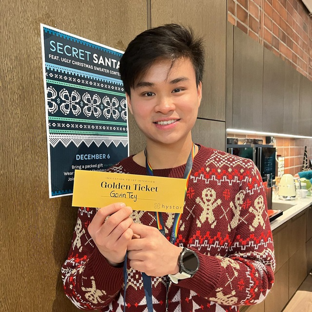
    <h4 style="margin: 8px 0 4px 0; font-size: 16px;">Gavin Tey</h4>
    
Mechanical Engineering &

    
Business Management

    
A0255359U

  

  
  

    
    <h4 style="margin: 8px 0 4px 0; font-size: 16px;">Ilham Ridzuan</h4>
    
Industrial Systems Engineering

    
A0253086A

      

  

  
  

    
    <h4 style="margin: 8px 0 4px 0; font-size: 16px;">Jolie Koh</h4>
    
Biomedical Engineering &

    
Innovation and Design Programme

    
A0255216J

     

  

  
  

    
    <h4 style="margin: 8px 0 4px 0; font-size: 16px;">Lim Soong En</h4>
    
Computer Engineering &

     
Business Administration

    
A0255302R

  

## Meet our Supervisors

  

    

      
    

    <h4 style="margin: 8px 0 4px 0; font-size: 16px;">Dr Elliot Law</h4>
    
NUS CDE

  

  
  

    

      
    

    <h4 style="margin: 8px 0 4px 0; font-size: 16px;">Mr Royston Shieh</h4>
    
NUS CDE

  

# Acknowledgements {#acknowledgements}

We would like to express our sincere gratitude to Dr Elliot Law and Mr Royston Shieh for their guidance, support and encouragement throughout this project. Their weekly check-ins provided us with clarity, direction and valuable feedback on where to focus our efforts. Their advice was instrumental in helping us identify our target users and refine the scope of our work.

We would also like to extend our thanks to all the hotels that worked with us, especially the staff who generously made time to share their experiences. We are humbled by the amount of work that goes into delivering service that meets the expectations of modern day luxury, and we are grateful for the rich insights they offered from their years in the industry. We are equally appreciative of the guests who participated in our interviews for giving us a deeper understanding of the hospitality experience from their perspective.

Finally, we are thankful to the Innovation and Design Department for the opportunity to be part of the Global Engineering Design Innovation programme, and for enabling this meaningful collaboration with Stanford. 

# Introduction {#introduction}

## Check-in Experience as a First Impression {#check-in-experience-as-a-first-impression}

The check-in experience is defined as part of both the pre-arrival and arrival stages, encompassing the period from the moment a guest confirms a booking on any platform to the point at which they arrive at the hotel, check in with staff, receive their room key or access credentials and proceed to their room. The interval between the pre-arrival and arrival stages, typically around 48 hours, provides hotels with an important opportunity to gather relevant guest information in advance. The efficiency of this information exchange often determines the quality of personalised service that hotel staff can deliver upon the guest’s arrival. This process represents the guest’s first substantive interaction with the hotel and plays a pivotal role in shaping their overall perception of the establishment. An efficient and well-organised check-in fosters a positive first impression and lays the foundation for a satisfying stay, whereas delays or procedural inefficiencies can negatively influence perceptions of service quality even before other aspects of the guest experience unfold. For instance, guest satisfaction has been shown to decline by approximately 47% when the check-in process exceeds 5 minutes (Smart Hotel Technology Guide, 2019). As such, this underscores the importance of attentiveness and efficiency throughout both the pre-arrival and arrival stages, which together form a critical phase of the guest journey.

## Luxury in Modern Day Context {#luxury-in-modern-day-context}

The meaning of luxury hotels has evolved significantly over the years. Luxury is no longer defined solely by extravagance, expansive spaces or high-quality amenities. Instead, it now encompasses the ability of a hotel to craft meaningful experiences and evoke emotions that foster a deep sense of connection and personal value for each guest. As such, we have defined luxury through five key dimensions that capture the characteristics of contemporary hospitality: exclusivity, genuineness and sincerity, hyper-personalisation, high-touch service and authenticity.

  <button onclick="toggleLuxuryDefinitions()" style="width: 100%; padding: 16px; background: linear-gradient(135deg, #667eea 0%, #764ba2 100%); color: white; border: none; border-radius: 8px; font-size: 16px; font-weight: 500; cursor: pointer; display: flex; align-items: center; justify-content: center; gap: 8px; transition: all 0.3s ease;">
    ▶
    Expand to view the definition of each dimension
  </button>
  
  

    

      <h4 style="color: #667eea; margin: 0 0 12px 0; font-size: 18px;">Exclusivity</h4>
      
Exclusivity refers to a feeling of rarity that enhances the perceived value of an experience (Kapferer and Bastien, 2025). For guests, this may be reflected in features such as a private check-in suite or the presence of a dedicated host who welcomes them by name, creating a seamless arrival experience that begins the moment they step out of the car. Ultimately, exclusivity is about making guests feel that the moment has been crafted specifically for them, reinforcing their sense of distinction and personal importance.

    

    
    

      <h4 style="color: #667eea; margin: 0 0 12px 0; font-size: 18px;">Genuineness and Sincerity</h4>
      
Genuineness and sincerity represent the human element that makes guests feel truly welcomed. Every interaction with hotel staff should appear natural and heartfelt rather than scripted or rehearsed. When expressed with warmth and care, such interactions foster emotional connection and trust between guests and the hotel. The Forbes Travel Guide defines luxury hospitality as warmth delivered with grace (Forbes Travel Guide, 2025), a description that captures how sincerity in service elevates hospitality from mere professionalism to a memorable experience.

    

    
    

      <h4 style="color: #667eea; margin: 0 0 12px 0; font-size: 18px;">Hyper-Personalisation</h4>
      
Modern luxury is characterised by hyper-personalisation, which highlights the hotel's commitment to understanding and remembering its guests in meaningful ways. It involves creating a sense of familiarity and comfort that makes the hotel feel like a second home. Through the thoughtful use of guest information and attentive service, each stay can be uniquely tailored to reflect individual preferences and needs. A hotel that remembers a guest's preferred room temperature, favourite drink or choice of pillow transforms a simple stay into a deeply personal and special experience.

    

    
    

      <h4 style="color: #667eea; margin: 0 0 12px 0; font-size: 18px;">High-Touch Service</h4>
      
Another defining element of contemporary luxury is the high-touch approach, where every interaction and gesture is intentional and deliberate. For the hotel, it is not about doing more but about doing it better with names remembered, needs anticipated and gestures timed with care. Often, one thoughtful moment means more than three generic ones.

    

    
    

      <h4 style="color: #667eea; margin: 0 0 12px 0; font-size: 18px;">Authenticity</h4>
      
Authenticity ties these elements together. Modern travellers increasingly seek experiences that reflect the local culture and story rather than uniform or standardised hotel designs. Authenticity has therefore become a cornerstone of brand loyalty within the luxury hospitality sector (Accenture, 2025).

    

  

 

Collectively, these five dimensions form the foundation of modern luxury hospitality and serve as our guiding principles for reimagining the luxury hotel check-in journey.

# Background {#background}

## Global market growth {#global-market-growth}

Demand for luxury tourism is rising faster than any other travel segment, supported by the growing number of wealthy individuals and a large base of younger, aspiring luxury travellers who are willing to spend more on upscale travel experiences (Tufft et al., 2024). Correspondingly, McKinsey & Company (Mann et al., 2024) projects that the luxury segment will grow around 6% through 2025, outpacing all other chain-scale hotel classes. This momentum is reinforced by a broader shift in travel behaviour: in 2023, demand for high-end experiences and luxury travel surged and has continued to expand, with affluent individuals increasingly proritizing travel (EHL Insights, 2025). Frost & Sullivan (2024) similarly notes that many travellers are also willing to stretch their budgets for additional activities, supported by AMEX findings that 77% of travelers value the right experience over the trip’s cost. Reflecting this strong demand, the global luxury hotel market continues to grow significantly, as shown in Figure 1. As luxury and travel preferences evolve, affluent consumers increasingly prioritise unique and personalised experiences over traditional material forms of luxury and over cost saving considerations.

  

    
  

<strong>Figure 1: Global luxury hotel market growth</strong>

## **Changing definition of luxury & guest experience**

As more luxury accommodations enter the market, competition for affluent travellers is intensifying, and some features that are associated with luxury have been adopted by non-luxury hotels, e.g. rainfall shower heads (Mann et al., 2024). At the same time, the meaning of luxury is evolving, as affluent travellers increasingly prioritise unique experiences and vibrant atmospheres over opulent formality or material products (Mann et al., 2024). True luxury today is rooted less in high prices or lavish finishes, but in thoughtful, carefully executed service. Therefore, cultivating a culture of excellence, where staff anticipate guest needs, deliver beyond expectations, and create seamless, memorable experiences, has become a key advantageous differentiator (Mann et al., 2024). Accordingly, findings indicate that the top factor influencing travellers’ choice of a brand is not value, convenience, or even quality, but rather the positive past experiences they have had with a brand (Mann et al., 2024). As hotels become more similar in physical offerings, personalisation is emerging as the key driver of guest satisfaction and loyalty, PwC reports that 65% of customers consider personalisation essential and would pay up to 25% more for it (EHL Insights, 2025).
 
This shift is further reinforced by younger luxury consumers, such as Millennials and Gen Z, who seek and expect luxury experiences that are authentic and personalised, catering to their unique preferences and needs, reflecting their identity and signalling a sense of exclusivity (EHL Insights, 2023). By 2030, the Millennials, Gen Z, and Gen Alpha, will collectively represent about 85% of all global luxury purchases, with Gen Z accounting for 25% to 30% (Bain & Company, 2024). In line with this, Gen Z significantly values personalised service higher than baby boomers, about 2.5 times more, underscoring its growing importance as younger consumers become the dominant luxury segment (Mann et al., 2024). 

## Global Trends {#global-trends}

Pent-up travel demand surged in 2023, pushing industry spending close to pre-pandemic levels (Frost & Sullivan, 2024). Similarly, it is estimated that in 2024, about 1.4 billion tourists travelled internationally, indicating almost complete recovery (99%) of pre-pandemic levels (UN Tourism, 2025). Despite the sector’s recovery, recruitment challenges persist, with demographic and structural shifts projected to leave the hospitality workforce roughly 18% below required staffing by 2035; many workers left during the pandemic, and with unemployment falling and working-age populations shrinking, the fast-growing industry now faces increasing strain on its available workforce (World Travel & Tourism Council, 2025).
 
Although labour shortages have improved slightly, they remain a persistent challenge as many former employees have not returned (Frost & Sullivan, 2024). Recruitment difficulties have become more difficult as businesses now compete for talent amid relatively low unemployment levels and encounter strong competition from other industries that offer flexible or remote work options. Hospitality roles are demanding, often involve long hours, irregular scheduling, and high-stress tasks like managing demanding customers (Lüthy, 2025). Younger workers, especially employees under 30, are increasingly reluctant to enter or remain in such customer-facing positions, prioritising work–life balance and flexibility and often seek jobs that allow for remote work. Employers also reported that although young applicants often lack the practical skills and experience required, and do not view the industry as a stable long-term career pathway (World Travel & Tourism Council, 2025).
 
Overall, despite its global influence and scope, the hospitality sector continues to struggle with persistent difficulties in attracting and retaining personnel with the necessary skills particularly those with the specialised skills required to deliver the personalised experiences travellers now expect, affecting both service quality and operational efficiency (Frost & Sullivan, 2024).

## Singapore's Hospitality Trends {#singapores-hospitality-trends}

Singapore’s tourism sector continues to show strong post-pandemic recovery and steady long-term growth potential. International visitor arrivals rose by 21% from the previous year to reach 16.5 million, while tourism receipts climbed to a record SGD 29.8 billion, a historic high demonstrating the strength of the post-pandemic rebound (Singapore Tourism Board, 2025). This momentum is supported by a robust year-round calendar of international events and business conferences, combined with strategic marketing, collaboration with industry partners, new and upgraded attractions, all which enhanced Singapore’s appeal as both a leisure and business destination.
 
Parallel to tourism growth, Singapore’s hospitality market is expanding significantly. The hotel industry serves as a key pillar of Singapore’s tourism economy, accounting for around 20% of total tourism receipts (Singapore Tourism Board, 2025). Within the accommodation sector, the luxury segment accounted for approximately 40.4% of total revenue in 2024, driven largely by strong corporate travel demand and the growth of event-led affluent tourism (Mordor Intelligence, 2025). At the same time, as the experience economy grows, travellers increasingly seek unique, authentic, and personalised experiences, prompting hotels to differentiate their offerings and tailor both service and marketing to individual needs (Workforce Singapore, 2023).

## Singapore Labour Shortage {#singapore-labour-shortage}
Singapore’s hospitality and F&B sectors continue to face a sustained manpower shortage beyond post-pandemic recovery, as businesses struggle to fill vacancies amid rising labour costs and high turnover, signalling a structural rather than temporary problem (Singapore Institute of Hospitality, 2024) According to the Ministry of Manpower, the accommodation industry recorded 33,300 employed workers as of June 2025, but had the highest job-vacancy rate across all industries at 6.5%, with clerical, sales and service roles showing the highest vacancy within the sector at 8.4% (MRSD, MOM, 2025). Manpower shortages have long been a prevailing challenge in the hospitality industry, even before the pandemic with technology adoption already underway to mitigate labour pressure, a trend that was accelerated by the pandemic (Choo, 2022).
 
Attracting more locals to join the hospitality workforce remains difficult due to perceptions of low wages and long working hours (Choo, 2022) and the physically and mentally demanding nature of hospitality work (Seah, 2022). Employees are often required to work extended hours, leading to fatigue, burnout, and high turnover, further eroding the labour pool as other service industries compete for the same talent (Singapore Institute of Hospitality, 2024). Other issues include lack of appreciation and respect; low occupational status and insufficient recognition significantly also undermine the retention of front-line service employees and in luxury hotel settings, it is also not uncommon for staff to face verbal abuse from guests (Cayla, 2023). 
 
Employers report that replacing foreign workers with locals has been difficult, as locals often show low interest in service jobs despite offering higher wages (Seah, 2022). 
 
At the same time, foreign-worker quotas have been progressively tightened, from 50% in 2011 to 35% in 2021 to encourage productivity improvement and limit the sector’s ability to rely on foreign labour (Seah, 2022; Choo, 2022). Educational institutions have observed a leakage of hospitality students into other sectors which is often attributed to poor internship experiences and negative perceptions of hospitality careers (Workforce Singapore, 2023). 
 
These challenges compounded by demographic shifts such as an ageing workforce and changing worker aspirations leave many hotels understaffed despite active recruitment. Thus, it is becoming increasingly critical to rebuild the hospitality talent pool to maintain long-term operations and guest satisfaction (Workforce Singapore, 2023; Singapore Institute of Hospitality, 2024). Understaffing reduces service speed and quality, increases inconsistency, and ultimately erodes guest satisfaction, brand reputation, and profitability in Singapore’s fast-paced hospitality landscape (Singapore Institute of Hospitality, 2024).

Figure 2 illustrates the top challenges and priorities identified by the hospitality industry, highlighting how manpower constraints continue to be a central concern.

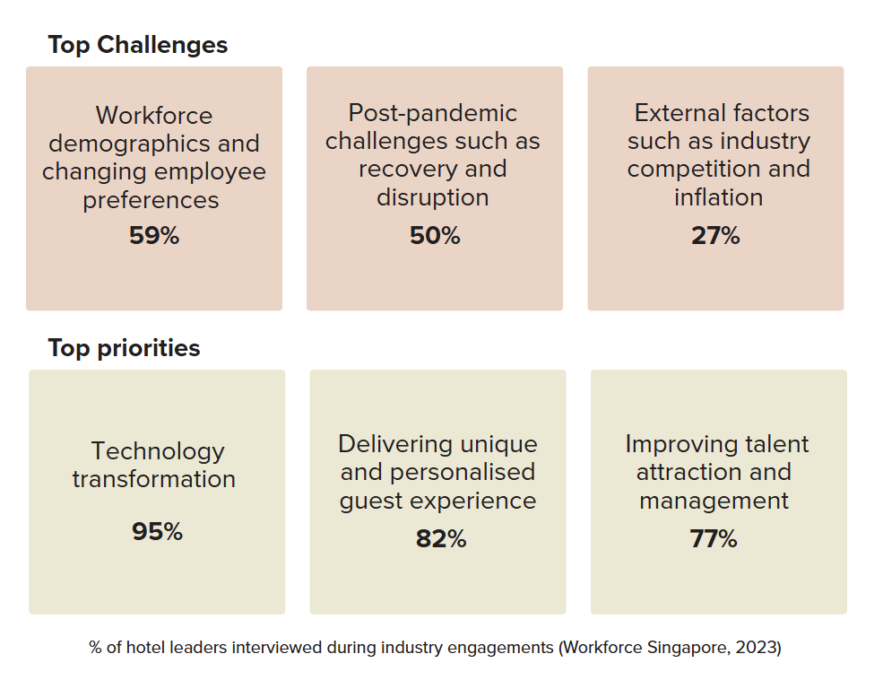

<strong>Figure 2: Top Challenges and Priorities in Singapore Hospitality Industry</strong>

Looking ahead, sustainable progress will depend on meaningful job redesign supported by labour-saving technologies to boost productivity and make hospitality careers more attractive.

## Leveraging AI {#leveraging-ai}

To remain relevant, luxury hotels must deliver engaging and highly personalised experiences, using data and technology to tailor services to individual preferences (EHL Insights, 2023). As the industry recovers post pandemic, a new balance is emerging between technological efficiency and human connection. In this context, AI should enhance rather than replace the warmth and empathy that define hospitality. Looking ahead, the thoughtful introduction of technology has the potential to shift the focus of hotel work back toward genuine guest interaction. By streamlining routine tasks, staff can devote more time to meaningful, high touch moments, which may also help attract more people to the industry, including younger workers who value a modern and engaging work environment.

# Primary Research  {#primary-research}

## Interviews with Hotels and Analysis {#interviews-with-hotels}

#### **Hotel Sample and Participant Roles** {#hotel-sample-and-participant-roles}

To gain a holistic understanding of the current luxury hotel check-in experience, we conducted semi-structured interviews with hospitality professionals across four prominent hotels in Singapore: Shangri-La, Banyan Tree, Raffles Hotel, and Amara Hotel. Participants represented a diverse range of roles within the hotel ecosystem, including the Rooms Director, Front Desk Manager, Front Desk Staff, General Manager, and Head of Technology. These individuals were selected for their ability to offer operational, managerial, and technological perspectives. Initial contact was made through formal email outreach and online contact forms.

#### **Data Collection Protocol** {#data-collection-protocol}

Interviews were conducted between September and October 2025, following the protocol developed for this study (click button below for details). Each session began with an introduction to the research context and verbal consent for recording. The interviews were audio-recorded with consent and supplemented by extensive note-taking \- two team members recorded observations and verbatim quotes while the other two led the conversation. In three of the four hotels, participants additionally provided guided walkthroughs of their front-desk operations, allowing the research team to observe real-time workflows and backstage processes. Notably, one hotel granted permission for us to interact directly with their front-desk system, providing valuable insights into system interfaces and limitations.

  <a href="assets/documents/InterviewQuestions.html" target="_blank" rel="noopener" style="display:inline-block;padding:0.5em 1.25em;background:#183153;color:#fff;border-radius:8px;font-weight:500;text-decoration:none;box-shadow:0 2px 8px rgba(20,30,80,0.06);margin-top:12px;">
    View Interview Questions Prepartion Document &rarr;
  </a>

#### **Interview Design and Flow** {#interview-design-and-flow}

The semi-structured interview guide was designed around five thematic stages (*Warm-up & Context Setting, Operational Perspectives, Customer Interactions & Challenges, Technology Acceptance, and Future Vision*). This design enabled both structured coverage of key topics and flexibility for interviewees to share detailed narratives about daily operations, guest interactions, and technology adoption in premium hospitality environments.

#### **Analysis Approach** {#analysis-approach}

Following transcription and data consolidation, we adopted an affinity clustering methodology supported by an empathy mapping framework to extract key insights. Each data point from interview transcripts was first classified within a six-category empathy map \- Think/Feel, See, Say/Do, Hear, Pains, and Gains.
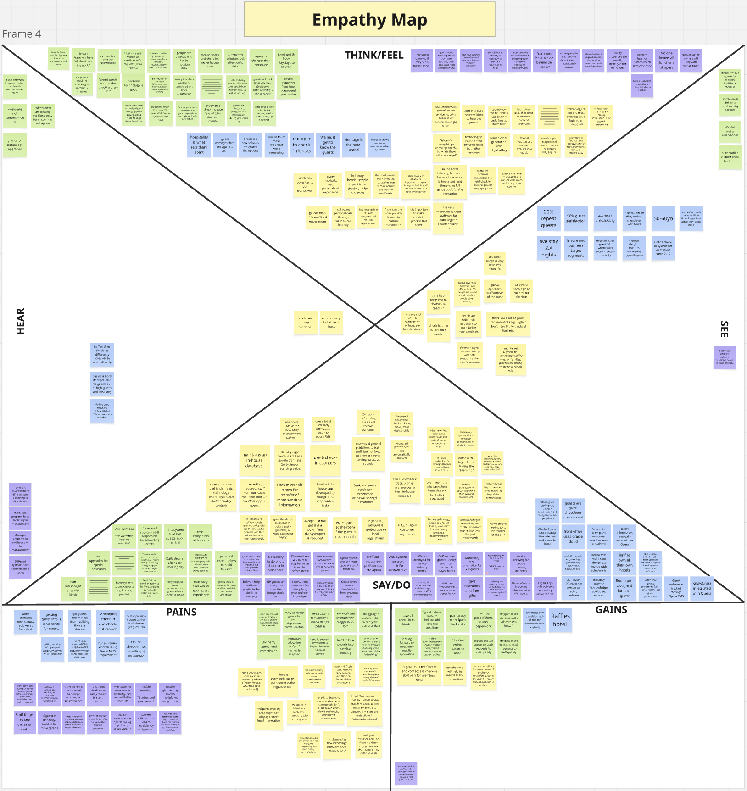

<strong>Figure 3: Empathy Map</strong>

This facilitated a systematic visualization of user sentiments and experiences across all interviews. Subsequently, we conducted affinity clustering, grouping similar observations and identifying overarching themes and opportunity areas such as Pre-arrival Personalization, Booking and Channel Integration, and Handling of Special Requests and Exceptions.  
These clusters were then distilled into key insights and design implications, forming the foundation for subsequent concept development and prototyping phases.

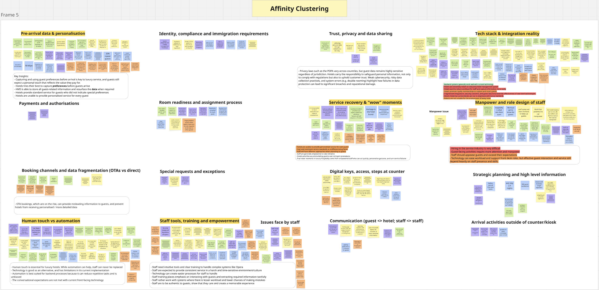

<strong>Figure 4: Affinity Clustering Map</strong>

### **Guest Experience Pain Points Analysis (1-Star Review Study)** {#guest-experience-pain-points-analysis}

To complement our interviews with hotel staff and validate observed service challenges from the guest perspective, we conducted a quantitative analysis of 1-star guest reviews from major online travel platforms. This served as a data-driven complement to our qualitative research, allowing us to triangulate findings and identify consistent pain points across both operational and experiential dimensions. A dataset of 60+ reviews from five-star properties in Singapore was collected, cleaned, and structured. Each review was coded and categorized into sub-themes based on the nature of dissatisfaction expressed by guests, and these sub-themes were consolidated into higher-level themes through affinity clustering. To visualise the findings, we built an interactive dashboard (HTML) that presents the relative frequency of each theme and its underlying categories.

  <a href="assets/dashboards/hotel-review-dashboard.html" target="_blank" rel="noopener" style="display:inline-block;padding:0.5em 1.25em;background:#183153;color:#fff;border-radius:8px;font-weight:500;text-decoration:none;box-shadow:0 2px 8px rgba(20,30,80,0.06);margin-top:12px;">
    View Interactive 1-Star Review Dashboard &rarr;
  </a>

## Key Themes and Insights from Primary Research {#key-themes-and-insights-from-primary-research}

#### **1\. Tech Stack and Integration Reality** 

Across all hotels, backend systems such as Opera PMS and Oracle Cloud are generally reliable and well-integrated within existing operational workflows. However, a high reliance on third-party software and the fragmentation between systems such as kiosks, tablets, and key card management create inefficiencies and compatibility issues. Several interviewees cited that implementing new technologies is costly and often constrained by vendor lock-in, data permissions, and cybersecurity concerns.

While hotels are keen to adopt automation, integration challenges between systems (e.g., PMS, kiosk, key systems) hinder seamless execution. Many expressed that current kiosk technologies fail to meet luxury standards, with system glitches and limited customization affecting guest experience. As a result, technology upgrades remain incremental, focusing on reducing staff workload rather than transforming the overall check-in experience.

  <button onclick="toggleInsightSummary2()" style="width: 100%; padding: 16px; background: linear-gradient(135deg, #667eea 0%, #764ba2 100%); color: white; border: none; border-radius: 8px; font-size: 16px; font-weight: 500; cursor: pointer; display: flex; align-items: center; justify-content: center; gap: 8px; transition: all 0.3s ease;">
    ▶
    Insight Summary — Click to expand
  </button>

  

    <ul style="margin: 0; padding-left: 20px; color: #444; line-height: 1.6;">
      <li>Backend systems are stable, but frontend integrations remain disjointed.</li>
      <li>Third-party dependencies limit flexibility and innovation.</li>
      <li>Cost and complexity deter experimentation with in-house technology.</li>
      <li>Hotels view technology as a tool for staff efficiency, not as a differentiator for luxury experience.</li>
    </ul>
  

#### **2\. Human Touch vs Automation**

The interviews revealed a strong and consistent belief that human touch is indispensable in luxury hospitality. While automation offers convenience, guests overwhelmingly associate luxury with personal attention, empathy, and conversation. Our interviewee from Shangri-La noted that 98–99% of guests still prefer to approach humans over kiosks, highlighting a deep-seated emotional expectation of being “welcomed.”

Automation is therefore best applied to backend operations (data entry, room allocation, and reporting) while front-facing interactions must preserve warmth and human presence. Many managers also emphasized that automation should be framed as a complement, not a replacement, to service. The challenge lies in balancing efficiency with emotional connection, ensuring guests experience speed without losing the personal engagement that defines luxury.

  <button onclick="toggleInsightSummary()" style="width: 100%; padding: 16px; background: linear-gradient(135deg, #667eea 0%, #764ba2 100%); color: white; border: none; border-radius: 8px; font-size: 16px; font-weight: 500; cursor: pointer; display: flex; align-items: center; justify-content: center; gap: 8px; transition: all 0.3s ease;">
    ▶
    Insight Summary — Click to expand
  </button>

  

    <ul style="margin: 0; padding-left: 20px; color: #444; line-height: 1.6;">
      <li>Human interaction is the core of luxury service.</li>
      <li>Automation should be limited to support roles, not guest-facing processes.</li>
      <li>Guests interpret human presence as a sign of attentiveness and exclusivity.</li>
      <li>Emotional connection remains the most powerful differentiator in premium hospitality.</li>
    </ul>
  

**3\. Staff Tools and Empowerment**

Frontline staff expressed that while tools like Opera and HotSOS are indispensable, they are also complex and unintuitive, requiring steep learning curves. Training periods are long, and mistakes, especially in data entry or double rooming, can directly affect guest satisfaction. Staff repeatedly emphasized the need for simpler, integrated tools and better pre-shift briefings to manage information overload.

Empowerment emerged as a central motivator: when staff have autonomy to resolve issues or make small gestures (e.g., using a discretionary budget to delight guests), morale and service quality improve significantly. Conversely, rigid processes or lack of cross-department awareness lead to inefficiencies and frustration.

  <button onclick="toggleInsightSummary1()" style="width: 100%; padding: 16px; background: linear-gradient(135deg, #667eea 0%, #764ba2 100%); color: white; border: none; border-radius: 8px; font-size: 16px; font-weight: 500; cursor: pointer; display: flex; align-items: center; justify-content: center; gap: 8px; transition: all 0.3s ease;">
    ▶
    Insight Summary — Click to expand
  </button>

  

    <ul style="margin: 0; padding-left: 20px; color: #444; line-height: 1.6;">
      <li>Staff need intuitive, well-integrated tools for smoother daily operations.</li>
      <li>Training and empowerment directly influence service quality.</li>
      <li>Excessive complexity in systems contributes to stress and human error.</li>
      <li>Empowered staff are more capable of delivering personalized and responsive service.</li>
    </ul>
  

**4\. Pre-arrival Data and Personalisation**

Hotels strive to capture guest preferences before arrival through membership profiles, pre-arrival forms, and communication platforms like Canary and Opera PMS. However, data utilization remains inconsistent. While some hotels use this information to prepare amenities or room settings, others rely heavily on staff memory or manual notes.

Luxury guests expect a personal touch proportionate to what they pay, yet personalization across all guests is impractical due to scale and manpower constraints. As a result, hotels tend to reserve full personalization for returning or VIP guests, while others receive standardized experiences.

  <button onclick="toggleInsightSummary4()" style="width: 100%; padding: 16px; background: linear-gradient(135deg, #667eea 0%, #764ba2 100%); color: white; border: none; border-radius: 8px; font-size: 16px; font-weight: 500; cursor: pointer; display: flex; align-items: center; justify-content: center; gap: 8px; transition: all 0.3s ease;">
    ▶
    Insight Summary — Click to expand
  </button>

  

    <ul style="margin: 0; padding-left: 20px; color: #444; line-height: 1.6;">
      <li>Pre-arrival data collection is good, but execution consistency varies.</li>
      <li>Systemic and manpower constraints prevent personalization for all guests.</li>
      <li>True personalization relies on data integration and staff initiative.</li>
      <li>Guests still expect visible recognition and tailored gestures that affirm their value.</li>
    </ul>
  

**5\. Manpower and Role Design of Staff**

The manpower shortage remains one of the most pressing issues in the industry. Recruiting and retaining hospitality workers, especially for front-desk roles, is increasingly difficult due to long hours, stress, and perceived lack of career progression.  

Technology can reduce repetitive tasks and support staff efficiency but cannot replace the emotional labor essential to guest satisfaction. Hotels have thus begun redesigning roles to combine operational efficiency with relational expertise, positioning staff near kiosks to assist guests and manage exceptions.

  <button onclick="toggleInsightSummary5()" style="width: 100%; padding: 16px; background: linear-gradient(135deg, #667eea 0%, #764ba2 100%); color: white; border: none; border-radius: 8px; font-size: 16px; font-weight: 500; cursor: pointer; display: flex; align-items: center; justify-content: center; gap: 8px; transition: all 0.3s ease;">
    ▶
    Insight Summary — Click to expand
  </button>

  

    <ul style="margin: 0; padding-left: 20px; color: #444; line-height: 1.6;">
      <li>Persistent labour shortages heighten reliance on technology.</li>
      <li>Staff are still central to guest experience, even in automated systems.</li>
      <li>Hybrid role designs (e.g., kiosk assistants) are emerging as pragmatic solutions.</li>
      <li>Maintaining hospitality’s emotional core remains a human-dependent challenge.</li>
    </ul>
  

**6\. Service Recovery and “Wow” Moments**

Service recovery emerged as a defining factor separating good from exceptional hospitality. Staff described instances of empowered decision-making, where they could upgrade rooms, offer discounts, or personalize gestures without waiting for management approval. Such autonomy allows quick, authentic responses to guest issues, transforming potential complaints into memorable moments.

However, this culture varies across hotels. Some operate under strict approval hierarchies, limiting their ability to recover gracefully from service lapses. Interviewees emphasized that true “wow” moments often stem from staff intuition and empathy, not protocol.

  <button onclick="toggleInsightSummary6()" style="width: 100%; padding: 16px; background: linear-gradient(135deg, #667eea 0%, #764ba2 100%); color: white; border: none; border-radius: 8px; font-size: 16px; font-weight: 500; cursor: pointer; display: flex; align-items: center; justify-content: center; gap: 8px; transition: all 0.3s ease;">
    ▶
    Insight Summary — Click to expand
  </button>

  

    <ul style="margin: 0; padding-left: 20px; color: #444; line-height: 1.6;">
      <li>Consistency in service recovery varies across organizations.</li>
      <li>Empowered staff can turn service failures into positive memories.</li>
      <li>"Wow" moments are more often the result of emotional intelligence than technology.</li>
      <li>Guests remember personal gestures far more than procedural efficiency.</li>
    </ul>
  

# Property Management System {#property-management-system}

Before analysing the staff's and guest's 'user journeys', it is essential to understand the core technological infrastructure underpinning hotel operations: the **Property Management System (PMS)**. In the luxury hospitality context, the PMS serves as the central nervous system of the hotel, coordinating information across reservations, housekeeping, billing, and guest services (Ecole Hôtelière de Lausanne, 2025). It connects the **front desk**, **back office**, and **guest-facing digital platforms**, ensuring that data flows seamlessly from booking to check-in and post-stay follow-up.

### **Role in Hotel Operations** {#role-in-hotel-operations}

Front desk staff rely on PMS platforms \- such as Opera PMS by Oracle Hospitality, one of the industry’s most widely adopted systems \- to perform key operational tasks including:

1. Looking up, verifying, and modifying guest reservations.  
2. Checking room availability and assigning rooms.  
3. Processing payments and pre-authorizations.  
4. Accessing guest profiles, preferences, and VIP histories.  
5. Logging service requests and special notes.  
6. Printing registration cards and receipts.

Through these functions, the PMS acts as the data hub that links room allocation algorithms, guest preference databases, and revenue management systems. Its reliability and accessibility directly influence the fluidity of the guest experience—particularly at check-in, where staff must access accurate, up-to-date information quickly.

### **Limitations and Friction Points** {#limitations-and-friction-points}

Despite its centrality, current PMS platforms—particularly legacy systems like Opera—exhibit notable usability limitations. The interface is often non-intuitive, requiring multiple clicks and navigation across several tabs to complete a single check-in process (Workforce Singapore, 2023). Staff are frequently required to switch between the PMS and other systems, such as payment gateways or CRM modules, which increases both cognitive load and error risk. Moreover, guest information can be buried, inconsistent, or fragmented across systems, hindering personalization efforts (Singapore Institute of Hospitality, 2024).

These inefficiencies are particularly problematic in the luxury segment, where service quality and responsiveness define the brand experience. Studies show that poor back-end integration and fragmented digital ecosystems can extend average check-in time by up to 30%, negatively impacting perceived service quality (EHL Insights, 2025).

### **Implications for Design** {#implications-for-design}

Understanding PMS limitations is critical when reimagining the automated check-in process. The system’s complexity and lack of integration often prevent staff from focusing on high-touch interactions—precisely the moments that differentiate luxury service (Mann, Scully, Straus & Tellez Holub, 2024). Therefore, future design interventions should not seek to replace the PMS entirely but to augment it \- for example, through an overlay interface or AI assistant that extracts and surfaces relevant information in real time, reducing friction while maintaining operational accuracy.

# Experience Journey Maps {#experience-journey-maps}
## Pre-Arrival {#pre-arrival}

  

<strong>Figure 5: Pre-arrival Flow</strong>

The pre-arrival phase establishes the foundation for the guest’s overall hotel experience. In luxury hospitality, this stage is not merely transactional but an opportunity to communicate attentiveness, personalization, and efficiency — qualities that define a premium brand. A seamless pre-arrival journey ensures that guests begin their stay feeling understood and valued, while the hotel benefits from streamlined operations and accurate data for service preparation (Ecole Hôtelière de Lausanne, 2023).

  <button onclick="togglePreArrivalDetails()" style="width: 100%; padding: 16px; background: linear-gradient(135deg, #667eea 0%, #764ba2 100%); color: white; border: none; border-radius: 8px; font-size: 16px; font-weight: 500; cursor: pointer; display: flex; align-items: center; justify-content: center; gap: 8px; transition: all 0.3s ease;">
    ▶
    Click to expand details on each stage
  </button>
  
  

    

      <h4 style="color: #667eea; margin: 0 0 12px 0; font-size: 18px;">1. Booking</h4>
      
The booking process represents the first point of interaction between the guest and the property. Guests today increasingly prefer online travel agencies (OTAs) such as Booking.com or Expedia for their flexibility and ease of comparison. However, hotels prefer direct booking channels as these allow them to access guest data directly, enabling more targeted communication, personalization, and upselling opportunities (Workforce Singapore, 2023). Integrating personalized booking systems that synchronize with guest profiles allows hotels to anticipate needs such as preferred room type, amenities, and check-in times well before arrival. This not only optimises operational planning but also reinforces the sense of exclusivity expected in the luxury segment.

    

    
    

      <h4 style="color: #667eea; margin: 0 0 12px 0; font-size: 18px;">2. Confirmation Email</h4>
      
The confirmation email is more than a transactional receipt; it acts as an early stage of relationship-building. Guests appreciate clear, accessible booking details and links that allow them to modify reservations, add services, or manage transportation requests with minimal friction. Many hotels leverage this touchpoint to include upselling and cross-selling content, such as dining experiences, spa packages, or transportation upgrades. From a service-design standpoint, the tone and aesthetic of these communications should reflect brand values: calm, refined, and anticipatory rather than commercial. 

    

    
    

      <h4 style="color: #667eea; margin: 0 0 12px 0; font-size: 18px;">3. Requests and Preferences</h4>
      
This touchpoint captures the guest’s ability to communicate specific needs and personal preferences, such as bedding type, dietary restrictions, or room location. However, as identified during user interviews, guests often experience frustration when their pre-submitted requests appear ignored or require repetition during check-in. For hotels, collecting and managing such data remains challenging due to low engagement rates and fragmented information systems, and some even try to call up guests before the stay. 

    

    
    

      <h4 style="color: #667eea; margin: 0 0 12px 0; font-size: 18px;">4. Room Allocation</h4>
      
Behind the scenes, the pre-arrival process culminates in room allocation, where hotels match reservations to specific rooms based on availability, maintenance status, and guest requirements. In most luxury properties, this is managed by a reservations team or automated algorithm that pre-allocates rooms to optimize occupancy while accommodating personalized preferences. When integrated with CRM and housekeeping systems, this process enhances both efficiency and guest satisfaction by ensuring that the assigned room is prepared and tailored to expectations prior to arrival. 

    

  

Collectively, these pre-arrival touchpoints demonstrate the interdependence of technology, personalization, and operational design in shaping the luxury guest journey. A reimagined premium check-in experience must therefore begin *before* the guest arrives—bridging digital anticipation with physical hospitality through integrated, data-driven, and emotionally engaging systems (Venture Corporation, 2025).

## Traditional Counter Check-In {#traditional-counter-check-in}

  

<strong>Figure 6: Counter Check-in Flow</strong>

The check-in process is one of the most defining moments in the guest journey, shaping first impressions and setting the tone for the stay (Mann, Scully, Straus & Tellez Holub, 2024). For luxury hotels, this stage embodies the brand’s promise of seamlessness, warmth, and personalization. Yet, as our field research and observations reveal, traditional counter-based check-in workflows can create friction for both guests and staff due to outdated system design, fragmented communication, and process inefficiencies.

  <button onclick="toggleCounterDetails()" style="width: 100%; padding: 16px; background: linear-gradient(135deg, #667eea 0%, #764ba2 100%); color: white; border: none; border-radius: 8px; font-size: 16px; font-weight: 500; cursor: pointer; display: flex; align-items: center; justify-content: center; gap: 8px; transition: all 0.3s ease;">
    ▶
    Click to expand details on each stage
  </button>
  
  

    

      <h4 style="color: #667eea; margin: 0 0 12px 0; font-size: 18px;">1. Arrival</h4>
      
<strong>Guest perspective:</strong> Upon arrival, guests often face queues before even reaching the front desk. Especially during peak hours, waiting time becomes a key source of frustration, undermining the perception of efficiency and exclusivity expected in premium hospitality. Luxury guests expect immediacy and recognition — long waits detract from that promise.

      
<strong>Staff perspective:</strong> Front desk staff must juggle multiple simultaneous tasks such as handling ongoing check-ins, attending to phone calls, and coordinating with bell staff. High guest volumes exacerbate this workload, leaving little time to deliver personalized attention. Staff shortages, identified as one of the industry's most pressing challenges, further intensify this pressure (Singapore Institute of Hospitality, 2024).

    

    
    

      <h4 style="color: #667eea; margin: 0 0 12px 0; font-size: 18px;">2. Greetings</h4>
      
<strong>Guest perspective:</strong> The greeting moment, while brief, carries emotional weight. Guests notice whether the staff member smiles, greets them by name, or acknowledges special occasions. Inconsistent greetings often lead guests to perceive the interaction as transactional rather than genuine.

      
<strong>Staff perspective:</strong> Staff acknowledge that they want to personalize greetings but often cannot recall guest details or lack access to the right information before the guest reaches the counter. This disconnect stems from the PMS interface limitations — information such as preferences or past stay notes is often buried within multiple tabs or outdated records.

    

    
    

      <h4 style="color: #667eea; margin: 0 0 12px 0; font-size: 18px;">3. Exchange of Information</h4>
      
<strong>Guest perspective:</strong> Guests frequently express frustration when asked to repeat information they have already provided during online booking or pre-arrival forms. This duplication creates an impression of inefficiency and poor data integration. Guests also find it unclear what staff are doing behind the screen, leading to perceptions of slowness or disorganization.

      
<strong>Staff perspective:</strong> Staff report that they must navigate between multiple software systems (e.g., PMS, payment gateways, and ID verification tools) to complete a single check-in. This multitasking increases cognitive load and risk of error. Many noted difficulty in maintaining conversation with guests while simultaneously keying data, undermining the warmth of the interaction.

    

    
    

      <h4 style="color: #667eea; margin: 0 0 12px 0; font-size: 18px;">4. Requests and Questions</h4>
      
<strong>Guest perspective:</strong> Guests often hesitate to raise additional questions or requests during check-in, perceiving staff as too busy or unapproachable. When they do ask, responses may feel scripted or delayed due to staff needing to check information in other systems.

      
<strong>Staff perspective:</strong> Employees shared that they sometimes struggle to answer guest questions on the spot, particularly regarding local recommendations or real-time room updates. When guests express dissatisfaction, front desk agents must escalate issues while staying composed — a difficult balance amid ongoing check-ins.

    

    
    

      <h4 style="color: #667eea; margin: 0 0 12px 0; font-size: 18px;">5. Collection of Key Card</h4>
      
<strong>Guest perspective:</strong> At this point, guests expect efficiency and clarity — they want to feel assured that their requests (such as late checkout or special amenities) have been noted. However, rushed handovers can create confusion and anxiety if guests are unsure about room details or inclusions.

      
<strong>Staff perspective:</strong> Staff often continue inputting data or printing forms while handing over key cards. If last-minute changes occur (e.g., incorrect room setup), the responsibility still falls on the front desk, despite upstream system or communication failures. This creates stress and impacts morale.

    

    
    

      <h4 style="color: #667eea; margin: 0 0 12px 0; font-size: 18px;">6. Rooming</h4>
      
<strong>Guest perspective:</strong> After check-in, guests evaluate whether the in-room experience matches what was promised. A missing request or incorrect setup (e.g., twin instead of king bed) amplifies dissatisfaction, as it signals poor internal communication.

      
<strong>Staff perspective:</strong> Staff acknowledge that follow-up lapses can occur, especially when information from the PMS is not synced with housekeeping or concierge systems. When issues arise, front desk agents often receive the complaint despite not being responsible for the error, highlighting the fragmented nature of existing workflows.

    

  

## Kiosk Check-In {#kiosk-check-in}

 

<strong>Figure 7: Kiosk Check-in Flow</strong>
 

As hotels experiment with automation to enhance efficiency and reduce manpower dependency, **self-service kiosks** have become increasingly common, especially in business and mid-to-upscale hotels. These kiosks aim to streamline routine procedures such as guest identification, payment, and room key issuance — mirroring the self-check-in models seen in airports. In Singapore, automation has been widely encouraged to address labour shortages and operational inefficiencies in the hospitality sector (Workforce Singapore, 2023). However, while kiosk systems deliver measurable gains in speed and consistency, they also expose gaps in emotional engagement and personalization — both critical attributes of the luxury segment.

  <button onclick="toggleKioskDetails()" style="width: 100%; padding: 16px; background: linear-gradient(135deg, #667eea 0%, #764ba2 100%); color: white; border: none; border-radius: 8px; font-size: 16px; font-weight: 500; cursor: pointer; display: flex; align-items: center; justify-content: center; gap: 8px; transition: all 0.3s ease;">
    ▶
    Click to expand details on each stage
  </button>
  
  

    

      <h4 style="color: #667eea; margin: 0 0 12px 0; font-size: 18px;">1. Entering of Key Details</h4>
      
<strong>Guest perspective:</strong> Guests generally perceive the kiosk as efficient and straightforward, appreciating the ability to bypass long queues. However, many express frustration that they still have to manually enter personal information, even if these details were already provided during online booking. This duplication creates a sense of redundancy and contradicts the promise of a seamless digital experience.

      
<strong>Staff perspective:</strong> The automation of initial data entry reduces front desk workload, allowing staff to supervise multiple kiosks simultaneously and assist guests only when necessary. This redeployment of manpower enables a more relaxed, concierge-like presence on the floor rather than behind the counter.

    

    
    

      <h4 style="color: #667eea; margin: 0 0 12px 0; font-size: 18px;">2. Guest Photo and Passport Scanning</h4>
      
<strong>Guest perspective:</strong> The passport scanning and verification process reinforces efficiency but introduces a transactional, impersonal tone. Guests accustomed to high-touch luxury interactions often perceive the lack of human acknowledgment as diminishing the sense of welcome. This aligns with findings from McKinsey (Mann, Scully, Straus & Tellez Holub, 2024), which highlight that luxury guests prioritize personalized recognition and emotional connection above speed.

      
<strong>Staff perspective:</strong> Kiosks significantly reduce training time, from an estimated one month to about a week, as staff no longer need to memorize complex PMS workflows. However, staff must still intervene frequently when the kiosk’s document recognition or verification system fails — especially with non-standard passports or international ID formats — revealing technical fragility beneath the automation veneer.

    

    
    

      <h4 style="color: #667eea; margin: 0 0 12px 0; font-size: 18px;">3. Filling of Additional Fields and Signing of Terms & Conditions</h4>
      
<strong>Guest perspective:</strong> This stage is where friction typically resurfaces. Guests may be required to fill in multiple mandatory fields, sign digital forms, and review terms on-screen. For less tech-savvy users or older guests, the interface can appear daunting, particularly if touch targets are small or instructions unclear. Such usability issues echo broader research noting that while self-service technologies improve efficiency, they can also alienate users when poorly designed (Ecole Hôtelière de Lausanne, 2025).

      
<strong>Staff perspective:</strong>While kiosks handle the procedural aspects of check-in, they remain limited in scope — unable to accommodate complex or exception-based requests such as split billing, room upgrades, or special amenities. Staff must therefore monitor the kiosks closely to address these exceptions in real time, sometimes negating the efficiency gains.

    

    
    

      <h4 style="color: #667eea; margin: 0 0 12px 0; font-size: 18px;">4. Collection of Key Card and Handling of Issues</h4>
      
<strong>Guest perspective:</strong> Guests expect the process to conclude smoothly once the key card is dispensed. However, issues such as incorrect room assignment, non-functional cards, or unmet special requests often require them to return to the counter — undermining the convenience of the kiosk experience. As one observed guest described, “I still have to go to the front desk anyway because of how limited the kiosk is.”

      
<strong>Staff perspective:</strong> Front desk teams report that kiosks reduce repetitive administrative tasks, freeing time for proactive engagement. However, they also note that system limitations lead to fragmented workflows — tasks often have to be finalized manually in the PMS, creating inconsistency in record-keeping and increasing post-check-in corrections.

    

  

# Stakeholders {#stakeholders}

The luxury hotel check-in ecosystem involves a complex network of stakeholders whose roles, expectations, and challenges directly shape the check-in experience. This section outlines the four primary stakeholder groups: Guests, Front Office Staff, Hotel Managers, and Technology Departments. Their needs and pain points serve as the basis for our three design pillars: *Empowering Staff, Personalisation Intelligence,* and *Human-Centric Automation.Guests*

## **1\. Guests** {#guests}

They are the primary users of the check-in process and beneficiaries of service excellence. The check-in experience serves a diverse range of guest profiles, each with distinct expectations and challenges as seen in Image 1\.

  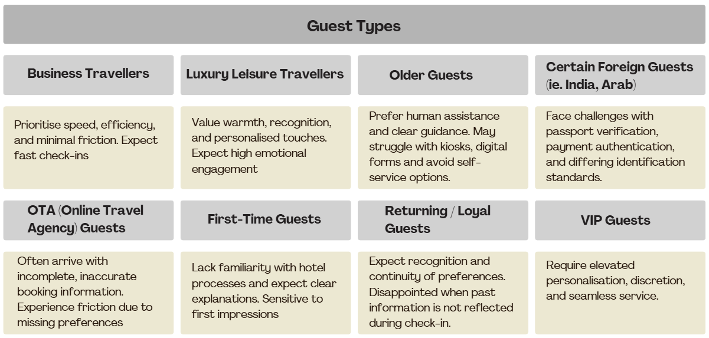

<strong>Figure 8: Diverse Guest Profiles and Their Unique Check-In Challenges</strong>

While each guest segment varies in priorities, their foundational expectations remain consistent.

  <button onclick="toggleguestDefinitions()" style="width: 100%; padding: 16px; background: linear-gradient(135deg, #667eea 0%, #764ba2 100%); color: white; border: none; border-radius: 8px; font-size: 16px; font-weight: 500; cursor: pointer; display: flex; align-items: center; justify-content: center; gap: 8px; transition: all 0.3s ease;">
    ▶
    Click to expand Guests [Core Expectations, Pain Points, and Needs]
  </button>
  
  

    

      <h4 style="color: #667eea; margin: 0 0 12px 0; font-size: 18px;">Core Expectations</h4>
      

        - Fast, seamless, low-friction check-in 
        - Recognition, warmth, and personalisation 
        - Clear communication and prompt issue resolution 
        - Strong reassurance of data privacy and consent
      

    

    
    

      <h4 style="color: #667eea; margin: 0 0 12px 0; font-size: 18px;">Pain Points</h4>
      

        - Long queues and waiting time, especially during peak hours 
        - Inconsistency in greetings and human warmth 
        - Impersonal kiosk interactions that feel “too mechanical” or “not worth the luxury price point” 
        - Frustration when special requests or preferences are not reflected at check-in 
        - Limited capability of current kiosks to handle complex or exception-based needs
      

    

    

      <h4 style="color: #667eea; margin: 0 0 12px 0; font-size: 18px;">Needs</h4>
      

        - Faster, smoother, low-friction check-in. 
        - Warm, personalised interactions that match luxury standards.
      

    

  

## **2\. Front-Office Staff** {#front-office-staff}

Front office staff are responsible for executing the end-to-end check-in process, which requires navigating complex systems like Opera PMS, verifying guest identities, processing payments, retrieving preferences, managing room allocations, and handling real-time guest inquiries. They must perform these administrative tasks while maintaining composure, warmth, and attentiveness.

  <button onclick="togglestaffDefinitions()" style="width: 100%; padding: 16px; background: linear-gradient(135deg, #667eea 0%, #764ba2 100%); color: white; border: none; border-radius: 8px; font-size: 16px; font-weight: 500; cursor: pointer; display: flex; align-items: center; justify-content: center; gap: 8px; transition: all 0.3s ease;">
    ▶
    Click to expand Front Office Staff [Core Expectations, Pain Points, and Needs]
  </button>
  
  

    

      <h4 style="color: #667eea; margin: 0 0 12px 0; font-size: 18px;">Core Expectations</h4>
      

        - Deliver high-touch hospitality and maintain warm guest interactions 
        - Accurately verify identities, process payments, check/ modify reservations   
        - Ability to multitask without compromising warmth or composure   
        - Manage real-time issues, exceptions, and service recovery   
        - Uphold brand standards and handle multiple tasks under pressure
      

    

    
    

      <h4 style="color: #667eea; margin: 0 0 12px 0; font-size: 18px;">Pain Points</h4>
      

        - Heavy multi-tasking (PMS navigation, answering calls, chat, guest queries)   
        - Complex systems (e.g., Opera PMS) that require deep knowledge and many clicks   
        - High risk of errors (misspelling names, incorrect allocations or missing requests)   
        - Stress from impatient guests, queue pressure, and service recovery situations   
        - Limited time and mental bandwidth to deliver personalised greetings   
        - Inconsistent handovers between shifts due to poor note capture
      

    

    

      <h4 style="color: #667eea; margin: 0 0 12px 0; font-size: 18px;">Needs</h4>
      

        - Tools that reduce repetitive administrative workload   
        - Systems with low cognitive load and minimal training curve   
        - Real-time visibility of guest data, preferences, and history   
        - Error-reduction support (auto-fill, guidance, note capture)
      

    

  

## **3\. Hotel Management** {#hotel-management}

Hotel managers oversee the performance and consistency of front office operations, ensuring that staff deliver service that meets luxury hospitality standards. They coordinate manpower, manage scheduling, monitor service quality metrics, resolve guest escalations, and make decisions on technology adoption. Their responsibilities bridge guest satisfaction, staff capability, and operational efficiency.

  <button onclick="togglehotelmanagementDefinitions()" style="width: 100%; padding: 16px; background: linear-gradient(135deg, #667eea 0%, #764ba2 100%); color: white; border: none; border-radius: 8px; font-size: 16px; font-weight: 500; cursor: pointer; display: flex; align-items: center; justify-content: center; gap: 8px; transition: all 0.3s ease;">
    ▶
    Click to expand Hotel Management [Core Expectations, Pain Points, and Needs]
  </button>
  
  

    

      <h4 style="color: #667eea; margin: 0 0 12px 0; font-size: 18px;">Core Expectations</h4>
      

        - Ensure consistent service quality across varying staff skill levels  
        - Manage manpower allocation, scheduling, and team performance    
        - Oversee guest satisfaction scores and service recovery protocols    
        - Make decisions on technology investment and operations
      

    

    
    

      <h4 style="color: #667eea; margin: 0 0 12px 0; font-size: 18px;">Pain Points</h4>
      

        - Persistent manpower shortages and high turnover   
        - Maintaining consistent service quality with inexperienced staff     
        - Fragmented tech stack leading to inefficiencies   
        - High cost and complexity of implementing new technology   
        - Pressure to balance luxury expectations with operational constraints
      

    

    

      <h4 style="color: #667eea; margin: 0 0 12px 0; font-size: 18px;">Needs</h4>
      

        - Tools that increase staff productivity and reduce training time  
        - Cost-effective, scalable solutions that integrate with existing systems  
        - Visibility into operational bottlenecks and performance trends   
        - Systems that reduce service inconsistencies and empowers staff
      

    

  

## **4\. Technology Department** {#technology-department}

Technology departments maintain the hotel’s digital ecosystem, including PMS, kiosk systems, CRM platforms, keycard systems, automated check-in solutions, and cybersecurity protocols. They ensure that systems remain compliant with data protection policies. Additionally, they support integrations, automation implementation and maintenance, troubleshooting system failures, and evaluating new technologies for feasibility and ROI. Their work underpins the operational reliability needed for smooth check-ins and personalised guest experiences.

  <button onclick="toggletechDefinitions()" style="width: 100%; padding: 16px; background: linear-gradient(135deg, #667eea 0%, #764ba2 100%); color: white; border: none; border-radius: 8px; font-size: 16px; font-weight: 500; cursor: pointer; display: flex; align-items: center; justify-content: center; gap: 8px; transition: all 0.3s ease;">
    ▶
    Click to expand Technology Department [Core Expectations, Pain Points, and Needs]
  </button>
  
  

    

      <h4 style="color: #667eea; margin: 0 0 12px 0; font-size: 18px;">Core Expectations</h4>
      

        - Maintain system reliability, uptime, and integration health  
        - Oversee data governance, cybersecurity, and PDPA compliance  
        - Support deployment, troubleshooting, and tech adoption    
        - Ensure smooth operation of PMS, kiosks, key systems, and APIs
      

    

    
    

      <h4 style="color: #667eea; margin: 0 0 12px 0; font-size: 18px;">Pain Points</h4>
      

        - Legacy systems with limited flexibility and heavy vendor lock-in 
        - Integration issues between kiosks, PMS, and CRM systems 
        - High risk associated with AI overhearing or data misuse
      

    

    

      <h4 style="color: #667eea; margin: 0 0 12px 0; font-size: 18px;">Needs</h4>
      

        - Modular and easily maintainable solutions 
        - Secure systems with strong privacy protections and local processing 
        - Minimal disruption to operations during integration 
        - Reduced dependency on third-party vendors
      

    

  

### **Scope Refinement**  
While our stakeholder analysis considered guests, front-office staff, hotel management, and technology departments, we subsequently narrowed the primary focus of this project to **guests** and **front-office staff**. These two groups sit at the centre of the check-in interaction and experience its pain points most directly. By prioritising their needs, we are able to address the most visible breakdowns in the current journey, while still generating downstream benefits for management and technology teams through improved consistency, usability, and data quality.

Within this refined scope, the needs and pain points of guests and front-office staff reveal a consistent tension between operational efficiency and the human expectations of luxury hospitality. Although technology and automation are increasingly adopted, they often do not adequately support staff or deliver the warmth and personalisation guests expect. This tension can be distilled into the following problem statement.
# Problem Statement {#problem-statement}

*“In luxury hospitality, guest-facing staff are often weighed down by operational, repetitive, and administrative tasks, limiting their ability to provide the personal and attentive service that defines true luxury. Current systems prioritise efficient workflows over human interaction and the formation of genuine connections.”*

To address this problem, we identified three design directions that will guide our subsequent concept development and prototyping. These directions translate the needs of the stakeholders into clear focus areas for redesigning the luxury check-in experience.

#  Design Directions {#design-directions}

Building on the needs and pain points of the 4 stakeholder groups, 3 core design directions were identified to guide the reimagining of a premium automated check-in experience. These directions align operational constraints with the emotional expectations of luxury hospitality, ensuring that technology enhances rather than replaces the human touch.

##### **1\. Empower Staff Consistency and Confidence** 

This design direction focuses on enabling front-office staff to deliver consistently high-quality, luxury-standard service regardless of experience level, workload or time of day. Rather than expecting individuals to “cope” with complex systems and multitasking, it emphasises designing processes and tools that reduce variability in performance, support clear decision-making under pressure, and give staff the confidence to stay composed, attentive, and guest-facing even in busy or stressful conditions.

##### **2\. Personalisation and Guest Preference Intelligence** 

This design direction centres on transforming fragmented guest data into meaningful, timely personalisation across the check-in journey. It recognises that luxury guests expect to be known, remembered, and anticipated, and therefore prioritises systems and workflows that make preferences visible, interpretable, and actionable for staff. 

##### **3\. Human-Centric Automation for Enhanced Hospitality** 

This design direction addresses the tension between efficiency and human touch in luxury settings. It focuses on shaping automation so that it supports the overall hospitality experience and aligns with the emotional expectations of luxury guests, rather than reducing the interaction to a purely transactional process.

# Prototypes {#prototypes}

Building on the three design directions, our team developed a suite of low-fidelity prototypes that collectively span the pre-arrival and check-in stages of the guest journey. Each prototype was intentionally designed to embody one or more of the design directions and to respond to the needs of our 2 primary stakeholder groups: guests and front-office staff.

Rather than converging immediately on a single concept, we adopted an exploratory, research-through-design approach to gain a holistic understanding of the solution space. By focusing at different phases of the check-in journey, we were able to examine distinct pain points in depth, compare how different interaction modes address them, and uncover unique opportunities for innovation that would not surface through a single, narrowly scoped prototype.

  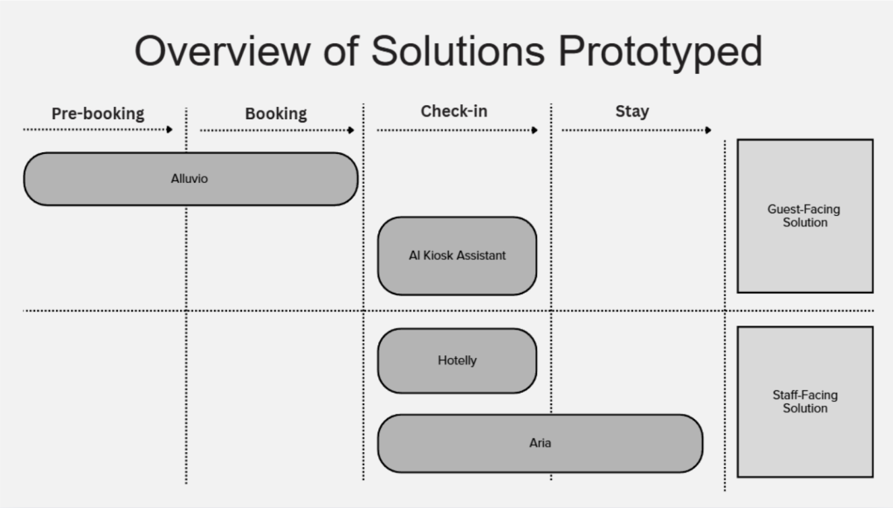

<strong>Figure 9: Overview of the solutions prototyped across the guest journey</strong>

## 1\. Alluvio {#alluvio}

Alluvio covers the pre-booking and booking phases of the luxury hotel check-in journey. Our goal is to design an intelligent, secure luxury system that intuitively captures and organises guest preferences. Through a fun, swipe-based interface, guests can build dynamic, evolving profiles while AI delivers personalised recommendations based on their preferences. Profiles can also securely store essential travel documents such as Visas, for easy and anytime access. With explicit consent, this information can be shared accurately across onboarded luxury hotels via secure integrations with their hotel management systems.

### Design Rationale

Most guests start looking for accommodation on Online Travel Agencies such as Booking.com, Expedia, Trip.com and Agoda. These platforms act as a centralised hub that allows users to compare prices, amenities and reviews across a wide range of properties, helping them find the best fit with minimal effort and high convenience. In recent years, many OTAs have expanded beyond hotel stays to include rental cars, attractions, flights and even airport transfers to the booked hotel, reinforcing their position as a one stop shop for travellers. According to a 2024 hotel distribution report, the vast majority of guests in Asia and Europe continue to book through these indirect channels, based on data from 2018 to 2023 as shown in Figure 10 (Hotel Distribution Report, 2024). A similar pattern is observed in the United States, where data collected in 2019, 2021 and 2023 indicates that OTAs remain a dominant booking channel, as shown in Figure 11 (Phocuswright Research, 2022). Together, these findings demonstrate how OTAs have become modern day leviathans in travel, shaping how guests search for and book their stays.

  

    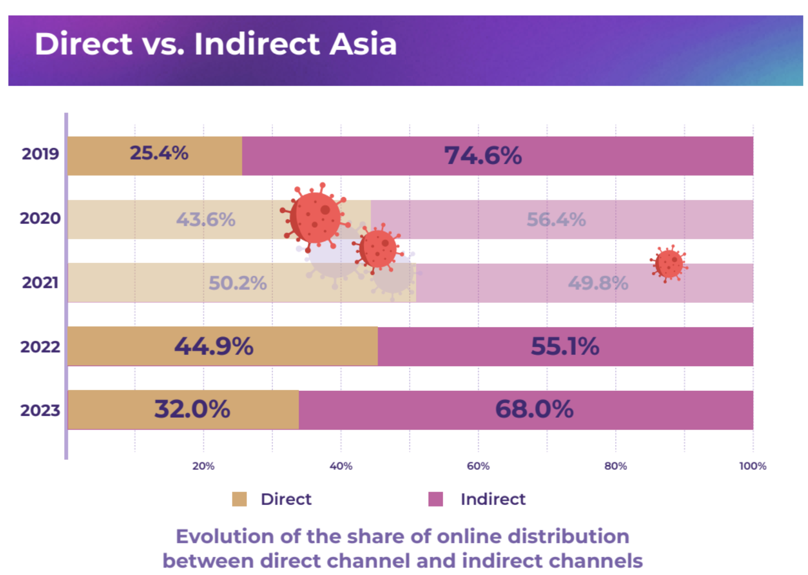
  
  
  

    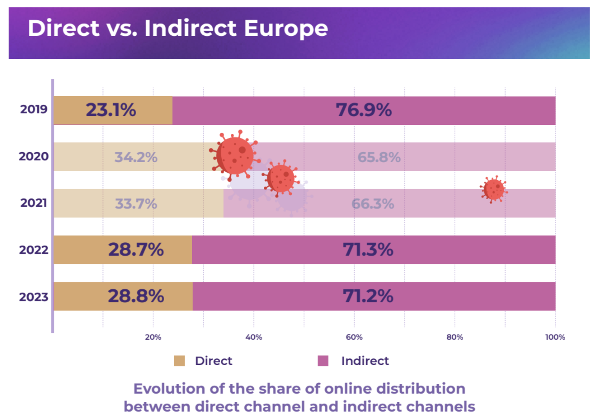
  

<strong>Figure 10: Share of direct and indirect online hotel bookings in Asia and Europe from 2019 to 2023</strong>

  

  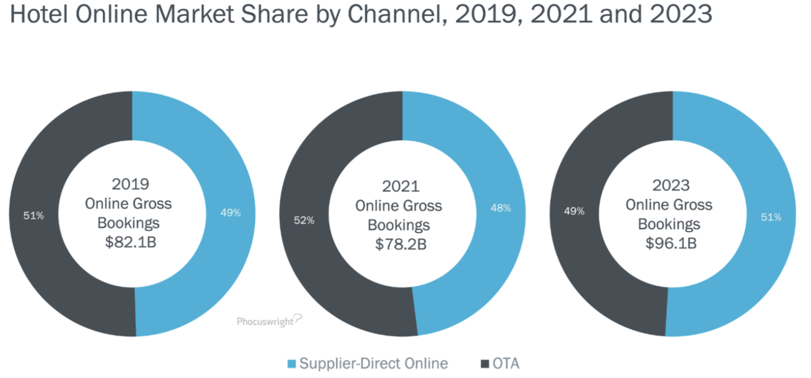

<strong>Figure 11: Share of direct and indirect online hotel bookings in the United States in 2019, 2021 and 2023</strong>

However, while OTAs bring clear benefits to guests, they are not as well received by hotels. OTAs function as intermediaries, which can introduce misrepresentation of hotel offerings, including outdated photos, inaccurate descriptions or missing amenities (Goswami, 2024). From our interviews with hotel staff, we also learned that OTAs do not always pass on guest information accurately and in some cases do not share it at all. This breakdown in communication can lead to guest dissatisfaction when preferences or special requests are not properly recorded or honoured at the property.

These shortcomings help explain why many hotels prefer direct bookings. When guests book directly, hotels gain full access to guest data, which enables deeper personalisation and a stronger sense of hospitality. Direct access to accurate guest profiles allows hotels to tailor services, anticipate needs and build long term relationships rather than simply fulfilling a transaction. More importantly, hotels can avoid the commission fees that OTAs typically charge, which are often in the range of 15-30% of the booking value (Dasgupta, 2025). For hotels, direct bookings therefore combine better control over the guest experience with improved financial outcomes.

### Value Proposition 

From here, we recognise that OTAs play an important role. They give hotels visibility, help them reach a wider audience and make it easy for guests to discover and compare options. At the same time, hotels still value direct bookings because they allow them to build stronger relationships with guests, personalise the stay and retain more revenue. Instead of replacing OTAs, our aim is to bring the best of both worlds together.

As such, Alluvio keeps the convenience and reach of OTAs while creating a direct and effortless connection between guests and the hotel. Through the integrated app and web platform, guests enjoy a smoother and more personalised pre-arrival experience and hotels can better anticipate their needs through direct communication. By allowing guests to apply their hotel loyalty programmes when booking through Alluvio, which is something that is not typically possible on OTAs, Alluvio makes the experience feel as seamless and rewarding as booking directly with the hotel while still delivering a level of service that reflects modern luxury.

### Solution Demo 

<iframe width="1000" height="600" src="https://youtube.com/embed/eHiLBygFeXg" title="Alluvio Demo Video" frameborder="0" allow="accelerometer; autoplay; clipboard-write; encrypted-media; gyroscope; picture-in-picture; web-share" allowfullscreen></iframe>

<strong>Video 1: Alluvio - Web Platform</strong>

<iframe width="1000" height="600" src="https://youtube.com/embed/rrKjjsphujQ" title="Alluvio Demo Video" frameborder="0" allow="accelerometer; autoplay; clipboard-write; encrypted-media; gyroscope; picture-in-picture; web-share" allowfullscreen></iframe>

<strong>Video 2: Alluvio - Mobile App Platform</strong>

### User Testing and Analysis

We had the opportunity to conduct user testing and analysis with hotel guests and staff, who are the two key stakeholder groups for Alluvio. Guests shared valuable feedback on both usability and the overall experience. They highlighted the need to reduce interaction friction, such as keeping all swipe options on the same page to avoid unnecessary scrolling. Guests also expressed that first time discounts or immediate rewards would motivate them to download and try a new platform. In addition, they were enthusiastic about features that help them discover hotels more easily, such as personalised recommendations based on their preference profiles. 

As for hotel staff, their insights centred strongly on revenue considerations. They emphasised that profit margins are always at the core of decision making and that guest preference data or personalised services are valuable mainly because they help guests feel that their stay is worth returning for. Staff noted that OTAs typically take between 16-20% of a room’s price, so from a business perspective they are open to adopting new platforms that offer more competitive pricing models. They also raised concerns about direct channel poaching, where guests who book through Alluvio could potentially be redirected by the hotel to amend or rebook their stay directly with the property due to the direct communication. This highlights the need for clear non-solicitation and shared data agreements if Alluvio were to work smoothly with hotels. Finally, staff suggested that Alluvio could offer guests meaningful benefits, such as a loyalty tier programme or the ability to stack rewards on top of existing hotel loyalty schemes, in order to motivate guests to use the platform.

These insights from guests and staff helped clarify Alluvio’s positioning and guided improvements to our interface and features. They are valuable considerations that we will carry forward as we decide on our final direction and solution.

## 2\. AI Kiosk Assistant {#ai-kiosk-assistant}

The AI Kiosk Assistant is a complementary device that works alongside existing self-service kiosks, keeping their speed while adding warmth and guidance. It uses a natural, conversational voice to talk with guests, help them through check-in, and gently capture their preferences. 

### Design Rationale (Primary)

Through site visits to multiple hotels in Singapore and interviews with front-office staff and managers, we examined how existing self-service kiosks are deployed and experienced in practice. In one hotel, for example, we observed tourists approaching the kiosk, appearing confused, and quickly searching for staff rather than completing check-in independently, highlighting a lack of clear guidance and reassurance. Across these observations and interviews, we distilled recurring pain points: 

1. Kiosks were too transactional and non-conversational  
2. Lacked guidance and emotionless  
3. Misaligned with luxury price points  
4. Inadequate when guests had questions or exceptions to handle

Illustrative quotes supporting each insight are provided in Appendix X. These insights suggest that the core issue is not automation itself, but that current kiosk experiences lack emotional engagement, clear guidance, and a sense of being genuinely cared for.

### Design Rationale (Secondary)

Secondary research points to a persistent tension between automation and emotional connection in hospitality. Automation can improve efficiency and consistency, but it often reduces warmth and empathy; qualities that are central to genuine hospitality. Studies also show that when self-service systems replace face-to-face interaction, guest satisfaction tends to drop, especially in areas like personalisation and perceived service quality (Christou et al., 2023).

Moreover, studies indicate that reduced interpersonal interaction in self-service systems negatively impacts guest satisfaction, particularly in areas related to personalization and perceived service quality (Nadiah et al., 2018). 

Despite technological advancements, guests continue to value human guidance in handling exceptions, building trust, and creating meaningful service experiences, showing that technology alone cannot meet the emotional expectations of luxury travelers (Christou et al., 2023). Consequently, emerging research supports a “High Touch \+ High Tech” approach that combines human empathy with intelligent automation to achieve both operational excellence and lasting guest satisfaction (Nichols, 2025). 

Collectively, these insights underscore the importance of designing solutions such as the AI Kiosk Assistant that balance efficiency with emotional resonance to redefine the modern luxury experience.

### Value Proposition 

For guests, the AI Kiosk Assistant offers the speed of a self-service kiosk with the reassurance of a human host. It turns the interaction from transactional to conversational, provides clear step-by-step guidance, responds to simple questions and exceptions, and adds emotional warmth and light personalisation so that using a kiosk feels aligned with luxury expectations rather than “cheap” or mechanical.

For hotels, it encourages higher kiosk adoption without the cost and disruption of a full hardware overhaul, as it can be added onto existing devices as a complementary layer.

#### <u>Key Features</u>

* **Conversational Guidance:** Natural voice interaction that welcomes guests, explains steps, and reduces confusion at the kiosk.

* **Policy & Knowledge Awareness:** Powered by OpenAI’s large language model that can be tailored with hotel policies, FAQs, and local information, so responses stay accurate and context-specific.

* **Exception Handling & Escalation:** Lets guests ask simple questions (e.g. late check-out, bedding type, package entitlements) and either provides guided answers or seamlessly routes the issue to front-office staff when human intervention is needed.

* **Light Personalisation:** Picks up basic preferences (e.g. pillow type, dietary requirements) during conversation

* **Emotionally Aware Tone:** Uses friendly, reassuring language and pacing to make the interaction feel less mechanical and more in line with a luxury experience.

* **Retrofit-Friendly Setup:** Designed to work alongside existing kiosk hardware and check-in flows with minimal operational change, avoiding a full system overhaul.

### **Solution Demo** {#solution-demo}

<iframe width="1000" height="600" src="https://youtube.com/embed/8P1xABYvYyA" title="AI Kiosk Assistant Demo Video" frameborder="0" allow="accelerometer; autoplay; clipboard-write; encrypted-media; gyroscope; picture-in-picture; web-share" allowfullscreen></iframe>

<strong>Video 3: AI Kiosk Assistant Demo</strong>

### **User Testing & Analysis** 

#### <u>Feedback from Hotel Stakeholders and Industry Partners</u>

To validate the AI Kiosk Assistant concept, we conducted early-stage user testing with front desk staff, hospitality trainees, and industry partners. The feedback provided valuable direction for refinement, summarised below:

#### 1. Operational Realism and Alignment with SOPs
Stakeholders stressed that any AI layer must align with real hotel procedures rather than just “talk nicely” on top of the kiosk. They emphasised that the system must support upselling within existing hotel policies, check booking time, room status, and room type before issuing a key, and escalate to staff when rooms are unavailable or exceptions arise. Overall, this feedback underscored the importance of operational accuracy and strict adherence to SOPs, guiding our next steps to refine system flows so they mirror existing procedures and escalation rules to ensure seamless hotel adoption.

#### 2. Voice Interaction, Noise, and Error Handling
Stakeholders raised concerns about whether voice interaction would function reliably in real hotel environments. They noted that lobbies can be noisy, especially during events, making it difficult for the AI to hear guests accurately, and there was worry that the system might overhear nearby conversations and respond inappropriately. Together, these points highlighted the need for robust handling of noise, misrecognition, and unintended activations. In response, our next steps focus on implementing dynamic audio systems and utilising touch-to-speak mechanisms to ensure more reliable interactions.

#### 3. Privacy, Data Protection, and Guest Expectations
Both hotel stakeholders and Venture Corporation emphasised strong concerns around privacy and data protection. They worried that the AI might overhear nearby conversations, questioned where voice data would be sent or stored in relation to PDPA requirements, and stressed the need to reassure guests that the system only listens when intentionally activated. This feedback highlighted the importance of moving toward privacy-by-design solutions, shaping our next steps to establish clearer boundaries around when the AI is active and explore on-device processing such as EdgeAI to minimise data exposure.

#### 4. Cost, ROI, and Adoption Risk
Cost and return on investment emerged as major concerns. With a single kiosk already costing around SGD 28,000, hotels questioned whether adding an AI layer would deliver clear, measurable benefits. Their feedback emphasised the need for a strong business case, guiding our next steps to assess whether the added investment can be justified.

#### <u>Feedback from Potential Guests</u>
Additionally, early-stage user testing with potential guests in a simulated setting revealed that users were open to guided automation and felt comfortable using a kiosk when it offered clear step-by-step instructions and reassurance at key moments. However, some were uneasy about speaking personal details aloud in a public lobby and preferred having the option to switch to touch input for sensitive information. These findings guide our next steps to combine voice guidance with privacy-sensitive touch interactions.

## 3\. Hotelly \- AI Overlay System for Front Desk Staff {#hotelly}

Building on the identified challenges of manpower shortages, inconsistent service quality, and rising guest expectations, our team developed *Hotelly*, an AI overlay system designed to discreetly support front desk staff during the hotel check-in process. Rather than replacing human hospitality, Hotelly enhances it. It serves as a real-time “co-pilot” that empowers staff to deliver warm, precise, and personalized service even under pressure.

Hotelly operates as a context-aware assistive layer, providing live prompts, key guest information, and automated note capture during guest interactions. This helps staff maintain composure and consistency, ensuring that high-touch service standards are met regardless of varying experience levels among employees. The prototype was inspired by successful analogues such as Google Contact Center AI, Otter.ai, and Cluely, which have demonstrated the technical viability of real-time overlays in other high-stakes conversational environments (AmplifAI, 2024).

### Design Rationale {#design-rationale}

The design rationale behind Hotelly was shaped by a recurring insight from our fieldwork across luxury hotels: although technology can streamline back-end processes, the essence of frontline hospitality remains profoundly human. Guest-facing excellence depends on staff judgement, composure, and consistent delivery, all traits that are increasingly difficult to maintain amid labour shortages, variable training quality, and rising expectations for personalization (Workforce Singapore, 2023). Rather than pursuing automation for its own sake, the team anchored the concept in an assistive paradigm: augmenting human capability rather than replacing it. Hotelly was therefore conceived as an AI co-pilot that strengthens service delivery while preserving the warmth and intentionality associated with luxury hospitality.

A key challenge uncovered during ethnographic observations was the cognitive load placed on front desk staff. Check-in requires parallel management of guest verification, data entry, problem-solving, and rapport-building - all while staying attentive and composed. Less experienced staff often struggled to recall phrasing, hotel policies, or local recommendations without breaking conversational flow. To address this, Hotelly introduces context-sensitive, real-time guidance delivered through a minimal peripheral overlay. This design takes inspiration from tools such as Google Contact Center AI and Cluely, which demonstrate how subtle prompts can bolster performance without becoming intrusive. By surfacing relevant information at the right moment, Hotelly supports knowledge recall and reduces hesitation, enabling staff to maintain natural interaction and human presence.
Preserving emotional connection was another foundational principle. Luxury guests consistently emphasized the value of eye contact, warmth, and authentic conversation; intrusive technology was seen as detracting from these qualities. User testing revealed strong resistance toward head-mounted interfaces, which were described as “awkward” and “dehumanizing.” As a result, Hotelly intentionally adopts a desktop-based design with compact, digestible prompts that live at the edges of the interface. This ensures that guidance remains available without pulling attention away from the guest or encouraging staff to read verbatim from a script. The system complements the choreography of human interaction.

Beyond moment-to-moment guidance, Hotelly also addresses a broader operational gap: the loss of service continuity between shifts. Many hotels suffer from inconsistent documentation of guest preferences and interactions, leading to lapses in personalization. Hotelly’s automated note capture and summarization create structured, timestamped records of guest conversations, improving handovers and supporting more accurate post-stay personalization and dispute resolution. This mirrors contemporary coaching systems (AmplifAI, 2024), where reflective review strengthens team capability over time. Together, these design choices reflect Ecole Hôtelière de Lausanne’s (2025) principle that AI in hospitality should enhance, not replace, empathy and human judgement. Ultimately, Hotelly aims to bridge automation with emotional intelligence, elevating the guest experience by empowering the people at its center.

### Value Proposition {#value-proposition-1}

Hotelly delivers value by strengthening the quality and consistency of front desk service while preserving the human warmth central to luxury hospitality. The system equips staff with subtle, real-time prompts that enhance confidence, speed, and accuracy during guest interactions, helping them respond more naturally and maintain composure even under pressure. This ensures that high-touch service can be delivered reliably across varying experience levels.

In addition, Hotelly automates the capture of guest notes, preferences, and key conversational details, reducing manual administrative work and improving continuity across shifts. By integrating lightweight automation with human-centric guidance, the system enhances personalization, reduces cognitive load, and reinforces a seamless, brand-aligned check-in experience that benefits both staff and guests.

### Solution Demo {#hotelly-solution-demo}

<iframe width="1000" height="600" src="https://www.youtube.com/embed/3t5eh34Za-s" title="Hotelly Demo Video" frameborder="0" allow="accelerometer; autoplay; clipboard-write; encrypted-media; gyroscope; picture-in-picture; web-share" allowfullscreen></iframe>

<strong>Video 4: Hotelly Demo</strong>

### User Testing and Analysis {#user-testing-and-analysis}

To validate the Hotelly concept, we conducted early-stage user testing with front desk staff and hospitality trainees. The feedback provided valuable direction for refinement, summarized below:

#### 1. Real-Time Retrieval Builds Confidence  
Many users described Hotelly as enabling them to appear “more knowledgeable” and “calmer under pressure.” Staff found it particularly helpful in recalling park timings, local attractions, or property-specific policies that they could not always memorize. The ability to surface key facts instantly helped maintain smooth conversational flow and reduced anxiety, especially among newer employees. This validated our hypothesis that cognitive offloading through AI can *elevate, not hinder* guest interaction quality.

#### 2. Training Potential Strongly Validated  
Participants widely recognized Hotelly’s potential as a training companion. New or junior staff saw it as a safety net that enabled them to handle complex guest requests more confidently. One participant noted: *“It’s more useful as a training tool than in real life. But for new hires, it’s perfect.”* This led to the concept of a dual-mode interface, a “Training Mode” with more guidance and feedback prompts, and a “Live Mode” optimized for minimal intrusion during actual guest interactions.

#### 3. Automated Note-Taking as a Key Value Driver  
Automation of guest note capture was consistently highlighted as one of Hotelly’s most valuable features. Staff emphasized its potential for dispute resolution, shift continuity, and personalized service. However, they also noted that accuracy and brevity would be critical: *“It even summarises preferences, that’s very helpful, but accuracy is important.”*This feedback informed our next development milestone \- integrating real-time summarization with adjustable confidence thresholds to balance automation and reliability.

#### 4. Managing Cognitive Offloading and Skill Atrophy  
While automation was largely welcomed, several respondents expressed concern about potential *skill atrophy*. Over-reliance on AI prompts might make staff dependent on the system rather than internalizing knowledge. As one user put it: *“This could make staff lazy… they might just read off it instead of remembering.”* These insights guided our philosophy that Hotelly should serve as a co-pilot, not a crutch, providing support while encouraging independent learning through gradual reduction of assistance.

#### 5. Interface and Usability Feedback  
Aesthetics and legibility were key concerns. Staff preferred short bullet points, large fonts, and strong visual hierarchy for quick scanning. They emphasized that the overlay should never compete with the PMS (Property Management System) interface, but rather complement it. This will guide subsequent iterations focusing on adaptive UI scaling, contrast sensitivity, and contextual card grouping.

#### 6. Discretion in Guest-Facing Interactions  
A final insight related to physical discretion was that participants felt that using smart glasses or overly visible devices risked making interactions feel robotic. Instead, staff favored screen-based overlays placed subtly on monitors or tablets. This feedback affirmed the decision to keep Hotelly’s presence peripheral and contextually embedded within existing workflows.

Together, these insights underscored the importance of balance—between speed and subtlety, automation and authenticity, information and intuition.

## 4\. Aria AI assistant {#aria-ai-assistant}

Aria is a Ai assistant design to help staff focus on conversation not typing. We aim to design a seamless, AI assistant that empowers hospitality staff by automating repetitive administrative work through auto-fill and intelligent recommendations. Enabling staff to focus more on meaningful guest interactions instead of data entry, with secure integration into workflow processes, it reduces stress and enhances workflow, while maintaining human oversight. Aria is an AI assistant designed to help staff focus on conversation not typing. It empowers hospitality staff through voice-driven data capture, supporting real-time transcription without recording. Extracted details would automatically be autofilled into guest profile and request fields. Staff would also be supported by guided real-time prompts with answers to guest inquiries, follow-up question suggestions, and a real-time summary of conversation and guest profile, enabling personalised recommendations. Aria could also reference hotel policies, FAQs, internal, safe external web searches databases such as available rooms. To maintain accuracy and accountability, staff should be able to manually verify, edit and approve all information. Consent, privacy, and data governance remain core. Aria would require explicit guest consent before activation, would not store raw audio, and would retain transcripts only briefly for verification. Any stored text would be encrypted, with audit trails maintained for full compliance. Operationally, Aria could integrate with existing systems such as Opera PMS to support seamless workflow integration.

**Design Rationale**

From our interviews, we found that front desk staff often struggle to balance conversation and data entry. Staff members described needing to pause interactions to avoid mistakes, which prolongs the process. Staff also get bombarded with guest questions and also frequently need to multitask. Such as across calls, chatboxes, in-person queries, and typing into systems, some of which occur simultaneously. Since details are manually keyed into Opera, mistakes such as missing or wrong/misspelled information may occur. These insights highlight the need for a tool that reduces typing burden and supports accurate, real-time data capture.

As personal service by staff remains an important skill, research across luxury hospitality consistently shows that high-touch remains central to luxury, and technology should enhance rather than replace human warmth and empathy,(Dusit Thani College, cited in WTTC, 2025; Al-Hyari et al., 2023; Bharwani & Mathews, 2021; EHL Insights, 2025). This informs our decision to position Aria for staff support instead of replacement. 
AI can streamline routine administrative tasks and boost efficiency, improving service quality and allowing employees to focus on higher-value meaning guest interactions, creating a lasting impression (EHL Insights, 2025). This supports Aria to automate typing so staff can focus more on the guest. 
Moreover, technology enables superior guest service and improves guest satisfaction by helping hotels identify and anticipate guest needs. It acts as an efficiency enhancer that equips staff with real-time, guest-specific and directly relevant information, combining data-driven precision with human empathy to elevate personalisation experience and service (Al-Hyari et al., 2023; Bharwani & Mathews, 2021). This aligns with our design choice for Aria to analyses guest profiles to tailored prompts and service recommendations, and support staff with answers to guest questions. 

### Value Proposition

For hotel staff who need to reduce manual workload and multitasking, ARIA is an AI-powered assistant that listens to guest conversations, automatically captures key information, and provides real-time intelligent prompts and answers. Delivering seamless and faster integration into hotel processes, allowing staff to focus on delivering personalized, high-touch guest experiences.

Unlike manual workflows where staff must track guest requests while juggling real-time interactions, ARIA supports rather than replaces staff tasks by reducing administrative burden, keeping them in the loop for verification, and providing quick access to information. This ensures accuracy, reduces stress and enhances workflow.

### Solution Demo

<iframe width="1000" height="600" src="https://youtube.com/embed/YVOP8cJANXY" title="Alluvio Demo Video" frameborder="0" allow="accelerometer; autoplay; clipboard-write; encrypted-media; gyroscope; picture-in-picture; web-share" allowfullscreen></iframe>

<strong>Video 5: Aria Demo</strong>

### User Testing & Analysis

#### 1. Accuracy Concern
During feedback sessions, managers raised concerns about accuracy and the risk of staff over-relying on AI. They worried that staff may lose focus or assume the system captured information when it did not, which could lead to problems. Staff emphasised that the effectiveness of an AI assistant depends heavily on its reliability and the need for staff to remain very attentive and actively verify information. In response, Aria can incorporate real-time confirmation prompts and to maintain accuracy and accountability and ensure that control over guest data always rests with staff. Concerns also emerged regarding microphone sensitivity and placement. Managers noted that counters in close proximity could cause the mic to pick up conversations from neighbouring guests. Solutions can include using directional microphones and training the AI to distinguish speakers to mitigate background voice capture.

#### 2. Data Protection
Data protection was another major concern. A manager highlighted PDPA risks, noting that guests can be very sensitive about data protection such as voice and cited “voice leak scandals” as to why guests may fear being recorded and also mention the importance of assuring guests that all data is deleted. He also mentioned that some staff might activate the tool even without obtaining consent. To address this, Aria requires explicit consent before activation, uses real-time transcription without storing raw audio and should include a visible active indicator, enforce audit trails with logged user actions and timestamps, and automatically delete transcripts after a defined period with a logged deletion timestamp. The IT director further stressed that any stored transcript must be encrypted.

#### 3. Value of autofill
Feedback also revealed mixed views about the usefulness of the auto-fill feature. The IT director acknowledged its value for capturing guest preferences and requests, noting that such requests could ideally be routed directly to service centres. However, the front office manager questioned its benefit for very short or simple interactions, where manual typing could be done quickly and easily. This informed our positioning that Aria is most beneficial in long, information-heavy, or multitasking situations rather than every check-in.

#### 4. Additional Features
Beyond face-to-face interactions, we also envision Aria being extended to phone calls and text messaging. Aria can listen to calls or read messages in real time, extract key details and requests, recommend replies, prepare summaries, and pre-fill guest profile fields. It can also integrate alongside our own or existing AI call/chat assistants adding autofill and structured data extraction capabilities rather than functioning solely as a reply generator and note taker. Across all channels, human verification remains required to ensure accuracy.

# Key Takeaways {#key-takeaways}

The 4 proposed solutions collectively address different stages of the luxury hotel check-in journey, encompassing elements of pre-booking, booking, check-in, and stay. 2 of these concepts are focused on guest-facing experiences aimed at streamlining and enhancing guest satisfaction while the other two lean more towards staff-facing solutions designed to improve operational efficiency, thereby indirectly enriching the overall guest experience. Together, these solutions offer a comprehensive exploration of the luxury hotel check-in process. Through user testing sessions conducted with both hotel staff and guests, several key insights were identified that consistently emerged across all 4 of our low-fidelity prototypes. The following section presents these key takeaways, which will guide our next phase of design refinement and development.

## Strengths {#strengths}
### **1\. Receptiveness to AI Solutions** 
Hotel staff generally expressed a positive attitude toward adopting AI to streamline operations and enhance guest service. While they acknowledged that AI has yet to make significant strides in the hospitality industry, largely due to the fundamental importance of the human touch, they were open to exploring how AI could be seamlessly integrated into both guest-facing and staff-facing processes. The staff were particularly enthusiastic about collaborating with us, noting that our generation’s familiarity with technology and innovative ideas made us valuable partners in their efforts to modernise.

### **2\. Key Features for Front-end and Back-end Use** 
Although our staff-facing solutions were initially designed to streamline front-end tasks, hotel staff recognised their potential value in both front-end and back-end operations. For example, the Hotelly feature, which was primarily intended to assist with check-ins by recording conversations and generating a transcript at the end of the process, proved useful for tracking back-end metrics such as average check-in times across different staff members. This data can also be leveraged for staff training, performance tracking, and even resolving disputes. For instance, if a guest claims they were not informed about lounge access during check-in, the hotel could refer to the recorded transcript to verify whether the information was communicated correctly and take appropriate action.

### **3\. High Feasibility for Integration with Existing PMS and HMS Systems** 
A key focus during the ideation and low-fidelity prototyping phase was minimising the learning curve and adoption barriers for hotel staff. With our low-fidelity prototypes, hotel staff expressed confidence in the feasibility of integrating our solutions with existing PMS and HMS systems. This consideration was central to our design approach, as we aim for our future proof-of-concept prototype to feature an intuitive interface, incorporating familiar icons and symbols aligned with widely used systems such as Opera by Oracle. This ensures smooth integration and simplifies the learning process for staff. 

These insights validate our low-fidelity prototypes and provide a solid foundation for further development. They affirm that we are on the right track and offer valuable momentum as we move forward with refining and expanding our solutions.

## Areas for Improvements/ Considerations {#areas-for-improvement}

### **1\. Data Privacy and Security Concerns** 
Data privacy and security are critical considerations in the hospitality industry, where large volumes of sensitive guest information are handled daily. As such, ensuring that all data is stored and transferred safely is essential. Any breach would not only lead to financial penalties and operational disruption but also reputational damage for the hotel. Protecting guest information must therefore be a priority, and our solutions need to uphold the highest standards of data protection.

### **2\. Balancing Human Judgement and AI Adoption** 
AI should empower staff rather than replace their judgement. Many staff members shared that technology designed to streamline operations should remain invisible to guests, supporting their work without creating over reliance. This underscores the need to maintain a balanced relationship between automation and human decision-making. The way moving forward will be to explore how AI can enhance staff capabilities while ensuring they retain the skill and confidence to deliver quality service independently. We believe this balance is achievable through sustained research, user testing and iterative refinement.

### **3\. Real-World Deployment Considerations** 
Within the context of luxury hotels, practicality and seamless integration are essential. Any solution introduced must fit naturally into existing workflows, uphold service standards and avoid disrupting the guest experience. Thus, real-world deployment is another key consideration for us, requiring evaluation of both technical and operational feasibility from the onset to ensure that the solution can be integrated smoothly.

# Project Plan {#project-plan}

Given the collaboration with our Stanford team across different time zones and countries, much of our work will be remote. However, in-person meetings will take place, albeit briefly relative to the overall duration of the project. It is crucial that we develop a plan to ensure both our team and the Stanford team are aligned on milestones and deadlines. These meetings must be focused and efficient to ensure we stay on track with the timeline and make steady progress. They are essential for maintaining momentum and ensuring effective collaboration. With this in mind, we have developed a timeline that we are committed to following closely. The key milestones are outlined below:

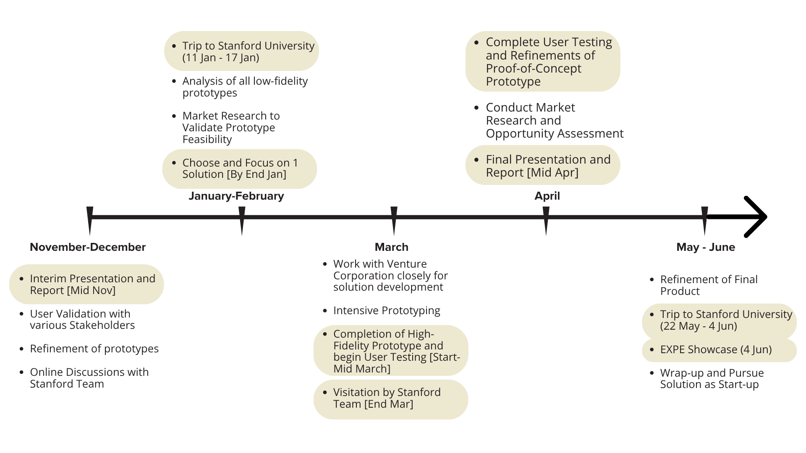  

<strong>Figure 12: Project Plan</strong>

# Conclusion {#conclusion}

During the December break, we will be conducting more extensive user testing with a wider range of hotels to gather deeper insights and feedback on our low-fidelity solutions. These findings will be consolidated and reviewed alongside insights from our Stanford team. After synthesising the results, we will prioritise the identified needs and address them systematically, beginning with the most critical. Given the diversity of the hospitality industry, even within the luxury segment, we will also need to define the specific tier of hotels our solution is intended for and consider how features may be adapted for other types of properties as well.

From this process, we aim to extract the most valuable elements across our low-fidelity prototypes that are relevant and integrate them into a single focused direction. This refined concept will be shaped by the considerations gathered from our research, industry feedback and collaborative discussions. Our goal is to identify and commit to one final prototype by the end of our Stanford trip in January. 

Following this, we will work closely with our industry partner, Venture Corporation, as well as other technology vendors to develop a solution that is both practical and secure. Their expertise will be essential in guiding us through the creation of an integrated system that can operate smoothly within real hospitality environments and meet the expectations of luxury hotel operations.

To support this progress, we will ensure clear delegation of tasks and maintain regular check-ins so that the team remains aligned and on track. With a structured approach and strong collaboration among all stakeholders, we are confident in our ability to develop a solution that has the potential to transform the luxury hotel check-in experience.

# References {#references}

1. Al-Hyari, H. S., Al-Smadi, M., & Weshah, S. R. (2023, June). The impact of artificial intelligence (AI) on guest satisfaction in hotel management: An empirical study of luxury hotels. GeoJournal of Tourism and Geosites, 48(2 spl), 810-819. [https://doi.org/10.30892/gtg.482spl15-1081 gtg.webhost.uoradea.ro+1](https://www.researchgate.net/publication/372048811_THE_IMPACT_OF_ARTIFICIAL_INTELLIGENCE_AI_ON_GUEST_SATISFACTION_IN_HOTEL_MANAGEMENT_AN_EMPIRICAL_STUDY_OF_LUXURY_HOTELS)  
2. AmplifAI. (2024). Real-time agent assist for hospitality. AmplifAI. [https://www.amplifai.com](https://www.amplifai.com/)  
3. Bharwani, S., & Mathews, D. (2021, May 31). Techno-business strategies for enhancing guest experience in luxury hotels: A managerial perspective. Worldwide Hospitality & Tourism Themes, 13(2), 168\. [https://doi.org/10.1108/WHATT-09-2020-0121](https://doi.org/10.1108/WHATT-09-2020-0121)  [Emerald+1](https://www.emerald.com/whatt/article-pdf/13/2/168/2401369/whatt-09-2020-0121.pdf?utm_source=chatgpt.com)  
4. Cayla, J. (2023, October 3). Services staff are humans, too – and customers need to understand this. Nanyang Business School, Nanyang Technological University. [https://www.ntu.edu.sg/business/news-events/news/story-detail/services-staff-are-humans-too-and-customers-need-to-understand-this](https://www.ntu.edu.sg/business/news-events/news/story-detail/services-staff-are-humans-too-and-customers-need-to-understand-this)   
5. Choo, D. (2022, January 17). The Big Read: At your service — or perhaps not, as manpower crunch worsens for hotels and restaurants. Channel NewsAsia. [https://www.channelnewsasia.com/today/big-read/hotel-restaurants-manpower-jobs-vacancies-2437971](https://www.channelnewsasia.com/today/big-read/hotel-restaurants-manpower-jobs-vacancies-2437971)   
6. Christou, P., Hadjielias, E., Simillidou, A., & Kvasova, O. (2023, January). The use of intelligent automation as a form of digital transformation in tourism: Towards a hybrid experiential offering. Journal of Business Research, 155, 113415\. [https://doi.org/10.1016/j.jbusres.2022.113415](https://doi.org/10.1016/j.jbusres.2022.113415)  
7. Dasgupta, N. (2025, August 5). 5 ota mistakes that could be hurting your hotel revenue & how to fix them. STAAH Blog. [https://blog.staah.com/tips-trends/ota-mistakes-hurting-hotel-revenue](https://blog.staah.com/tips-trends/ota-mistakes-hurting-hotel-revenue)  
8. D’Arpizio, C., Levato, F., & Montgolfier, J. de. (2024, January). Long live luxury: Converge to expand through turbulence. Bain & Company. [https://www.bain.com/insights/long-live-luxury-converge-to-expand-through-turbulence/](https://www.bain.com/insights/long-live-luxury-converge-to-expand-through-turbulence/)   
9. EHL Insights. (2023, November 8). Luxury hospitality: Trends, challenges, and best practices. [https://hospitalityinsights.ehl.edu/luxury-hospitality-trends-challenges-best-practices](https://hospitalityinsights.ehl.edu/luxury-hospitality-trends-challenges-best-practices)  
10. EHL Insights. (2025). Hospitality Outlook 2025: Insights Report. [https://hospitalityinsights.ehl.edu/hubfs/Blog-EHL-Insights/Documents-EHL-Insights/HospitalityOutlook2025\_InsightsReport.pdf](https://hospitalityinsights.ehl.edu/hubfs/Blog-EHL-Insights/Documents-EHL-Insights/HospitalityOutlook2025_InsightsReport.pdf)   
11. Frost & Sullivan. (2024, August 8\) CX Growth Opportunities in the Travel & Hospitality Industry 2024 to 2025 [https://member-frost-com.libproxy1.nus.edu.sg/loginEnterprise?reportID=KAE7-01-00-00-00](https://member-frost-com.libproxy1.nus.edu.sg/loginEnterprise?reportID=KAE7-01-00-00-00)   
12. Goswami, S. (2024, July 8). Ota Vs Hotel Direct Booking: Who is winning the battle?. eZee Absolute. [https://www.ezeeabsolute.com/blog/ota-vs-direct-booking/](https://www.ezeeabsolute.com/blog/ota-vs-direct-booking/)  
13. D-EDGE. (2024, April). Hotel distribution report 2024 – Have direct bookings reached a peak? \[White paper\]. [https://www.d-edge.com/wp-content/uploads/2024/04/Hotel-Distribution-Report-2024-EN.pdf](https://www.d-edge.com/wp-content/uploads/2024/04/Hotel-Distribution-Report-2024-EN.pdf)  
14. Kapferer, J.-N., & Bastien, V. (2025). The luxury strategy break the rules of marketing to build luxury brands. Kogan Page, Limited.  
15. Lüthy, B. (2025, January 23). Key hospitality data & industry statistics to watch for 2025\. EHL Insights. [https://hospitalityinsights.ehl.edu/hospitality-industry-statistics](https://hospitalityinsights.ehl.edu/hospitality-industry-statistics)   
16. Luxe Eternal \- How Luxury Brands are reinventing for Success. (n.d.-a). [https://www.accenture.com/content/dam/accenture/final/accenture-com/document-3/Accenture-Luxe-Eternal-Luxury-Report-1.pdf](https://www.accenture.com/content/dam/accenture/final/accenture-com/document-3/Accenture-Luxe-Eternal-Luxury-Report-1.pdf)  
17. Mann, R., Scully, E., Straus, M., & Tellez Holub, J. (2024, March 18). How the world’s best hotels deliver exceptional customer experience. McKinsey & Company. [https://www.mckinsey.com/industries/travel/our-insights/how-the-worlds-best-hotels-deliver-exceptional-customer-experience](https://www.mckinsey.com/industries/travel/our-insights/how-the-worlds-best-hotels-deliver-exceptional-customer-experience)   
18. Ministry of Manpower, Manpower Research and Statistics Department. (2025, September 17). Labour market report: Second quarter 2025\. [https://stats.mom.gov.sg/Pages/Labour-Market-Report-2Q-2025.aspx](https://stats.mom.gov.sg/Pages/Labour-Market-Report-2Q-2025.aspx)   
19. Mordor Intelligence. (2025, August 21). Hospitality industry in Singapore: Size & share analysis. [https://www.mordorintelligence.com/industry-reports/hospitality-industry-in-singapore\#:\~:text=Luxury%20captured%2040.40%25%20of%202024,or%20downshift%20to%20budget%20convenience](https://www.mordorintelligence.com/industry-reports/hospitality-industry-in-singapore#:~:text=Luxury%20captured%2040.40%25%20of%202024,or%20downshift%20to%20budget%20convenience)  
20. Mordor Intelligence. (2025, October 24). Luxury hotel market – growth, trends, forecast (2025–2030). [https://www.mordorintelligence.com/industry-reports/luxury-hotel-market](https://www.mordorintelligence.com/industry-reports/luxury-hotel-market)  
21. Nadiah, D., Dzia-Uddin, B., Amir, S., Bt, Z., & Isa, M. (2018). SELF-SERVICE TECHNOLOGIES INFLUENCING GUEST SATISFACTION IN HOTEL INDUSTRY. Journal of Hospitality and Networks Jurnal Hospitaliti Dan Jaringan, 1, 25–31. [https://unimel.edu.my/journal/index.php/JHN/article/viewFile/368/318](https://unimel.edu.my/journal/index.php/JHN/article/viewFile/368/318)  
22. Nichols, J. P. (2025, August 22). Finding A Balance Between Technology and Human Touch in Hospitality. Hospitality Net. [https://www.hospitalitynet.org/opinion/4128479.html](https://www.hospitalitynet.org/opinion/4128479.html)  
23. Phocuswright. (2022, March 9). By 2023, hotel supplier-direct will again surpass otas. Phocuswright. [https://www.phocuswright.com/Travel-Research/Research-Updates/2022/by-2023-hotel-supplier-direct-will-again-surpass-ota](https://www.phocuswright.com/Travel-Research/Research-Updates/2022/by-2023-hotel-supplier-direct-will-again-surpass-ota)  
24. SMART HOTEL TECHNOLOGY GUIDE 2019\. Singapore Hotel Association :: Publications publications. (2019, November). [https://sha.org.sg/userfiles/ckeditor/Files/Smart%20Hotel%20Technology%20Guide%202019.pdf](https://sha.org.sg/userfiles/ckeditor/Files/Smart%20Hotel%20Technology%20Guide%202019.pdf)    
25. Seah, K. C. (2022, July 23). Commentary: Raise salaries to attract more locals to hospitality and F\&B? It’s not so simple. Channel NewsAsia. [https://www.channelnewsasia.com/commentary/hotel-restaurant-long-wait-labour-shortage-foreign-worker-jobs-2828971](https://www.channelnewsasia.com/commentary/hotel-restaurant-long-wait-labour-shortage-foreign-worker-jobs-2828971)   
26. Singapore Institute of Hospitality. (2024, March 20). Why upskilling your staff is the most cost-effective solution to labour shortages. [https://sih.edu.sg/why-upskilling-your-staff-is-the-most-cost-effective-solution-to-labour-shortages/](https://sih.edu.sg/why-upskilling-your-staff-is-the-most-cost-effective-solution-to-labour-shortages/)   
      
27. Singapore Tourism Board. (2025, April 11). Speech by Ms Grace Fu, minister for Sustainability and the environment and minister-in-charge of trade relations, at TIC 2025\. [https://www.stb.gov.sg/about-stb/media-publications/speeches/speech-by-ms-grace-fu--minister-for-sustainability-and-the-environment-and-minister-in-charge-of-trade-relations--at-tic-2025/](https://www.stb.gov.sg/about-stb/media-publications/speeches/speech-by-ms-grace-fu--minister-for-sustainability-and-the-environment-and-minister-in-charge-of-trade-relations--at-tic-2025/)   
28. Singapore Tourism Board. (2025, February 4). Singapore achieves historical high in tourism receipts in 2024\. [https://www.stb.gov.sg/about-stb/media-publications/media-centre/singapore-achieves-historical-high-in-tourism-receipts-in-2024](https://www.stb.gov.sg/about-stb/media-publications/media-centre/singapore-achieves-historical-high-in-tourism-receipts-in-2024) (Singapore Tourism Board, 2025\)  
29. Singapore Tourism Board. (2025, September 18). Hotels. Retrieved from [https://www.stb.gov.sg/industries-experience-development/hotels](https://www.stb.gov.sg/industries-experience-development/hotels)  
30. Stanley, S. (2025, April 11). Singapore targets $50 billion in tourism receipts by 2040; eyes MICE sector as key growth driver. The Straits Times. [https://www.straitstimes.com/singapore/singapore-targets-50-billion-in-tourism-receipts-by-2040-eyes-mice-sector-as-key-growth-driver](https://www.straitstimes.com/singapore/singapore-targets-50-billion-in-tourism-receipts-by-2040-eyes-mice-sector-as-key-growth-driver)  
31. Tufft, C., Constantin, M., Pacca, M., & Mann, R. (2024, May 29). Updating perceptions about today’s luxury traveler. McKinsey & Company. [https://www.mckinsey.com/industries/travel/our-insights/updating-perceptions-about-todays-luxury-traveler](https://www.mckinsey.com/industries/travel/our-insights/updating-perceptions-about-todays-luxury-traveler)   
32. UN Tourism. (2025, January 21). International tourism recovers pre-pandemic levels in 2024\. [https://www.untourism.int/news/international-tourism-recovers-pre-pandemic-levels-in-2024](https://www.untourism.int/news/international-tourism-recovers-pre-pandemic-levels-in-2024)   
33. Venture Corporation Ltd. (2025). Reimagining a Premium Automated Hotel Check-In Experience: Project Brief.  
34. Workforce Singapore. (2023, November 7). The Future of Jobs and Skills in Singapore’s Hotel Industry [https://www.wsg.gov.sg/docs/default-source/content/jtm/jtm-for-hotels\_full-report\_v8-0\_public\_vf\_07112023.pdf](https://www.wsg.gov.sg/docs/default-source/content/jtm/jtm-for-hotels_full-report_v8-0_public_vf_07112023.pdf)  
35. World Travel & Tourism Council. (2025, September 30). WTTC report shows travel & tourism set to support 91MN new jobs by 2035\. [https://wttc.org/news/wttc-report-shows-travel-and-tourism-set-to-support-91mn-new-jobs-by-2035](https://wttc.org/news/wttc-report-shows-travel-and-tourism-set-to-support-91mn-new-jobs-by-2035)  
36. World Travel & Tourism Council. (2025). The future of work in travel & tourism: The key trends shaping workforce strategies. World Travel & Tourism Council.

# Appendices {#appendix}

### Appendix A: More Background Information

**Global market growth**

The Luxury Traveler Survey from Skift further highlights a trend towards splurging on luxury accommodation, customized itineraries, and highend experiences (EHL Insights, 2025). 

**Changing definition of luxury & guest experience**

This is shaped by the declining ability of luxury goods to signal social standing, driven by their increased accessibility and the growing prevalence of high-quality fakes (EHL Insights, 2023).

Similarly, the UN Tourism (2025) estimated that in 2024, about 1.4 billion tourists travelled internationally, indicating almost complete recovery (99%) of pre-pandemic levels—fueled by strong post-pandemic demand, robust performance from large source markets and the ongoing recovery of destinations in Asia and the Pacific. The sector’s strong rebound is also becoming a powerful engine for global job creation, with projections to support about 371 million jobs this year (World Travel & Tourism Council, 2025). International arrivals are projected to rise a further 3%–5% in 2025 (UN Tourism, 2025).

Roles that depend on human interaction and services that are hard to automate will remain especially in high demand (World Travel & Tourism Council, 2025).

**Singapore’s Hospitality Trends**

Looking ahead, the Singapore Tourism Board (2025) forecasts tourism receipts of SGD 29 to 30.5 billion and expects international visitor arrivals to reach 17 to 18.5 million in 2025, maintaining the upward trajectory seen in 2024\.

Mordor Intelligence (2025) projects the hospitality sector will reach a market size of USD 21.18 billion in 2025 and grow further to USD 28.51 billion by 2030, representing a compound annual growth rate (CAGR) of 6.12 %. 

In 2025, luxury hotel segment in Singapore comprises about 30 establishments, contributes roughly 35 % of total hotel room revenue, with a REVPAR of around SGD 520.96, it remains the strongest-performing tier (Singapore Tourism Board, 2025).

These collective efforts elevated the nation’s global standing, with Singapore ranking ninth in Euromonitor International’s 2024 City Destinations Index—one of only two Asian cities in the top ten (Singapore Tourism Board, 2025). Growth in 2024 was further fueled by the 30-day mutual visa exemption with Mainland China and improved air connectivity, with Changi Airport nearing pre-pandemic capacity (Singapore Tourism Board, 2025). 

Shifting lifestyles and social habits are fuelling demand for innovative, seamless, and personalised guest experiences (Workforce Singapore, 2023). 

At the same time rising competition from new brands, distribution channels, and other industries is pressuring hotels to transform and differentiate themselves (Workforce Singapore, 2023). To stay ahead and remain relevant in a saturated market, hotels must continue to leverage technological advancements to boost efficiency and productivity, while adapting their business strategies to the post-pandemic environment (Workforce Singapore, 2023).

**Singapore Labour Shortage**

The Singapore Business Federation notes that foreign manpower remains essential to meeting service demand due to the shrinking pool of willing local job seekers (Seah, K. C., 2022). Post-COVID recovery has reignited consumer demand, yet the industry’s workforce has not rebounded at the same pace  (Singapore Institute of Hospitality, 2024\). Singapore's recruitment and retention problem in the service industry threatens growth (Cayla, 2023). 

Employees are often required to work extended hours, resulting in fatigue, burnout, and even higher turnover rates (Singapore Institute of Hospitality, 2024\). 

Service workers feel that customers undervalue the skills and expertise required for their jobs, hospitality employees often undertake years of rigorous training, yet their skills are unappreciated (Cayla, 2023).

In turn, this contributes to lost revenue opportunities, as teams are unable to manage demand (Singapore Institute of Hospitality, 2024\). 

### Appendix B: Hotel and Industry Visits {#appendix}

This appendix summarises the luxury hotels and organisations we visited as part of our primary research. Each visit helped us understand real-world check-in operations, constraints, and attitudes towards automation in luxury hospitality.

#### B.1 Amara Singapore
We visited Amara Singapore to observe front-office operations and better understand current check-in practices and guest–staff interactions.

**Stakeholders Engaged** 
**Gordon Aeria** – General Manager, Amara Singapore 
**Pearlyn** – Front Office Manager

#### B.2 Shangri-La Singapore
We conducted two visits to Shangri-La Singapore. 
The first visit focused on understanding the luxury hotel while the second visit involved sharing and testing early-stage prototypes with hotel stakeholders to gather feedback.

**Stakeholders Engaged** 
**Devendra Pandey** – Director of Information Technology 
**Benny Fok** – Front Office Manager

  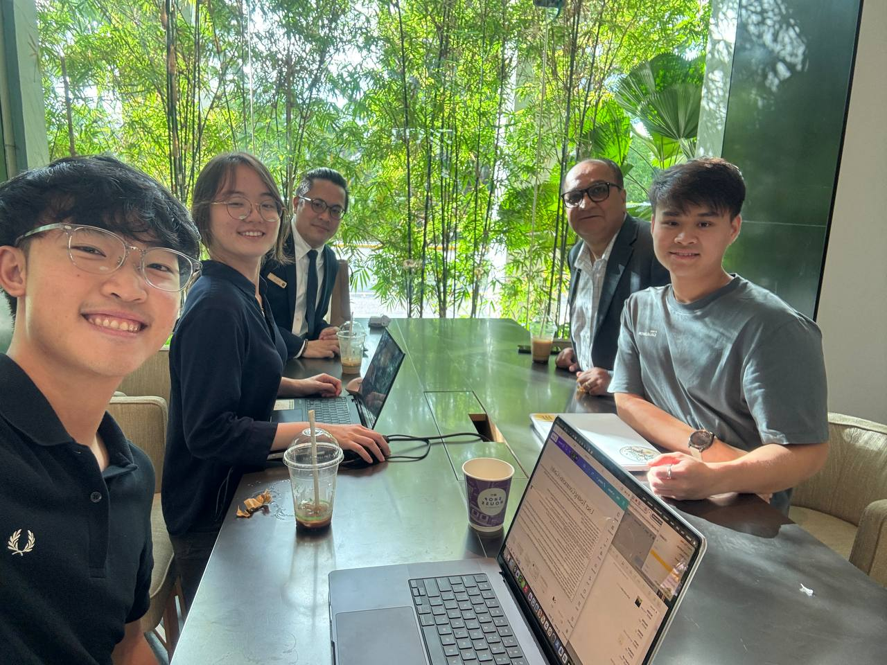

<strong>Figure B.2. Shangri-La Singapore (site visit photograph)</strong>

#### B.3 Raffles Hotel Singapore
At Raffles Hotel Singapore, we engaged with stakeholders to understand the perspectives from an iconic luxury heritage brand.

**Stakeholders Engaged** 
**Alfani Leonaris** – Lobby Operation Manager 
**Christian Westbeld** – Managing Director

  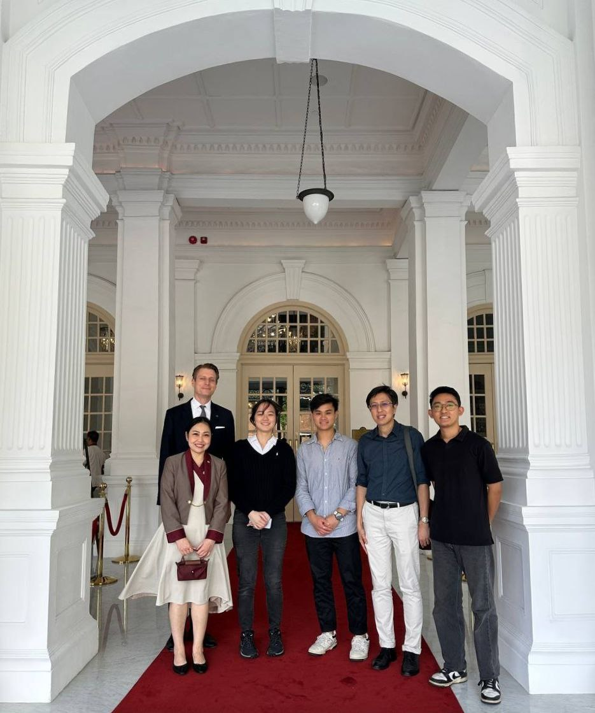

<strong>Figure B.3. Raffles Hotel Singapore – lobby and entrance area (site visit photograph)</strong>

#### B.4 Banyan Tree Headquarters
We visited the Banyan Tree Headquarters to gain a brand-level perspective on guest experience and the strategic role of technology and AI across the group’s portfolio.

**Stakeholder Engaged** 
**Sheriann** – Business Development Team

  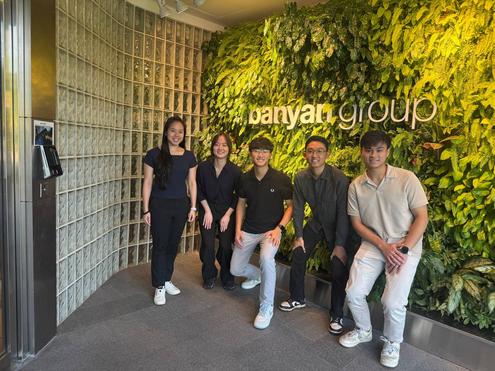

<strong>Figure B.4. Banyan Tree Headquarters (site visit photograph)</strong>

#### B.5 Mandai Rainforest Resort
We also visited Mandai Rainforest Resort, a flagship resort under Banyan Tree.

**Stakeholder Engaged** 
**Joan Yao** – Director, Rooms

  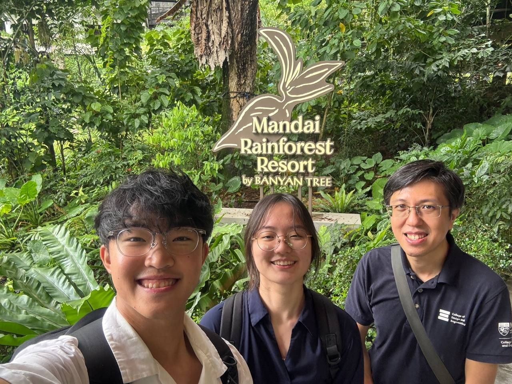

<strong>Figure B.5. Mandai Rainforest Resort – arrival area (site visit photograph)</strong>

### Appendix C: Illustrative Quotes Supporting Key Insights

**Insight 1: Kiosks are too transactional and non-conversational**

  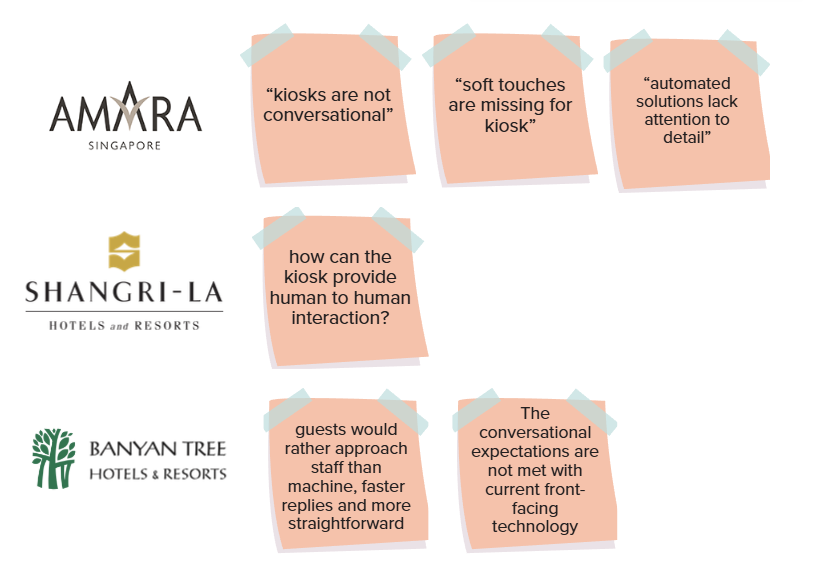

<strong>Figure C.1: Quotes that justify Insight 1</strong>

These quotes highlight how guests perceive kiosks as mechanical and emotionless, lacking the warmth and conversational qualities of human interaction (see Figure C.1).

**Insight 2: Kiosks lacked guidance and were emotionless**

Field observations showed guests hesitating, appearing confused, and ultimately abandoning the kiosk to seek staff; over a two-hour period, we observed at least three to four groups unsure of how to proceed

  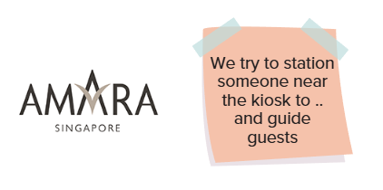

<strong>Figure C.2: Quotes that justify Insight 2</strong>

Interview insights highlight that staff often need to station someone near the kiosk specifically because the kiosk lacks sufficient guidance and emotional reassurance (see Figure C.2).

**Insight 3: Misaligned with luxury price points**

  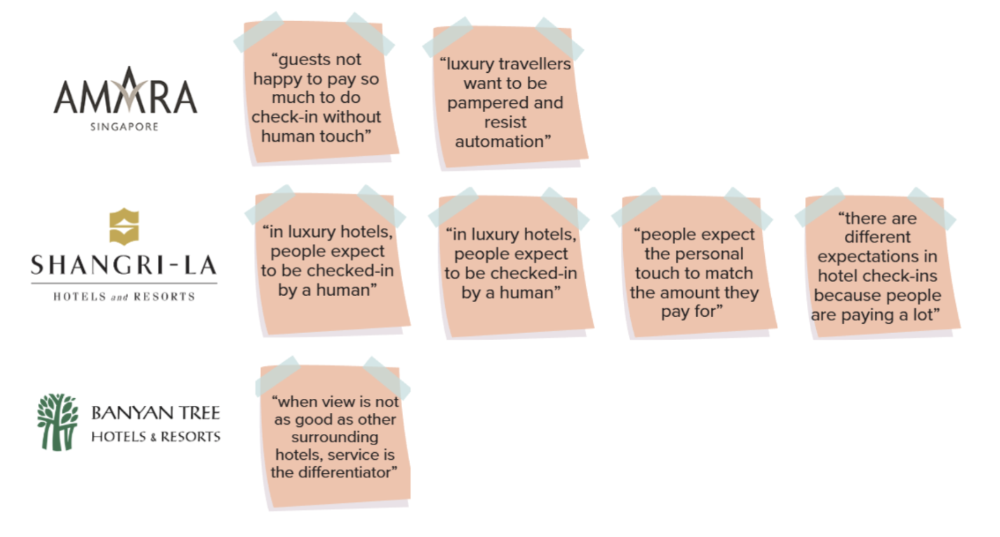

<strong>Figure C.3: Quotes that justify Insight 3</strong>

These quotes show that guests paying premium rates expect personalised, human-led service, making self-service check-in feel mismatched with luxury hospitality standards (see Figure C.3).

**Insight 4: Kiosks are inadequate when guests have questions or exceptions**

  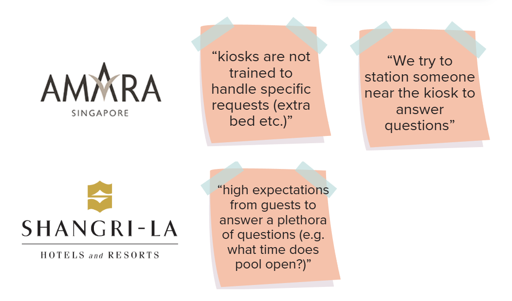

<strong>Figure C.4: Quotes that justify Insight 4</strong>

These quotes demonstrate how kiosks struggle not only with non-standard requests and special needs, but also with answering the wide range of questions guests typically ask; resulting in users defaulting to staff for support (see Figure C.4).

### Appendix D: User Personas

#### Overview

Building on the insights gathered from our interviews and affinity clustering analysis, we developed two user personas representing key stakeholders in the luxury hotel check-in ecosystem: the Front Desk Staff and the Hotel Manager. These personas encapsulate recurring behavioural patterns, motivations, and frustrations observed across different hotels and roles.

By distilling common attributes into relatable archetypes, the personas helped the team anchor design decisions around real human needs rather than abstract assumptions. They serve as reference points to evaluate potential solutions - ensuring that design directions remain grounded in the operational realities and emotional experiences of both staff and management.

**Persona 1: Front Desk Staff (Extrovert)**
This persona embodies the frontline employees who directly engage with guests during check-in. Typically sociable and service-driven, these individuals thrive on personal interaction and hospitality but face significant cognitive and emotional strain balancing human engagement with system-related administrative tasks.

**Key Characteristics:**
- Behaviours: Greets guests warmly, keys in details manually, manages guest expectations and complaints in real-time.
- Goals: To provide seamless service, input guest data accurately, and maintain composure under pressure.
- Pain Points: Struggles with complex systems like Opera PMS; repetitive, multitasking-heavy workflows; and emotionally draining guest interactions.
- Personality: Extroverted, warm, yet occasionally overwhelmed or careless under stress.
- Motivations: Desire to make guests feel valued and to perform well under managerial supervision — often driven by pride in hospitality and fear of reprimand.

**Design Implication:**
Tools targeting this persona should emphasize simplicity, real-time guidance, and emotional relief, reducing manual data entry, streamlining multitasking, and allowing staff to focus on the relational side of service.

**Persona 2: Hotel Manager**
This persona represents middle- to upper-level managers responsible for overall service quality, staff coordination, and technology adoption. They bridge guest expectations, staff realities, and corporate objectives, often balancing efficiency goals with the preservation of brand hospitality standards.

**Key Characteristics:**
- Behaviours: Conducts team meetings, supervises operations, and occasionally intervenes in guest escalations.
- Goals: Improve consistency, empower staff autonomy, enhance efficiency and guest satisfaction.
- Pain Points: Fragmented tech systems, difficulty retaining skilled staff, and pressure to adopt technologies that may disrupt daily operations.
- Personality: Charismatic and outwardly confident, but at times detached from on-the-ground challenges.
- Motivations: Enhance hotel reputation, improve guest ratings, and optimize operations to manage costs effectively.

**Design Implication:**
Solutions for this persona should provide visibility, control, and actionable insights. This enables managers to monitor performance, empower teams, and assess new technology adoption without micromanaging.

**Application of Personas**
The personas collectively highlight the tension between human empathy and system efficiency - a central challenge in reimagining the luxury check-in experience. By referencing these personas in subsequent design stages (such as journey mapping and prototyping), the team can ensure that innovations remain empathetic to staff realities while aligning with managerial objectives for scalability and consistency.

  <nav class="toc-sidebar">
    <h2>Table of Contents</h2>
    <ul>
      <li><a href="#acknowledgements">Acknowledgements</a></li>
      <li>
        <a href="#introduction">Introduction</a>
        <ul>
          <li><a href="#check-in-experience-as-a-first-impression">Check-in Experience as a First Impression</a></li>
          <li><a href="#luxury-in-modern-day-context">Luxury in Modern Day Context</a></li>
        </ul>
      </li>
      <li>
        <a href="#background">Background</a>
        <ul>
          <li><a href="#global-market-growth">Global market growth</a></li>
          <li><a href="#global-trends">Global Trends</a></li>
          <li><a href="#singapores-hospitality-trends">Singapore's Hospitality Trends</a></li>
          <li><a href="#singapore-labour-shortage">Singapore Labour Shortage</a></li>
          <li><a href="#leveraging-ai">Leveraging AI</a></li>
        </ul>
      </li>
      <li>
        <a href="#primary-research">Primary Research</a>
        <ul>
          <li>
            <a href="#interviews-with-hotels">Interviews with Hotels</a>
            <ul>
              <li><a href="#hotel-sample-and-participant-roles">Hotel Sample and Participant Roles</a></li>
              <li><a href="#data-collection-protocol">Data Collection Protocol</a></li>
              <li><a href="#interview-design-and-flow">Interview Design and Flow</a></li>
              <li><a href="#analysis-approach">Analysis Approach</a></li>
            </ul>
          </li>
          <li><a href="#guest-experience-pain-points-analysis">Guest Experience Pain Points Analysis (1-Star Review Study)</a></li>
          <li>
            <a href="#key-themes-and-insights-from-primary-research">Key Themes and Insights from Primary Research</a>
          </li>
        </ul>
      </li>
      <li>
        <a href="#property-management-system">Property Management System</a>
        <ul>
          <li><a href="#role-in-hotel-operations">Role in Hotel Operations</a></li>
          <li><a href="#limitations-and-friction-points">Limitations and Friction Points</a></li>
          <li><a href="#implications-for-design">Implications for Design</a></li>
        </ul>
      </li>
      <li>
        <a href="#experience-journey-maps">Experience Journey Maps</a>
        <ul>
          <li><a href="#pre-arrival">Pre-arrival</a></li>
          <li><a href="#traditional-counter-check-in">Traditional Counter Check-in</a></li>
          <li><a href="#kiosk-check-in">Kiosk Check-in</a></li>
        </ul>
      </li>
      <li>
        <a href="#stakeholders">Stakeholders</a>
        <ul>
          <li><a href="#guests">1. Guests</a></li>
          <li><a href="#front-office-staff">2. Front-Office Staff</a></li>
          <li><a href="#hotel-management">3. Hotel Management</a></li>
          <li><a href="#technology-department">4. Technology Department</a></li>
        </ul>
      </li>
      <li><a href="#problem-statement">Problem Statement</a></li>
      <li>
        <a href="#design-directions">Design Directions</a>
      </li>
      <li>
        <a href="#prototypes">Prototypes</a>
        <ul>
          <li><a href="#alluvio">1. Alluvio</a></li>
          <li>
            <a href="#ai-kiosk-assistant">2. AI Kiosk Assistant</a>
          </li>
          <li>
            <a href="#hotelly">3. Hotelly - AI Overlay System for Front Desk Staff</a>
          </li>
          <li><a href="#aria-ai-assistant">4. Aria AI assistant</a></li>
        </ul>
      </li>
      <li>
        <a href="#key-takeaways">Key Takeaways</a>
        <ul>
          <li><a href="#strengths">Strengths</a></li>
          <li><a href="#areas-for-improvement">Areas for Improvement/ Considerations</a></li>
        </ul>
      </li>
      <li><a href="#project-plan">Project Plan</a></li>
      <li><a href="#conclusion">Conclusion</a></li>
      <li><a href="#references">References</a></li>
      <li><a href="#appendix">Appendices</a></li>
    </ul>
  </nav>
  
  

  

