<div style="text-align: center; margin: 40px 0;">
  
  
  <h1 style="color: #003d7a; margin: 20px 0 10px 0; font-size: 24px; font-weight: bold;">CDE4301 Innovation & Design Capstone (Final Report)</h1>
  
  <p style="color: #666; font-size: 18px; margin: 10px 0;">Stanford GEDI Programme AY2025/26</p>
  
  <h2 style="color: #1a1a1a; margin: 30px 0 15px 0; font-size: 28px; font-weight: bold; line-height: 1.3;">Reimagining the Luxury Hotel Check-In Experience</h2>


</div>


## Meet the Students

<div style="display: flex; justify-content: space-around; align-items: center; margin: 40px 0; flex-wrap: wrap;">
  <div style="text-align: center; margin: 20px;">
    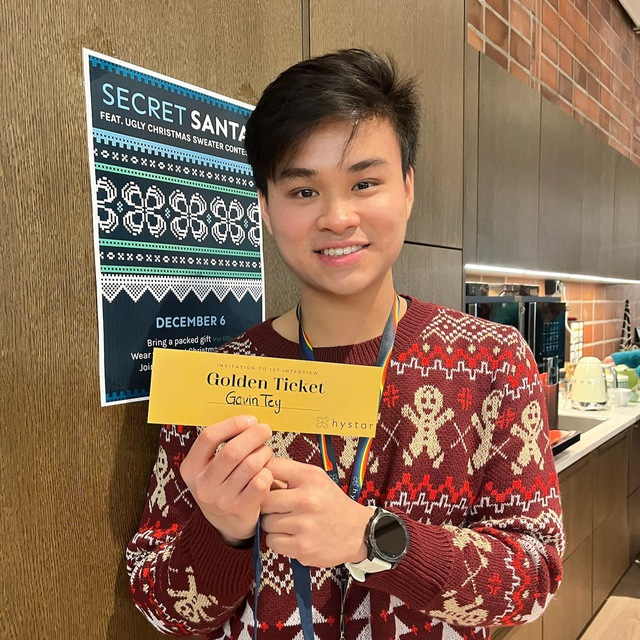
    <h4 style="margin: 8px 0 4px 0; font-size: 16px;">Gavin Tey</h4>
    <p style="margin: 0; font-size: 14px; color: #666;">Mechanical Engineering &</p>
    <p style="margin: 0; font-size: 14px; color: #666;">Business Management</p>
    <p style="margin: 0; font-size: 14px; color: #666;">A0255359U</p>
  </div>
  
  <div style="text-align: center; margin: 20px;">
    
    <h4 style="margin: 8px 0 4px 0; font-size: 16px;">Ilham Ridzuan</h4>
    <p style="margin: 0; font-size: 14px; color: #666;">Industrial Systems Engineering</p>
    <p style="margin: 0; font-size: 14px; color: #666;">A0253086A</p>
    <p style="margin: 0; font-size: 14px; color: #666;"></p>
  </div>
  
  <div style="text-align: center; margin: 20px;">
    
    <h4 style="margin: 8px 0 4px 0; font-size: 16px;">Jolie Koh</h4>
    <p style="margin: 0; font-size: 14px; color: #666;">Biomedical Engineering &</p>
    <p style="margin: 0; font-size: 14px; color: #666;">Innovation and Design Programme</p>
    <p style="margin: 0; font-size: 14px; color: #666;">A0255216J</p>
    <p style="margin: 0; font-size: 14px; color: #666;"></p>
  </div>
  
  <div style="text-align: center; margin: 20px;">
    
    <h4 style="margin: 8px 0 4px 0; font-size: 16px;">Lim Soong En</h4>
    <p style="margin: 0; font-size: 14px; color: #666;">Computer Engineering &</p>
    <p style="margin: 0; font-size: 14px; color: #666;">Business Administration</p>
    <p style="margin: 0; font-size: 14px; color: #666;">A0255302R</p>
  </div>
</div>

## Meet our Supervisors

<div style="display: flex; justify-content: center; align-items: center; margin: 40px 0; gap: 60px; flex-wrap: wrap;">
  <div style="text-align: center; margin: 20px;">
    <div style="width: 120px; height: 120px; border-radius: 50%; background-color: #f0f0f0; margin: 0 auto 10px auto; display: flex; align-items: center; justify-content: center; color: #999; font-size: 14px;">
      
    </div>
    <h4 style="margin: 8px 0 4px 0; font-size: 16px;">Dr Elliot Law</h4>
    <p style="margin: 0; font-size: 14px; color: #666;">NUS CDE</p>
  </div>
  
  <div style="text-align: center; margin: 20px;">
    <div style="width: 120px; height: 120px; border-radius: 50%; background-color: #f0f0f0; margin: 0 auto 10px auto; display: flex; align-items: center; justify-content: center; color: #999; font-size: 14px;">
      
    </div>
    <h4 style="margin: 8px 0 4px 0; font-size: 16px;">Mr Royston Shieh</h4>
    <p style="margin: 0; font-size: 14px; color: #666;">NUS CDE</p>
  </div>
</div>


<a id="1-acknowledgements"></a>

# 1 Acknowledgements

We would like to express our sincere gratitude to Dr Elliot Law and Mr Royston Shieh for their guidance, support and encouragement throughout this project. Their weekly check-ins provided us with clarity, direction and valuable feedback on where to focus our efforts. Their advice was instrumental in helping us identify our target users and refine the scope of our work.

We would also like to extend our thanks to all the hotels that worked with us, especially the staff who generously made time to share their experiences. We are humbled by the amount of work that goes into delivering service that meets the expectations of modern day luxury, and we are grateful for the rich insights they offered from their years in the industry. We are equally appreciative of the guests who participated in our interviews for giving us a deeper understanding of the hospitality experience from their perspective.

Finally, we are thankful to the Innovation and Design Department for the opportunity to be part of the Global Engineering Design Innovation programme, and for enabling this meaningful collaboration with Stanford.

The collective support of everyone involved has made this an extraordinarily enriching experience. The insights we have gained from each stakeholder have deepened our understanding in ways that go well beyond the technical scope of this project, and the skills we have developed would not have been possible without their generosity and involvement.


<a id="2-context"></a>

# 2 Context

<a id="2-1-stanford-gedi-programme-overview"></a>

## 2.1 Stanford GEDI Programme Overview

This project was undertaken as part of the Stanford Global Engineering Design Innovation (GEDI) programme, a collaborative initiative that brings together graduate engineering students from Stanford University and undergraduate engineering students from international partner institutions. Under this programme, NUS students are enrolled in CDE4301 Innovation & Design Capstone while their Stanford counterparts take ME310 Global Engineering Design Innovation. ME310 is structured around a rigorous design process that moves teams from problem investigation through prototyping to a final showcase, exposing NUS students to Stanford's human-centred design methodology. The programme is designed to foster cross-cultural, interdisciplinary collaboration, equipping students with the practical skills and design mindset to tackle real-world engineering challenges.

<a id="2-2-programme-timeline"></a>

## 2.2 Programme Timeline

The programme spans approximately 10 months, from August 2024 to June 2025, and is structured around three academic quarters at Stanford and two semesters at NUS. The programme timeline is illustrated in Figure 1 below.

  

<div style="text-align: center; margin: 16px 0;">
  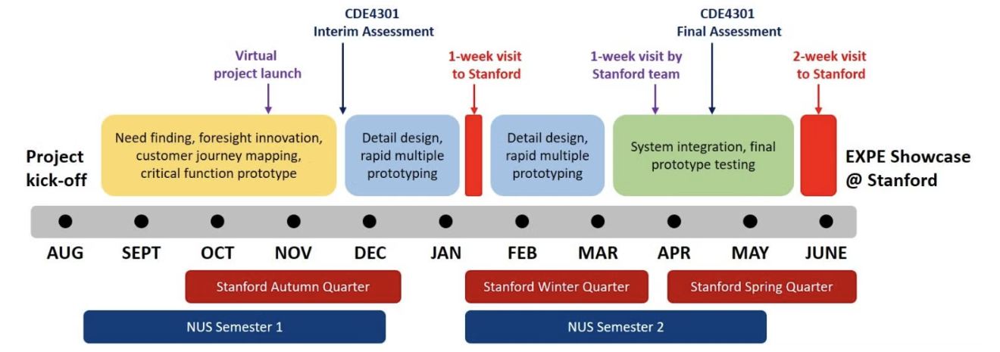
</div>

<p style="text-align:center; font-style:italic; font-size:0.9em;"><strong>Figure 1: Programme Timeline</strong></p>

The programme culminates in two showcases: the EDIC Project Showcase in April 2026, where the NUS team presents independently, and the EXPE Showcase at Stanford University in June 2026, where the NUS and Stanford teams jointly present their final integrated prototype to an audience of industry professionals, faculty, and investors.

<a id="2-3-nature-of-collaboration"></a>

## 2.3 Nature of Collaboration

Collaboration across the NUS and Stanford teams was conducted primarily online through Zoom for weekly check-ins and WhatsApp/Telegram for day-to-day updates, keeping both teams aligned on progress and design decisions across different time zones. 

The programme incorporates structured in-person exchanges as a core feature of the academic year. Each team visits the partner university once, with a final joint visit to Stanford for the EXPE Showcase in June. These in-person periods function as intensive design sprints, enabling rapid co-creation, prototyping, and iteration. Industry partners are engaged throughout the year through virtual calls and in-person sessions.

<a id="3-problem-statement"></a>

# 3 Problem Statement

<a id="3-1-industry-partner-and-design-challenge"></a>

## 3.1 Industry Partner and Design Challenge

The industry partner our project is Venture Corporation Ltd, which presented us with the following design challenge:

*"Reimagining a Premium Automated Hotel Check-In Experience"*

The brief identified that while hotel guests increasingly expect seamless, efficient, and contactless interactions, current automated check-in solutions often lack the sophistication and elevated service quality expected in premium hotels. Traditional check-in processes are time-consuming and impersonal, yet existing automation falls short of delivering the luxury experience that discerning guests anticipate. Venture challenged our team to rethink this touchpoint by combining cutting-edge technology with elevated service design.

<a id="3-2-objective-scope"></a>

## 3.2 Objective & Scope

The objective of this project is to design and prototype a premium automated hotel check-in experience that addresses the limitations of both traditional counter check-in and existing self-service kiosks, specifically within the context of premium hospitality.

The scope covers the arrival stage of the guest journey, from the moment a guest arrives to the hotel lobby through to receiving room access. Both guest-facing and staff-facing dimensions were considered, though the primary focus remains on reimagining the guest's first physical interaction with the hotel.

<a id="4-background-problem-investigation"></a>

# 4 Background & Problem Investigation

<a id="4-1-definition-of-luxury"></a>

## 4.1 Definition of Luxury

The meaning of luxury hotels has evolved beyond extravagance, expansive spaces or high-quality amenities. It now centres on crafting meaningful, emotionally resonant experiences that create a deep sense of connection and personal value for each guest.

This shift is being driven by intensifying competition and changing guest expectations. As luxury features are increasingly adopted by non-luxury hotels, their power as differentiators has eroded (Mann et al., 2024). Affluent travellers have responded by prioritising unique experiences and vibrant atmospheres over opulent formality or material products (Mann et al., 2024). Research shows that the top factor influencing brand choice is not value, convenience, or quality, but the positive emotional experiences guests have had with a brand in the past (Mann et al., 2024). Personalisation has emerged as the clearest expression of this shift where 65% of customers consider it essential and would pay up to 25% more for it (EHL Insights, 2025), a preference that is even more pronounced among younger luxury consumers who expect experiences that feel authentically tailored rather than transactional (EHL Insights, 2023). True luxury today is therefore rooted more in thoughtful, carefully executed service, where staff anticipate needs, deliver beyond expectations, and create moments that guests carry with them long after checkout (Mann et al., 2024). 

Through our literature review, we have identified five key dimensions that capture these characteristics of contemporary luxury hospitality.


<style>
.rt { width: 100%; border-collapse: collapse; margin: 1.2em 0; font-size: 0.93em; }
.rt td, .rt th { border: 1px solid #ccc; padding: 11px 14px; vertical-align: top; }
.rt th { background: #f5f5f5; font-weight: bold; text-align: left; }
.rt-concept { width: 22%; font-weight: bold; vertical-align: middle !important; }
.rt-num { width: 44px; font-weight: bold; color: #555; text-align: center; vertical-align: middle !important; }
.rt-head { font-weight: bold; margin-bottom: 6px; }
.rt ul { margin: 6px 0; padding-left: 18px; }
.rt li { margin-bottom: 4px; }
.rt-gap { background: #fffbe6; font-style: italic; }
.rt-yes { color: #27ae60; font-weight: bold; }
.rt-partial { color: #e67e22; font-weight: bold; }
.rt-indirect { color: #7f8c8d; font-weight: bold; }
.rt-label { font-weight: bold; }
.rt-guest { margin-bottom: 8px; }
.rt-3col td:nth-child(1) { width: 30%; }
.rt-3col td:nth-child(2) { width: 16%; text-align: center; }
.rt-3col td:nth-child(3) { width: 54%; }
.rt-sol-img { text-align: center; margin: 10px 0; }
.rt-sol-img img { max-width: 55%; }
.rt-sol-caption { text-align: center; font-style: italic; font-size: 0.88em; }
.rt-card { margin-bottom: 6px; }
.rt-card-head { font-weight: bold; margin-bottom: 3px; }
</style>
<table class="rt">
  <tbody>
    <tr>
      <td class="rt-concept">Exclusivity</td>
      <td>Exclusivity refers to a feeling of rarity that enhances the perceived value of an experience (Wang et al., 2024). For guests, this may be reflected in features such as a private check-in suite or the presence of a dedicated host who welcomes them by name, creating a seamless arrival experience that begins the moment they step out of the car. Ultimately, exclusivity is about making guests feel that the moment has been crafted specifically for them, reinforcing their sense of distinction and personal importance.</td>
    </tr>
    <tr>
      <td class="rt-concept">Genuineness &amp; Sincerity</td>
      <td>Genuineness and sincerity represent the human element that makes guests feel truly welcomed. Every interaction with hotel staff should appear natural and heartfelt rather than scripted or rehearsed. When expressed with warmth and care, such interactions foster emotional connection and trust between guests and the hotel.</td>
    </tr>
    <tr>
      <td class="rt-concept">Hyper-Personalisation</td>
      <td>Modern luxury is characterised by hyper-personalisation, which highlights the hotel's ability to remember and anticipate its guests' preferences in ways that transform a stay into a deeply personal and special experience. From preferred room temperatures to favourite drinks and pillow choices, thoughtful use of guest information creates a sense of familiarity that makes the hotel feel like a second home.</td>
    </tr>
    <tr>
      <td class="rt-concept">High-Touch Service</td>
      <td>Another defining element of contemporary luxury is the high-touch approach, where every interaction and gesture is intentional and deliberate. For the hotel, it is not about doing more but about doing it better — with names remembered, needs anticipated, and gestures timed with care. Often, one thoughtful moment means more than three generic ones.</td>
    </tr>
    <tr>
      <td class="rt-concept">Authenticity</td>
      <td>Authenticity ties these elements together. Modern travellers increasingly seek experiences that reflect the local culture and story rather than uniform or standardised hotel designs. Authenticity has therefore become a cornerstone of brand loyalty within the luxury hospitality sector (Accenture, 2026).</td>
    </tr>
  </tbody>
</table>


<p style="text-align:center; font-style:italic; font-size:0.9em;"><strong>Table 1: Our Definitions of Modern Luxury Hospitality</strong></p>

Collectively, these five dimensions form the foundation of modern luxury hospitality and serve as our guiding principles for reimagining the luxury hotel check-in journey.

<a id="4-2-market-trends-overview"></a>

## 4.2 Market Trends Overview


<a id="4-2-1-increasing-demand-in-luxury-travel"></a>

### 4.2.1 Increasing Demand in Luxury Travel

Demand for luxury tourism is rising faster than any other travel segment, driven by a growing population of wealthy individuals and younger aspiring luxury travellers willing to spend more on upscale experiences (Tufft et al., 2024). McKinsey & Company projects that the luxury segment will grow around 6% CAGR, outpacing all other chain-scale hotel classes (Bartman et al., 2025), with momentum further reinforced by a post-2023 surge in demand for high-end travel that has continued to expand (EHL Insights, 2025). Many travellers are also willing to stretch their budgets for additional activities, supported by AMEX findings that 77% of travelers value the right experience over cost (Frost & Sullivan, 2025). Reflecting this strong demand, the global luxury hotel market continues to grow significantly, as shown in Figure 2, with personalised and unique experiences now firmly displacing traditional material forms of luxury as the primary driver of consumer preference.

  

<div style="text-align: center; margin: 16px 0;">
  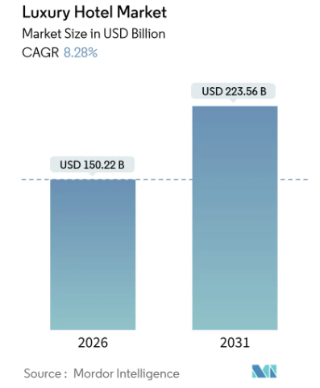
</div>

<p style="text-align:center; font-style:italic; font-size:0.9em;"><strong>Figure 2: Global Luxury Hotel Market Growth (Mordor Intelligence, 2026b)</strong></p>

<a id="4-2-2-singapores-hospitality-trends"></a>

### 4.2.2 Singapore’s Hospitality Trends

Singapore reflects and amplifies these global trends. International visitor arrivals grew 2.3% year-on-year to 16.9 million in 2025, with the Singapore Tourism Board (STB) projecting 17 to 18 million arrivals in 2026, generating approximately SGD 31.0 to 32.5 billion in tourism receipts (STB, 2026). This momentum is underpinned by a calendar of international events, new attractions, and continued investment in tourism infrastructure. Hotels serve as the key pillar of this growth, contributing approximately 20% of total tourism receipts (STB, 2026). Luxury properties captured 47.65% of the Singapore hospitality market in 2025, anchored by integrated resorts and iconic brands attracting high-net-worth travellers seeking premium experiences (Mordor Intelligence, 2026a).

<a id="4-2-3-hospitality-labour-shortage"></a>

### 4.2.3 Hospitality Labour Shortage


The hospitality industry faces a deepening structural workforce crisis that extends well beyond post-pandemic recovery. Global travel has largely rebounded, approximately 1.4 billion tourists travelled internationally in 2024, representing 99% of pre-pandemic levels (UN Tourism, 2025), yet the labour market has not recovered in parallel. Demographic and structural shifts are projected to leave the global hospitality workforce roughly 18% below required staffing levels by 2035, as many workers who left during the pandemic have not returned, working-age populations shrink, and unemployment levels remain low across competing industries (World Travel & Tourism Council, 2025; Frost & Sullivan, 2025). Recruitment has become increasingly difficult as hospitality competes for talent against industries offering flexible and remote work options. The demanding nature of the work: long hours, irregular scheduling, and high-stress customer interactions, deters entry and accelerates exit (Lüthy, 2025). Hotel workers in physically demanding roles, including bellmen and porters, face elevated rates of musculoskeletal disorders from heavy lifting (Park et al., 2013). Younger workers under 30 are especially reluctant to enter or remain in these roles, prioritising work-life balance and flexibility, and increasingly do not view hospitality as a stable long-term career (World Travel & Tourism Council, 2025). 

Singapore reflects and amplifies these global pressures. The accommodation industry recorded a high job-vacancy rate across all industries at 6.5% as of June 2025, (MOM, 2025). Rising labour costs, high turnover, and persistent difficulty attracting locals signal a structural rather than temporary problem (jonng, 2025). Perceptions of low wages, long working hours, and the physically and mentally demanding nature of hospitality work continue to deter local talent (Choo, 2022; Seah, 2022). Additionally, lack of appreciation, low occupational status, and exposure to verbal abuse from guests further undermine front-line retention, particularly within luxury settings (Cayla, 2023). Employers report that replacing foreign workers with locals has been difficult, as locals often show low interest in service jobs despite offering higher wages (Seah, 2022). Foreign-worker quotas have been progressively tightened from 50% in 2011 to 35% in 2021, limiting the sector's traditional fallback of supplementing local shortfalls with overseas hires (Seah, 2022; Choo, 2022).

The pressure to rebuild the hospitality talent pipeline is therefore becoming critical to sustaining long-term operations and guest satisfaction (Ernst & Young, 2023; Jonng, 2025). Understaffing reduces service speed and quality, increases inconsistency, and erodes brand reputation and profitability in Singapore's competitive hospitality landscape (Jonng, 2025).

Figure 3 illustrates the top challenges and priorities identified by the hospitality industry, highlighting how manpower constraints continue to be a central concern.

  

<div style="text-align: center; margin: 16px 0;">
  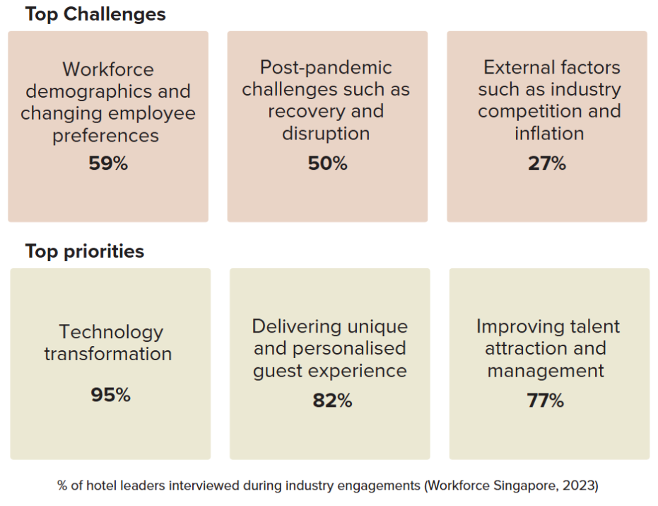
</div>

<p style="text-align:center; font-style:italic; font-size:0.9em;"><strong>Figure 3: Top Challenges and Priorities in Singapore Hospitality Industry</strong></p>

Looking ahead, sustainable progress will depend on meaningful job redesign supported by labour-saving technologies to boost productivity and make hospitality careers more attractive (Workforce Singapore, 2023; Seah, 2022). 

<a id="4-3-primary-research"></a>

## 4.3 Primary Research

To build a grounded and multi-perspectival understanding of the problem space, we conducted primary research across three complementary methods: semi-structured interviews with luxury hotels, direct field observations, and a two-round guest review analysis. Together, these methods triangulate the problem from the perspectives of staff, operators, and guests, forming the evidential foundation for the design directions and solution development that follow.

<a id="4-3-1-on-site-hotel-interviews"></a>

### 4.3.1 On-Site Hotel Interviews

To gain a holistic understanding of the current luxury hotel check-in experience, we conducted semi-structured interviews with hospitality professionals across five prominent hotels and organisations in Singapore: Shangri-La, Banyan Tree Headquarters, Mandai Rainforest Resort by Banyan Tree, Raffles Hotel, and Amara Hotel (See Appendix A).

Participants represented a diverse range of roles within the hotel ecosystem, including Rooms Director, Front Desk Manager, Front Desk Staff, General Manager, Head of Technology, and Business Development leads, selected for their ability to offer operational, managerial, and technological perspectives on the check-in experience.

*The full interview protocol and preparation document is included in Appendix B.*


<table class="rt">
  <thead><tr><th>#</th><th>Theme</th></tr></thead>
  <tbody>
    <tr>
      <td class="rt-num">1</td>
      <td>
        <div class="rt-head">Tech Stack and Integration Reality</div>
        <ul>
          <li>Backend systems like Opera PMS are reliable but fragmented, creating compatibility issues</li>
          <li>New technology adoption is costly and constrained by vendor lock-in and cybersecurity concerns</li>
          <li>Upgrades remain incremental, focused on reducing workload rather than transforming guest experience</li>
        </ul>
      </td>
    </tr>
    <tr>
      <td class="rt-num">2</td>
      <td>
        <div class="rt-head">Human Touch vs Automation</div>
        <ul>
          <li>Up to 99% of guests at Shangri-La approach human staff over kiosks even when self-service is available</li>
          <li>Existing kiosks described as emotionless, transactional, and misaligned with luxury expectations</li>
          <li>Hoteliers expressed that automation should enhance rather than replace the human warmth</li>
        </ul>
      </td>
    </tr>
    <tr>
      <td class="rt-num">3</td>
      <td>
        <div class="rt-head">Staff Tools and Empowerment</div>
        <ul>
          <li>Tools like Opera and HotSOS are indispensable but complex, with steep learning curves</li>
          <li>Data entry errors such as double rooming or missing preferences directly impact guest satisfaction</li>
          <li>Staff empowerment through autonomy and discretionary budgets significantly improves morale and service quality</li>
        </ul>
      </td>
    </tr>
    <tr>
      <td class="rt-num">4</td>
      <td>
        <div class="rt-head">Pre-arrival Data and Personalisation</div>
        <ul>
          <li>Hotels collect guest preferences but utilisation remains inconsistent across properties</li>
          <li>Many still rely on staff memory rather than systematic data activation</li>
          <li>Personalisation at scale is impractical due to manpower constraints</li>
        </ul>
      </td>
    </tr>
    <tr>
      <td class="rt-num">5</td>
      <td>
        <div class="rt-head">Manpower and Role Design of Staff</div>
        <ul>
          <li>Recruiting and retaining front-desk staff is difficult due to long hours and low career appeal</li>
          <li>Hotels are redesigning roles to combine operational efficiency with relational expertise</li>
          <li>Technology reduces repetitive tasks but cannot replace emotional labour</li>
        </ul>
      </td>
    </tr>
    <tr>
      <td class="rt-num">6</td>
      <td>
        <div class="rt-head">Service Recovery and "Wow" Moments</div>
        <ul>
          <li>Empowered staff can transform complaints into memorable moments through quick, autonomous decisions</li>
          <li>True "wow" moments stem from intuition and empathy, not protocol</li>
          <li>Culture of empowerment varies significantly across properties</li>
        </ul>
      </td>
    </tr>
    <tr>
      <td class="rt-num">7</td>
      <td>
        <div class="rt-head">Physical Arrival and Guest Escort Experience</div>
        <ul>
          <li>Bellmen play a critical role in bridging the physical arrival and the check-in process, leading guests from the entrance to the counter</li>
          <li>Escorting guests to their room is standard for VIP and ultra-luxury guests but inconsistently applied across tiers</li>
          <li>The physical dimensions of arrival — luggage handling, navigation, and room orientation — remain heavily staff-dependent</li>
        </ul>
      </td>
    </tr>
  </tbody>
</table>


<p style="text-align:center; font-style:italic; font-size:0.9em;"><strong>Table 2: Key Themes and Insights from On-Site Hotel Interviews</strong></p>

  

<div style="text-align: center; margin: 16px 0;">
  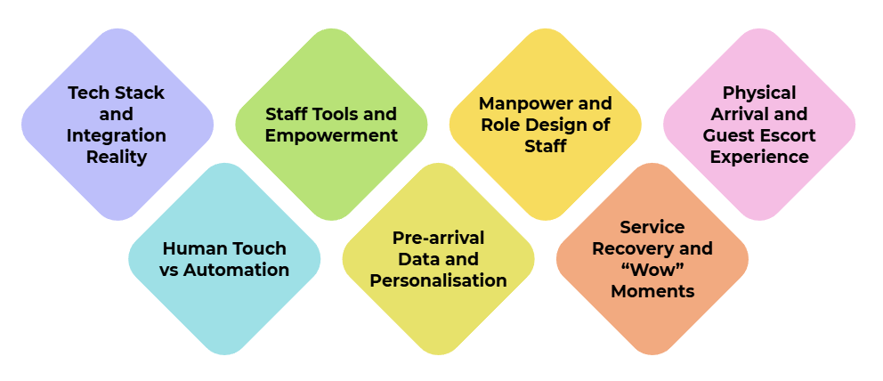
</div>

<p style="text-align:center; font-style:italic; font-size:0.9em;"><strong>Figure 4: Summary of Key Insights from Hotel Interviews</strong></p>

*Key findings from the interim reviews with detailed analysis can be found in Appendix C.*

<a id="4-3-2-hotel-observations"></a>

### 4.3.2 Hotel Observations

To validate and build upon the insights gathered through staff interviews, we conducted direct field observations, during peak check-in periods, at three luxury properties in Singapore: Marina Bay Sands, Fullerton Bay Hotel, and The Fullerton Hotel. Rather than relying solely on staff accounts, on-site observation allowed us to witness the arrival experience from the guest's perspective and surface operational realities that interviews alone could not capture. 

*Raw field notes were collected across all properties and organised into three thematic clusters. Methodologies and clustering are included in Appendix D.*


<style>
.obs-table { width: 100%; border-collapse: collapse; margin: 1.5em 0; font-size: 0.93em; }
.obs-table td { border: 1px solid #ccc; padding: 14px 16px; vertical-align: top; }
.obs-table .row-content { width: 75%; }
.obs-table .row-validates { width: 25%; text-align: center; vertical-align: middle; }
.obs-table .row-header { font-weight: bold; font-size: 1em; margin-bottom: 8px; }
.obs-table ul { margin: 6px 0 12px 0; padding-left: 20px; }
.obs-table ul li { margin-bottom: 6px; }
.obs-table .fig-caption { text-align: center; font-style: italic; font-size: 0.88em; margin-top: 4px; }
.obs-table .validates-label { font-style: italic; font-size: 0.85em; color: #555; margin-bottom: 10px; }
.diamond-chip { position: relative; width: 90px; height: 90px; margin: 10px auto; display: flex; align-items: center; justify-content: center; }
.diamond-chip .diamond-bg { position: absolute; width: 80px; height: 80px; transform: rotate(45deg); border-radius: 4px; }
.diamond-chip .diamond-text { position: relative; z-index: 1; font-size: 0.65em; font-weight: bold; text-align: center; line-height: 1.25; padding: 4px; color: #333; }
</style>

<table class="obs-table">
  <tbody>
    <tr>
      <td class="row-content">
        <div class="row-header">1. Check-In Flow &amp; Queue Dynamics</div>
        <ul>
          <li>At Marina Bay Sands, long queues formed after 2:30pm, with some guests observed waiting over 20 minutes at the front desk, consistent with the peak-period congestion documented in secondary research</li>
          <li>Not a single self-check-in kiosk was observed at any of the three properties, validating that kiosk adoption in luxury settings remains near zero and that human staff remain the preferred point of contact</li>
        </ul>
        <div style="text-align:center; margin-top:10px;">
          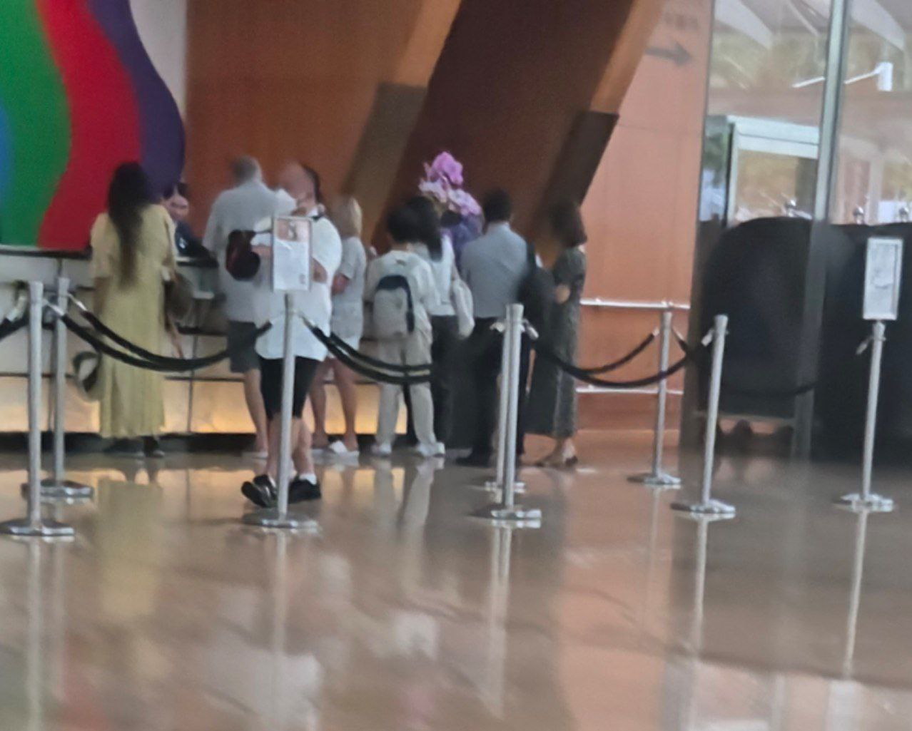
          <p class="fig-caption"><strong>Figure 5: Guests at the Check-in Counter</strong></p>
        </div>
      </td>
      <td class="row-validates">
        <div class="validates-label">Validates:</div>
        <div class="diamond-chip">
          <div class="diamond-bg" style="background:#F4C030;"></div>
          <div class="diamond-text">Manpower and Role Design of Staff</div>
        </div>
        <div class="diamond-chip">
          <div class="diamond-bg" style="background:#85C1E9;"></div>
          <div class="diamond-text">Human Touch vs Automation</div>
        </div>
      </td>
    </tr>
    <tr>
      <td class="row-content">
        <div class="row-header">2. Physical Labour Intensity &amp; Luggage Handling</div>
        <ul>
          <li>No room escort was witnessed for standard guests across any property, with the bellboy role limited to guest arrival and luggage handling, validating that escorting guests beyond the lobby is inconsistently applied and possibly reserved for higher-tier guests only</li>
          <li>Luggage was tagged manually (Figure 6) and transported entirely by hand and trolley across all three properties, validating that the physical arrival experience remains wholly staff-dependent and sensitive to individual capacity and availability</li>
          <li>Loose bags and personal items placed on lobby floors by guests created persistent visual clutter (Figure 7) — a friction point not raised in any interview, revealing a blind spot in staff accounts of the arrival experience</li>
          <li>Guests were observed and overheard requesting stored luggage back from the bellhop counter rather than waiting for room delivery, revealing that some guests may prefer to keep their belongings with them at all times, a preference not surfaced in any interview</li>
        </ul>
        <div style="text-align:center; margin-top:10px; display:flex; gap:12px; justify-content:center; flex-wrap:wrap;">
          <div style="flex:1; min-width:120px;">
            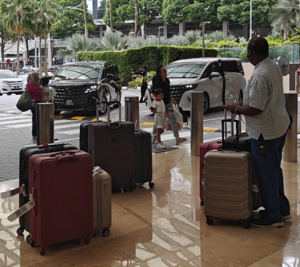
          </div>
          <div style="flex:1; min-width:120px;">
            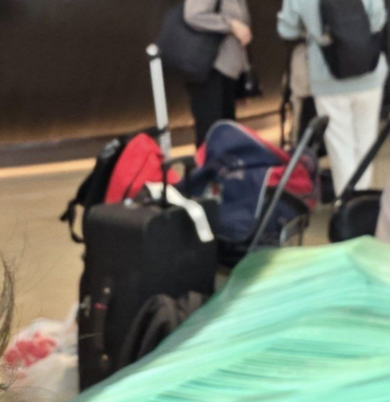
          </div>
        </div>
        <p class="fig-caption"><strong>Figure 6 &amp; 7: Luggage being tagged manually by bellboy (left) and luggage left unattended on the lobby floor (right)</strong></p>
      </td>
      <td class="row-validates">
        <div class="validates-label">Validates:</div>
        <div class="diamond-chip">
          <div class="diamond-bg" style="background:#F1948A;"></div>
          <div class="diamond-text">Physical Arrival and Guest Escort Experience</div>
        </div>
      </td>
    </tr>
    <tr>
      <td class="row-content">
        <div class="row-header">3. Service Coverage Inconsistency</div>
        <ul>
          <li>Luggage disputes were escalated to the manager rather than resolved by bellboys, validating that staff empowerment remains limited</li>
          <li>Guests with fewer bags were sometimes left to self-serve, while bellboys attended to higher-volume arrivals (Figure 8), validating that physical arrival assistance remains unevenly distributed and subject to manpower constraints</li>
        </ul>
        <div style="text-align:center; margin-top:10px;">
          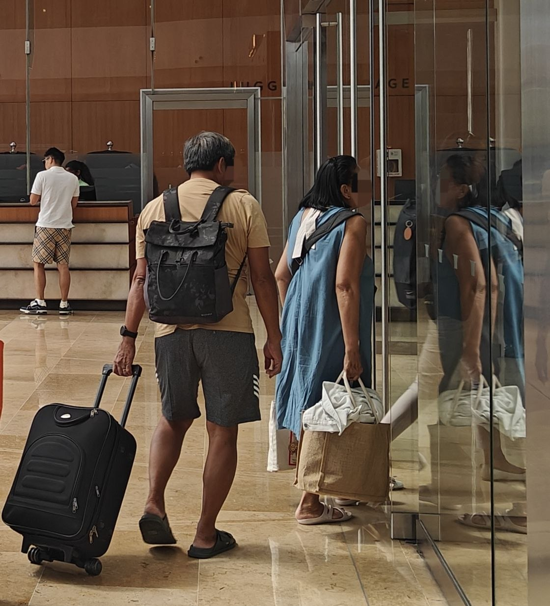
          <p class="fig-caption"><strong>Figure 8: Guests being left to Self-Serve</strong></p>
        </div>
      </td>
      <td class="row-validates">
        <div class="validates-label">Validates:</div>
        <div class="diamond-chip">
          <div class="diamond-bg" style="background:#A9DFBF;"></div>
          <div class="diamond-text">Staff Empowerment &amp; Resource Allocation</div>
        </div>
      </td>
    </tr>
  </tbody>
</table>

<p style="text-align:center; font-style:italic; font-size:0.9em;"><strong>Table 3: Thematic Clusters from Hotel Observations</strong></p>

Validation Summary

Field observations independently confirmed four interview themes on-site. Observation also surfaced one blind spot not captured in interviews, guest behaviour, specifically the preference to keep belonging with them at all times, and placement of personal items on lobby floors, as a contributing factor to visual clutter and diminished luxury perception.

<a id="4-4-secondary-research"></a>

## 4.4 Secondary Research

Data from Reviews 

To complement the interview and observational research with the guest perspective at scale, we conducted two rounds of review analysis across major online travel platforms.


<table class="rt">
  <thead><tr><th style="width:20%">Study</th><th>Findings</th></tr></thead>
  <tbody>
    <tr>
      <td style="font-weight:bold; vertical-align:middle;">One-Star Reviews</td>
      <td>
        A dataset of 60+ one-star reviews from five-star properties in Singapore was collected, cleaned, and structured. Each review was coded and categorised into sub-themes, which were then consolidated into 9 higher-level themes across 34 categories through affinity clustering. The most frequently cited theme was Staff &amp; Service Quality, appearing in 95.8% of reviews, followed by Value-for-Money (65.55%). Critically for this project, Check-In &amp; Check-Out Process was the fourth most cited theme at 53.78%, with the dominant sub-categories being poor service (32.77% of all reviews) and long wait times (24.37%). These findings confirm that the check-in experience is a significant and recurring driver of guest dissatisfaction at luxury properties, and that its failure is rooted not in physical infrastructure but in service quality and process efficiency.
        <br><br><em>A full interactive dashboard of the Round 1 findings is included in Appendix E.</em>
      </td>
    </tr>
    <tr>
      <td style="font-weight:bold; vertical-align:middle;">Broader Sentiment Study</td>
      <td>
        Another round of analysis was conducted across 109 reviews spanning a full rating range (one to five stars) across four Singapore luxury properties: Capella, Marina Bay Sands, Raffles, and Fullerton. Reviews were coded across five service sentiment dimensions: luggage handling, high-touch service, staff availability, staff competency, and staff attitude, each scored out of 5.
        <br><br>
        <table style="width:55%; border-collapse:collapse; font-size:0.88em; margin:8px 0;">
          <thead>
            <tr style="background:#f5f5f5;">
              <th style="border:1px solid #ccc; padding:5px 10px;">Dimension</th>
              <th style="border:1px solid #ccc; padding:5px 10px; text-align:center;">Avg Score</th>
              <th style="border:1px solid #ccc; padding:5px 10px; text-align:center;">Reviews</th>
            </tr>
          </thead>
          <tbody>
            <tr><td style="border:1px solid #ccc; padding:4px 10px;">Luggage Handling</td><td style="border:1px solid #ccc; padding:4px 10px; text-align:center;">3.37</td><td style="border:1px solid #ccc; padding:4px 10px; text-align:center;">68</td></tr>
            <tr><td style="border:1px solid #ccc; padding:4px 10px;">High Touch Service</td><td style="border:1px solid #ccc; padding:4px 10px; text-align:center;">3.59</td><td style="border:1px solid #ccc; padding:4px 10px; text-align:center;">34</td></tr>
            <tr><td style="border:1px solid #ccc; padding:4px 10px;">Staff Availability</td><td style="border:1px solid #ccc; padding:4px 10px; text-align:center;">3.46</td><td style="border:1px solid #ccc; padding:4px 10px; text-align:center;">37</td></tr>
            <tr><td style="border:1px solid #ccc; padding:4px 10px;">Staff Competency</td><td style="border:1px solid #ccc; padding:4px 10px; text-align:center;">3.28</td><td style="border:1px solid #ccc; padding:4px 10px; text-align:center;">32</td></tr>
            <tr style="background:#fff9e6;"><td style="border:1px solid #ccc; padding:4px 10px;">Staff Attitude</td><td style="border:1px solid #ccc; padding:4px 10px; text-align:center;">3.67</td><td style="border:1px solid #ccc; padding:4px 10px; text-align:center;">45</td></tr>
          </tbody>
        </table>
        The 0.30-point gap between the highest dimension (attitude, 3.67) and luggage handling (3.37) is the most telling finding: guests consistently rate staff warmth positively while flagging operational dimensions as recurring points of friction. 39% of reviews referenced check-in or waiting experiences. Reviews describing the best arrivals emphasised being greeted by name, luggage handled invisibly, and feeling anticipated. What guests remember most is not what went smoothly, but whether they felt welcomed, guided, and cared for throughout the arrival experience.
        <br><br><em>A full interactive dashboard of the broader sentiment findings is included in Appendix F.</em>
      </td>
    </tr>
  </tbody>
</table>


<p style="text-align:center; font-style:italic; font-size:0.9em;"><strong>Table: 4: Review Analysis across Major Online Travel Platforms</strong></p>

<a id="4-5-key-insights-from-primary-and-secondary-research"></a>

## 4.5 Key Insights from Primary and Secondary Research

Across the research conducted, five cross-cutting insights emerged that collectively define the problem space and motivate the design of a new solution.


<table class="rt">
  <thead><tr><th>#</th><th>Key Insight</th></tr></thead>
  <tbody>
    <tr>
      <td class="rt-num">1</td>
      <td>
        <div class="rt-head">The Check-In Process Is a High-Stakes, Time-Sensitive Touchpoint</div>
        The check-in experience consistently emerged as one of the most consequential moments in the guest journey. Guest satisfaction declines by approximately 50% when check-in exceeds five minutes (Cornell University, 2013), and the Check-In &amp; Check-Out Process was the fourth most cited theme in one-star reviews at 53.78%, with poor service and long wait times as the dominant sub-categories.
      </td>
    </tr>
    <tr>
      <td class="rt-num">2</td>
      <td>
        <div class="rt-head">Luggage Handling Is a Significant, Underaddressed Pain Point</div>
        Luggage handling was one of the most consistently flagged pain points across all research methods. Observations revealed manual handling to be physically demanding, inconvenient, and spatially disruptive. Review data provided the strongest quantitative signal: across 109 reviews from four Singapore luxury properties, luggage handling was at 3.37 out of 5.0, against staff attitude at 3.67, confirming the friction is operational rather than attitudinal. Despite its visibility, it remains largely unaddressed by existing hotel technology.
      </td>
    </tr>
    <tr>
      <td class="rt-num">3</td>
      <td>
        <div class="rt-head">Existing Automation Fails the Luxury Standard</div>
        Self-service kiosks are widely deployed but consistently underutilised in luxury settings, with usage rates below 1% at Shangri-La. Across interviews and observations, kiosks were described as transactional, emotionless, and misaligned with luxury price points. The failure lies in the experience.
      </td>
    </tr>
    <tr>
      <td class="rt-num">4</td>
      <td>
        <div class="rt-head">Staff Are Overloaded and the Workforce Is Shrinking</div>
        Manpower shortage was cited as the single most pressing operational challenge across all hotel visits and research. Frontline staff simultaneously manage data entry, guest rapport, payment processing, and room allocation, creating significant cognitive overload that directly contributes to service errors. Bellboys and porters face additional physical strain from luggage handling across peak periods. Together, these pressures produce inconsistent guest experiences.
      </td>
    </tr>
    <tr>
      <td class="rt-num">5</td>
      <td>
        <div class="rt-head">Guests Want Efficiency Without Losing the Feeling of Being Hosted</div>
        Guests did not reject technology. They rejected technology that felt cold, impersonal, or required effort from them. The desire articulated consistently was for an arrival experience that is fast and frictionless, but still feels warm, guided, and personal.
      </td>
    </tr>
  </tbody>
</table>


<p style="text-align:center; font-style:italic; font-size:0.9em;"><strong>Table: 5: Key Insights from Primary and Secondary Research</strong></p>

<a id="4-6-review-of-existing-solutions"></a>

## 4.6 Review of Existing Solutions

A review of existing market solutions was conducted to understand what has already been attempted across each of the five problem areas identified in Section 3.5, and to identify where meaningful gaps remain.


<table class="rt">
  <thead><tr><th colspan="2">Problem Area 1: The Check-In Process Is a High-Stakes, Time-Sensitive Touchpoint</th></tr></thead>
  <tbody>
    <tr>
      <td>
        <strong>Self-service kiosks</strong> are the most common attempt to address check-in speed, observed directly at Amara Hotel. While faster for straightforward check-ins, kiosk adoption at luxury properties was mentioned to be below 1% at a property visited. Guests consistently bypassed them in favour of human staff, negating the intended efficiency benefit.
      </td>
      <td class="rt-sol-img">
        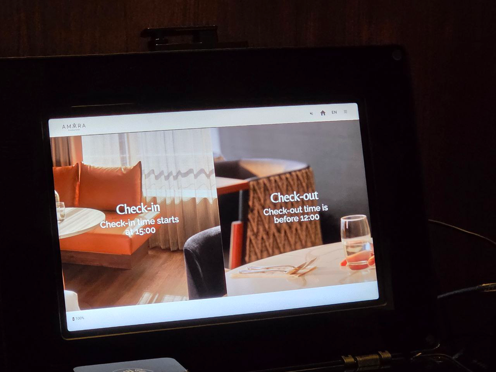
        <div class="rt-sol-caption"><strong>Figure 9: Amara Hotel Self-Service Kiosk</strong></div>
      </td>
    </tr>
    <tr>
      <td>
        <strong>Mobile and digital pre-check-in apps</strong>, such as those offered by Hilton and Marriott, allow members to indicate preferences and room selection before arrival. While these reduce time at the front desk, guests must still present physical identification and collect key cards at the desk in certain countries, including Singapore, preserving a friction point at arrival.
      </td>
      <td class="rt-sol-img">
        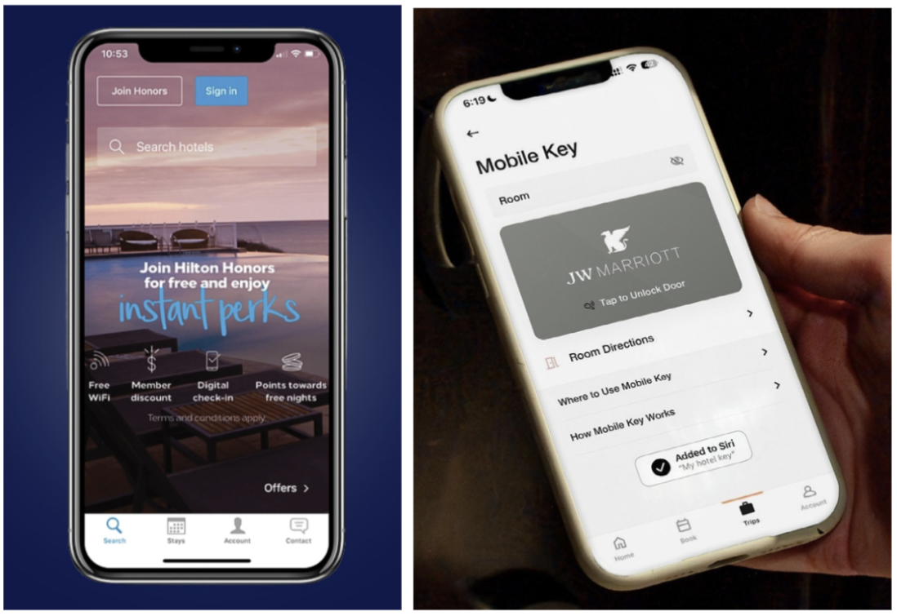
        <div class="rt-sol-caption"><strong>Figure 10: Hilton Honors and Marriott Bonvoy Mobile App</strong></div>
      </td>
    </tr>
    <tr class="rt-gap">
      <td colspan="2"><strong>Gap:</strong> Existing solutions optimise for speed but sacrifice warmth. None successfully deliver both within a single guest-facing interaction that meets the emotional expectations of luxury hospitality.</td>
    </tr>
  </tbody>
</table>


<p style="text-align:center; font-style:italic; font-size:0.9em;"><strong>Table: 6: Problem Area 1</strong></p>


<table class="rt">
  <thead><tr><th colspan="2">Problem Area 2: Luggage Handling Is a Significant, Underaddressed Pain Point</th></tr></thead>
  <tbody>
    <tr>
      <td>
        <strong>YOTEL Yobot (New York)</strong> automates luggage storage via a robotic arm handling approximately 300 items per day, but is purely a storage system. It does not transport luggage to the guest's room and is too slow for peak arrival periods.
      </td>
      <td class="rt-sol-img">
        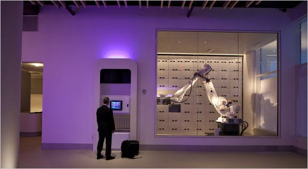
        <div class="rt-sol-caption"><strong>Figure 11: YOTEL Yobot</strong></div>
      </td>
    </tr>
    <tr>
      <td>
        <strong>Piaggio Fast Forward Kilo</strong> is a four-wheeled robotic flatbed that follows a staff member while carrying heavy loads of up to 130 kg, relieving physical strain. While it addresses the occupational health burden of manual work, it was designed for industrial environments and is only now exploring hotel integration. It requires a human operator to lead it, follows rather than guides, and functions as a staff tool rather than a guest-facing autonomous system.
      </td>
      <td class="rt-sol-img">
        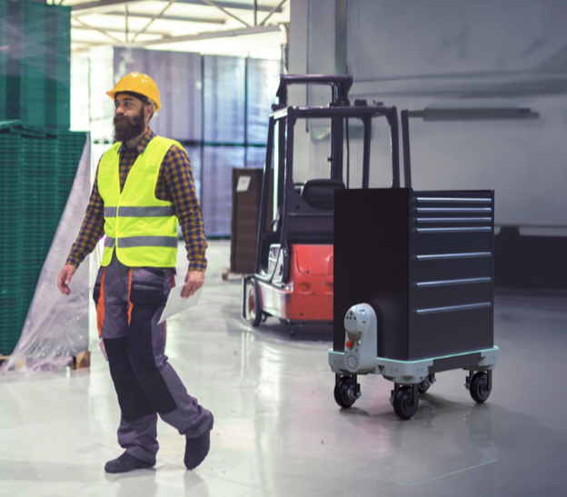
        <div class="rt-sol-caption"><strong>Figure 12: Piaggio Kilo following staff</strong></div>
      </td>
    </tr>
    <tr class="rt-gap">
      <td colspan="2"><strong>Gap:</strong> Some guests preferred to keep their luggage with them throughout the arrival journey rather than handing it off to staff for separate delivery. No existing solution accommodates this preference: current options either store luggage out of sight, require staff operation, or play no role in the arrival journey at all.</td>
    </tr>
  </tbody>
</table>


<p style="text-align:center; font-style:italic; font-size:0.9em;"><strong>Table: 7: Problem Area 2</strong></p>


<table class="rt">
  <thead><tr><th colspan="2">Problem Area 3: Existing Automation Fails the Luxury Standard</th></tr></thead>
  <tbody>
    <tr>
      <td>
        <strong>Henn-na Hotel in Japan</strong> deployed over 240 robots at its peak but retired more than half by 2019 due to technical glitches and guest complaints (Hertzfeld, 2019). Guests reacted negatively to the humanoid robots' appearance, describing them as creepy and unsettling rather than premium — a textbook example of the "uncanny valley" effect (Nelson, 2025).
      </td>
      <td class="rt-sol-img">
        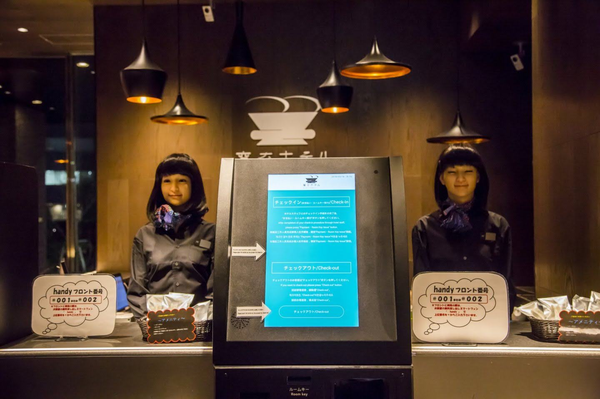
        <div class="rt-sol-caption"><strong>Figure 13: Henn-na Hotel Japan Humanoid Robots</strong></div>
      </td>
    </tr>
    <tr>
      <td>
        <strong>Hilton Connie</strong> is a robot concierge that answers guest questions about local attractions, hotel amenities, and dining options. However, Connie's interactions are stilted and robotic, limited to scripted factual responses with no natural conversational flow. It has no check-in capability, cannot handle physical tasks, and does not form part of the arrival journey.
      </td>
      <td class="rt-sol-img">
        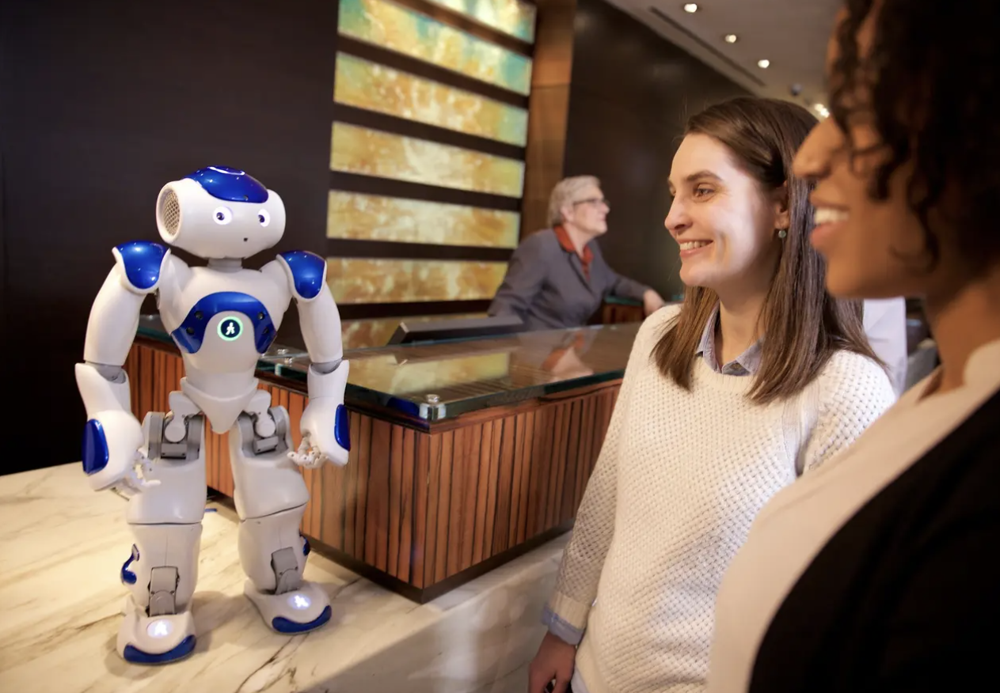
        <div class="rt-sol-caption"><strong>Figure 14: Hilton Connie</strong></div>
      </td>
    </tr>
    <tr class="rt-gap">
      <td colspan="2"><strong>Gap:</strong> Existing automation solutions either over-automate at the cost of warmth, or under-deliver on conversational quality. None successfully replicate the emotional experience of being genuinely welcomed and guided.</td>
    </tr>
  </tbody>
</table>


<p style="text-align:center; font-style:italic; font-size:0.9em;"><strong>Table: 8: Problem Area 3</strong></p>


<table class="rt">
  <thead><tr><th colspan="2">Problem Area 4: Staff Are Overloaded and the Workforce Is Shrinking</th></tr></thead>
  <tbody>
    <tr>
      <td>
        <strong>The Citadines delivery robot</strong>, observed during our site visit to Citadines Rochester, demonstrates the operational viability of autonomous robot deployment in a hotel environment. The robot calls and rides lifts independently, navigates hallways, and completes amenities delivery without staff assistance, confirming that robot deployment can meaningfully reduce operational load in hotel environments.
      </td>
      <td class="rt-sol-img">
        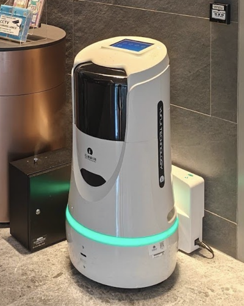
        <div class="rt-sol-caption"><strong>Figure 15: Citadines Autonomous Delivery Robot</strong></div>
      </td>
    </tr>
    <tr>
      <td>
        <strong>Amazon Alexa for Hospitality</strong> handles in-room guest requests at properties including Marriott and Westin, reducing call volume to the front desk, but its function is limited entirely to the in-room experience.
      </td>
      <td class="rt-sol-img">
        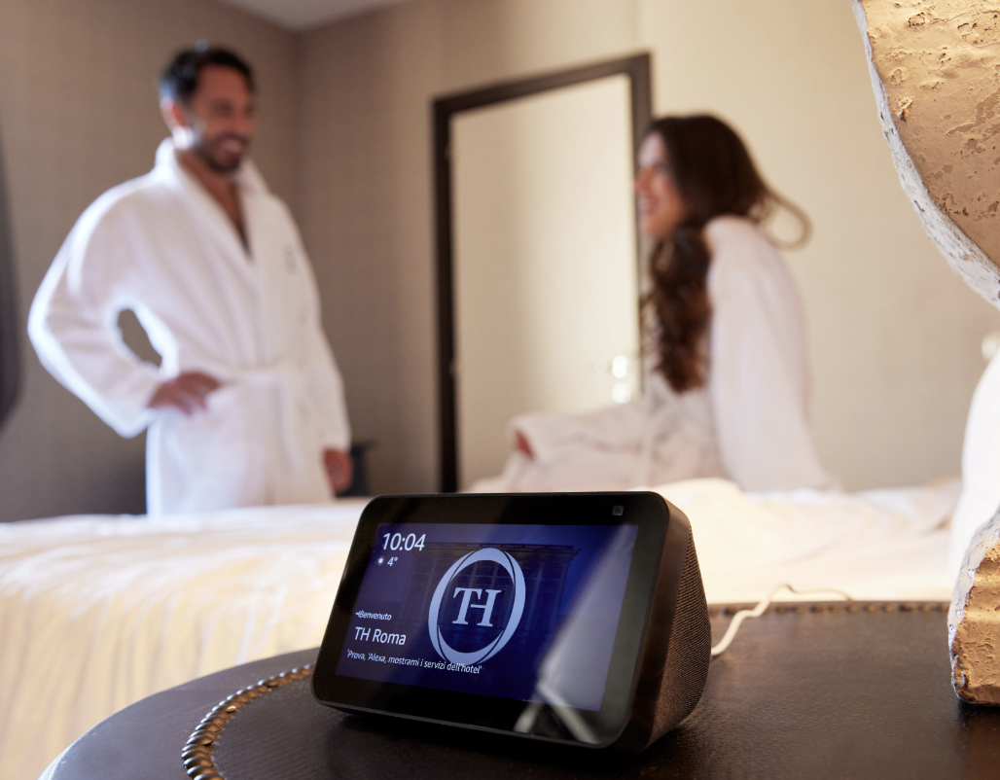
        <div class="rt-sol-caption"><strong>Figure 16: Hospitality Alexa</strong></div>
      </td>
    </tr>
    <tr class="rt-gap">
      <td colspan="2"><strong>Gap:</strong> Existing solutions reduce operational load at the margins — in-room requests, back-of-house logistics — but none address the concentration of physical and cognitive demand at the point of arrival.</td>
    </tr>
  </tbody>
</table>


<p style="text-align:center; font-style:italic; font-size:0.9em;"><strong>Table: 9: Problem Area 4</strong></p>


<table class="rt">
  <thead><tr><th colspan="2">Problem Area 5: Guests Want Efficiency Without Losing the Feeling of Being Hosted</th></tr></thead>
  <tbody>
    <tr>
      <td>
        <strong>Four Seasons Chat and Ritz-Carlton ChatGenie</strong> deliver fast, personalised guest communication through messaging channels backed by human staff. Both reduce neither headcount nor reliance on human availability — rather, they shift the medium from face-to-face to digital. Critically, both are absent at the point of physical arrival and cannot replicate the embodied experience of being greeted and guided from the moment a guest steps out of their vehicle.
      </td>
      <td class="rt-sol-img">
        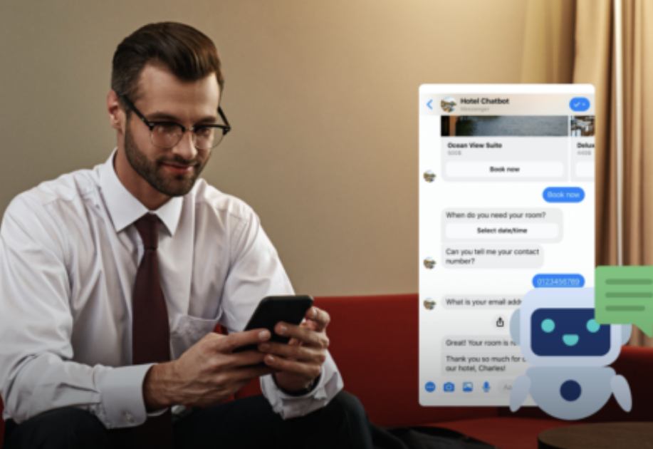
        <div class="rt-sol-caption"><strong>Figure 17: ChatGenie</strong></div>
      </td>
    </tr>
    <tr class="rt-gap">
      <td colspan="2"><strong>Gap:</strong> No existing solution delivers the combination of speed, warmth, physical presence, and personalised guidance at the point of arrival.</td>
    </tr>
  </tbody>
</table>


<p style="text-align:center; font-style:italic; font-size:0.9em;"><strong>Table: 10: Problem Area 5</strong></p>

  

<div style="text-align: center; margin: 16px 0;">
  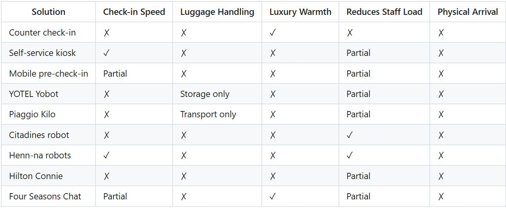
</div>

<p style="text-align:center; font-style:italic; font-size:0.9em;"><strong>Table 11: Summary of Existing Solutions</strong></p>

 *Physical Arrival refers to the end-to-end guest journey from vehicle drop-off at the hotel entrance through luggage handling, lobby navigation, and room escort.*

The table reveals **two** structural gaps:

- Physical arrival remains entirely unaddressed across all solutions reviewed. A guest who checks in via kiosk, mobile app, or AI concierge still carries their own luggage, navigates the property independently, and locates their room without guidance.  
- Staff load reduction comes at the cost of warmth. The solutions that most effectively reduce staff involvement (Henn-na robots, self-service kiosks) offer little in luxury warmth, while those that preserve warmth (Counter check-in, Four Seasons Chat) do not meaningfully reduce staff dependency.

The pattern across all reviewed solutions confirms that the market has not yet produced a system capable of simultaneously delivering speed, warmth, physical presence, and operational efficiency at the point of arrival.

<a id="4-7-upcoming-trends"></a>

## 4.7 Upcoming Trends

The hospitality industry is undergoing a rapid technological shift, with robotics and conversational AI emerging as two of the most significant forces reshaping hotel operations and guest experience. While industry-wide adoption data spans all hotel segments, early signals from luxury operators specifically suggest the segment is moving toward AI-augmented guest interactions.

<a id="4-7-1-growth-of-hospitality-robots"></a>

### 4.7.1 Growth of Hospitality Robots

  

<div style="text-align: center; margin: 16px 0;">
  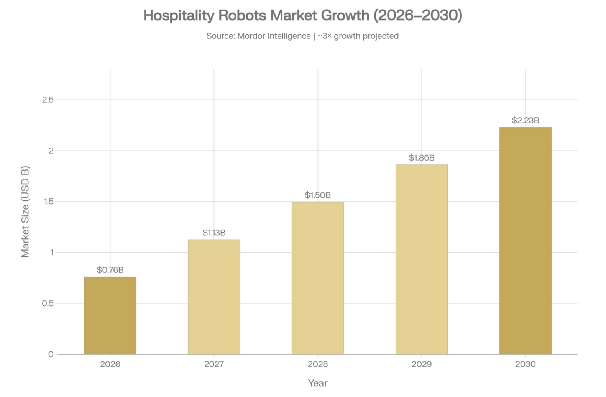
</div>

<p style="text-align:center; font-style:italic; font-size:0.9em;"><strong>Figure 18: Hospitality Robots Market Growth</strong></p>

The hospitality robots market reached USD 0.76 billion in 2026 and is projected to grow to USD 2.23 billion by 2030 (Mordor, 2026), as illustrated in Figure 18 This growth is underpinned by both falling costs and rising guest acceptance: humanoid robot costs dropped approximately 40% between 2022 and 2024 (Hanbury et al., 2025), while a meta-analytic review of 56 studies confirmed that consumers are increasingly receptive to hotel service robots, with performance expectancy and customer attitude emerging as the strongest drivers of acceptance (Begum et al., 2024). Major chains including Marriott, Hilton, and IHG have active robot deployments, with Asia-Pacific properties accounting for the highest density globally (AI, 2025). Over 45% of luxury hotels have already deployed service robots to enhance guest safety and operational efficiency (Intel Market Research, 2026). 

```
The luxury segment has learned from earlier missteps. The Henn-na Hotel experience demonstrated that wholesale automation without warmth or reliability undermines the premium experience. The industry has consequently shifted toward using robots for physically demanding tasks while preserving human presence for high-touch interactions.
```

<a id="4-7-2-rise-of-ai-in-guest-facing-hotel-interactions"></a>

### 4.7.2 Rise of AI in Guest-Facing Hotel Interactions

  

<div style="text-align: center; margin: 16px 0;">
  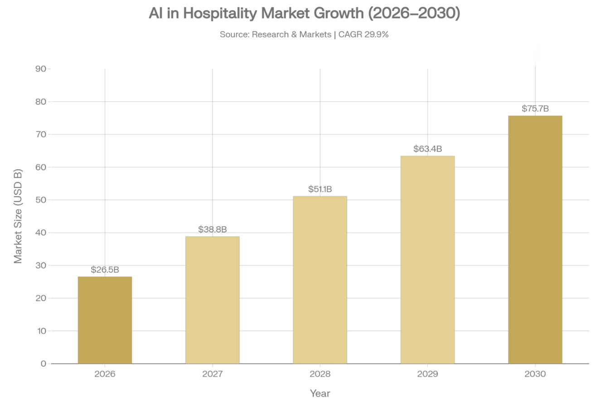
</div>

<p style="text-align:center; font-style:italic; font-size:0.9em;"><strong>Figure 19: AI in Hospitality Market Growth</strong></p>

The global AI in the hospitality and tourism market was valued at USD 26.53 billion in 2026 and is projected to reach USD 75.66 billion by 2030, growing at a CAGR of 29.9% (researchandmarkets, 2026), as illustrated in Figure 19 Within hotels, 71% of hospitality professionals view AI as having a significant or transformative impact, 82% expect AI usage to increase within the next year, and 85% plan to allocate at least 5% of their IT budget to AI tools in 2026 (Canary Technologies, 2026). 45% of hotels are already running AI-powered webchat agents and 92% have adopted or plan to adopt AI-assisted guest communications (Canary Technologies, 2026). 94% of regional tourism and hospitality leaders are already experimenting with AI and 89% will prioritise Generative AI within the next one to two years (pwc, 2025).

Within luxury specifically, the most viable deployment model blends AI efficiency with human warmth. High-profile guests often prefer AI interaction for reasons of privacy and discretion (Editeur Metalab, 2025), and AI-powered virtual concierges are enabling service continuity at a scale unachievable through human staffing alone (Harkison, 2025). Regional operators are investing accordingly: CapitaLand, parent company of The Ascott Limited, established a SGD 50 million Innovation Fund to support the testbedding of high-tech innovations across its portfolio (CapitaLand, 2021).

<a id="4-8-opportunities-and-design-direction"></a>

## 4.8 Opportunities and Design Direction

The research conducted across Sections 3.1 to 3.6 converges on four distinct but interconnected opportunity areas. Each opportunity directly motivated a corresponding design direction and How Might We statement that guided the first phase of concept development.


<table class="rt">
  <thead><tr><th>#</th><th>Opportunity &amp; Design Direction</th></tr></thead>
  <tbody>
    <tr>
      <td class="rt-num">1</td>
      <td>
        <div class="rt-head">Reinventing the Check-In Experience Through Human-Centric Automation</div>
        With self-service options underperforming, automation that feels transactional has already been tried and rejected by the luxury segment. The gap lies in designing a guest-facing system that retains the warmth and conversational quality of a human interaction while delivering the speed and consistency of automation — and critically, one that extends beyond the front desk to cover the full physical arrival journey.
        <br><br>
        <strong>Design statement:</strong> <em>Human-Centric Automation for Enhanced Hospitality</em> — shaping automation so that it supports the overall hospitality experience and aligns with the emotional expectations of luxury guests, rather than reducing the interaction to a purely transactional process.
        <br><strong>HMW:</strong> How might we make automated systems encapsulate human touch?
      </td>
    </tr>
    <tr>
      <td class="rt-num">2</td>
      <td>
        <div class="rt-head">Unlocking Real-Time Hyper-Personalisation</div>
        Although hotels collect extensive guest data, it is often underutilised at the point of arrival. Personalisation remains largely reserved for VIP guests and relies on prior checks on data base rather than systematic data activation. The opportunity lies in designing systems that surface this data in real time.
        <br><br>
        <strong>Design statement:</strong> <em>Personalisation and Guest Preference Intelligence</em> — transforming fragmented guest data into meaningful, timely personalisation across the check-in journey.
        <br><strong>HMW:</strong> How might we enable hotels to provide genuinely personalised and tailored experiences?
      </td>
    </tr>
    <tr>
      <td class="rt-num">3</td>
      <td>
        <div class="rt-head">Supporting and Empowering Frontline Staff</div>
        Frontline staff managing multiple systems simultaneously creates cognitive overload, limiting their ability to deliver high-touch service. With manpower shortages worsening, the opportunity lies in redesigning tools and workflows so that technology handles operational complexity, freeing staff to focus on meaningful guest interactions.
        <br><br>
        <strong>Design statement:</strong> <em>Empowering Staff Consistency and Confidence</em> — designing processes and tools that reduce variability in performance, support clear decision-making under pressure, and enable staff to remain composed, attentive, and guest-facing even during peak periods.
        <br><strong>HMW:</strong> How might we help hotel staff perform at their best even in high-pressure guest interactions?
      </td>
    </tr>
  </tbody>
</table>


<p style="text-align:center; font-style:italic; font-size:0.9em;"><strong>Table 11: Opportunity Areas</strong></p>

  

<div style="text-align: center; margin: 16px 0;">
  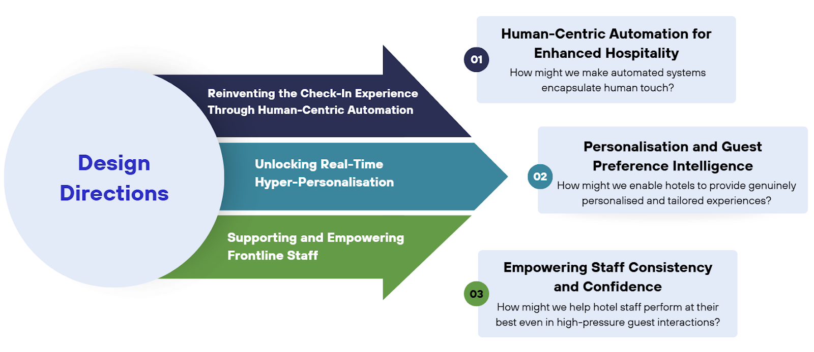
</div>

<p style="text-align:center; font-style:italic; font-size:0.9em;"><strong>Figure 20: Summary of opportunities, design direction, and HMW statements</strong></p>

<a id="5-design-exploration-solution-development"></a>

# 5 Design Exploration & Solution Development

<a id="5-1-user-journey-map"></a>

## 5.1 User Journey Map

```
To ground the design process in real guest experience, we mapped four current-state journeys based on hotel interviews, walkthroughs, and observations conducted across multiple Singapore luxury properties. The maps cover three key touchpoints of the guest arrival experience: pre-arrival, check-in, spanning both traditional counter and self-service kiosk modes, and the luggage handling journey.
```


<div style="text-align: center; margin: 16px 0;">
  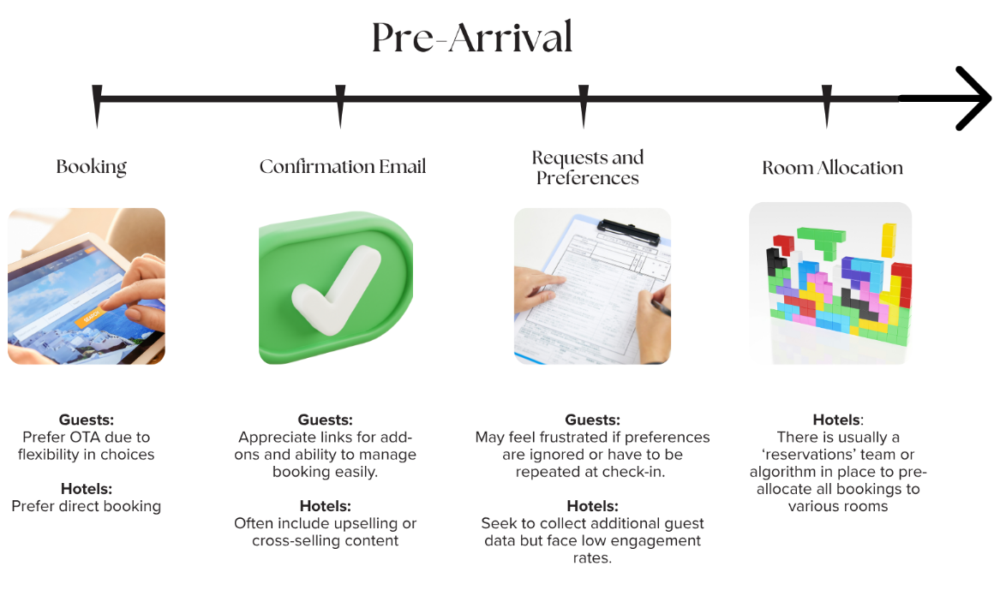
</div>

<p style="text-align:center; font-style:italic; font-size:0.9em;"><strong>Figure 21: Pre-Arrival Flow</strong></p>

---

  

<div style="text-align: center; margin: 16px 0;">
  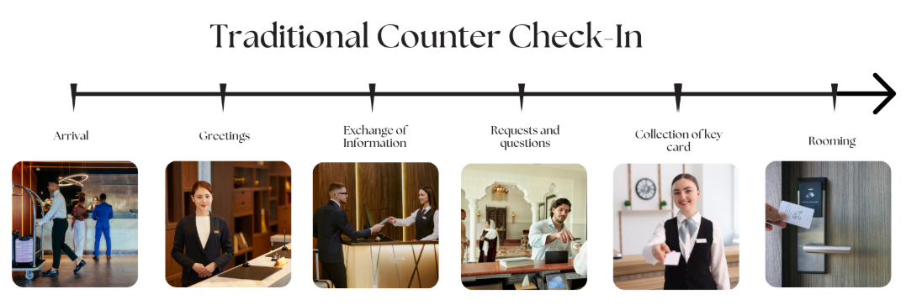
</div>

<p style="text-align:center; font-style:italic; font-size:0.9em;"><strong>Figure 22: Counter Check-In Flow</strong></p>

---

  

<div style="text-align: center; margin: 16px 0;">
  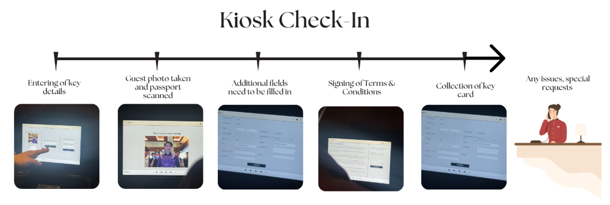
</div>

<p style="text-align:center; font-style:italic; font-size:0.9em;"><strong>Figure 23: Kiosk Check-in Flow (Modelled from Amara Hotel's Kiosk Check-In)</strong></p>

---

  

<div style="text-align: center; margin: 16px 0;">
  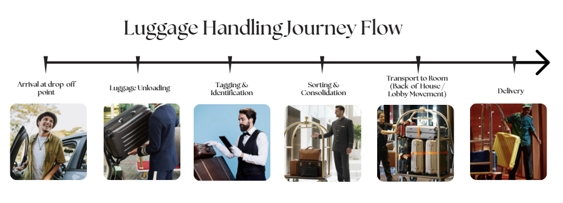
</div>

<p style="text-align:center; font-style:italic; font-size:0.9em;"><strong>Figure 24: Luggage Handling Journey Map (modelled from Marina Bay Sands)</strong></p>

---

*Detailed stage-by-stage breakdowns of each journey are included in Appendix G.*

<a id="5-2-stakeholder-needs"></a>

## 5.2 Stakeholder Needs

The luxury hotel check-in ecosystem involves a complex network of stakeholders whose roles, expectations, and challenges directly shape the arrival experience. Four primary stakeholder groups were identified: guests, front-office staff, hotel management, and technology departments. Their needs and pain points serve as the basis for our three design pillars: Empowering Staff, Personalisation Intelligence, and Human-Centric Automation.Guests

*Detailed profiles covering core expectations, pain points, and needs for each group are included in Appendix H.*


<table class="rt">
  <thead><tr><th>Stakeholder</th><th>Role &amp; Context</th></tr></thead>
  <tbody>
    <tr>
      <td style="font-weight:bold; width:20%; vertical-align:middle;">Guests</td>
      <td>The primary users of the check-in process and ultimate beneficiaries of service excellence — spanning diverse profiles (business travellers, honeymooners, families) each with distinct priorities but a consistent expectation: to feel welcomed, recognised, and cared for from the moment of arrival.</td>
    </tr>
    <tr>
      <td style="font-weight:bold; vertical-align:middle;">Front-of-house Staff</td>
      <td>Execute the end-to-end check-in process while simultaneously managing complex systems, verifying identities, processing payments, and handling real-time guest inquiries — all while maintaining warmth, composure, and attentiveness. Bellmen and porters form a distinct sub-role, responsible for the physically demanding handling and transport of guest luggage.</td>
    </tr>
    <tr>
      <td style="font-weight:bold; vertical-align:middle;">Hotel Management</td>
      <td>Oversees front office performance, coordinating manpower, monitoring service quality, resolving escalations, and making technology adoption decisions at the intersection of guest experience and operational efficiency.</td>
    </tr>
    <tr>
      <td style="font-weight:bold; vertical-align:middle;">Technology Departments</td>
      <td>Maintain the hotel's digital ecosystem: PMS, kiosk systems, CRM, and keycard infrastructure. Responsible for evaluating new technologies for feasibility, integration compatibility, and return on investment.</td>
    </tr>
  </tbody>
</table>


<p style="text-align:center; font-style:italic; font-size:0.9em;"><strong>Table 12: Stakeholder Needs</strong></p>

<a id="5-3-initial-ideas"></a>

## 5.3 Initial Ideas

Building on the three design directions and the pain points identified through primary research, four initial prototypes were developed during the interim phase. Rather than converging on a single concept, we deliberately explored multiple directions across different stages of the guest journey, covering pre-arrival personalisation, guest-facing check-in, and staff support tools. Each prototype addressed a distinct dimension of the problem space.

  

<div style="text-align: center; margin: 16px 0;">
  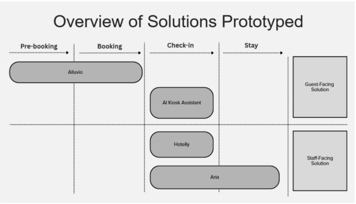
</div>

<p style="text-align:center; font-style:italic; font-size:0.9em;"><strong>Figure 25: Overview of the solutions prototyped across the guest journey</strong></p>

<a id="5-3-1-alluvio-pre-arrival-personalisation-platform"></a>

### 5.3.1 Alluvio:  Pre-Arrival Personalisation Platform

Alluvio addressed the personalisation gap that exists when guests book through Online Travel Agencies, which dominate hotel bookings across Asia, Europe, and the United States but frequently fail to pass accurate guest preference data to hotels. The concept was a web and mobile platform combining OTA-like discovery with a direct, personalised data relationship between guest and hotel. Guests could build dynamic preference profiles through a swipe-based interface, store travel documents securely, and share this information with onboarded hotels ahead of arrival. Hotels in turn could use this data to personalise the stay from the moment of booking rather than relying on staff memory or incomplete PMS records.

<iframe width="1000" height="600" src="https://youtube.com/embed/eHiLBygFeXg" title="Alluvio Demo Video" frameborder="0" allow="accelerometer; autoplay; clipboard-write; encrypted-media; gyroscope; picture-in-picture; web-share" allowfullscreen></iframe>

<p align="center"><strong>Video 1: Alluvio - Web Platform</strong></p>

<iframe width="1000" height="600" src="https://youtube.com/embed/rrKjjsphujQ" title="Alluvio Demo Video" frameborder="0" allow="accelerometer; autoplay; clipboard-write; encrypted-media; gyroscope; picture-in-picture; web-share" allowfullscreen></iframe>

<p align="center"><strong>Video 2: Alluvio - Mobile App Platform</strong></p>
  

<div style="text-align: center; margin: 16px 0;">
  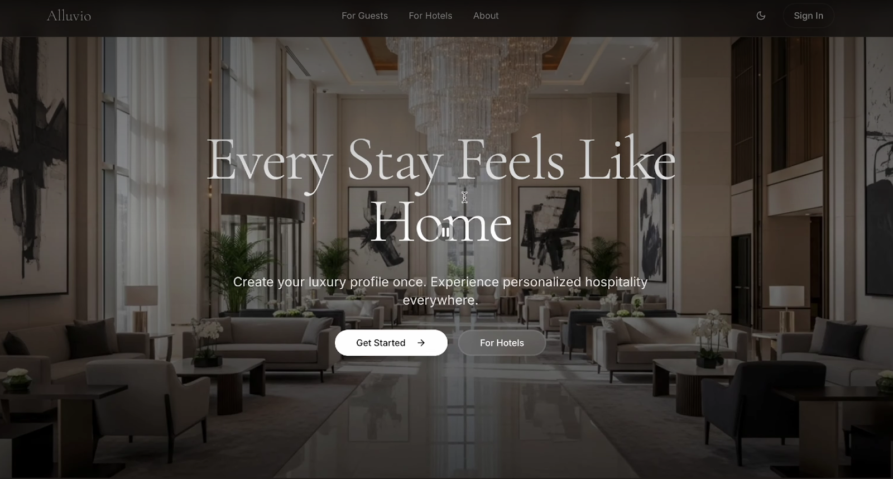
</div>

<p style="text-align:center; font-style:italic; font-size:0.9em;"><strong>Figure 26: Alluvio Web Platform — Interface Overview</strong></p>

  

<div style="text-align: center; margin: 16px 0;">
  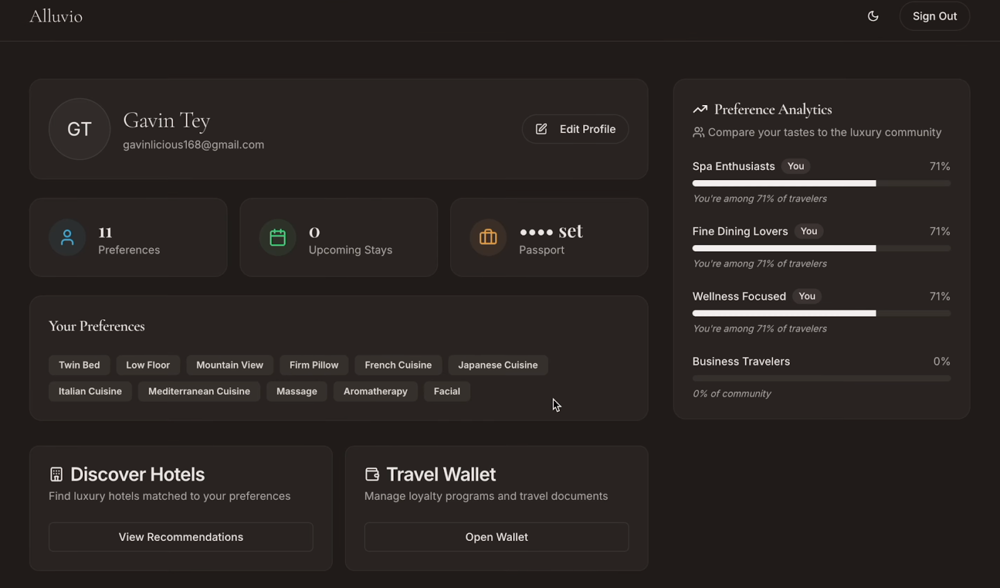
</div>

<p style="text-align:center; font-style:italic; font-size:0.9em;"><strong>Figure 27: The preference analytics dashboard provides guests with a visual overview of their evolving profile. This data is shared with onboarded hotels, enabling personalised service before arrival.</strong></p>
  

<div style="text-align: center; margin: 16px 0;">
  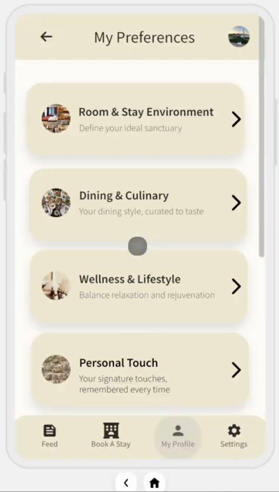
</div>

<p style="text-align:center; font-style:italic; font-size:0.9em;"><strong>Figure 28: The mobile app mirrors the web platform's preference analytics. Guests can review, update, and refine their profiles at any time, ensuring preferences remain current</strong></p>

  

<div style="text-align: center; margin: 16px 0;">
  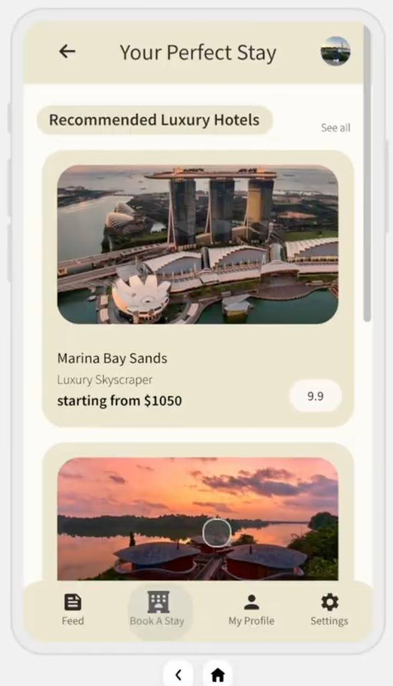
</div>

<p style="text-align:center; font-style:italic; font-size:0.9em;"><strong>Figure 29:  Based on the guest's preference profile, Alluvio surfaces personalised luxury hotel recommendations ranked by compatibility, making discovery feel intuitive and tailored.</strong></p>

### User Testing and Analysis

User testing was conducted through engagements with hotel directors and front-office staff. In parallel, sessions were held with members of the public who were invited to interact with Alluvio's prototype interface, followed by a short structured feedback session.

Guest Feedback:

- Strong interest in preference-based hotel recommendations  
- Enthusiasm for features that reduced booking effort and friction  
- Motivation tied to immediate rewards or first-time incentives for platform adoption

Hotel Staff Feedback:

- Commercial concerns around displacing OTA commission revenue  
- Risk of direct channel poaching through Alluvio's direct hotel-guest communication  
- Need for competitive pricing models and clear non-solicitation agreements to gain industry buy-in

*The full design rationale, value proposition, and prototype documentation for Alluvio are included in Appendix I.*  


<a id="5-3-2-ai-kiosk-assistant-conversational-layer-for-self-service-check-in"></a>

### 5.3.2 AI Kiosk Assistant: Conversational Layer for Self-Service Check-In

The AI Kiosk Assistant was a complementary device designed to work alongside existing kiosk hardware, adding conversational warmth and guidance without requiring a full system overhaul. It used a natural voice interface to welcome guests, walk them through each step of the check-in process, answer simple questions, and escalate exceptions to staff when needed. Unlike a standard kiosk, it could pick up basic preferences during conversation and respond with an emotionally aware tone aligned with luxury expectations.

<iframe width="1000" height="600" src="https://youtube.com/embed/8P1xABYvYyA" title="AI Kiosk Assistant Demo Video" frameborder="0" allow="accelerometer; autoplay; clipboard-write; encrypted-media; gyroscope; picture-in-picture; web-share" allowfullscreen></iframe>

<p align="center"><strong>Video 3: AI Kiosk Assistant Demo</strong></p>
  

<div style="text-align: center; margin: 16px 0;">
  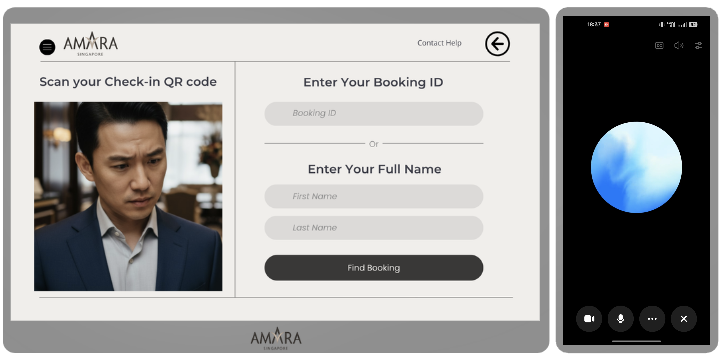
</div>

<p style="text-align:center; font-style:italic; font-size:0.9em;"><strong>Figure 30: The assistant initiates the interaction with a personalised greeting, setting a warm, conversational tone before guiding the guest into the check-in flow.</strong></p>

  

<div style="text-align: center; margin: 16px 0;">
  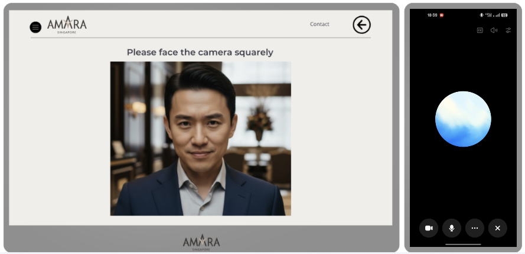
</div>

<p style="text-align:center; font-style:italic; font-size:0.9em;"><strong>Figure 31 The assistant directs the guest through passport scanning and photo capture using natural language cues such as "*Please face the camera squarely*”.</strong></p>

  

<div style="text-align: center; margin: 16px 0;">
  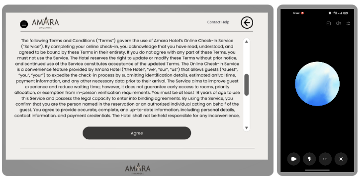
</div>

<p style="text-align:center; font-style:italic; font-size:0.9em;"><strong>Figure 32: The assistant walks the guest through each stage in real time, escalating exceptions to nearby staff when needed without disrupting the experience.</strong></p>

  

<div style="text-align: center; margin: 16px 0;">
  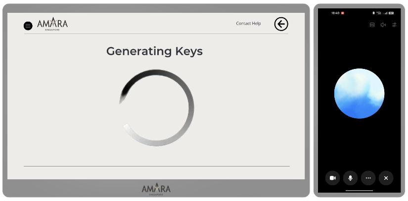
</div>

<p style="text-align:center; font-style:italic; font-size:0.9em;"><strong>Figure 33:  After dispensing the key card, the assistant continues the conversation to confirm room details and capture guest preferences, turning it into a personalisation moment.</strong></p>

### User Testing and Analysis

User testing was conducted through engagements with hotel directors and front-office staff. In parallel, sessions were held with approximately 10 members of the public, who were invited to interact with a simulation of the Amara Hotel kiosk check-in flow alongside the AI Kiosk Assistant without prompts, followed by a short structured feedback session to capture unguided first impressions and usability concerns.

Four key concerns were raised following feedback from hotel staff, industry partners, and potential guests:

- SOP alignment: the AI must strictly follow hotel escalation protocols and service standards  
- Voice recognition reliability: noisy lobby environments posed a risk to consistent performance  
- Privacy concerns: uncertainty around when and where the AI was actively listening  
- Cost justification: difficulty in justifying an AI overlay on top of an average existing SGD 28,000+ kiosk investment

*The full design rationale, value proposition, and prototype documentation for AI Kiosk Assistant are included in Appendix J.*  

<a id="5-3-3-hotelly-ai-co-pilot-for-front-desk-staff"></a>

### 5.3.3 Hotelly: AI Co-Pilot for Front Desk Staff

Hotelly was a real-time AI overlay system designed to support front desk staff during guest interactions without replacing them. Operating as a discreet, desktop-based interface, it surfaced contextual prompts, guest profile information, policy references, and local recommendations at the relevant moment in a conversation, reducing the cognitive load of simultaneously managing data entry, guest rapport, and question-handling. It also automated the capture and summarisation of guest preferences and interaction notes, improving shift handover continuity.

<iframe width="1000" height="600" src="https://www.youtube.com/embed/3t5eh34Za-s" title="Hotelly Demo Video" frameborder="0" allow="accelerometer; autoplay; clipboard-write; encrypted-media; gyroscope; picture-in-picture; web-share" allowfullscreen></iframe>
  
<p align="center"><strong>Video 4: Hotelly Demo</strong></p>

<div style="text-align: center; margin: 16px 0;">
  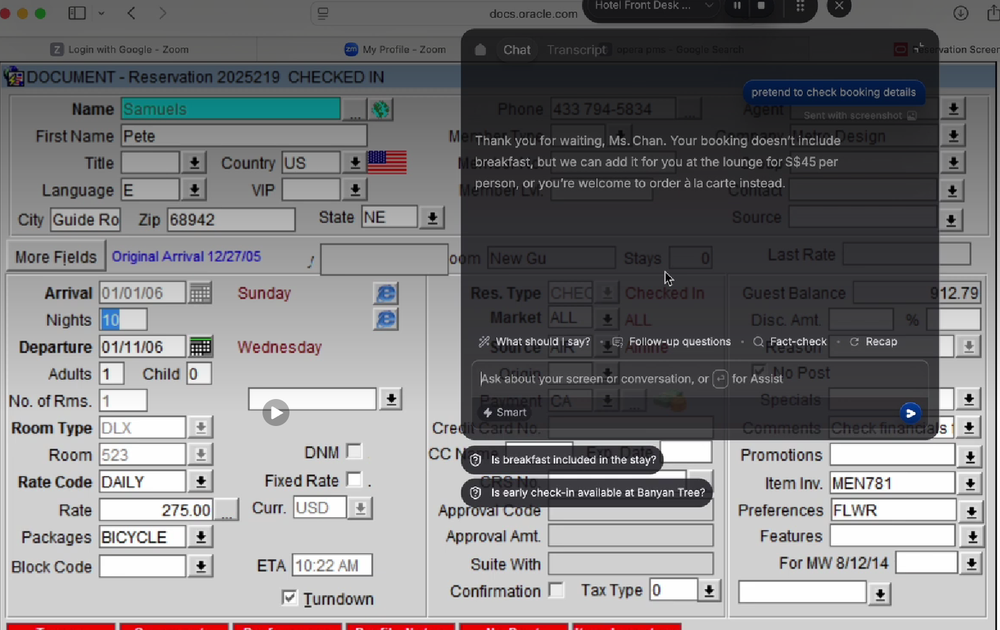
</div>

<p style="text-align:center; font-style:italic; font-size:0.9em;"><strong>Figure 34: The Hotelly interface operates as a discreet desktop overlay alongside existing PMS systems</strong></p>

  

<div style="text-align: center; margin: 16px 0;">
  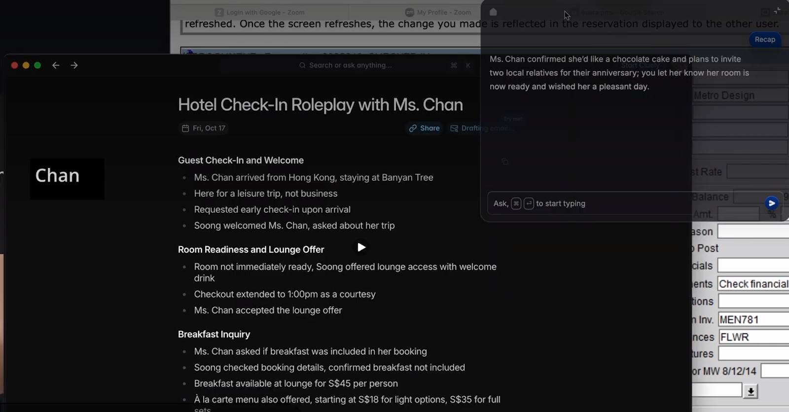
</div>

<p style="text-align:center; font-style:italic; font-size:0.9em;"><strong>Figure 35:  At the close of each interaction, Hotelly generates a summarised recap of guest preferences, requests, and key conversation points</strong></p>

### User Testing and Analysis

User testing was conducted through engagements with hotel directors and front-office staff. To evaluate functional accuracy, simulated role-play sessions were conducted in which participants acted as guests interacting with Hotelly, while team members took on the role of hotel staff, allowing us to assess the system's real-time prompting accuracy, note summarisation, and usability under realistic conversational conditions.

Four key themes emerged from user testing with front desk staff and hospitality trainees:

- Confidence Under Pressure: Users felt more knowledgeable and calmer during guest interactions with real-time AI support  
- Automated Note-Taking: Identified as one of the most valuable features for dispute resolution and personalisation across shifts  
- Dual Mode Design: Newer staff were particularly receptive to AI guidance, leading to the concept of a Training Mode alongside a Live Mode  
- Skill Atrophy and Interface Weight: Concerns centred on over-reliance reducing staff capability over time, and the need for a lightweight interface that could run alongside existing PMS systems without added clutter

*The full design rationale, value proposition, and prototype documentation for Hotelly are included in Appendix K.*

---

<a id="5-3-4-aria-voice-driven-data-capture-assistant"></a>

### 5.3.4 Aria — Voice-Driven Data Capture Assistant

Aria addressed the specific tension between conversation and data entry at the front desk. Rather than prompting staff with information, Aria listened to guest conversations, transcribed key details in real time, and automatically populated relevant fields in the PMS without requiring staff to type. Staff could verify, edit, and approve all captured information before it was saved, maintaining accuracy and accountability. Aria could also surface relevant answers to guest questions, suggest follow-up prompts, and reference hotel policies, FAQs, and room availability in real time.

<iframe width="1000" height="600" src="https://youtube.com/embed/YVOP8cJANXY" title="Alluvio Demo Video" frameborder="0" allow="accelerometer; autoplay; clipboard-write; encrypted-media; gyroscope; picture-in-picture; web-share" allowfullscreen></iframe>

<p align="center"><strong>Video 5: Aria Demo</strong></p>

<div style="text-align: center; margin: 16px 0;">
  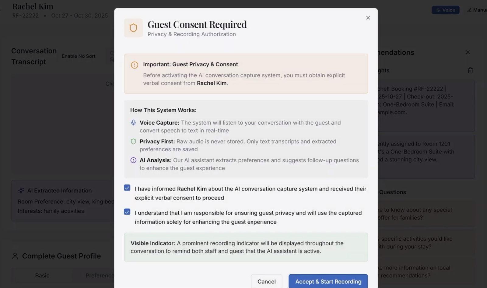
</div>

<p style="text-align:center; font-style:italic; font-size:0.9em;"><strong>Figure 36: Aria requires explicit guest consent before activation, with transcripts retained briefly for verification</strong></p>

  

<div style="text-align: center; margin: 16px 0;">
  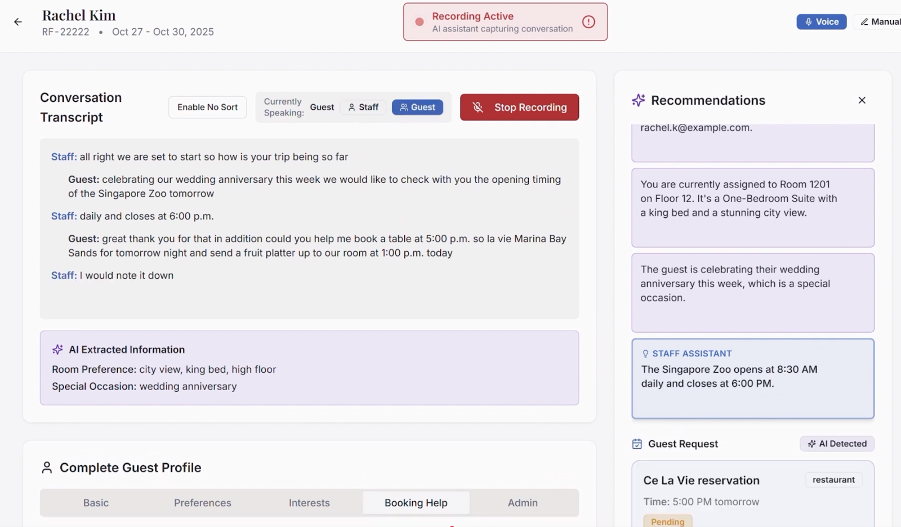
</div>

<p style="text-align:center; font-style:italic; font-size:0.9em;"><strong>Figure 37:  Throughout the conversation, Aria does transcription and highlights key extracted information, while surfacing AI-generated prompts and answers to guest questions</strong></p>

  

<div style="text-align: center; margin: 16px 0;">
  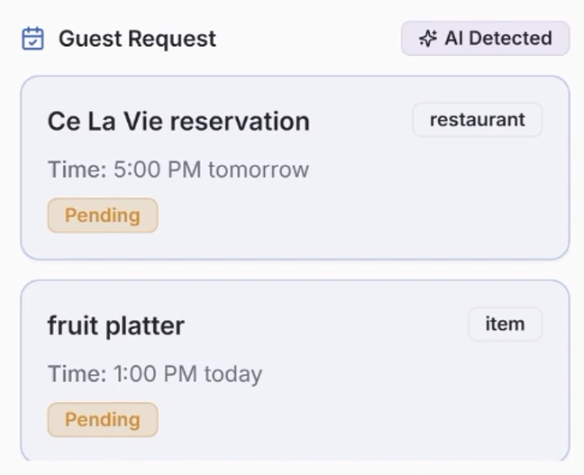
</div>

<p style="text-align:center; font-style:italic; font-size:0.9em;"><strong>Figure 38:  Aria surfaces actionable guest requests and captured preferences for staff to review, edit, and approve</strong></p>

### User Testing and Analysis

Feedback was gathered through a structured discussion with a front office manager and an IT director, conducted using a video demonstration of the Aria prototype. Three key themes emerged:

- Accuracy Concerns: The manager raised concerns about staff over-relying on AI, worrying that errors from misheard or misinterpreted speech could propagate into guest records and PMS systems and cause incidents.
- Privacy and PDPA Compliance: Concerns were raised around voice data sensitivity, consent, and data handling, including the risk of staff activating the tool without first obtaining guest consent.
- Contextual Value of the Tool: The value of auto-fill was acknowledged for capturing guest preferences and routing requests directly. However, its benefit was questioned for short, simple interactions where manual input is just as fast, shaping our understanding that Aria is most valuable in longer, information-heavy, or multitasking check-in scenarios.

*The full design rationale, value proposition, and prototype documentation for Aria are included in Appendix L.*  

These four prototypes collectively explored the pre-arrival, check-in, and staff support dimensions of the problem space. While each addressed a genuine and well-evidenced pain point, none resolved the physical arrival experience. This gap, consistently surfaced across primary research but left unaddressed by all four prototypes, became the central question we brought to Stanford.

<a id="5-4-stanford-dark-horse-prototyping-experience-the-turning-point"></a>

## 5.4 Stanford & Dark Horse Prototyping Experience: The Turning Point

During the one-week visit to Stanford, we adopted a Dark Horse Prototyping approach to deliberately explore a radical future-state concept and surface deeper insights about what luxury means in an automated hospitality context. Instead of refining existing assumptions incrementally. We specifically delved further into our design direction 3 (Human-Centric Automation for Enhanced Hospitality), as we continued to think more about how we could solve key pain points highlighted in our primary research section: thus we explored a radical concept of a floating AI hologram robot guiding guests.

<div style="text-align: center; margin: 16px 0;">
  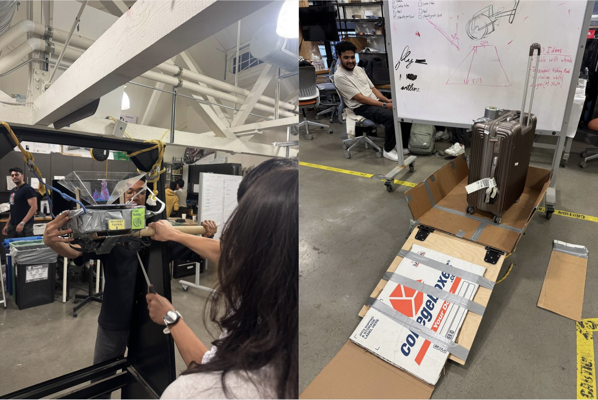
</div>

<p style="text-align:center; font-style:italic; font-size:0.9em;"><strong>Figure 39: Aerohost and Luggage-Carrying Robot (Wizard-of-Oz Prototypes)</strong></p>

The prototype, named AeroHost, reimagined check-in as a hosted journey led by a small flying drone with a holographic character that greeted guests, coordinated luggage handling with another luggage-carrying robot, supported identity verification, and escorted guests through the arrival process. We used a Wizard-of-Oz setup combining a phone-based conversational AI, iPad-based visual prompts, a manually operated luggage bot, and projected navigation cues.

Live user testing generated both structured ratings and qualitative reactions. The prototype scored well on social comfort, security and trust, and cognitive clarity, but lower on luxury, indicating that novelty alone does not translate into a premium experience.

<a id="5-4-1-key-insights-mindset-shift"></a>

### 5.4.1 Key Insights & Mindset Shift

Four key insights emerged from the Stanford week:

**Luxury requires effortlessness, not novelty.** The most consistent breakdown point was the luggage handoff. Participants reacted negatively when required to lift and place their own bags onto the robot. Automation that transfers effort from staff to guest, however innovative in appearance, fails the luxury standard.

**Digital interactions require physical grounding.** Users were confused about where to scan passports and present cards when instructions were not coupled to clear physical cues. High-technology interfaces require low-technology anchors (e.g. lights, markers, and spatial placement to be immediately legible).

**Hospitality must be designed as continuity, not transaction.** Participants responded negatively when the interaction ended at key issuance. The arrival experience must extend beyond identity verification to navigation, room entry, and ongoing reassurance. 

**Conversational AI enables technology to deliver a personalised touch.** The Stanford Dark Horse experience did not produce a final solution, but it fundamentally changed the team's confidence in AI-driven avatar interaction as a design direction. Prior to the Stanford visit, the idea of an AI virtual avatar as a guest-facing hospitality interface had been considered but set aside, as its viability and appropriateness within a luxury hotel context remained uncertain. During live user testing, participants engaged with the conversational AI component more naturally and receptively than anticipated, suggesting that guest comfort with AI interaction had matured significantly, driven both by the novelty and the normalisation of AI tools in everyday life. 

<a id="5-4-2-revised-design-directions-hmw-statements"></a>

### 5.4.2 Revised Design Directions & HMW Statements

The Stanford findings shifted the team's design direction in three ways: from automation as efficiency to automation as service augmentation, from isolated check-in touchpoints to an end-to-end arrival journey, and from novelty-driven to grounded, legible interaction.

These shifts were captured in 2 more in-depth How Might We statements, building off all our previous insights and prototypes:

- How might we design an automated hotel arrival experience that feels effortless and intuitive rather than laborious and frustrating to both the guest and staff?  
- How might we use technology to enhance perceived hospitality that extends beyond the transactional moment of check-in, rather than merely replace human labour?

<a id="5-5-new-refined-ideas"></a>

## 5.5 New & Refined Ideas

As such, two new concept directions emerged in parallel, each attempting to address the gaps the AeroHost prototype had exposed.

The first was a low-profile luggage robot capable of flattening itself to ground level so that guests could load their baggage without lifting which would directly resolve the handoff friction that had been among the most criticised moments in the Dark Horse testing. In its standard operating form, the robot would rise to its full height and function as a mobile amenity, guide and AI recommendation platform. We briefly explored an alternative mechanical approach using a forklift-style system to hook and drag luggage autonomously, but this too was set aside as impractical. More fundamentally, the team recognised the need to first validate whether guests actually wanted an autonomous luggage companion at all before committing to complex hardware, and the Autonomous Mobile Robot (AMR) platform available at the University did not readily support the flattening mechanism in any case.


<div style="text-align: center; margin: 16px 0;">
  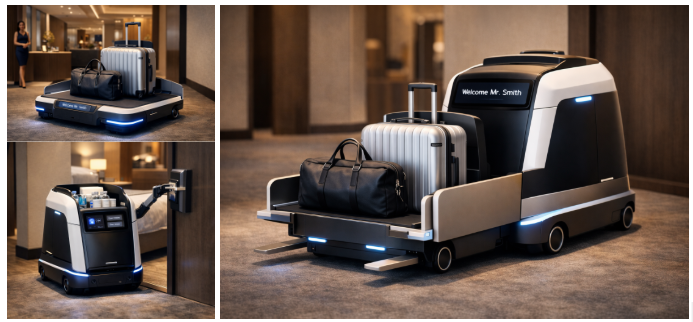
</div>

<p style="text-align:center; font-style:italic; font-size:0.9em;"><strong>Figure 40: Luggage Bot Conceptual Design</strong></p>

The second concept was a digital room key embedded with a live AI avatar, a handheld interface that could answer guest questions, provide navigation guidance, and personalise the arrival experience beyond the check-in counter. While conceptually appealing, this direction was ultimately paused. Without a more distinct interaction model, the concept risked being too close to simply repackaging an existing large language model interface and would not represent a meaningful design advancement.


<div style="text-align: center; margin: 16px 0;">
  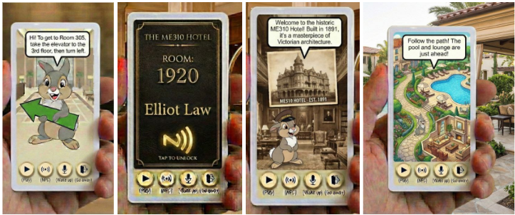
</div>

<p style="text-align:center; font-style:italic; font-size:0.9em;"><strong>Figure 41: Hotel Digital Key Conceptual Design</strong></p>

Drawing on the field observations documented in Section 3.3.2, the team identified a stronger use case for the luggage robot: not to replace the bellhop trolley, but to offer guests an alternative that kept their belongings with them throughout the check-in journey, eliminating the friction of either handing luggage off upon arrival or managing it unassisted while waiting to check in.

<a id="6-concept-of-our-idea"></a>

# 6 Concept of our Idea

Before consolidating the final concept, the team mapped out the complete guest arrival journey from the moment a guest reaches the hotel entrance through to settling into their room, as illustrated in Figure 42 This exercise served to identify every touchpoint where the solution could intervene, and more importantly, where it should not — ensuring that the concept enhanced the arrival experience rather than disrupting moments where human interaction remained valuable.


<div style="text-align: center; margin: 8px 0; height: 400px; display: flex; align-items: center; justify-content: center;">
  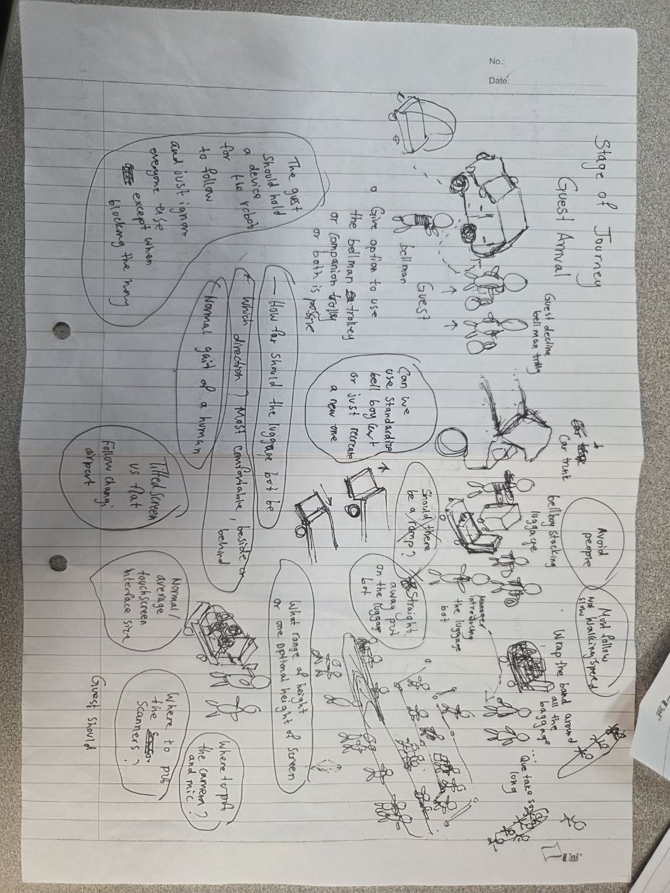
</div>

<p style="text-align:center; font-style:italic; font-size:0.9em;"><strong>Figure 42: Guest Arrival Journey Map — Identifying Key Touchpoints and System Requirements</strong></p>

Mapping the journey surfaced several key considerations. First, the solution had to slot naturally into an existing hotel workflow without requiring the property to restructure its operations around the technology. Second, it had to account for variability in guest behaviour — guests arriving with different amounts of luggage, first-time guests unfamiliar with the property layout, and guests arriving at off-peak hours when staffing is reduced. Third, any automation introduced had to feel intentional and premium rather than transactional, consistent with the expectations of a luxury hotel guest.

From this exercise, four core capabilities were identified as necessary for the concept to deliver a complete and self-sufficient arrival experience: autonomous navigation to escort the guest from the lobby to their room, luggage transport so the guest arrives hands-free, conversational AI check-in to handle identity verification and reservation confirmation, and payment processing to complete the check-in without requiring a separate interaction at the front desk. These four functions formed the basis of the concept.

With the robot already accompanying the guest, integrating a self check-in process and an AI concierge becomes a natural extension rather than a separate system. The concepts of a physical luggage companion and a conversational AI interface were therefore consolidated into a single integrated platform, forming the foundation of ELEVIA.

ELEVIA is an AI-powered concierge system that unifies autonomous mobility, luggage transport, conversational check-in, and identity verification and payment into a single, continuous arrival experience, as first conceptualised in the early sketches shown in Figures 43 and 44 Rather than digitising individual touchpoints in isolation, the concept embeds every check-in function into one physically present, conversationally intelligent system that accompanies the guest from the lobby through to their room. The underlying design principle is that luxury automation must reduce effort for the guest, not transfer it — eliminating the fragmented handoffs between arrival, luggage management, check-in processing, and room navigation that characterise the conventional hotel arrival sequence, and replacing them with a single uninterrupted interaction.

<div style="text-align: center; margin: 8px 0; height: 400px; display: flex; align-items: center; justify-content: center;">
  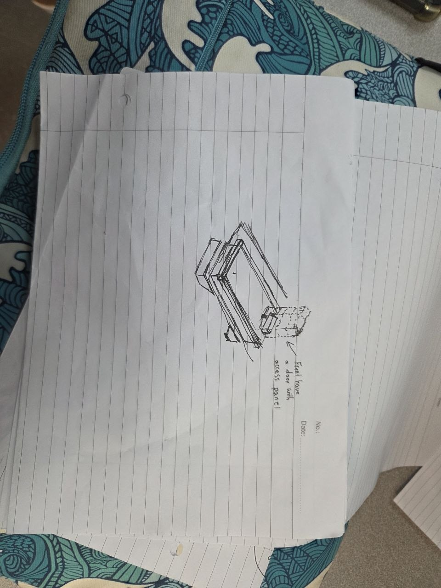
</div>

<p style="text-align:center; font-style:italic; font-size:0.9em;"><strong>Figure 43: Conceptual Design Sketch of the ELEVIA System</strong></p>


<div style="text-align: center; margin: 8px 0; height: 400px; display: flex; align-items: center; justify-content: center;">
  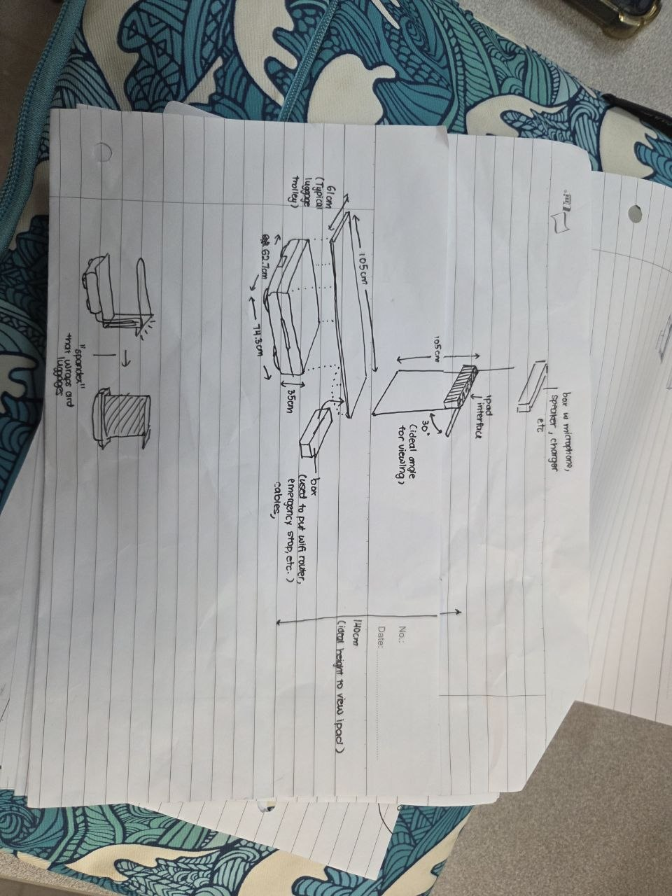
</div>

<p style="text-align:center; font-style:italic; font-size:0.9em;"><strong>Figure 44: Conceptual Design Sketch of the ELEVIA System</strong></p>


<a id="6-1-components-of-elevia"></a>

## 6.1 Components of ELEVIA

ELEVIA is realised through the integration of 6 main components, which together form the full functionality of the system.

<a id="6-2-autonomous-mobile-robot-amr"></a>

## 6.2 Autonomous Mobile Robot (AMR)

At the heart of the ELEVIA concept is an autonomous mobile robot that serves as the physical embodiment of the system. Unlike a fixed kiosk or a purely digital interface, the AMR gives ELEVIA a tangible presence, meeting the guest at arrival, accompanying them through the check-in process, and escorting them to their room. This physical continuity is what distinguishes ELEVIA from existing self-service check-in solutions, which complete a transaction but leave the guest to navigate the rest of the arrival journey independently.

For the AMR to fulfil this role, it must be capable of navigating hotel environments autonomously, detecting and avoiding obstacles in real time, and operating safely alongside guests and staff without requiring dedicated pathways or infrastructure modifications. Equally important is its form factor. The robot must be compact and low-profile enough to move unobtrusively through lobbies and corridors, and refined enough in appearance to sit comfortably within a luxury hotel aesthetic. A robot that appears industrial or bulky would undermine the very experience it is designed to elevate.

<a id="6-3-luggage-porter"></a>

## 6.3 Luggage Porter

A defining feature of the ELEVIA experience is the luggage porter function, in which the AMR physically carries guest luggage from the point of arrival through to the guest's room. This capability is central to the core design principle of reducing guest effort. By taking ownership of the luggage from the moment the guest is greeted, ELEVIA eliminates the need for the guest to manage, monitor, or handle their bags at any point during the arrival journey.

Conceptually, the luggage porter function transforms the AMR from a navigation aid into a physical companion. Rather than the guest following a robot to their room while still managing their own bags, the luggage travels with the robot and the guest travels with the luggage, arriving at their room hands-free and without interruption. The value of the function lies not just in the physical transport of luggage, but in the sense of effortlessness it creates throughout the entire arrival sequence.

For this function to work effectively, the AMR platform must offer sufficient deck space to accommodate a realistic guest luggage load, enough payload capacity to carry that load safely, and the ability to navigate hotel corridors at a pace that feels natural alongside a walking guest. These requirements informed the evaluation of any platform considered for realising the ELEVIA concept.

<a id="6-4-ai-check-in-capabilities"></a>

## 6.4 AI Check-in Capabilities

Apart from the physical device, the other design challenge was the check-in interaction itself: how the guest would identify themselves, complete payment, and receive their room key, all while being conversed with by an intelligent system that felt warm rather than mechanical. Three core capabilities were designed to address this: a passport reader for identity verification, an NFC module for contactless payment, and an AI concierge agent to orchestrate the entire experience.

<a id="6-5-ai-agent"></a>

## 6.5 AI Agent

The AI concierge is the most consequential design decision in the check-in system. It determines not just how the guest completes administrative steps, but how the entire arrival feels.

The central question was whether to use a traditional state machine (a fixed sequence of screens and button presses) or a conversational agent capable of adapting in real time. Our research made this clear: guests consistently rejected interactions that felt transactional or rigid, and the Stanford prototype revealed that guests respond positively to conversational AI when grounded, clear, and hospitable.

We designed the AI concierge as an LLM-driven agent with function-calling capabilities. We envisioned the agent having a professional concierge persona and being equipped with data tools that query live hotel information (reservations, availability, amenities) and UI action tools that control the screen (triggering the passport scanner, initiating payment, issuing a digital key, etc). The LLM decides which tools to call based on what the guest says, allowing check-in to unfold as natural dialogue.

  

<div style="text-align: center; margin: 16px 0;">
  
</div>

<p style="text-align:center; font-style:italic; font-size:0.9em;"><strong>Figure 45: AI Concierge Persona</strong></p>

This architecture addresses three core considerations. First, automation as service augmentation: responses are short and tuned for spoken delivery, replicating the warmth of a human concierge. Second, grounded interaction: the agent never fabricates hotel data, as every factual answer is retrieved through tool calls. Third, continuity beyond the transaction: after check-in, the agent continues conversing during the robot escort, maintaining the feeling of being hosted throughout arrival.

<a id="6-6-passport-reader"></a>

## 6.6 Passport Reader

In a traditional setting, the guest hands their passport to a staff member who either then slots it into passport scanners, image capture machines or manually keys in the details. Self-service kiosks allow guests to scan their passports themselves through dedicated passport scanner modules, and we wanted to bring this into our solution as well. Our approach was thus to embed a passport scanner, positioned at a natural angle for the guest to simply slide their passport in flat. This approach would allow identity verification to happen mid-conversation with minimal disruption.

<a id="6-7-nfc-module"></a>

## 6.7 NFC Module

Payment processing in luxury hotels typically involves handing over a credit card to staff or navigating a payment terminal on a kiosk, both of which introduce friction where the guest must pause and engage with a separate device. We chose contactless NFC over alternatives such as QR code scanning or on-screen card entry for two reasons. First, it is the fastest physical payment interaction available that is also the most common and intuitive, requiring only a single tap lasting less than a second. Second, and more importantly from a hospitality design perspective, a tap requires no visual attention or manual input, allowing the guest to maintain eye contact with the avatar and stay within the conversational experience rather than shifting focus to a separate payment interface.

<a id="6-8-design-considerations-for-ai-check-in-capabilities"></a>

## 6.8 Design Considerations for AI Check-In Capabilities

These 4 performance dimensions shaped how the check-in subsystem was designed and iterated throughout development.

**Speed and responsiveness:** the full voice loop, from the guest finishing a sentence to the avatar replying, needed to feel conversational. The pipeline was designed with streaming text-to-speech and barge-in support so the guest can interrupt mid-sentence, mirroring natural turn-taking.

**Accuracy and trustworthiness:** every piece of hotel information must be factually correct. The tool-calling architecture ensures this by grounding responses in database queries. Fuzzy name matching handles misspellings gracefully, suggesting corrections conversationally rather than returning a hard failure.

**Graceful degradation:** no single failure should prevent check-in from completing. If the passport camera fails, the guest provides their name verbally. If NFC is unavailable, payment proceeds manually. If the primary AI provider is unreachable, the system falls back to an alternative model.

**Hospitality tone:** beyond functional performance, the system was evaluated on whether the interaction felt premium, including persona, response pacing, and the ability to handle off-topic questions mid-flow.

<a id="7-prototyping-and-testing"></a>

# 7 Prototyping and Testing

<a id="7-1-the-final-prototype"></a>

## 7.1 The Final Prototype

Our final prototype, ELEVIA, is a robot-mounted AI concierge that unifies four capabilities into a single, continuous arrival experience: autonomous mobility, luggage transport, conversational AI check-in, and hardware-based identity verification and payment. The design intent was to directly address the core insight that luxury automation must reduce effort for the guest, not transfer it by embedding every check-in function into one physically present, conversationally intelligent system that accompanies the guest from lobby to room.


<div style="text-align: center; margin: 16px 0;">
  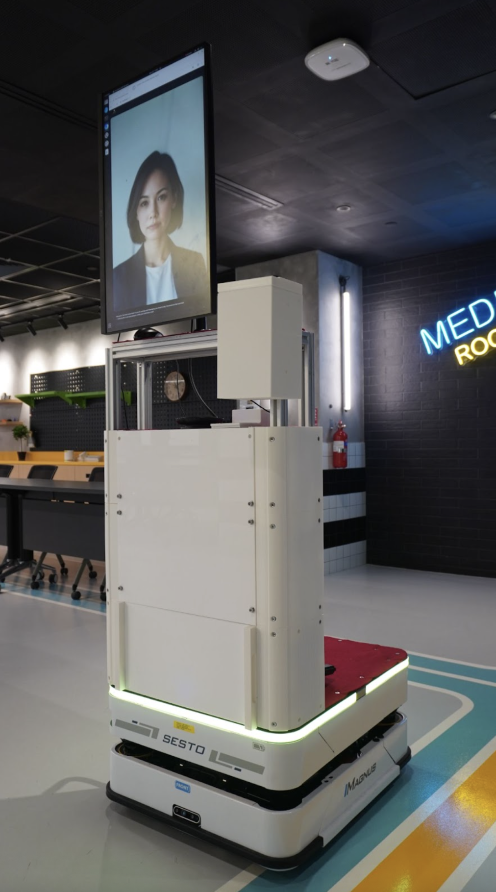
</div>

<p style="text-align:center; font-style:italic; font-size:0.9em;"><strong>Figure 46: Full ELEVIA Prototype</strong></p>

<div style="text-align: center; margin: 16px 0;">
  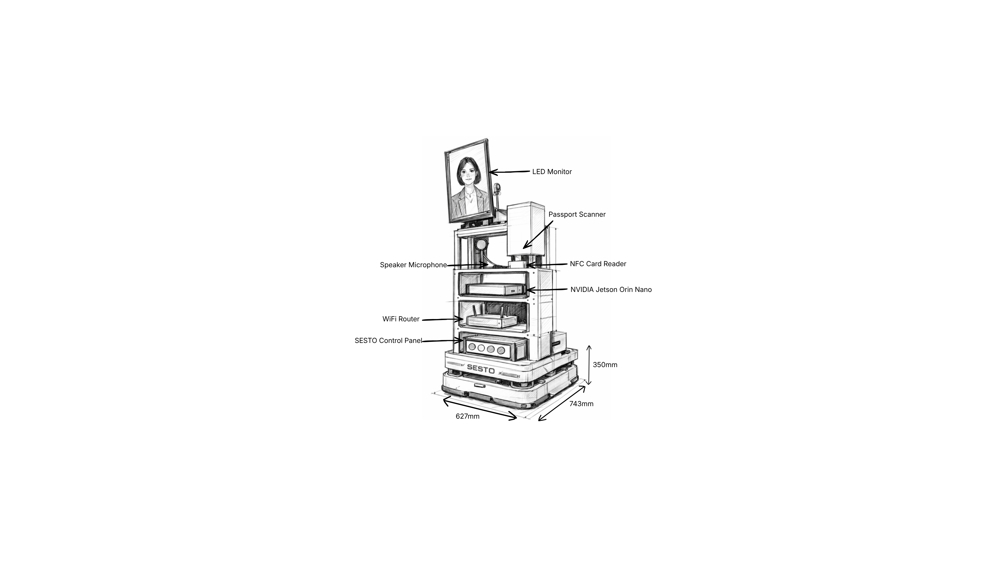
</div>

<p style="text-align:center; font-style:italic; font-size:0.9em;"><strong>Figure 47: Full ELEVIA Sketch with Parts Labelled</strong></p>

The system, built on a SESTO Magnus AMR as the foundation, provides the physical platform for navigation and luggage transport. Mounted on the AMR is a display connected to an NVIDIA Jetson, which runs a custom React frontend that presents a life-sized AI avatar, a conversation panel, and step-by-step check-in overlays. The robot also carries a USB webcam packaged into a passport scanner, and an ESP32-based NFC reader for contactless payment. These subsystems are coordinated through a Node.js backend that acts as the central orchestrator. Audio input and output are handled through a Jabra speakerphone mounted alongside the display, selected for its omnidirectional microphone pickup and noise cancellation suitable for a hotel lobby environment.


<div style="text-align: center; margin: 16px 0;">
  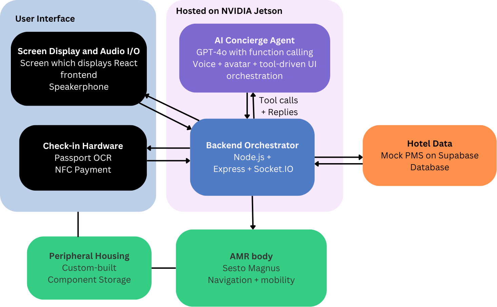
</div>

<p style="text-align:center; font-style:italic; font-size:0.9em;"><strong>Figure 48: Labelled System Diagram</strong></p>

The integrated check-in flow works as follows. The robot travels to the guest upon arrival, and a staff member assists the guest in loading luggage onto the robot platform, before introducing the AI Concierge Agent (also referred to as the AI avatar). The AI avatar is able to greet the guest by voice and asks for his/her name. Through natural conversation, the agent retrieves the guest's reservation, prompts them to scan their passport on the robot-mounted camera, confirms booking details, offers a room upgrade if available, and processes payment via NFC card tap. Upon completion, the guest receives a digital room key by email (with Apple Wallet support), and the robot autonomously navigates to escort them to their room, continuing to converse along the way.

<!-- ====== HERO SECTION: DEMO VIDEO ====== -->
<div style="width:100%; margin: 48px 0 48px 0; display: flex; flex-direction: column; align-items: center;">

  <!-- Top Divider -->
  <div style="width: 70%; border-top: 4px solid #0859AD; border-radius: 3px; margin-bottom: 28px;"></div>
  
  <!-- Hero Headline -->
  <h2 style="
      font-size: 2.6em; 
      color: #0859AD; 
      font-weight: 800; 
      letter-spacing: 1px; 
      margin: 0 0 18px 0;
      text-shadow: 0 3px 16px rgba(8,89,173,0.10);">
    <span style="background: linear-gradient(90deg,#E9B42F 20%, #50B3FF 80%); color:transparent; background-clip:text; -webkit-background-clip:text;">Experience ELEVIA in Action</span>
  </h2>

  <p style="font-size:1.2em; max-width:700px; color:#444; margin-bottom: 40px; text-align:center;">
    Watch the full prototype showcase: <b>ELEVIA, our all-in-one premium autonomous check-in robot—delivering seamless guest arrival, AI-powered concierge, and effortless luggage transport.
    </b>
  </p>

  <!-- Demo Video Responsive Container -->
  <div style="position:relative; padding-bottom: 56.25%; height:0; max-width: 1000px; width: 100%; box-shadow: 0 8px 40px 0 rgb(80,179,255,0.23); border-radius:18px; overflow:hidden; background:#f3f8fd;">
    <iframe src="https://youtube.com/embed/Ib0czW4uUcc" title="ELEVIA Demo Video" frameborder="0" style="position:absolute; top:0; left:0; width:100%; height:100%;" allow="accelerometer; autoplay; clipboard-write; encrypted-media; gyroscope; picture-in-picture; web-share" allowfullscreen></iframe>
  </div>

  <!-- Label with icon -->
  <div style="margin-top: 30px; text-align:center;">
    <span style="display: inline-flex; align-items: center; font-size:1.15em; color:#222; font-weight: 600; letter-spacing: 0.3px;">
      
      Final Prototype Demo Video
    </span>
  </div>

  <!-- Bottom Divider -->
  <div style="width: 70%; border-top: 4px solid #0859AD; border-radius: 3px; margin-top: 36px;"></div>
</div>
<!-- ====== END HERO SECTION ====== -->

Critically, the AI agent drives all screen transitions. Rather than a fixed sequence of button presses, the LLM decides what the screen displays next based on the conversation, keeping the interaction natural and responsive. If the guest asks an off-topic question mid-flow, wants to skip the upgrade offer, or gives a misspelled name, the system adapts without breaking. This conversational flexibility was a deliberate design response to the finding that rigid kiosk workflows feel transactional and impersonal.

This final prototype involved iterative enhancements of multiple subsystems, namely the (1) Robot Body, (2) Peripheral housing, (3) AI Agent, (4) Passport Scanner & NFC which will be further expounded upon.

<a id="7-2-selection-of-the-sesto-magnus-amr"></a>

## 7.2 Selection of the SESTO Magnus AMR

For the purpose of prototyping and validating the ELEVIA concept, the team utilised the SESTO Magnus AMR available through EDIC's lab, as shown in Figure 49, rather than fabricating a bespoke platform. This decision allowed development effort to be concentrated on the components unique to the concept, namely the AI avatar capabilities and system integration, while still realising a fully functional end-to-end prototype.

<div style="text-align: center; margin: 16px 0;">
  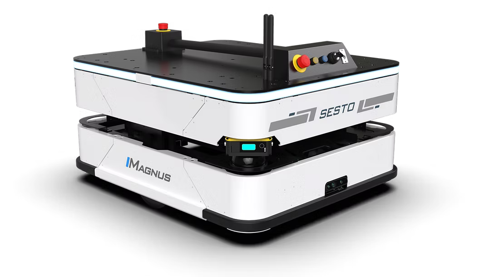
</div>

<p style="text-align:center; font-style:italic; font-size:0.9em;"><strong>Figure 49: SESTO Magnus AMR</strong></p>

The SESTO Magnus was evaluated against the functional requirements established in section 6 and proved well-suited for prototyping purposes. Its relatively compact, low-profile form factor (743 × 627 × 350 mm) aligned with the sleek aesthetic central to the luxury hotel context. Its open cargo deck supported a payload of up to 300 kg, comfortably exceeding typical guest luggage loads, and its footprint was confirmed to accommodate at least two large suitcases without requiring modification or the addition of retractable extenders. Its maximum operating speed of 1.2 m/s was compatible with a comfortable average human walking pace of approximately 1.3 m/s (Cronkleton, 2025), satisfying the requirement for the robot to travel naturally alongside a guest. Navigation was handled by dual Safety LiDARs with a range of 40 m each and 360° combined coverage, providing the real-time obstacle detection and rerouting capability needed for safe deployment in a live, high-footfall environment.

Together, these characteristics confirmed that the SESTO Magnus was not merely a convenient available platform, but one that genuinely met the functional requirements of the luggage porter use case without compromise.

<a id="7-2-1-sesto-magnus-amr-set-up"></a>

### 7.2.1 SESTO Magnus AMR Set-Up

<a id="7-2-1-1-network-configuration"></a>

#### 7.2.1.1 Network Configuration

We mounted a dedicated WiFi router with a SIM card onto the SESTO Magnus to serve as the shared network between the AMR and our development laptop. This allowed both devices to operate on the same IP address, establishing a wireless connection to the SESTO Fleet UI and enabling access to the system configuration interface.

<a id="7-2-1-2-environment-mapping"></a>

#### 7.2.1.2 Environment Mapping

We mapped the EDIC Hub by manually driving the SESTO Magnus around the space using a wired remote controller, as shown in Figure XX, tracing the perimeter first before covering all navigable internal paths. This allowed the system to register fixed obstacles such as tables, chairs, and couches throughout the space. The completed floor map as rendered in the Fleet UI is shown in Figure XX.

<div style="text-align: center; margin: 16px 0;">
  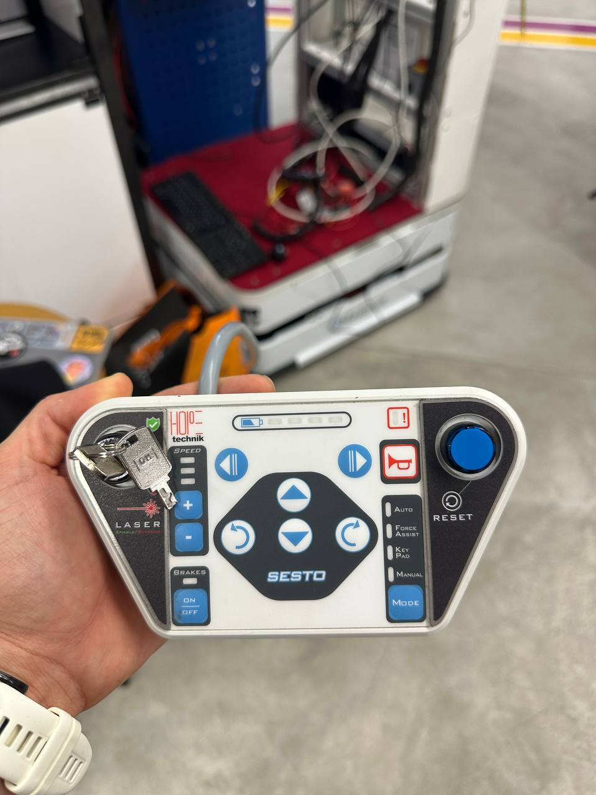
</div>

<p style="text-align:center; font-style:italic; font-size:0.9em;"><strong>Figure 50: Remote Controller of the SESTO Magnus AMR</strong></p>

<div style="text-align: center; margin: 16px 0;">
  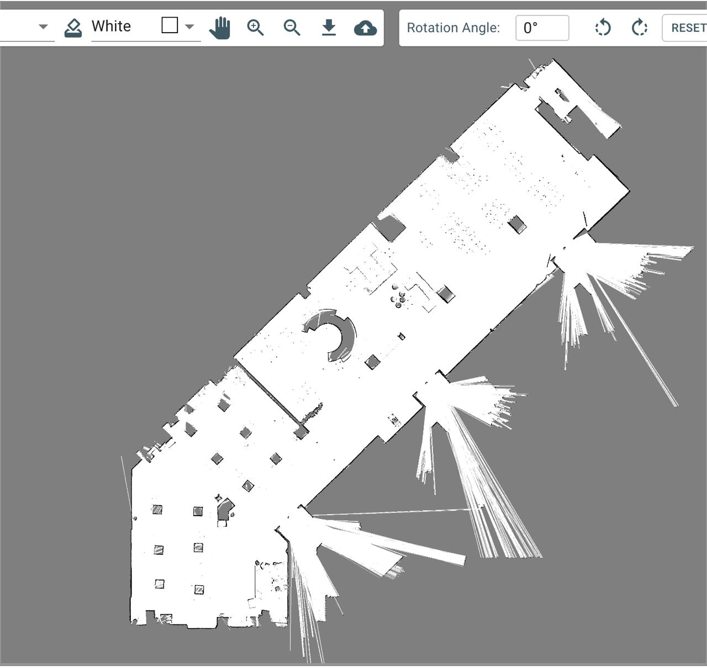
</div>

<p style="text-align:center; font-style:italic; font-size:0.9em;"><strong>Figure 51: Rendered Mapping of EDIC Hub on the SESTO Magnus AMR Fleet UI</strong></p>

<!-- image pending -->

<a id="7-2-1-3-amr-initialisation"></a>

#### 7.2.1.3 AMR Initialisation

After mapping, we initialised the AMR by physically pushing it to the designated recovery waypoint, establishing its positional awareness within the active map and enabling autonomous navigation.

<a id="7-2-1-4-waypoint-configuration"></a>

#### 7.2.1.4 Waypoint Configuration

We plotted waypoints across the EDIC Hub to simulate a hotel environment, defining a minimum of one recovery point, one park point, and one charging point as required by the system. The recovery point was set as the AMR's default standby position when idle. Additional waypoints representing hotel locations including the hotel porch, lobby, restaurant, and room destinations such as Rooms 2501, 1501, and 3501 were placed at distinct reference points around the hub as shown in Figure XX. For each destination waypoint, we configured the arrival heading angle to ensure the AMR oriented itself correctly relative to the guest upon reaching its destination, which is important for a natural and intuitive handover moment at the room entrance.

<div style="text-align: center; margin: 16px 0;">
  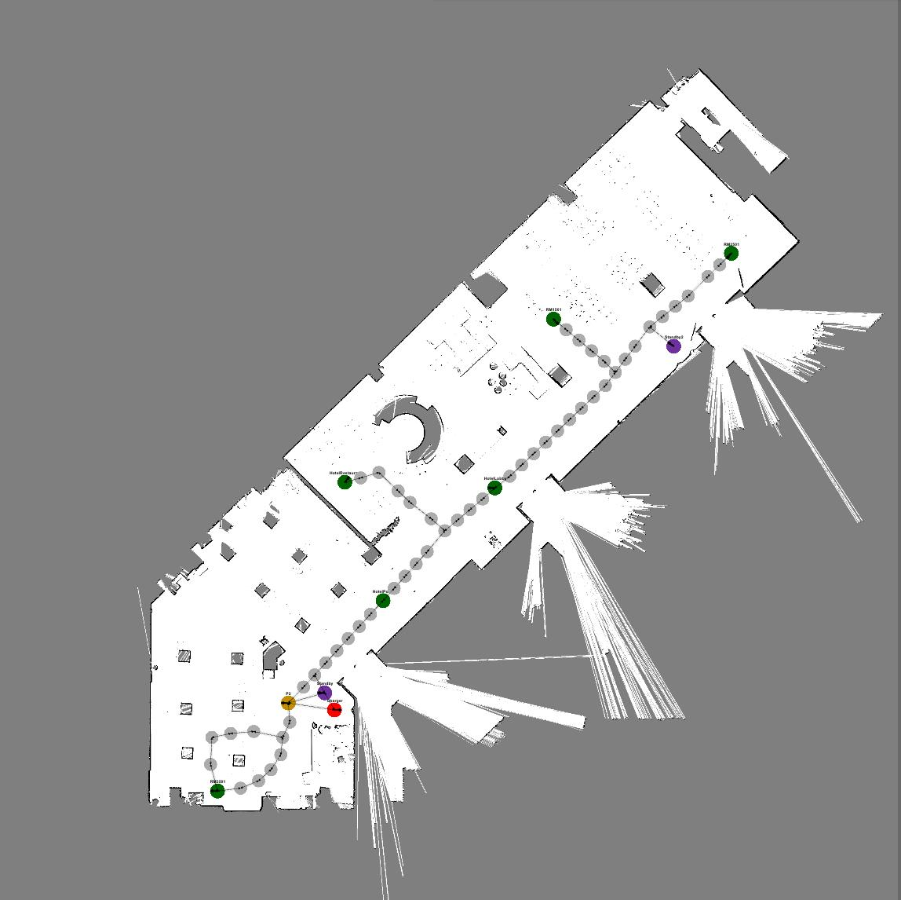
</div>

<p style="text-align:center; font-style:italic; font-size:0.9em;"><strong>Figure 52: Waypoints plotted based on mapping</strong></p>

<a id="7-2-1-5-safety-parameters"></a>

#### 7.2.1.5 Safety Parameters

We set the obstacle stopping distance to 1 metre, ensuring the AMR decelerates and halts well before entering the personal space of nearby guests during navigation. Selected configuration parameters are shown in Figure XX.

<div style="text-align: center; margin: 16px 0;">
  
</div>

<p style="text-align:center; font-style:italic; font-size:0.9em;"><strong>Figure 53: Configuration Parameters of each waypoint and intermediaries</strong></p>

<a id="7-2-2-sesto-magnus-amr-testing"></a>

### 7.2.2 SESTO Magnus AMR Testing

With all waypoints configured, we conducted navigation tests by commanding the AMR to travel to each destination and observing its performance along each route. The key parameters we validated were autonomous obstacle avoidance, route consistency, and whether the AMR's travel speed matched a comfortable walking pace alongside a guest. These tests were essential given that the SESTO Magnus formed the physical backbone of the ELEVIA prototype and any navigation failures would directly compromise the end-to-end guest experience.

<a id="7-3-peripheral-housing"></a>

## 7.3 Peripheral Housing

<a id="design-rationale"></a>

### Design Rationale

The luggage shelf was designed as a custom structure built directly around the AMR, serving the dual purpose of providing a secure platform to house the check-in hardware and peripherals (NFC scanner and passport reader) and monitor that form the guest-facing interface of ELEVIA.

The design process began with dimensioning the kiosk frame footprint against the SESTO’'s physical profile. A key constraint was preserving access to the AMR's control panel, including its buttons and key, without the structure exceeding the robot's outer edge. To resolve this, one side of the bottommost level was left open without a profile, creating a clearance zone around the control panel while keeping the overall footprint within the AMR boundaries. The frame was designed to align with the existing threaded holes on the Sesto platform, allowing it to be screwed directly into the base while sitting flush against the robot body, giving the appearance of an integrated rather than retrofitted structure.


<div style="text-align: center; margin: 16px 0;">
  
</div>

<p style="text-align:center; font-style:italic; font-size:0.9em;"><strong>Figure 54: AMR platform threaded hole location referenced onto the T-slot aluminium profile</strong></p>


<div style="text-align: center; margin: 16px 0;">
  
</div>

<p style="text-align:center; font-style:italic; font-size:0.9em;"><strong>Figure 55: AMR with the T-slot aluminium profile base</strong></p>


<div style="text-align: center; margin: 16px 0;">
  
</div>

<p style="text-align:center; font-style:italic; font-size:0.9em;"><strong>Figure 56: AMR with the fully assembled T-slot aluminium profile</strong></p>

The frame was constructed from 30x30mm aluminium T-slot extrusion profiles, selected for their ready availability, ease of cutting and drilling, and compatibility with the inner corner L-brackets and rhombus nut fasteners used throughout the assembly. Aluminium was preferred over steel for its lower weight, reducing the overall load on the AMR platform while maintaining sufficient structural rigidity for the prototype's requirements.

The structure is organised into five functional levels, with component placement determined by ergonomic accessibility and spatial requirements, as shown in Figure 56 The first level sits at the base of the frame directly above the AMR platform and is intentionally left without a screwed-on shelf panel to preserve access to the Sesto's control panel for routine startup and maintenance. The second level houses the Jetson module and the server box, positioned low in the structure as it requires no guest interaction and should only be accessed for maintenance and software updates. The third level is dedicated to the router, which requires the full clearance of that level due to its size and should be covered up for the same reason unless maintenance is required. The fourth level houses the NFC scanner and emergency stop button, positioned at approximately arms-reach height for intuitive guest interaction and accessible operator intervention. The passport reader is mounted at the front of the fifth level, positioned just to the side of the monitor to minimise guest reach distance and improve interaction intuitiveness. The fifth and uppermost level consists of a thick 10mm aluminium plate mounting the monitor stand, selected for the rigidity and load-bearing strength required to hold the monitor securely during robot movement, where acrylic would be insufficient.

Intermediate shelf levels use 5mm white acrylic, chosen for its low cost, low weight, strength, and ease of cutting, while matching the Sesto's default white body colour. The visible shelf surface is lined with maroon felt to reinforce the premium aesthetic of the overall system.

To ensure the structure integrated visually with the Sesto body, custom interface frames were modelled in PTC Creo and 3D printed in white. These frames sit mostly flush against the curves of the Sesto base, with cutouts aligned to the aluminium profiles for direct fastening via rhombus nuts. As the cutouts reduced the material thickness at the curved edge, a corresponding protrusion was added on the opposite side to compensate, maintaining the structural rigidity of the printed frame. A removable magnetic door provides quick access to the Sesto's control panel for maintenance without disrupting the exterior appearance of the structure. The following are images of the right bottom level frame. 


<div style="text-align: center; margin: 16px 0;">
  
</div>

<p style="text-align:center; font-style:italic; font-size:0.9em;"><strong>Figure 57: Computer-Aided Design of the AMR Shelf Panels</strong></p>

<div style="display: flex; flex-wrap: wrap; justify-content: center; gap: 24px; margin: 24px 0;">
  <div style="flex: 1 1 300px; max-width: 47%; text-align: center;">
    
    <p style="text-align:center; font-style:italic; font-size:0.9em; margin-top: 8px;"><strong>Figure 58: Computer-Aided Design of the AMR Shelf Panels assembled</strong></p>
  </div>
  <div style="flex: 1 1 300px; max-width: 47%; text-align: center;">
    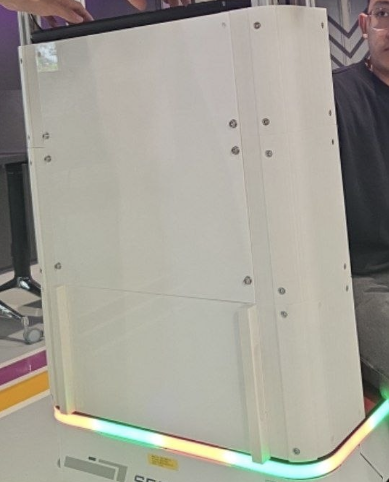
    <p style="text-align:center; font-style:italic; font-size:0.9em; margin-top: 8px;"><strong>Figure 59: Assembled 3D printed panels with the magnetic panel</strong></p>
  </div>
  <div style="flex: 1 1 300px; max-width: 47%; text-align: center;">
    
    <p style="text-align:center; font-style:italic; font-size:0.9em; margin-top: 8px;"><strong>Figure 60: Fully Assembled Pheripheral Housing and AI Avatar Eye Height</strong></p>
  </div>
  <div style="flex: 1 1 300px; max-width: 47%; text-align: center;">
    
    <p style="text-align:center; font-style:italic; font-size:0.9em; margin-top: 8px;"><strong>Figure 61: Monitor Arm Screwed onto the Metal Plate</strong></p>
  </div>
</div>


A monitor was chosen over alternative display types such as tablets or touchscreen panels as it offered the combination of cost-effectiveness, appropriate screen size for the life-sized AI avatar display, and ease of mounting on a height-adjustable stand. The monitor stand was also readily available for purchase and also allows the screen height to be manually adjusted, with the AI avatar's eyes positioned at approximately 1530mm from the ground. This height was determined using anthropometric data from BS ISO 7250-3:2015, specifically the Asian regional standing eye height ranges, which better represent the expected user demographic in a Singapore hospitality context than worldwide ranges (British Standards Institution, 2015). The midrange value across Asian male and female adults is approximately 1530mm ensuring the avatar's gaze meets the eyeline of the majority of standing Asian adult guests for a natural face-to-face interaction.

<a id="7-4-ai-agent"></a>

## 7.4 AI Agent

<a id="design-rationale-1"></a>

### Design Rationale

The AI concierge is the central intelligence of the check-in experience. A key design decision was to build it as an LLM-driven conversational agent rather than a rigid state machine. Traditional hotel kiosks follow fixed screen sequences: scan passport → confirm booking → tap card → collect key. This works for efficiency, but as our research showed (Section 4.5), guests perceive such interactions as cold and transactional. Our approach was to use a large language model (GPT-4o) with function-calling capabilities, allowing the dynamic check-in to unfold as a natural dialogue where the AI decides what to do next based on what the guest says, not a button they press.

 


<div style="text-align: center; margin: 16px 0;">
  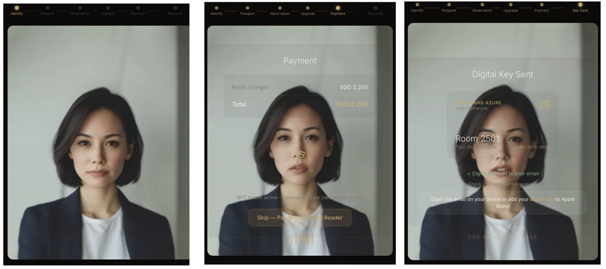
</div>

<p style="text-align:center; font-style:italic; font-size:0.9em;"><strong>Figure 62: Example AI Interface Screenshots</strong></p>

<a id="how-it-works"></a>

### How It Works

All backend software for the AI agent is hosted on the NVIDIA Jetson, which communicates with OpenAI's API for LLM inference. The agent operates through a tool-calling architecture. It has access to two categories of tools: data tools that query live hotel information (reservation lookups, room availability, hotel amenities), and UI action tools that control what the screen displays (advancing the check-in step, triggering the passport scanner, initiating payment, issuing a digital key, or commanding the robot to navigate). On each conversational turn, the backend sends the full conversation history and current context to the LLM. If the model determines it needs information or wants to trigger an action, it calls the appropriate tool; the backend executes it, feeds the result back, and loops until the model produces a spoken reply. This loop runs up to five iterations per turn to prevent runaway calls.


<div style="text-align: center; margin: 16px 0;">
  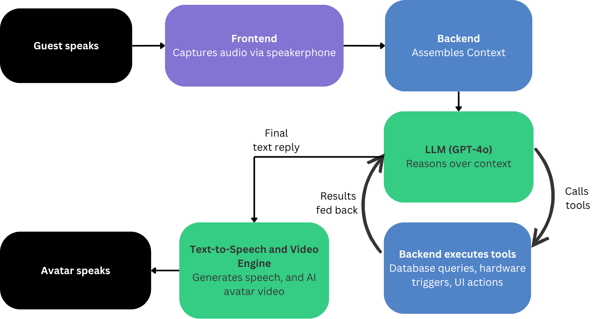
</div>

<p style="text-align:center; font-style:italic; font-size:0.9em;"><strong>Figure 63: Simplified diagram of AI System</strong></p>


| Tool Name                   | Description                                                                               |
| --------------------------- | ----------------------------------------------------------------------------------------- |
| lookupreservation           | Looks up a guest reservation by confirmation code or reservation ID.                      |
| lookupreservationbyname     | Looks up a reservation by the guest's first and last name, with fuzzy suggestion support. |
| lookupreservationbypassport | Looks up a reservation using the guest's passport number.                                 |
| gethotelinfo                | Retrieves hotel details such as amenities, Wi-Fi, breakfast hours, and contact info.      |
| getavailablerooms           | Returns a list of currently available rooms with types, prices, and amenities.            |
| getroomupgrades             | Returns available room upgrade options based on the guest's current room type.            |


<p style="text-align:center; font-style:italic; font-size:0.9em;"><strong>Table 13: Data / Query Tools</strong></p>


| Tool Name           | Description                                                                                  |
| ------------------- | -------------------------------------------------------------------------------------------- |
| triggerpassportscan | Displays the passport scanner UI for guest identity verification                             |
| skippassportscan    | Skips the passport scanning step and falls back to manual verification                       |
| triggerpayment      | Displays the payment UI for guest to complete their transaction                              |
| dispensekeycard     | Displays the digital key card dispensing screen after successful payment                     |
| setcheckinstep      | Updates the check-in progress bar on the kiosk UI to the specified step.                     |
| movetoroom          | Fetches the robot waypoint for the guest's room and navigates the robot to escort them there |


<p style="text-align:center; font-style:italic; font-size:0.9em;"><strong>Table 14: Action/UI Control Tools</strong></p>

This pattern gives us conversational flexibility. The guest can say things in any order, ask tangential questions ("What time is breakfast?"), or skip steps ("I don't want an upgrade"), while keeping all side effects under server-side control. The AI never fabricates hotel data; every factual answer is grounded in a database query through its tools.

The agent's persona is defined through a carefully engineered system prompt: a warm, professional luxury concierge whose responses are constrained to two to three short sentences of natural spoken language. This constraint was designed specifically for text-to-speech output, as longer or formatted responses (bullet points, markdown) sound unnatural when spoken aloud and increase audio latency.

Voice interaction for the AI agent runs through a real-time pipeline. The frontend captures microphone audio using the Web Audio API with voice activity detection and streams it to the backend, where OpenAI Whisper transcribes the speech to text. The transcript is then processed through the same AI agent tool-calling loop described above, and the resulting reply is synthesised into audio using OpenAI Text-To-Speech (TTS). This audio is streamed back to the frontend and played through the AI avatar powered by Simli, a real-time avatar rendering SDK that synchronises lip movements and facial expressions to the audio stream over WebRTC. The avatar gives the guest a face to speak to rather than a static screen, reinforcing the sense of being hosted by a concierge rather than interacting with a machine.

To ensure the interaction feels natural, we implemented barge-in support. If the guest begins speaking while the avatar is still talking, TTS playback is interrupted immediately and the new utterance enters the pipeline from the start. This mirrors the natural turn-taking of human conversation and avoids the frustration of having to wait for the system to finish before responding, a common complaint with voice-based interfaces.

<a id="testing"></a>

### Testing

Testing of the AI agent covered both functional validation (whether intended capabilities work correctly) and performance evaluation (how reliably and effectively they work under varied conditions).

Functional validation was conducted through structured walkthroughs of the full check-in flow, verifying that the agent called the correct tools in the expected sequence and that all screen transitions fired as intended. We tested a range of edge cases including misspelled guest names (triggering Levenshtein fuzzy matching and conversational correction suggestions), missing reservations, passport scan failures with manual fallback, declined room upgrades, and off-topic questions mid-flow such as "What is the Wi-Fi password?" In all cases, the agent was expected to handle the deviation gracefully without breaking the check-in flow.

Performance evaluation focused on three measurable dimensions. First, voice pipeline latency: we profiled the full round-trip from the user finishing a sentence to the avatar beginning its spoken reply across 20 consecutive interactions. The median round-trip time was approximately 5 to 6 seconds, which is still slightly slower than human conversation. Second, tool-call reliability: across all testing sessions, we logged whether the agent selected the correct tool for the conversational context. The agent consistently selected appropriate tools, with the most common deviation being unnecessary repeated lookups when the guest rephrased a request already fulfilled. Third, barge-in responsiveness: we tested whether TTS playback was interrupted within a perceptible timeframe when a user began speaking mid-reply. Interruption was near-instantaneous in all cases tested.

<a id="7-5-passport-reader-nfc"></a>

## 7.5 Passport Reader & NFC

<a id="7-5-1-passport-reader"></a>

### 7.5.1 Passport Reader

<a id="design-rationale-2"></a>

### Design Rationale

The passport reader was designed to make identity verification feel like a natural part of the conversation rather than a separate administrative step. When the AI agent reaches the identity verification stage, it triggers a scan overlay on the kiosk screen and asks the guest to insert their passport. 

Our approach was to embed a passport scanner box directly onto the robot's kiosk body, positioned at a natural angle for the guest to simply insert their passport biographical data page, facing down. In the passport scanner box is a USB-connected camera facing upwards that captures the image and processes it, allowing us to prototype without spending money on an industry-grade passport scanner. The guest simply scans the passport page on a scanning box mounted on the robot, and no separate scanner device or physical handoff is required.


<div style="text-align: center; margin: 16px 0;">
  
</div>

<p style="text-align:center; font-style:italic; font-size:0.9em;"><strong>Figure 64: Guest Scanning Passport</strong></p>


<div style="text-align: center; margin: 16px 0;">
  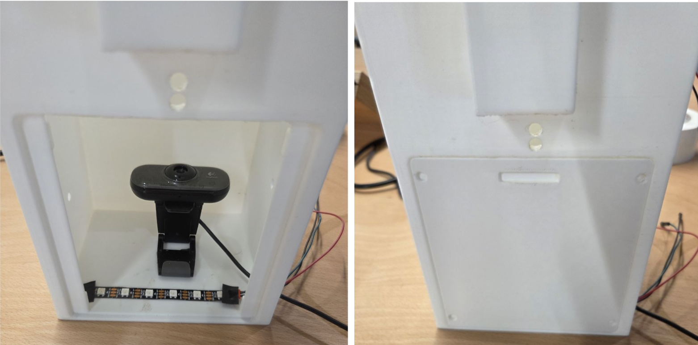
</div>

<p style="text-align:center; font-style:italic; font-size:0.9em;"><strong>Figure 65: USB Camera in the scanner box</strong></p>

The passport reader hardware went through two main design iterations before reaching its final form, with an additional refinement to the insertion interface. 

<div style="text-align: center; margin: 16px 0;">
  
</div>

<p style="text-align:center; font-style:italic; font-size:0.9em;"><strong>Figure 66: Initial Passport Cover Design</strong></p>


<div style="text-align: center; margin: 16px 0;">
  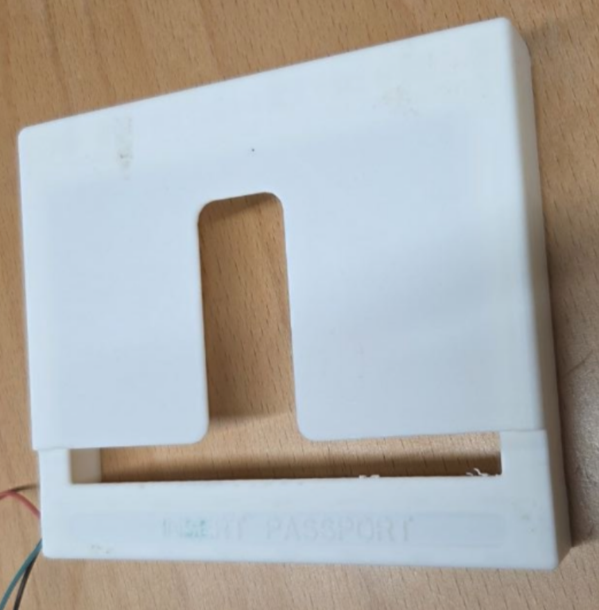
</div>

<p style="text-align:center; font-style:italic; font-size:0.9em;"><strong>Figure 67: Second Passport Cover Design</strong></p>

The first passport scanner top frame design iteration established the basic enclosure form but proved to be confusing.  A top cover was added to better suggest the correct insertion method for the second iteration. However, it also proved to be unintuitive in user testing. Participants consistently attempted to insert the passport vertically rather than in the intended orientation. The solution came from adding a clear acrylic panel beneath the slot. We also added a passport cover to the mock passport card. This made the flat insertion surface visible and immediately communicated to the guest that the passport should be laid flat and slid in horizontally in a particular orientation, which is further reinforced by visual cues on the screen. The feedback received was that the process is similar to the passport scanner at the airport. A refinement is to redesign the base of the passport scanner housing to better secure the positioning of the LED strip and camera.


<div style="text-align: center; margin: 16px 0;">
  
</div>

<p style="text-align:center; font-style:italic; font-size:0.9em;"><strong>Figure 68: Passport Scanner with clear acrylic</strong></p>


<div style="text-align: center; margin: 16px 0;">
  
</div>

<p style="text-align:center; font-style:italic; font-size:0.9em;"><strong>Figure 69: Revised Mock Passport Cover</strong></p>

The passport reader is mounted on the shelf structure facing the guest. When the AI agent reaches the identity verification stage, the ESP32, which is in wireless communication with the Jetson compute module through the router, triggers an LED strip positioned along the bottom edge of the flat insertion surface, closest to the guest. Once the guest name has been found in the database, the LED strip on the passport scanner will automatically light up and blink continuously in green as the AI avatar instructs the guest to insert their passport, drawing on the universal association of green with a ready or go signal to intuitively indicate that the slot is ready for use while ensuring visibility even in low-light environments. Once the passport details have been captured, the LED strip automatically turns off. A sticker indicating the correct insertion orientation was also designed to be added to the passport reader surface as a visual cue, further reinforcing the flat insertion direction for guests.


<div style="text-align: center; margin: 16px 0;">
  
</div>

<p style="text-align:center; font-style:italic; font-size:0.9em;"><strong>Figure 70: Passport Reader Visual Cue Sticker</strong></p>


<div style="text-align: center; margin: 16px 0;">
  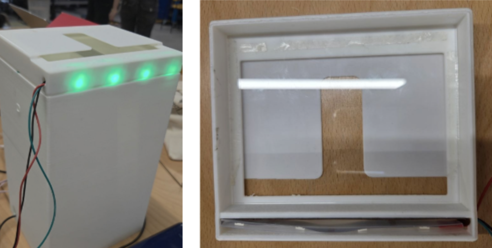
</div>

<div style="text-align: center; margin: 16px 0;">
  
</div>

<p style="text-align:center; font-style:italic; font-size:0.9em;"><strong>Figure 71: Green LED to Enhance User Experience                Figure 72: LED flash</strong></p>

Another LED strip connected to the ESP32 also serves a functional role in the Optical Character Recognition (OCR) pipeline. As shown in Figure 73, the illumination provided by the LED flash improves image clarity and MRZ contrast, directly improving OCR accuracy under the varying lighting conditions typical of hotel lobbies.

<div style="text-align: center; margin: 16px 0;">
  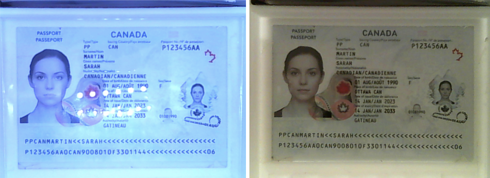
</div>

<p style="text-align:center; font-style:italic; font-size:0.9em;"><strong>Figure 73: Lighting enhancements for passport scanning (before and after)</strong></p>

How It Works

Once the passport is presented to the scanner, the system enters a polling loop that repeatedly acquires frames until a successful Machine Readable Zone (MRZ) is obtained from the captured image. The recognition pipeline is built around EasyOCR and is tailored to the ICAO 9303 TD3 passport format, which defines the two-line MRZ used in standard passport booklets. Rather than relying on a single raw capture, the system evaluates candidate frames and applies several preprocessing variants, including sharpening, grayscale conversion, and contrast enhancement. These generate multiple OCR hypotheses, which are merged using a confidence-weighted voting stage to improve robustness.


<div style="text-align: center; margin: 16px 0;">
  
</div>

<p style="text-align:center; font-style:italic; font-size:0.9em;"><strong>Figure 74: Machine Readable Zone (Sample)</strong></p>

EasyOCR operates through two underlying neural components: a text detection model to localise text regions and a text recognition model to decode the detected text. In the passport pipeline, the detection stage is first applied to the preprocessed passport image to identify candidate text regions. The pipeline then applies TD3-aware structural heuristics to identify the two MRZ lines based on their expected format. Once identified, their union is cropped into a focused strip, deskewed, and processed across several image variants. EasyOCR's recognition model is then applied to these variants, and the final passport number and guest name are extracted only from the vote-winning MRZ lines, with checksum validation used to reject invalid readings.

Testing

Passport OCR accuracy was evaluated across three test passports with distinct MRZ layouts and print qualities. Since all test standard passport booklets conform to the same ICAO 9303 TD3 format, the critical variable for OCR performance is not the diversity of passports but the consistency of extraction under varying imaging conditions.

The LED strip provides consistent illumination of the passport surface during scanning. Flash illumination was found to improve MRZ contrast and OCR accuracy compared to ambient lighting alone. Insertion angle was not a variable because the enclosure mechanically constrains the passport to a fixed flat orientation relative to the camera, deliberately reducing the degrees of freedom the pipeline needs to handle. However, occasional slight tilting of the inserted passport is handled through deskewing in the preprocessing pipeline.

EasyOCR's model initialisation introduced a noticeable cold-start delay, resolved by loading the model at program startup in parallel with the kiosk UI so guests experience no perceptible wait. Occasional OCR substitutions between visually similar characters (e.g. "H" and "M") are handled downstream through fuzzy string matching against existing guest records, with the AI concierge confirming the closest candidate conversationally. 


<a id="7-5-2-nfc-payment"></a>

### 7.5.2 NFC Payment

The NFC payment module was designed to simulate the contactless payment step within the check-in flow. The hardware consists of an ESP32 microcontroller paired with a PN532 NFC module, housed in a custom 3D-printed enclosure mounted on the robot body (Figure 75). 


<div style="text-align: center; margin: 16px 0;">
  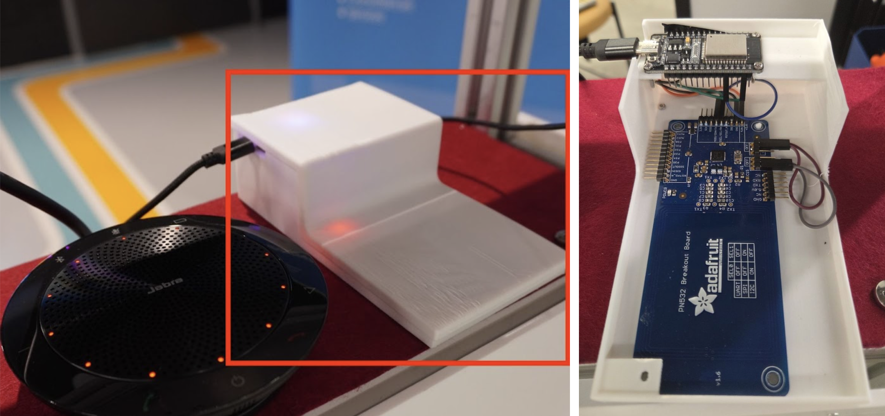
</div>

<p style="text-align:center; font-style:italic; font-size:0.9em;"><strong>Figure 75: NFC Payment Module</strong></p>

A sticker was designed to be added to the NFC reader surface as a visual cue, allowing guests to immediately identify the tap point without verbal instruction, improving intuitiveness of the interaction.


<div style="text-align: center; margin: 16px 0;">
  
</div>

<p style="text-align:center; font-style:italic; font-size:0.9em;"><strong>Figure 76: Visual que sticker for the NFC Payment Module</strong></p>

The enclosure was designed to position the NFC reader at a natural tap height for the guest, with an integrated LED indicator that provides visual feedback when a card is detected.


<div style="text-align: center; margin: 16px 0;">
  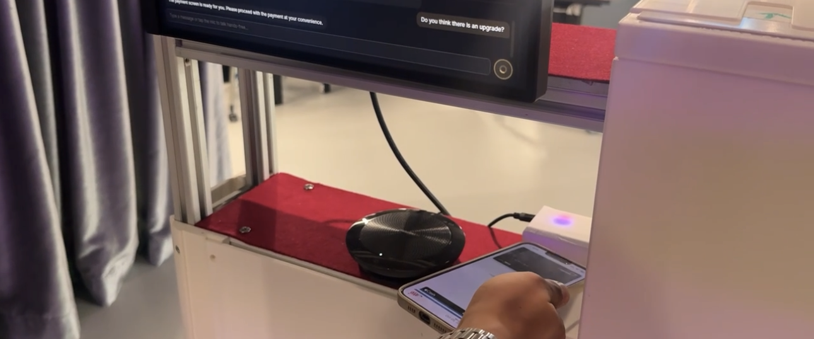
</div>

<p style="text-align:center; font-style:italic; font-size:0.9em;"><strong>Figure 77: Guest Making Card Payment</strong></p>

When the AI agent reaches the payment step in the conversation, it triggers a payment overlay on the kiosk screen and verbally invites the guest to tap their card. The ESP32 detects the card's unique identifier and transmits it to the backend via USB serial, which then maps the identifier to a card's last four digits for on-screen confirmation. The detection-to-confirmation cycle was measured at under one second during testing, ensuring the payment step does not interrupt the conversational flow.


<div style="text-align: center; margin: 16px 0;">
  
</div>

<p style="text-align:center; font-style:italic; font-size:0.9em;"><strong>Figure 78: NFC Flow</strong></p>

It is important to note that the current prototype does not process real transactions. The NFC reader captures card identifiers as a proof of concept to validate the interaction design and the integration of a physical tap gesture within a voice-led check-in flow. The design decision to use contactless NFC over alternative payment methods (such as QR code scanning or on-screen card entry) was driven by minimising guest effort: a single tap requires no visual attention or manual input, allowing the guest to maintain eye contact with the avatar and stay within the conversational experience.

Testing

During development, we explored two communication modes between the ESP32 and the backend. The final prototype uses a direct USB serial connection to the Jetson compute module, which proved more reliable and lower-latency than an earlier WiFi-based approach that transmitted identifiers over the local network. The WiFi mode, which we decided not to go with, included AES-128-CBC encryption to prevent UID spoofing, which was useful but unnecessary once all hardware was co-located on the robot. With all of this said, we recognise that this is ultimately a prototype. A production deployment would replace the ESP32/PN532 setup with an industry-grade payment terminal capable of processing real transactions securely, with full regulatory compliance and integration with hotel payment gateways.

Testing was conducted with multiple NFC-enabled cards and mobile wallets to verify consistent and reliable detection across different card types. We also verified the auto-close behaviour, where the serial listener stops after the first successful tap to prevent duplicate registrations. 

<a id="7-6-electrical-configuration-and-integration"></a>

## 7.6 Electrical Configuration and Integration

With all components — the WiFi router, Jetson Orin Nano, LED monitor, and ESP-32 — set up individually, the next challenge was establishing a common power source that would allow the prototype to operate without any connection to wall sockets, which would otherwise constrain the AMR's freedom of movement. Opening the SESTO Magnus control panel revealed a user power outlet using a D-Sub type connector, labelled as port 7 in Figure 79, capable of supplying 48V DC at a maximum of 20A. The close-up of this connector is shown in Figure 80

<div style="text-align: center; margin: 16px 0;">
  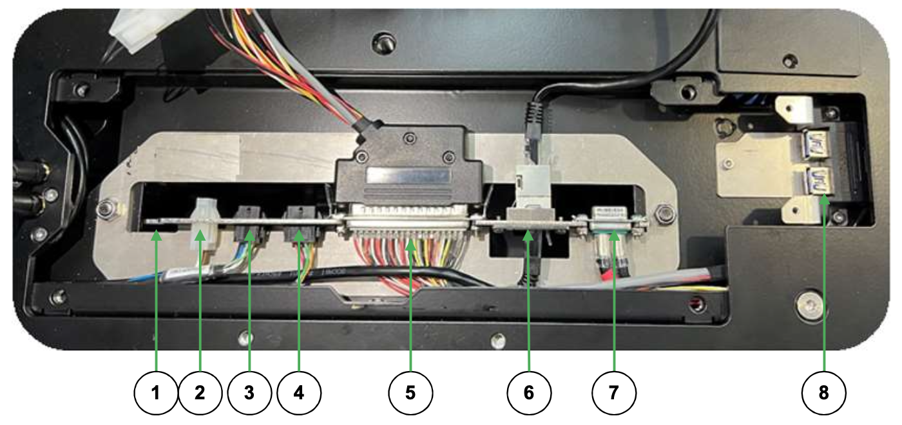
</div>

<div style="text-align: center; margin: 16px 0;">
  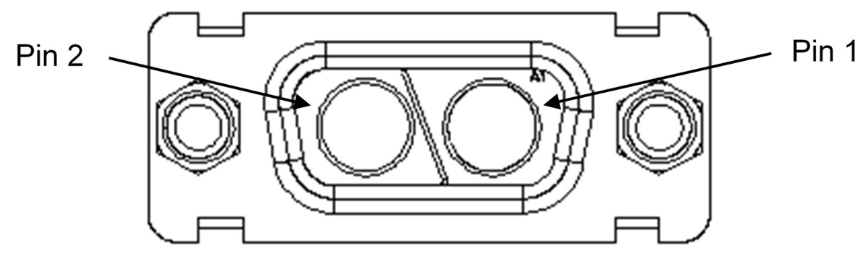
</div>

To draw power from this outlet, we procured an Amphenol CONEC 302W2CPXX41A10X connector and its corresponding housing (Figures 81 and 82).

<div style="text-align: center; margin: 16px 0;">
  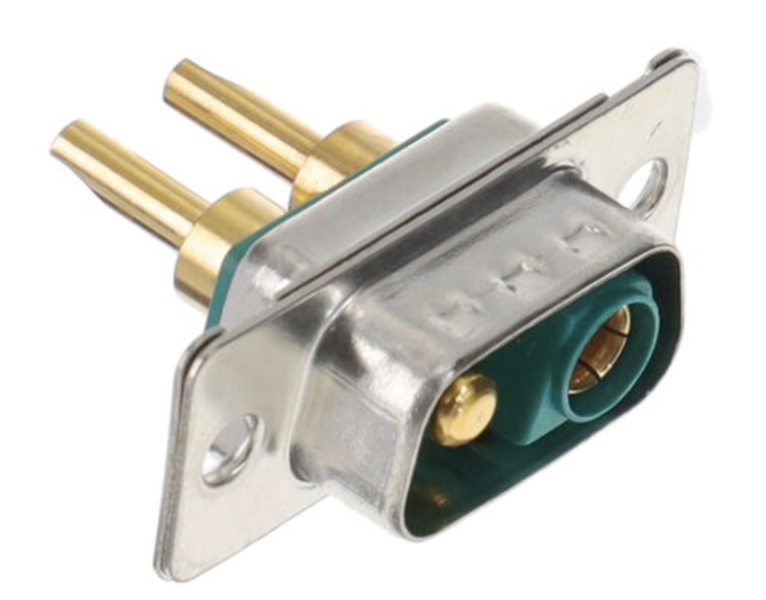
</div>

<div style="text-align: center; margin: 16px 0;">
  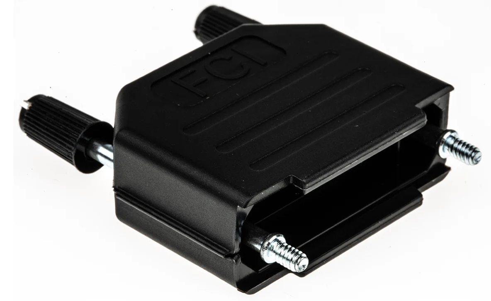
</div> 

With the source voltage and maximum current established, we identified the input voltage requirements for each component as summarised in Table 15 below.


| Component                 | Source/ Input Voltage | Current | Step-Down Required |
| ------------------------- | --------------------- | ------- | ------------------ |
| SESTO Magnus AMR (Output) | 48V DC                | 20A max |                    |
| Jetson Orin Nano          | 19V DC                | 2.37A   | 48V to 19V         |
| ESP-32                    | 5 to 9V DC            | 1.5A    | 48V to 5V          |
| WiFi Router               | 12V DC                | 2A      | 48V to 12V         |
| LED Monitor               | 19V DC                | 240mA   | 48V to 19V         |


<p style="text-align:center; font-style:italic; font-size:0.9em;"><strong>Table 15: Power Requirements of Prototype Components</strong></p>

Since the components required different input voltages stepped down from the 48V source, we procured fixed and variable buck converters accordingly. AWG18 wiring, rated for 5 to 10A, was used throughout as it was more than sufficient for the load requirements. Component-specific input connectors were soldered to the wiring and connected to the respective buck converters, as shown in Figure 83

<!-- image pending -->


<div style="text-align: center; margin: 16px 0;">
  
</div>

<p style="text-align:center; font-style:italic; font-size:0.9em;"><strong>Figure 83: Wiring of Buck Converter</strong></p>

All wired components were then consolidated using Wago 221 push-in wire clamp terminals, allowing every component to draw power from the single AMR source through one unified connection point. An example of the wiring assembly is shown in Figure XX.

<!-- image pending -->


<div style="text-align: center; margin: 16px 0;">
  
</div>

<p style="text-align:center; font-style:italic; font-size:0.9em;"><strong>Figure 84: Wago Connections</strong></p>

<a id="7-6-1-testing-of-components"></a>

### 7.6.1 Testing of Components

Each wired connection was tested individually using a DC bench power supply and a multimeter to verify connection stability, solder joint integrity, and output voltage accuracy against each component's input requirement. Once all connections were confirmed, the full assembly was plugged into the SESTO Magnus AMR and powered on to verify that all components functioned correctly and that no components exhibited abnormal heat buildup.

<a id="7-7-integration-with-hotel-system-architecture"></a>

## 7.7 Integration with Hotel System Architecture

<a id="hotel-data-layer"></a>

### Hotel Data Layer

A key architectural decision was how to handle hotel data. Integrating with a proprietary Property Management System like Oracle Opera would require vendor partnerships and API licensing beyond the scope of this project. Instead, we built our own hotel data layer using Supabase (a hosted PostgreSQL database with REST API), modelling the core entities a PMS would contain: hotel information, guests, rooms, reservations, room upgrades, and check-in logs. This gave us full control over the data model while demonstrating that our system architecture could interface with any PMS through a similar abstraction layer.


<div style="text-align: center; margin: 16px 0;">
  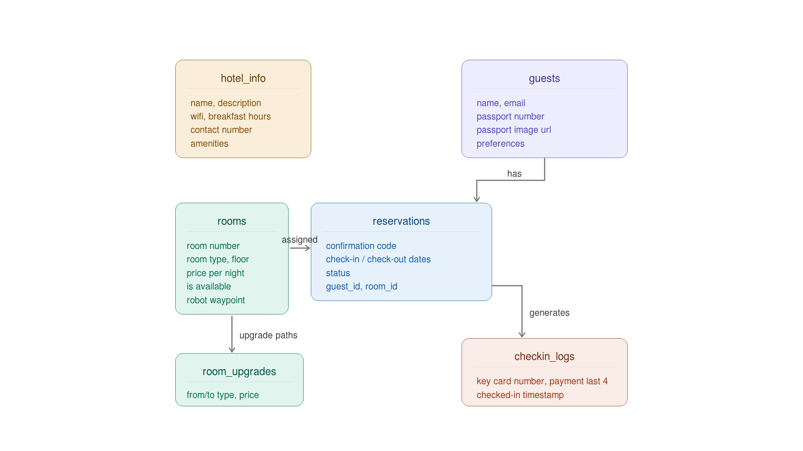
</div>

<p style="text-align:center; font-style:italic; font-size:0.9em;"><strong>Figure 85: Simple entity-relationship diagram showing the hotel data schema</strong></p>

Critically, every service function falls back to comprehensive in-memory mock data when Supabase is not configured. This means the entire system runs fully functional without any external database, a deliberate choice that made testing, demos, and local development frictionless. The mock dataset models a fictional "Grand Azure Hotel" in Singapore with realistic reservations, room types, upgrade paths, and guest profiles, to mimic what a luxury hotel with 80 rooms will have.

<a id="ai-to-hotel-data-bridge"></a>

### AI-to-Hotel-Data Bridge

The AI agent accesses hotel data exclusively through its function-calling tools, which map directly to backend service functions. When the agent calls `lookup_reservation_by_name`, the backend queries the database and returns the result as structured data. The AI never sees raw database queries or internals. It operates on a clean interface. This separation ensures the agent cannot fabricate reservation details or room availability; every factual claim in the conversation is grounded in the data layer.

<a id="robot-navigation"></a>

### Robot Navigation

Post-check-in room escort is handled by mapping room IDs to robot waypoints in the Sesto fleet management system. When the AI agent's `move_to_room` tool is called, the backend looks up the corresponding waypoint and sends a navigation command to the Sesto API. If the API is unavailable, the system logs a mock navigation event and returns success, maintaining the end-to-end flow for testing purposes.


<a id="digital-key-delivery"></a>

### Digital Key Delivery

The decision to issue a digital room key rather than a physical keycard was driven by two factors. First, physical keycard dispensing requires dedicated encoding hardware integrated into the robot, adding mechanical complexity and a potential point of failure to a mobile platform. A digital key delivered via email eliminates this dependency entirely. Second, guest expectations are shifting toward contactless access: a joint survey by Skift and Oracle Hospitality (2025) found that over 60% of hospitality executives expected fully contactless check-in and room key delivery to become standard, while 34.4% of guests identified using their own device for hotel access as a must-have (Skift & Oracle, 2025). For the prototype, digital delivery also allowed us to demonstrate the complete check-in flow without sourcing proprietary keycard encoding equipment.

Upon check-in completion, the backend generates a digital room key delivered via email. If Apple Wallet signing certificates are configured, a `.pkpass` file is generated containing the room number, floor, check-in/out dates, and a barcode. This is emailed to the guest using a branded HTML template. The entire pipeline is non-blocking, as the check-in response returns immediately with the key card number while email delivery happens in the background, ensuring the guest experience is not delayed.

<a id="end-to-end-integration-testing-of-subsystems"></a>

### End-to-End Integration Testing of Subsystems

We tested the fully integrated system across three configurations of increasing fidelity.

The first configuration was full-stack local with mock data, serving as our primary development and iteration environment. All services ran locally with in-memory mock data, no external database or hardware required. This configuration allowed rapid iteration on the AI agent's behaviour, UI transitions, and tool-calling logic. We verified every check-in step end-to-end, from welcome through farewell, confirming that the AI agent correctly orchestrated all transitions and that mock passport scans, NFC taps, and payment processing behaved identically to their real counterparts.

The second configuration connected the backend to a live Supabase instance seeded with test data. This verified that reservation lookups, fuzzy name matching, passport image uploads, and room upgrade queries worked correctly against a real database, and that the data normalisation layer (converting between database and frontend conventions) produced consistent results.

The third configuration was hardware-in-the-loop deployment on the NVIDIA Jetson mounted on the Sesto robot, with the live USB camera for passport scanning (EasyOCR engine) and the ESP32 NFC reader connected via USB serial. We conducted end-to-end check-ins with test passports and NFC card taps, verifying the complete flow from physical interaction through AI processing to digital key delivery. Key findings from this configuration included the importance of LED flash calibration for consistent passport scanning and the need for the serial listener auto-close behaviour to prevent duplicate NFC registrations.

<a id="8-feedback-and-validation"></a>

# 8 Feedback and Validation

To evaluate the final solution concept and gather actionable feedback for further development, we conducted validation activities across four complementary methods: open-house user testing with members of the public at NUS, hotel feedback sessions, expert review, and a structured survey. Together, these methods provided both qualitative depth and quantitative signal on the solution's reception, feasibility, and priority areas for refinement.

<a id="8-1-user-testing-at-nus-open-house"></a>

## 8.1 User Testing at NUS Open House


<div style="text-align: center; margin: 16px 0;">
  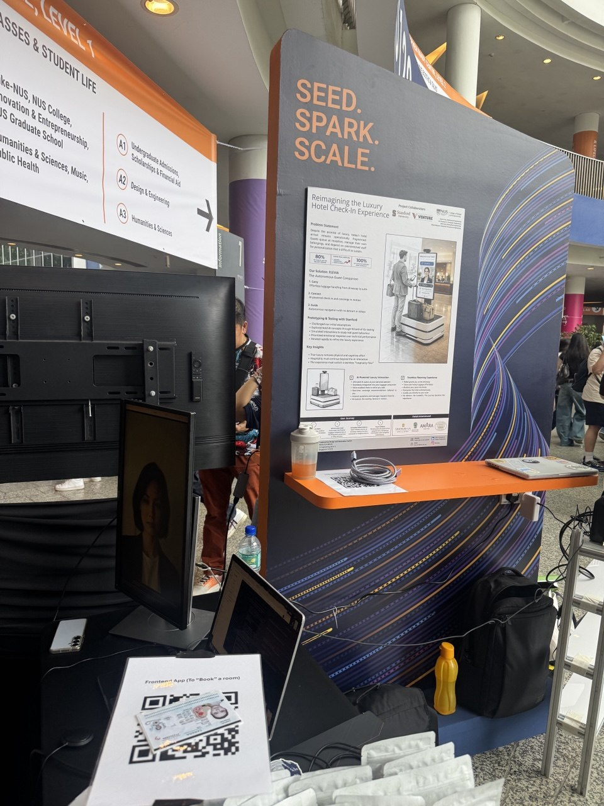
</div>


<div style="text-align: center; margin: 16px 0;">
  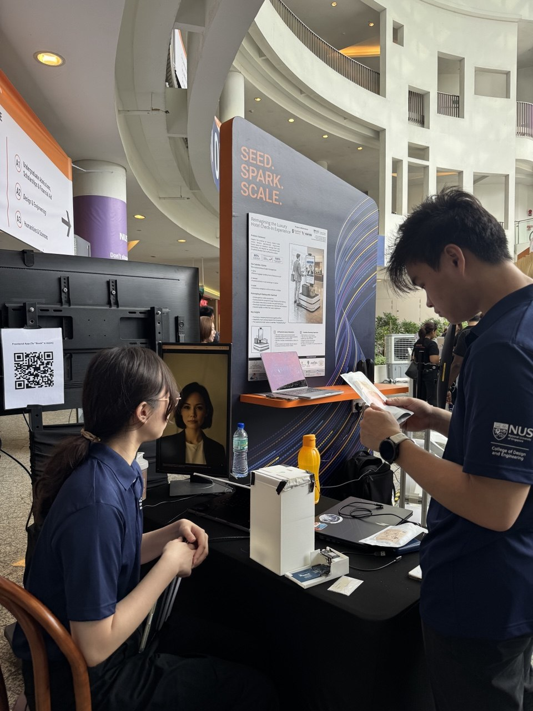
</div>

  **Figure 87 and Figure 88: Our booth at NUS Open House     **                                                

<a id="8-1-1-methodology"></a>

### 8.1.1 Methodology

User testing was conducted on 7 March 2026 at the NUS Open House. 15 participants completed the full seven-step check-in prototype, from the welcome screen through to keycard delivery. We logged step-completion outcomes and behavioural observations in real time, supplemented by a post-session questionnaire capturing Likert-scale ratings and open-ended feedback.

Our AMR component was not deployed at this stage. Testing was scoped exclusively to the AI avatar check-in interface, evaluating step intuitiveness, voice interaction, and overall usability. The full end-to-end flow including AMR guest escort is planned for a subsequent testing phase once a suitable deployment environment can be secured.

<a id="8-1-2-participant-profile"></a>

### 8.1.2 Participant Profile

All 15 participants fell within the 14 to 30 age range, distributed as follows: 4 participants aged 14 to 20, 7 aged 21 to 25, and 4 aged 26 to 30 This skews toward a digitally native cohort with high baseline comfort around kiosk interfaces and AI interactions. In terms of accommodation habits, the majority reported frequenting 4-star and 5-star hotels, with a smaller proportion using Airbnb or budget accommodation. Two participants reported experience with 6-star properties, reflecting a range of expectations around what 'luxury' service means.

<a id="8-1-3-key-findings"></a>

### 8.1.3 Key Findings

Each of the seven prototype steps was logged for one of 3 outcomes: the participant completed the step without any assistance ('Completed Unprompted'), required a verbal or physical prompt from us ('Needed Hint'), or was unable to proceed regardless of assistance ('Failed / Could Not Proceed'). The table below summarises these outcomes across all 15 participants.


| Step                             | Unprompted | Needed Hint | Failed | Key Observation                                                                                                                 |
| -------------------------------- | ---------- | ----------- | ------ | ------------------------------------------------------------------------------------------------------------------------------- |
| Step 1: Welcome Screen           | **11**     | **4**       | 0      | Some users briefly hesitated at initiation, unclear how to begin.                                                               |
| Step 2: Voice Interaction        | **11**     | **4**       | 0      | Open-house noise caused automatic speech recognition (ASR) failures; response latency created uncertainty and some frustration. |
| Step 3: Passport Scan            | **3**      | **12**      | 0      | 80% needed guidance on this Wrong orientation or slot; no physical affordance to direct users.                                  |
| Step 4: Reservation Confirmation | **13**     | **2**       | 0      | Strongest step. Minor AI lag for some users.                                                                                    |
| Step 5: Upgrade Offer            | **11**     | **2**       | **2**  | Mostly skipped by users which was expected behaviour. Those that tried generally found it smooth.                               |
| Step 6: Payment                  | **8**      | **5**       | **2**  | Tap point somewhat unclear; 2 sessions had screen render failures.                                                              |
| Step 7: Keycard / Farewell       | **5**      | **7**       | **3**  | Highest failure rate, email lost in spam mailbox                                                                                |


<p style="text-align:center; font-style:italic; font-size:0.9em;"><strong>Table 16: Key Findings broken down into various steps</strong></p>

<a id="8-1-4-pain-points"></a>

### 8.1.4 Pain Points

Microphone performance was raised in 9 of 15 sessions, users described the AI as stopping mid-interaction or failing to register speech, with no visual feedback to indicate whether input had been received. Requests included push-to-talk and a visible recording indicator. Passport scan orientation was the most frequent single-step failure (12 of 15), consistently caused by missing physical affordances. A smaller cluster of users (3 of 15 noted that instructional text was too small, the avatar face too dominant, and that speaking aloud to a screen in a public setting felt socially awkward.

**8.1.5 Positive Signals**

Speed and convenience were the most consistently praised aspects, raised in roughly 10 of 15 sessions. Multiple users independently highlighted late-night check-in (e.g., arrivals at 2–3am) as a particularly compelling advantage. Four users independently noted a preference for the AI Avatar precisely because it eliminated social interaction, an introverted-appeal angle that emerged without any prompting represented a genuine differentiator. Despite the voice-related issues, several users praised the AI’s conversational quality. Notably, one user observed that the avatar correctly identified an intentionally false last name, suggesting that the underlying model performs well when the audio pipeline is not a limiting factor.

<a id="8-1-6-summary-and-design-recommendations"></a>

### 8.1.6 Summary and Design Recommendations

The prototype was well received, with 73% rating it better than a traditional front desk and 80% indicating they would use it again. Navigation clarity, scoring 4.67 out of 5, suggests that the step logic is sound. However, the three main issues of microphone performance, passport scanner affordance, and keycard delivery remain key barriers to a seamless end to end experience and should be prioritised in the next iteration.

Qualitative feedback also revealed strong positioning opportunities, including appeal to introverted users, 24/7 availability, and the perception of technology as a marker of luxury, all of which emerged organically from users rather than being prompted by the team.

<a id="8-2-hotel-feedback"></a>

## 8.2 Hotel Feedback

To validate the final robot concept against real operational constraints, we conducted structured site visits and feedback sessions with upper-upscale hotel operators in Singapore.

<a id="8-2-1-methodology"></a>

### 8.2.1 Methodology

Each session involved a walkthrough presentation of the proposed solution, followed by an open discussion with property management and operations staff on feasibility, guest experience, privacy, and commercial considerations. 

<a id="8-2-2-the-ascott-limited"></a>

### 8.2.2 The Ascott Limited

Property Profile

Hotel visits were conducted with two properties under The Ascott Limited: Citadines Rochester and lyf One-North. Both were selected for their technology-forward focus relative to traditional luxury hotels.


<div style="text-align: center; margin: 16px 0;">
  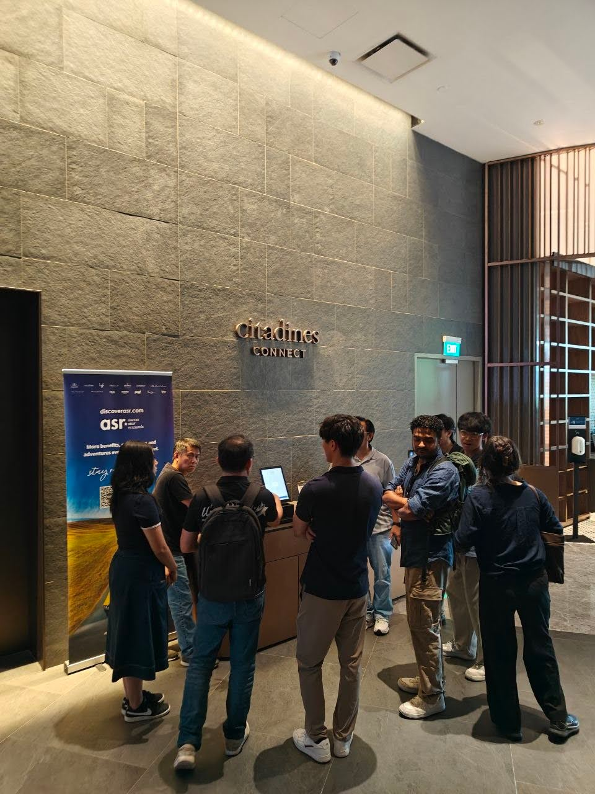
</div>


<div style="text-align: center; margin: 16px 0;">
  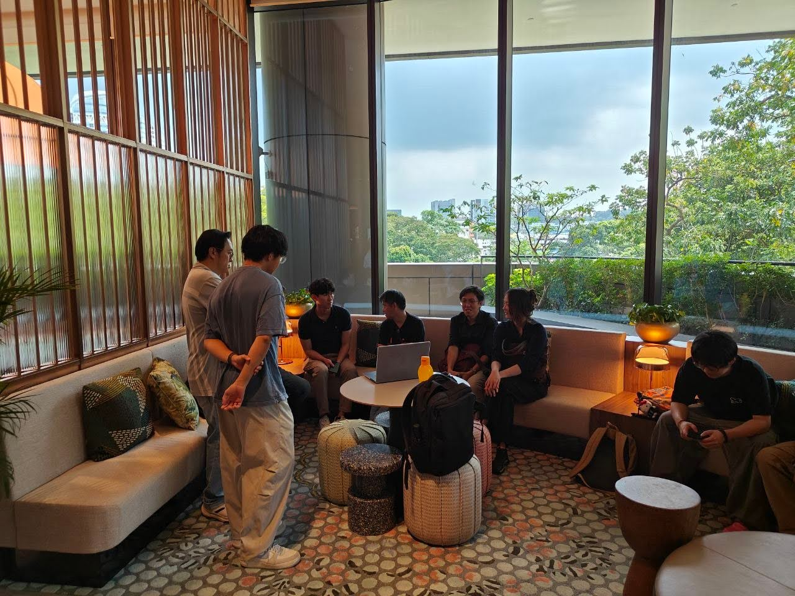
</div>

<p style="text-align:center; font-style:italic; font-size:0.9em;"><strong>Figure 89 & 90: Our Visit to Ascott Limited Properties</strong></p>

Key Findings


<table class="rt">
  <thead><tr><th>#</th><th>Key Finding</th></tr></thead>
  <tbody>
    <tr>
      <td class="rt-num" style="vertical-align:top; padding-top:13px;">1</td>
      <td>
        <div class="rt-head">Technical Feasibility</div>
        <ul>
          <li>The property's existing delivery robot confirms that the core technical infrastructure — autonomous lift integration, navigation, and room guidance — is already commercially deployed and operational</li>
          <li>Lift integration remains expensive and technically complex, flagging a key implementation constraint</li>
        </ul>
      </td>
    </tr>
    <tr>
      <td class="rt-num" style="vertical-align:top; padding-top:13px;">2</td>
      <td>
        <div class="rt-head">Privacy &amp; Guest Comfort</div>
        <ul>
          <li>The robot verbally confirming guest identity or room details in shared spaces risks exposing personal data to bystanders, raising PDPA concerns</li>
          <li>The robot looking at and walking alongside guests was described as unsettling — proximity choreography and movement design require careful refinement</li>
        </ul>
      </td>
    </tr>
    <tr>
      <td class="rt-num" style="vertical-align:top; padding-top:13px;">3</td>
      <td>
        <div class="rt-head">Solution Architecture</div>
        <ul>
          <li>Check-in AI and luggage assistance should be designed as separate, modular functions, allowing guests to opt into each component independently</li>
          <li>AI interaction itself is not a concern — guests are comfortable with AI — but responses must be relevant and contextually appropriate</li>
          <li>Placement and first-impression visibility are critical to adoption: the robot must be positioned such that guests encounter it naturally upon arrival, or it risks being bypassed entirely</li>
        </ul>
      </td>
    </tr>
    <tr>
      <td class="rt-num" style="vertical-align:top; padding-top:13px;">4</td>
      <td>
        <div class="rt-head">Commercial Considerations</div>
        Any proposed solution must demonstrate a credible ROI to qualify for funding through the CapitaLand Innovation Fund (SGD 50 million) or the Ascott Fund.
      </td>
    </tr>
  </tbody>
</table>


<p style="text-align:center; font-style:italic; font-size:0.9em;"><strong>Table 17: Key Findings from Our Visit to Ascott Limited Properties</strong></p>

<a id="8-3-expert-review"></a>

## 8.3 Expert Review

To complement feedback from hotel visits and public testing, we sought an expert perspective grounded in hospitality academia and industry practice.

<a id="8-3-1-methodology"></a>

### 8.3.1 Methodology

An expert consultation was conducted with Dr Natt Srinara, Lecturer at Ecole hôtelière de Lausanne (EHL) Hospitality Business School, with over 25 years of experience in hospitality consulting, marketing, and guest experience strategy. His advisory portfolio includes Mandarin Oriental, Pan Pacific, IHG, Marriott, Accor, and the Singapore Tourism Board. The session involved a presentation of the team's final solution concept followed by a structured discussion on hospitality design principles, luxury guest expectations, and AI adoption frameworks. 

<div style="text-align: center; margin: 16px 0;">
  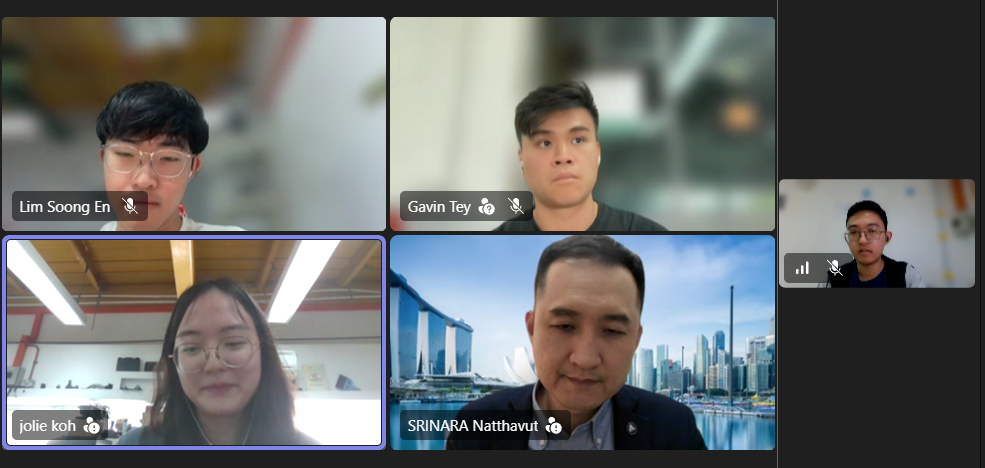
</div>

<p style="text-align:center; font-style:italic; font-size:0.9em;"><strong>Figure 91: Online Meeting with Dr Natt Srinara</strong></p>

<table class="rt">
  <tbody>
    <tr>
      <td>
        <ul>
          <li>AI adoption should be stratified by hotel tier: luxury guests expect human-led interactions with AI in a supporting role, while budget guests are more receptive to AI-led self-service, reinforcing our decision to position the robot as a warm, conversational companion rather than a transactional kiosk</li>
          <li>The luggage-handling function was identified as particularly valuable for family-oriented stays, validating its inclusion as a core feature</li>
          <li>The AI avatar face was flagged as potentially unnatural and discomforting</li>
          <li>The robot should be designed as a complement to human staff, not a replacement — the absence of any human touchpoint in the arrival journey risks undermining the luxury standard in higher-end properties</li>
        </ul>
      </td>
    </tr>
  </tbody>
</table>

<p style="text-align:center; font-style:italic; font-size:0.9em;"><strong>Table 18: Key Findings from Our Meeting with the Expert</strong></p>
	  
The expert review reinforced the core design premise: that automation in luxury hospitality must augment rather than replace human warmth. Dr Srinara suggested a pivot towards a tiered adoption framework that positions the solution as most appropriate for mid-to-upper tier properties rather than ultra-luxury settings.

<a id="8-4-real-world-navigation-testing"></a>

## 8.4 Real-World Navigation Testing

To complement the controlled environment of the NUS Open House testing, we conducted a real-world navigation trial in public spaces to observe how people naturally respond to the robot in shared environments. The objective was to understand pedestrian behaviour around the robot, assess comfort levels with robot proximity, and identify design considerations for movement choreography.

<a id="8-4-1-lift-testing"></a>

### 8.4.1 Lift Testing

The first round of testing was conducted in a lift environment, during which the robot interacted with a sample of roughly 100 members of the public.

  

<div style="text-align: center; margin: 16px 0;">
  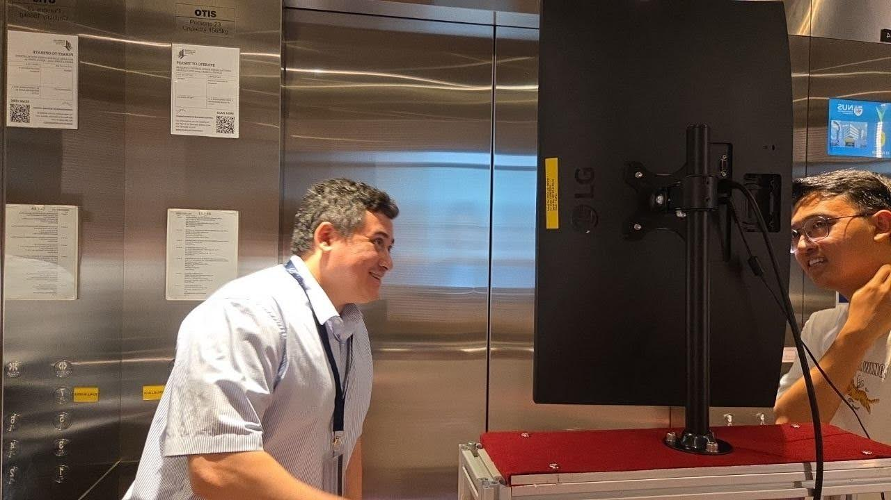
</div>

<p style="text-align:center; font-style:italic; font-size:0.9em;"><strong>Figure 92: A participant interacting with ELEVIA</strong></p>


<div style="text-align: center; margin: 16px 0;">
  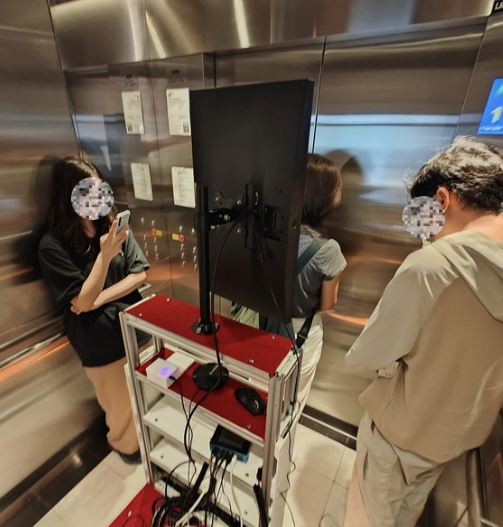
</div>


<div style="text-align: center; margin: 16px 0;">
  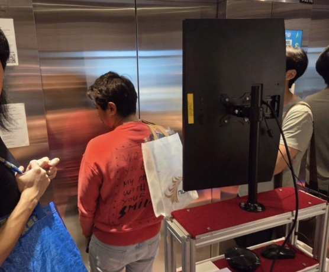
</div>

<p style="text-align:center; font-style:italic; font-size:0.9em;"><strong>Figure 93 and Figure 94: Participants sharing a lift with ELEVIA. (Right Image) The participant in red visibly displaying discomfort and positioning close to the door, eager to exit</strong></p>


<table class="rt">
  <thead><tr><th>Response Patterns from Lift Testing</th></tr></thead>
  <tbody>
    <tr>
      <td>
        Three distinct response patterns emerged:
        <ul>
          <li>The majority of participants were initially surprised, then quickly became curious and engaged</li>
          <li>Fewer than 2% refused to enter the lift with the robot present, choosing to wait for the next lift instead</li>
          <li>A smaller subset showed visible discomfort, facing away from the robot and standing close to the door, signalling an anxious desire to exit</li>
        </ul>
      </td>
    </tr>
  </tbody>
</table>


<p style="text-align:center; font-style:italic; font-size:0.9em;"><strong>Table 19: Response Patterns from Lift Testing</strong></p>

When the robot was repositioned to face the back wall of the lift, participants were markedly more comfortable, took up more space, and displayed less anxious behaviour. This suggests that direct eye contact with the robot's AI avatar face, rather than the robot's physical presence alone, was the primary source of discomfort, a finding consistent with the uncanny valley concerns raised during the expert review and NUS Open House testing.

  

<div style="text-align: center; margin: 16px 0;">
  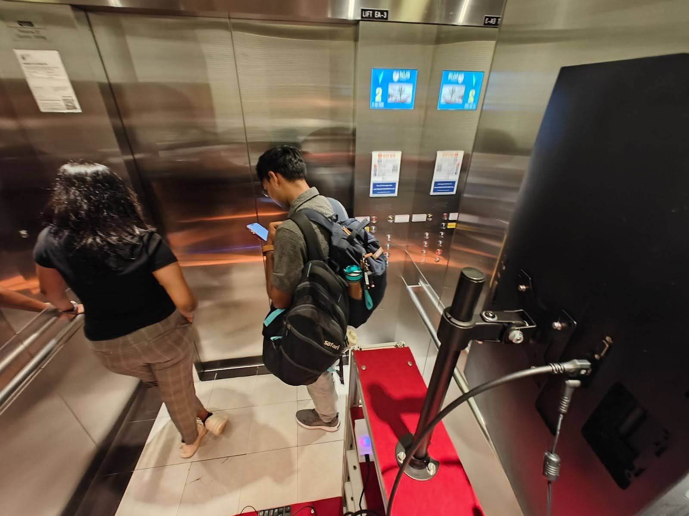
</div>

<p style="text-align:center; font-style:italic; font-size:0.9em;"><strong>Figure 95: Robot repositioned to face the back wall of the lift — participants visibly more comfortable, occupying more space and displaying less anxious behaviour</strong></p>

When the robot was repositioned to face the back wall of the lift, the response changed noticeably. Participants were markedly more comfortable, took up more space in the lift, and displayed less anxious behaviour. This suggests that the direction the robot faces has a significant effect on perceived intrusiveness and social comfort.

<a id="8-4-2-corridor-navigation-testing"></a>

### 8.4.2 Corridor Navigation Testing

A second round of navigation testing was conducted in the open corridors and common areas of NUS, where the robot encountered approximately 10 pedestrians per minute. We wanted to observe how members of the public responded to the robot moving through shared space. 


<div style="text-align: center; margin: 16px 0;">
  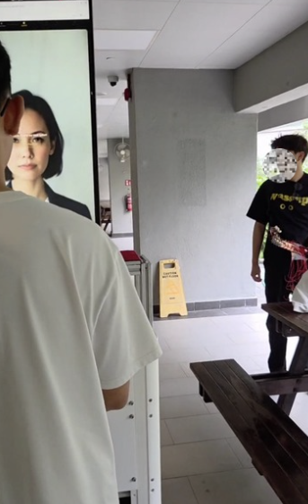
</div>


<div style="text-align: center; margin: 16px 0;">
  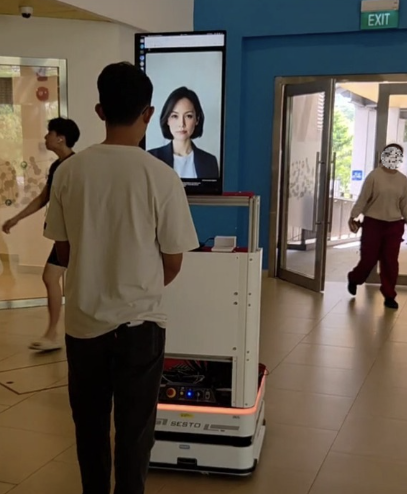
</div>

<p style="text-align:center; font-style:italic; font-size:0.9em;"><strong>Figure 96 and Figure 97: Real-world corridor navigation testing. (left) A passerby waiting patiently for ELEVIA to pass, (right) pedestrians instinctively moving aside to make way for the robot</strong></p>


<table class="rt">
  <tbody>
    <tr>
      <td>
        <ul>
          <li>Pedestrians consistently moved out of the robot's path without instruction or prompting; another held doors open to allow it through</li>
          <li>Most bystanders showed no signs of discomfort or over-curiosity</li>
          <li>No instances of confusion about the robot's intended direction of travel were observed, suggesting its movement cues were intuitive even in high-footfall environments</li>
        </ul>
      </td>
    </tr>
  </tbody>
</table>

<p style="text-align:center; font-style:italic; font-size:0.9em;"><strong>Table 20: Response Patterns from Corridor Navigation Testing</strong></p>

<a id="8-4-3-key-findings"></a>

### 8.4.3 Key Findings

<table class="rt">
  <tbody>
    <tr>
      <td>
        <ul>
          <li>Public reception was broadly positive, with curiosity and excitement as the dominant initial reactions — the robot's presence reads as novel and engaging rather than threatening in most contexts</li>
          <li>The minority refusal rate in the lift highlights that a meaningful minority will be uncomfortable sharing enclosed spaces with a robot</li>
          <li>Robot orientation is a significant variable in perceived comfort — facing away from people in enclosed spaces substantially reduces social discomfort, a finding that directly informs proximity choreography design</li>
          <li>Pedestrians naturally and instinctively accommodate the robot in shared spaces, indicating that corridor navigation is unlikely to pose a significant social barrier in hotel environments</li>
        </ul>
      </td>
    </tr>
  </tbody>
</table>

<p style="text-align:center; font-style:italic; font-size:0.9em;"><strong>Table 21: Key Findings from Corridor Navigation Testing</strong></p>

<a id="8-5-survey-testing"></a>

## 8.5 Survey Testing

To evaluate user adoption, a structured guest survey was administered to validate luggage handling as a recognised pain point among hotel guests and to gather initial reception data on the personal luggage companion robot concept. 

<a id="8-5-1-methodology"></a>

### 8.5.1 Methodology

The survey was therefore scoped to test luggage handling pain points, covering travel habits, arrival experience, concept appeal, trust and privacy concerns, and likelihood of use.

<a id="8-5-2-participant-profile"></a>

### 8.5.2 Participant Profile

32 participants across a range of travel profiles. 68.8% stayed in 4–5 star hotels between 3–10 times per year, and 53.1% typically travel with two or more checked bags, establishing a relevant sample for the problem being investigated. Travel purposes spanned leisure, business, family, and mixed-purpose travel. 

<a id="8-5-3-key-findings"></a>

### 8.5.3 Key Findings

When asked to consider luggage-related pain points during hotel arrivals, friction surfaced consistently despite most respondents rating their overall arrival experience as smooth. Heavy lifting was the most widely cited pain point at 59.4%, followed by waiting for luggage in the room (34.4%) and lack of location visibility during transit (25%). These findings align with review analysis in Section 4.4, where luggage handling scored the lowest service dimension at 3.37 out of 5.0.

  

<div style="text-align: center; margin: 16px 0;">
  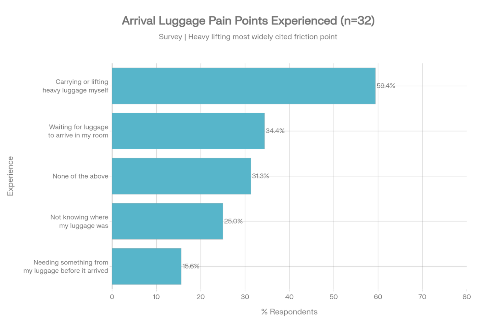
</div>

<p style="text-align:center; font-style:italic; font-size:0.9em;"><strong>Figure 98: Luggage Related Pain Points</strong></p>

65.6% rated the luggage companion robot as appealing or very appealing. Notably in Figure 98, fetching amenities (58.1%) and security monitoring of the luggage (51.6%) ranked above core luggage transport (41.9%), with answering hotel and local questions coming in third (45.2%). This collectively suggests that guests perceive the robot's value as extending well beyond the arrival moment and into the broader stay experience.

  

<div style="text-align: center; margin: 16px 0;">
  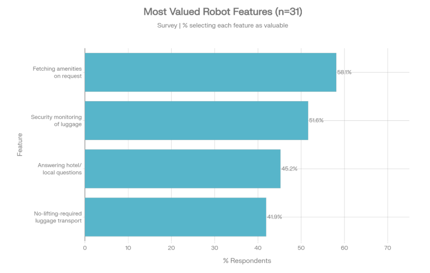
</div>

<p style="text-align:center; font-style:italic; font-size:0.9em;"><strong>Figure 99: Most Valued Robot Features</strong></p>

In Figure 100, 59.4% were comfortable or very comfortable with the robot transporting their luggage, with only 21.9% expressing discomfort.

  

<div style="text-align: center; margin: 16px 0;">
  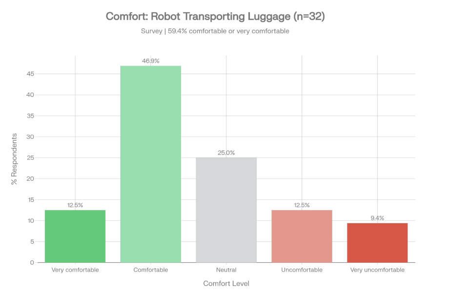
</div>

<p style="text-align:center; font-style:italic; font-size:0.9em;"><strong>Figure 100: Comfort towards Autonomous Luggage Transport Feature</strong></p>

Additionally, 40.6% rated AI-assisted check-in as appealing or very appealing. When asked to pick features they were comfortable with, Voice-only was the most preferred format (43.3%), while 20% indicated they would not be comfortable with any AI assistant format, suggesting the need for a parallel human-assisted pathway.


  

<div style="text-align: center; margin: 16px 0;">
  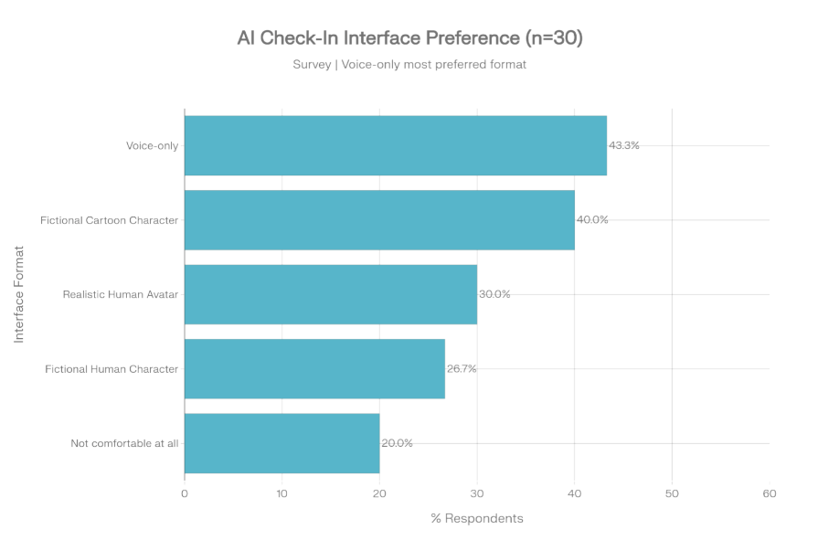
</div>

<p style="text-align:center; font-style:italic; font-size:0.9em;"><strong>Figure 101: AI Check-In Interface Preference</strong></p>

Responses were evenly split between luxury enhancement and convenience feature at 37.5% each, suggesting solution's strongest fit in the upscale rather than ultra-luxury tier. Likelihood of use averaged 3.19 out of 5, with a bimodal distribution reflecting both genuine advocates and a sceptical segment deterred primarily by privacy and reliability concerns.

*The full set of survey results can be accessed via [https://drive.google.com/file/d/1DKi2mwWx3UOnLDoQM2IrRlxSfIRDLDr/view](https://drive.google.com/file/d/1DKi2mwWx3UOnLDoQM2IrRlxSfIR_DLDr/view)* 

<a id="8-6-overall-findings"></a>

## 8.6 Overall Findings

Across the five validation methods, a consistent set of findings emerged that affirm the solution's core direction and identify clear priorities for the next iteration.


<table class="rt">
  <tbody>
    <tr>
      <td style="width:18%; font-weight:bold; color:#27ae60; vertical-align:middle;">What Worked</td>
      <td>
        <ul>
          <li>The AI check-in prototype was well received, confirming that guests are receptive to AI-led check-in when the interaction is warm and conversational</li>
          <li>Hotel visits confirmed that the core technical infrastructure underpinning ELEVIA — autonomous navigation, lift integration, and room guidance — is already commercially deployed in Singapore, establishing technical feasibility</li>
          <li>65.6% of survey respondents found the luggage companion robot concept appealing or very appealing, with value perceived across the full stay rather than arrival alone</li>
          <li>Real-world corridor navigation testing confirmed that pedestrians naturally and instinctively accommodate the robot in shared spaces without prompting</li>
        </ul>
      </td>
    </tr>
    <tr>
      <td style="font-weight:bold; color:#e67e22; vertical-align:middle;">What Needs Improvement</td>
      <td>
        <ul>
          <li>Microphone performance and ASR reliability in noisy environments was the most consistently cited technical barrier, raised in 9 of 15 Open House sessions</li>
          <li>The AI avatar face was identified as a source of discomfort across multiple validation methods. Suggestions included orienting the display toward the back of the robot's head when guiding guest rather than facing the guest directly, or exploring alternative mediums altogether</li>
          <li>PDPA compliance around verbal identity and room disclosure in shared spaces was flagged as a non-negotiable requirement by hotel operators</li>
          <li>An isolated minority of lift testing participants refused to share an enclosed space with the robot, reinforcing the need for opt-in modular design</li>
        </ul>
      </td>
    </tr>
    <tr>
      <td style="font-weight:bold; color:#555; vertical-align:middle;">Looking Forward</td>
      <td>
        <ul>
          <li>Strengthen AI infrastructure and resolve pipeline issues before form factor investment</li>
          <li>Explore holographic or voice-only interface to address avatar discomfort</li>
          <li>Pursue modular decomposition and validate with upscale/upper-midscale hotel operators</li>
        </ul>
      </td>
    </tr>
  </tbody>
</table>


<p style="text-align:center; font-style:italic; font-size:0.9em;"><strong>Table 22: Summary of Overall Findings</strong></p>

<a id="8-7-closing-the-loop"></a>

## 8.7 Closing the Loop

This section closes the loop between the problem space established, the design directions, and the validation evidence gathered across Sections 7.1 to 7.5. Evaluating where ELEVIA succeeded, where gaps remain, and what the findings mean for the next stage of development.

**Against the Five Key Pain Points**


<table class="rt rt-3col">
  <thead>
    <tr>
      <th>Pain Point</th>
      <th>Status</th>
      <th>Evidence</th>
    </tr>
  </thead>
  <tbody>
    <tr>
      <td>Check-in is high-stakes and time-sensitive</td>
      <td class="rt-yes">Addressed</td>
      <td>Conversational AI check-in replaces queuing and counter overhead. 73% rated it better than traditional front desk. Core logic sound (navigation clarity 4.67/5). ASR reliability and keycard delivery remain technical gaps.</td>
    </tr>
    <tr>
      <td>Luggage handling is a significant, underaddressed pain point</td>
      <td class="rt-partial">Partially Addressed</td>
      <td>The AMR-based luggage transport targets this. 59.4% cited lifting heavy luggage as a pain point. 65.6% considered the concept appealing or very appealing. Real-world navigation testing validated its movement. Yet, it has not been validated in a live hotel environment.</td>
    </tr>
    <tr>
      <td>Existing automation fails the luxury standard</td>
      <td class="rt-yes">Addressed</td>
      <td>Warm conversational AI replaced transactional kiosk flow. Guests engaged naturally; several preferred AI over human interaction. Avatar face discomfort (uncanny valley) remains an open design question.</td>
    </tr>
    <tr>
      <td>Staff are overloaded and the workforce is shrinking</td>
      <td class="rt-yes">Addressed</td>
      <td>ELEVIA absorbs check-in and luggage handling workload without additional staff. Citadines visit confirmed autonomous navigation and lift integration are already commercially deployed in Singapore.</td>
    </tr>
    <tr>
      <td>Guests want efficiency without losing the feeling of being hosted</td>
      <td class="rt-partial">Partially Addressed</td>
      <td>Survey split evenly between luxury enhancement and convenience feature. Solution fits upscale tier more than ultra-luxury. Unexpected finding: introverted guests preferred AI precisely because it removed social pressure.</td>
    </tr>
  </tbody>
</table>


<p style="text-align:center; font-style:italic; font-size:0.9em;"><strong>Table 23: Against the 5 Key Pain Points</strong></p>

**Against the Design Directions**


<table class="rt rt-3col">
  <thead>
    <tr>
      <th>Design Direction &amp; HMW</th>
      <th>Status</th>
      <th>Evidence</th>
    </tr>
  </thead>
  <tbody>
    <tr>
      <td><strong>Human-Centric Automation for Enhanced Hospitality</strong><br><em>How might we make automated systems encapsulate human touch?</em></td>
      <td class="rt-yes">Addressed</td>
      <td>LLM-driven conversational AI replaces rigid kiosk sequences with natural dialogue. Validated: 73% of Open House participants rated it better than a traditional front desk, and several independently described it as more comfortable than speaking to a human.</td>
    </tr>
    <tr>
      <td><strong>Personalisation and Guest Preference Intelligence</strong><br><em>How might we enable hotels to provide genuinely personalised and tailored experiences?</em></td>
      <td class="rt-partial">Partially Addressed</td>
      <td>AI greets by name and retrieves live reservation data via tool-calling. Validated: guests responded positively to being recognised and guided. Deep pre-arrival preference integration (Alluvio) was not carried forward. Remains an open opportunity for the next phase.</td>
    </tr>
    <tr>
      <td><strong>Empowering Staff Consistency and Confidence</strong><br><em>How might we help hotel staff perform at their best even in high-pressure guest interactions?</em></td>
      <td class="rt-indirect">Indirectly Addressed</td>
      <td>ELEVIA absorbs check-in, identity verification, payment, and luggage transport, indirectly reducing workload for front-desk hotel staff.</td>
    </tr>
    <tr>
      <td><strong>Effortless and Intuitive Arrival</strong><br><em>How might we design an automated hotel arrival experience that feels effortless and intuitive rather than laborious and frustrating?</em></td>
      <td class="rt-yes">Addressed</td>
      <td>Luggage travels with robot, check-in is conversational, key delivered digitally. Validated: navigation clarity scored 4.67/5 and 80% of Open House participants said they would use it again. Passport scanner affordance and ASR reliability were recognised as the two points where effort was transferred back to the guest.</td>
    </tr>
    <tr>
      <td><strong>Hospitality Beyond the Transaction</strong><br><em>How might we use technology to enhance perceived hospitality that extends beyond the transactional moment of check-in?</em></td>
      <td class="rt-yes">Addressed</td>
      <td>Robot converses during escort, extending the hosted feeling to room arrival. Validated: survey respondents ranked answering hotel questions above luggage transport as a desired feature; 73% of Open House participants rated it better than a traditional front desk.</td>
    </tr>
  </tbody>
</table>


<p style="text-align:center; font-style:italic; font-size:0.9em;"><strong>Table 24: Against the Design Directions</strong></p>

<a id="8-8-limitations"></a>

## 8.8 Limitations

The most significant limitation of this project is the gap between the solution's intended deployment context and the validation conducted. Due to the size of the ELEVIA prototype, it could not be transported out of the school premises for in-hotel pilot and real-world navigation testing. Feedback sessions were therefore conducted using a video demonstration of the prototype rather than direct hands-on interaction, limiting the reliability of responses as indicators of real-world usability and guest acceptance in an actual hotel environment. real-world navigation testing not done in hotel

The closest the team came to live prototype testing was at the NUS Open House, where the kiosk frame and shelf were brought out for testing with general students and members of the public. While valuable, this cohort skewed toward digitally native, younger participants rather than the target demographic of luxury hotel guests and frontline hospitality staff. The absence of testing with actual front desk staff is a particularly notable gap, as operational perspective and workflow compatibility were not validated beyond video viewing feedback.

The backend was validated using a mock Supabase database modelled on a fictional hotel property rather than a live Property Management System. Integration with an actual PMS such as Oracle Opera, including real reservation data, room inventory, and payment processing, remains unvalidated, and the technical and compliance requirements of such an integration represent a significant unknown.

Our research and interviews were weighted toward ultra-luxury properties, where the findings consistently indicated that human touch remains paramount and automation is less accepted. This reframed the target market toward upscale, midrange, and business-oriented properties, segments where operational efficiency, manpower reduction, and technology adoption are prioritised over personalised human service. Despite this, formal validation with the revised target segment was not conducted, and no pilot testing was carried out to confirm adoption, usability, or operational fit. We gathered qualitative signals from key industry stakeholders, notably Ascott and EHL Singapore, whose representatives expressed strong receptiveness toward the concept, affirming that automation and AI integration aligned closely with their innovation priorities. Their openness suggests that earlier and deeper engagement with this tier of hospitality operator would have strengthened the validation basis for the revised target market.

Finally, the guest survey conducted in Section 7.5 used closed multiple-choice questions, which limits the depth and generalisability of the findings as a measure of guest attitudes toward autonomous check-in. While the findings revealed useful behavioural patterns and qualitative feedback, they cannot be treated as reliable indicators of real-world performance. Meaningful validation would require deployment testing in an actual hotel environment with surveys and testing with real guests and frontline staff to assess usability, adoption, and operational fit under realistic conditions.

<a id="9-future-work"></a>

# 9 Future Work

The purpose of this section is to show that our solution has a future beyond this project.

<a id="9-1-further-development-roadmap"></a>

## 9.1 Further Development Roadmap

### Stanford May Visit

May visit to Stanford will focus on presenting validation findings from Singapore hotel visits, aligning on the final showcase direction, and testing the AI assistant's conversational flow and modular check-in architecture.

### Form Factor & Platform Direction

Following discussions during Stanford’s visit to NUS, we converged on strengthening the underlying AI check-in infrastructure first, decoupling the core technology from any single physical form factor so it can be deployed in a plug-and-play manner across different mediums. Additionally, we are exploring a video conferencing feature that connects guests with front desk staff on demand, providing a human fallback option when needed. Our Stanford team is independently exploring virtual check-in as well within limousine services, reflecting a shared recognition that the arrival experience need not begin at the check-in counters.

For the EXPE Showcase, beyond improving the underlying AI model, we will explore a holographic AI host interface as advised by the teaching teams and Venture. This addresses hotel feedback that a physical robot can feel unsettling in certain guest interactions, while preserving the warmth and conversational quality of the check-in experience.


| Iteration Priorities from Validation                             |                                                                 |
| ---------------------------------------------------------------- | --------------------------------------------------------------- |
| **PDPA** Refine verbal behaviour in shared spaces                | **Movement Choreography** Reduce unsettling proximity behaviour |
| **Modular Opt-Design** Consider separating check-in from luggage | **Avatar Interface** Explore alternative mediums of interaction |


<p style="text-align:center; font-style:italic; font-size:0.9em;"><strong>Table 25: Iteration Priorities from Validation</strong></p>

Future Timeline

  

<div style="text-align: center; margin: 16px 0;">
  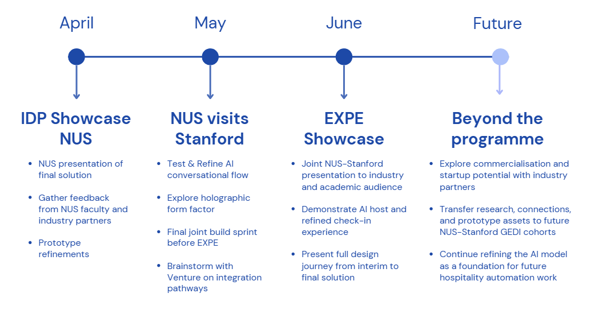
</div>

<p style="text-align:center; font-style:italic; font-size:0.9em;"><strong>Figure 103: Future Timeline</strong></p>

<a id="9-2-integration-with-ventures-existing-computing-board"></a>

## 9.2 Integration with Venture's Existing Computing Board

Venture Corporation Limited, the industry partner for this project, is a Singapore-based technology solutions company with capabilities spanning embedded computing, AI hardware, robotics, sensing, and communications. Venture represents a credible manufacturing and technology partner for the next stage of development, as several of their existing product capabilities map directly onto the core hardware requirements of the ELEVIA prototype.

Most notably, Venture has been developing proprietary compute boards with on-device AI capabilities, including the Jetson Orin Nano and the NXP iMX8M Plus with ARA2 AI accelerator. During a visit to their facilities, our team was shown a visual language model running locally on one of their boards, where a camera captures the environment and users can ask natural language questions about what they see. This capability is directly relevant to ELEVIA's next iteration: the current prototype relies on cloud-based APIs from OpenAI for LLM inference, text-to-speech, and speech-to-text, which introduces both latency and recurring subscription costs.

Beyond the compute board itself, Venture's product ecosystem offers hardware directly compatible with ELEVIA's existing subsystems. Venture's VEST Embedded High-Speed Scanning Kit targets applications in logistics, medical, and identity verification, and is closely aligned with ELEVIA's check-in use case, especially for the passport verification stage.

Beyond language models, recent advances in open-source real-time avatar and video generation pipelines suggest that even the avatar rendering component, currently dependent on the Simli SDK, could eventually run locally, enabling a fully self-contained system with no external API dependencies. Venture has also expressed interest in exploring holographic display technology as a future form factor for the AI assistant, aligning with the team's post-Stanford direction and signalling appetite for continued collaboration beyond the programme.

<a id="10-reflection"></a>

# 10 Reflection

<a id="10-1-revised-target-market"></a>

## 10.1 Revised Target Market

As established in Section 3.2, luxury in its most premium form is defined by exclusivity, genuineness, hyper-personalisation, high-touch service, and authenticity. Across every hotel interview conducted throughout this project, one finding was consistent: at the ultra-luxury level, human presence is not a legacy inefficiency to be automated away — it is the product. Guests at properties like Raffles or Banyan Tree are paying for the feeling of being known, welcomed, and cared for by another person. No AI avatar, however warm and conversationally capable, fully replicates that.

One of the most significant realisations to emerge from this project is that ELEVIA, as designed, is better suited to non-ultra-luxury properties than to the five-star and above segment the brief originally centred on. This conclusion is not a failure of the solution but a refinement of the problem space.

Where ELEVIA finds its strongest fit is in upscale, mid-range properties and  business-oriented, e.g. hotels under Ascott Limited, where guests still expect a competent and pleasant arrival experience, but where the balance tips more toward efficiency and convenience than towards deeply personal human service. In this segment, the ability to check in instantly without queuing, have luggage accompanied throughout the journey, and access a responsive point of contact at any moment represents a genuine upgrade rather than a compromise. It also directly addresses the labour shortage challenge most acutely, where staffing constraints are severe but the guest expectation of human-only service is less absolute.

<a id="10-2-lessons-learned"></a>

## 10.2 Lessons Learned

Several lessons emerged across the course of this project that extended beyond the technical details of what was built.

The most fundamental was about the relationship between automation and effortlessness. Early in the project, the team assumed that automating a task was sufficient to improve it. The Stanford Dark Horse experience dismantled that assumption. What guests respond to is not automation, but the removal of friction and effort. 

A second lesson was that environment shapes behaviour as much as product design. Insights from Ascott revealed that how a robot is positioned in a lobby determines whether it gets used at all. Deliberate configuration of the physical environment, through psychological nudging via placement, visibility, and spatial flow, can direct guests toward self-check-in as naturally as any interface improvement.

The third lesson was that the pace of iteration matters. More exploration of radical ideas along with rapid prototyping and testing cycles would have resolved more unknowns earlier, particularly around user behaviour and hotel operator requirements. The team's most productive learning moments came from building and testing quickly, and the project would have benefited from more of these moments distributed across the full timeline.

A fourth lesson concerned the importance of relationship-building and communication frequency with external stakeholders. Many hotels became unresponsive to outreach, likely due to infrequent and insufficiently personal communication. More frequent, relationship-driven engagement with hotel partners would have enabled faster feedback cycles, more meaningful pilot testing opportunities, and a stronger validation basis for the final solution.

The final lesson concerned the importance of engaging the right stakeholders early. The team's primary research was weighted toward established luxury hotel operators. Innovation-oriented operators and hospitality institutions such as EHL Singapore, who are actively exploring new concepts and approaches, proved to be more receptive and generative as conversation partners. Engaging this category of stakeholder earlier in the project, alongside the traditional luxury segment, would have surfaced more forward-looking insights and provided a stronger foundation for the revised target market sooner.

<a id="11-conclusion"></a>

# 11 Conclusion

When we first received the brief to reimagine a premium automated hotel check-in experience, we had little sense of how far the problem would take us. Ten months later, what the team has built goes beyond a prototype, it is a clearer understanding of where automation can and cannot replace human hospitality.

ELEVIA, a robot-mounted AI concierge integrating autonomous luggage transport, conversational check-in, passport verification, and contactless payment into a single continuous arrival experience, represents a genuine attempt to close the gap that existing solutions have left open. Traditional counter check-in is warm but time-consuming, occupying staff with repetitive administrative tasks that could otherwise be directed toward higher-value guest interactions. Self-service kiosks are efficient but transactional, lacking the warmth and guidance expected in a hospitality setting. Neither integrates the physical arrival experience with the check-in process into a single coherent journey. ELEVIA was designed to bridge all three.

The validation process, across the NUS Open House, feedback from Ascott Limited and EHL, confirmed both the promise and the boundaries of the current implementation. Participants responded positively to the conversational AI, the intuitiveness of the check-in flow, and the concept of a luggage companion that stays with them throughout arrival. Feedback received also sharpened the team's understanding of what comes next: decoupling the luggage robot from the check-in kiosk as independent modular options, integrating a video-conferencing alternative with remote front-desk staff, refining the AI avatar's physical modality, and focusing development on the non-ultra-luxury segment where the solution is most commercially viable.

Across ten months of hotel visits, prototyping, testing, and iteration, we have come away with more than a working system, we have a much clearer picture of the real problem, and a stronger foundation to build the next version on.


<a id="12-references"></a>

# 12 References

1. Accenture. (2026, January 13). *Luxe eternal \| Accenture*. Accenture.com. [https://www.accenture.com/us-en/insights/retail/luxe-eternal](https://www.accenture.com/us-en/insights/retail/luxe-eternal)
2. AI, S. (2025, November 12). *Service Robot Deployment in Hospitality: Industry Analysis and Implementation Guide 2025*. Sparkco AI. [https://sparkco.ai/blog/service-robot-hospitality-industry-deployment](https://sparkco.ai/blog/service-robot-hospitality-industry-deployment)
3. AL-HYARI, H. S., AL-SMADI, H. M., & WESHAH, S. R. (2023). The Impact of Artificial Intelligence (AI) on Guest Satisfaction in Hotel management: an Empirical Study of Luxury Hotels. *GeoJournal of Tourism and Geosites*, *48*(2 supplement), 810–819. [https://doi.org/10.30892/gtg.482spl15-1081](https://doi.org/10.30892/gtg.482spl15-1081)
4. AmplifAI. (2024). *AmplifAI*. Amplifai.com. [https://www.amplifai.com](https://www.amplifai.com)
5. Bartman, T., Krishnan, V., & Mann, R. (2025, November 24). *Travel industry trends and the opportunity for private equity*. McKinsey & Company. [https://www.mckinsey.com/industries/private-capital/our-insights/travel-industry-trends-and-the-opportunity-for-private-equity](https://www.mckinsey.com/industries/private-capital/our-insights/travel-industry-trends-and-the-opportunity-for-private-equity)
6. Begum, N., Nishat Faisal, Mohd., Sobh, R., Nunkoo, R., & Rana, N. P. (2024). Consumers acceptance of service robots in hotels: A meta-analytic review. *International Journal of Hospitality Management*, *126*, 104052 [https://doi.org/10.1016/j.ijhm.2024.104052](https://doi.org/10.1016/j.ijhm.2024.104052)
7. Bharwani, S., & Mathews, D. (2021). Techno-business strategies for enhancing guest experience in luxury hotels: a managerial perspective. *Worldwide Hospitality and Tourism Themes*, *13*(2). [https://doi.org/10.1108/whatt-09-2020-0121](https://doi.org/10.1108/whatt-09-2020-0121)
8. British Standards Institution. (2015). *BS ISO 7250-3:2015 Basic human body measurements for technological design. Worldwide and regional design ranges for use in product standards*. BSI Standards Online; British Standards Institution. [https://bsol-bsigroup-com.libproxy1.nus.edu.sg/Bibliographic/BibliographicInfoData/000000000030292342](https://bsol-bsigroup-com.libproxy1.nus.edu.sg/Bibliographic/BibliographicInfoData/000000000030292342)
9. Canary Technologies. (2026). *Hospitality Shifts From Exploration to Execution*. [https://resources.canarytechnologies.com/rs/753-LTW-752/images/AI-Report-2026dl031826.pdf?mkt\_tok=NzUzLUxUVy03NTIAAAGgpZuxsfrmrHJIsNeGT9exSm3mF3PDVA9bNBDwM1ANA3d35PyqBVpFwtWeEC2ITglkvhxiChrVTDr0MVQcE7HrS0Cd174W7EJmA4Jeic8Uvtw](https://resources.canarytechnologies.com/rs/753-LTW-752/images/AI-Report-2026dl031826.pdf?mkt\_tok=NzUzLUxUVy03NTIAAAGgpZuxsfrmrHJIsNeGT9exSm3mF3PDVA9bNBDwM1ANA3d35PyqBVpFwtWeEC2ITglkvhxiChrVTDr0MVQcE7HrS0Cd174W7EJmA4Jeic8Uvtw)
10. CapitaLand. (2021, June 11). *CapitaLand unveils S$50 million innovation fund and crowns winners of first CapitaLand Sustainability X Challenge*. Www.capitaland.com. [https://www.capitaland.com/en/about-capitaland/newsroom/news-releases/international/2021/jun/CapitaLand\_50\_million\_innovation\_fund\_and\_crowns\_winners\_of\_first\_CSXC.html](https://www.capitaland.com/en/about-capitaland/newsroom/news-releases/international/2021/jun/CapitaLand\_50\_million\_innovation\_fund\_and\_crowns\_winners\_of\_first\_CSXC.html)
11. Cayla, J. (2023, October 3). *Services staff are humans, too – and customers need to understand this*. Nanyang Business School. [https://www.ntu.edu.sg/business/news-events/news/story-detail/services-staff-are-humans-too-and-customers-need-to-understand-this](https://www.ntu.edu.sg/business/news-events/news/story-detail/services-staff-are-humans-too-and-customers-need-to-understand-this)
12. Choo, D. (2022, January 17). *The Big Read: At your service — or perhaps not, as manpower crunch worsens for hotels and restaurants*. CNA. [https://www.channelnewsasia.com/today/big-read/hotel-restaurants-manpower-jobs-vacancies-2437971](https://www.channelnewsasia.com/today/big-read/hotel-restaurants-manpower-jobs-vacancies-2437971)
13. Christou, P., Hadjielias, E., Simillidou, A., & Kvasova, O. (2023). The use of intelligent automation as a form of digital transformation in tourism: Towards a hybrid experiential offering. *Journal of Business Research*, *155*, 113415 [https://doi.org/10.1016/j.jbusres.2022.113415](https://doi.org/10.1016/j.jbusres.2022.113415)
14. Constantin, M., Pacca, M., Tufft, C., & Mann, R. (2024). *Updating perceptions about today’s luxury traveler*. McKinsey & Company. [https://www.mckinsey.com/industries/travel/our-insights/updating-perceptions-about-todays-luxury-traveler](https://www.mckinsey.com/industries/travel/our-insights/updating-perceptions-about-todays-luxury-traveler)
15. Cornell University. (2013, September). *Cornell Hospitality Industry Perspectives Vol. 3, No. 2*. Cornell ECommons. [https://ecommons.cornell.edu/server/api/core/bitstreams/d0dc3ab2-d891-47e3-b7f6-fd1c4da92d80/content](https://ecommons.cornell.edu/server/api/core/bitstreams/d0dc3ab2-d891-47e3-b7f6-fd1c4da92d80/content)
16. Cronkleton, E. (2019, March 14). *Average Walking Speed: Pace, and Comparisons by Age and Sex*. Healthline. [https://www.healthline.com/health/exercise-fitness/average-walking-speed\#average-speed-by-sex](https://www.healthline.com/health/exercise-fitness/average-walking-speed\#average-speed-by-sex)
17. Editeur Metalab. (2025, July 23). *BALANCING TECHNOLOGY AND HUMAN INTERACTION IN LUXURY HOSPITALITY \| Can AI Enhance the Guest Experience Without Compromising the Essence of Service?  METALAB*. METALAB. [https://metalab.essec.edu/balancing-technology-and-human-interaction-in-luxury-hospitality-can-ai-enhance-the-guest-experience-without-compromising-the-essence-of-service/](https://metalab.essec.edu/balancing-technology-and-human-interaction-in-luxury-hospitality-can-ai-enhance-the-guest-experience-without-compromising-the-essence-of-service/)
18. EHL Insights. (2023, September 8). *Luxury hospitality: Trends, challenges, and best practices*. Hospitalityinsights.ehl.edu. [https://hospitalityinsights.ehl.edu/luxury-hospitality-trends-challenges-best-practices](https://hospitalityinsights.ehl.edu/luxury-hospitality-trends-challenges-best-practices)
19. EHL Insights. (2025). *Hospitality Outlook 2025*. [https://hospitalityinsights.ehl.edu/hubfs/Blog-EHL-Insights/Documents-EHL-Insights/HospitalityOutlook2025\_InsightsReport.pdf](https://hospitalityinsights.ehl.edu/hubfs/Blog-EHL-Insights/Documents-EHL-Insights/HospitalityOutlook2025\_InsightsReport.pdf)
20. Ernst & Young. (2023). *The Future of Jobs and Skills in Singapore’s Hotel Industry*. [https://www.wsg.gov.sg/docs/default-source/content/jtm/jtm-for-hotels\_full-report\_v8-0\_public\_vf\_07112023.pdf](https://www.wsg.gov.sg/docs/default-source/content/jtm/jtm-for-hotels\_full-report\_v8-0\_public\_vf\_07112023.pdf)
21. Frost & Sullivan. (2025). *Customer Experience in Hospitality Industry \| CX Growth Opportunities in Travel and Hospitality Industry 2024-2025*. Store.Frost.com. [https://store.frost.com/global-cx-growth-opportunities-in-the-travel-hospitality-industry-2025-to-2026.html](https://store.frost.com/global-cx-growth-opportunities-in-the-travel-hospitality-industry-2025-to-2026.html)
22. Goswami, S. (2024, January 12). *OTA vs Hotel Direct Booking: Who is Winning The Battle?* EZee Absolute. [https://www.ezeeabsolute.com/blog/ota-vs-direct-booking/](https://www.ezeeabsolute.com/blog/ota-vs-direct-booking/)
23. Hanbury, P., Dutt, A., & Veratti, E. (2025, April 15). *Humanoid Robots at Work: What Executives Need to Know*. Bain. [https://www.bain.com/insights/humanoid-robots-at-work-what-executives-need-to-know/](https://www.bain.com/insights/humanoid-robots-at-work-what-executives-need-to-know/)
24. Harkison, T. (2025). Artificial intelligence (AI) in Luxury Hospitality: Balancing Efficiency and Human Connection. *Hospitality Insights*, *9*(1). [https://doi.org/10.24135/hi.v9i1.176](https://doi.org/10.24135/hi.v9i1.176)
25. Hertzfeld, E. (2019, January 31). *Japan’s Henn na Hotel fires half its robot workforce*. Hotel Management. [https://www.hotelmanagement.net/tech/japan-s-henn-na-hotel-fires-half-its-robot-workforce](https://www.hotelmanagement.net/tech/japan-s-henn-na-hotel-fires-half-its-robot-workforce)
26. Hotel Distribution Report. (2024). *Hotel Distribution Report 2024 Have Direct Bookings Reached a Peak?* [https://www.d-edge.com/wp-content/uploads/2024/04/Hotel-Distribution-Report-2024-EN.pdf](https://www.d-edge.com/wp-content/uploads/2024/04/Hotel-Distribution-Report-2024-EN.pdf)
27. Huang, C.-C. (Jacky). (2025, July). *5 OTA Mistakes That Could Be Hurting Your Hotel Revenue & How To Fix Them*. STAAH Blog. [https://blog.staah.com/tips-trends/ota-mistakes-hurting-hotel-revenue](https://blog.staah.com/tips-trends/ota-mistakes-hurting-hotel-revenue)
28. Intel Market Research. (2026, February 13). *Hospitality Service Robot Market Growth Analysis, Dynamics, Key Players and Innovations, Outlook and Forecast 2026-2034*. Intelmarketresearch.com. [https://www.intelmarketresearch.com/hospitality-service-robot-market-32307](https://www.intelmarketresearch.com/hospitality-service-robot-market-32307)
29. jonng. (2025, July 29). *Why Upskilling Your Staff Is The Most Cost-Effective Solution to Labour Shortages  Singapore Institute Of Hospitality*. Singapore Institute of Hospitality. [https://sih.edu.sg/why-upskilling-your-staff-is-the-most-cost-effective-solution-to-labour-shortages/](https://sih.edu.sg/why-upskilling-your-staff-is-the-most-cost-effective-solution-to-labour-shortages/)
30. Lee, J. W., Lee, J. J., Mun, H. J., Lee, K.-J., & Kim, J. J. (2013). The Relationship between Musculoskeletal Symptoms and Work-related Risk Factors in Hotel Workers. *Annals of Occupational and Environmental Medicine*, *25*(1). [https://doi.org/10.1186/2052-4374-25-20](https://doi.org/10.1186/2052-4374-25-20)
31. Lüthy, B. (2025, January 23). *Hospitality industry data and key statistics: 2024 update*. Hospitalityinsights.ehl.edu. [https://hospitalityinsights.ehl.edu/hospitality-industry-statistics](https://hospitalityinsights.ehl.edu/hospitality-industry-statistics)
32. Mann, R., Scully, E., Straus, M., & Holub, J. T. (2024, March 18). *How the world’s best hotels deliver exceptional customer experience*. McKinsey & Company. [https://www.mckinsey.com/industries/travel/our-insights/how-the-worlds-best-hotels-deliver-exceptional-customer-experience](https://www.mckinsey.com/industries/travel/our-insights/how-the-worlds-best-hotels-deliver-exceptional-customer-experience)
33. MOM. (2025). *Labour Market Report Second Quarter 2025*. [https://stats.mom.gov.sg/iMAS\_PdfLibrary/mrsd-Labour-Market-Report-2Q-2025.pdf](https://stats.mom.gov.sg/iMAS\_PdfLibrary/mrsd-Labour-Market-Report-2Q-2025.pdf)
34. Mordor. (2026). *Hospitality Robots Market Analysis  Industry Report  Trends, Size & Share*. Mordor Intelligence. [https://www.mordorintelligence.com/industry-reports/hospitality-robots-market](https://www.mordorintelligence.com/industry-reports/hospitality-robots-market)
35. Mordor Intelligence. (2026a, January). *Hospitality Industry in Singapore  Growth, Trends and Forecast (2020-2025)*. Mordor Intelligence. [https://www.mordorintelligence.com/industry-reports/hospitality-industry-in-singapore](https://www.mordorintelligence.com/industry-reports/hospitality-industry-in-singapore)
36. Mordor Intelligence. (2026b, January). *Luxury Hotel Market Share, Size, Trends, Statistics (2019-24)*. Mordor Intelligence. [https://www.mordorintelligence.com/industry-reports/luxury-hotel-market](https://www.mordorintelligence.com/industry-reports/luxury-hotel-market)
37. Nelson, J. (2025, July). *Hotels Are Staffing Robots—and Guests Are Freaking Out*. Decrypt. [https://decrypt.co/328073/hotels-staffing-robots-guests-freaking-out](https://decrypt.co/328073/hotels-staffing-robots-guests-freaking-out)
38. Nichols, J. P. (2025, August 22). *Finding A Balance Between Technology and Human Touch in Hospitality*. Hospitality Net. [https://www.hospitalitynet.org/opinion/4128479.html](https://www.hospitalitynet.org/opinion/4128479.html)
39. Peng, W., & Zhang, M. (2020). Is Personalized Service No Longer Important? Guests of Smart Hotels May Have Other Preferences. *Journal of Service Science and Management*, *13*(03), 535–557. [https://doi.org/10.4236/jssm.2020.133035](https://doi.org/10.4236/jssm.2020.133035)
40. Phocuswright Research. (2022). *Home*. Phocuswright.com. [https://www.phocuswright.com/Travel-Research/Research-Updates/2022/by-2023-hotel-supplier-direct-will-again-surpass-ota](https://www.phocuswright.com/Travel-Research/Research-Updates/2022/by-2023-hotel-supplier-direct-will-again-surpass-ota)
41. pwc. (2025). *AI at the heart of tourism and hospitality powering personalisation, efficiency and growth*. [https://www.pwc.com/m1/en/publications/2025/docs/ai-tourism-hospitality.pdf](https://www.pwc.com/m1/en/publications/2025/docs/ai-tourism-hospitality.pdf)
42. researchandmarkets. (2026). *AI in Hospitality and Tourism Market Report 2026*. Researchandmarkets.com. [https://www.researchandmarkets.com/reports/6005577/ai-in-hospitality-tourism-market-report?srsltid=AfmBOop0T94fKQ6mewhHaZTXEMV7fs0vjnC6EjgwZr\_aaFKVuwCTLnWJ](https://www.researchandmarkets.com/reports/6005577/ai-in-hospitality-tourism-market-report?srsltid=AfmBOop0T94fKQ6mewhHaZTXEMV7fs0vjnC6EjgwZr\_aaFKVuwCTLnWJ)
43. Seah, K. (2022, July 23). *Commentary: Raise salaries to attract more locals to hospitality and FB? It’s not so simple*. CNA. [https://www.channelnewsasia.com/commentary/hotel-restaurant-long-wait-labour-shortage-foreign-worker-jobs-2828971](https://www.channelnewsasia.com/commentary/hotel-restaurant-long-wait-labour-shortage-foreign-worker-jobs-2828971)
44. Singapore Tourism Board. (2026). *Record Singapore tourism receipts from January to September 2025*. Singapore Tourism Board. [https://www.stb.gov.sg/about-stb/media-publications/media-centre/record-singapore-tourism-receipts-from-january-to-september-2025/](https://www.stb.gov.sg/about-stb/media-publications/media-centre/record-singapore-tourism-receipts-from-january-to-september-2025/)
45. Skift, & Oracle. (2025). *Hospitality in 2025: AUTOMATED, INTELLIGENT… AND MORE PERSONAL*. Https://Www.oracle.com/A/Ocom/Docs/Industries/Hospitality/Hospitality-Industry-Trends-For-2025.Pdf.
46. UN Tourism. (2025, January 21). *International tourism recovers pre-pandemic levels in 2024*. Untourism.int. [https://www.untourism.int/news/international-tourism-recovers-pre-pandemic-levels-in-2024](https://www.untourism.int/news/international-tourism-recovers-pre-pandemic-levels-in-2024)
47. Wang, X., Sung, B., & Phau, I. (2024). How Rarity and Exclusivity Influence Types of Perceived Value for Luxury. *Journal of Brand Management*, *31*(6). [https://doi.org/10.1057/s41262-024-00359-8](https://doi.org/10.1057/s41262-024-00359-8)
48. World. (2025, September 30). *WTTC Report Shows Travel & Tourism Set to Support 91MN New Jobs by 2035*. Wttc.org; World Travel & Tourism Council. [https://wttc.org/news/wttc-report-shows-travel-and-tourism-set-to-support-91mn-new-jobs-by-2035](https://wttc.org/news/wttc-report-shows-travel-and-tourism-set-to-support-91mn-new-jobs-by-2035)

<a id="13-appendices"></a>

# 13 Appendices

<a id="appendix-a"></a>

## Appendix A: Interview Protocol and Preparation

This appendix summarises the luxury hotels and organisations we visited as part of our primary research. Each visit helped us understand real-world check-in operations, constraints, and attitudes towards automation in luxury hospitality.

**A.1 Amara Singapore**  
We visited Amara Singapore to observe front-office operations and better understand current check-in practices and guest–staff interactions.

**Stakeholders Engaged**  
Gordon Aeria – General Manager, Amara Singapore  
Pearlyn – Front Office Manager

**A.2 Shangri-La Singapore**  
We conducted two visits to Shangri-La Singapore: the first visit focused on understanding the luxury hotel while the second visit involved sharing and testing early-stage prototypes with hotel stakeholders to gather feedback.

**Stakeholders Engaged**  
Devendra Pandey – Director of Information Technology  
Benny Fok – Front Office Manager


<div style="text-align: center; margin: 16px 0;">
  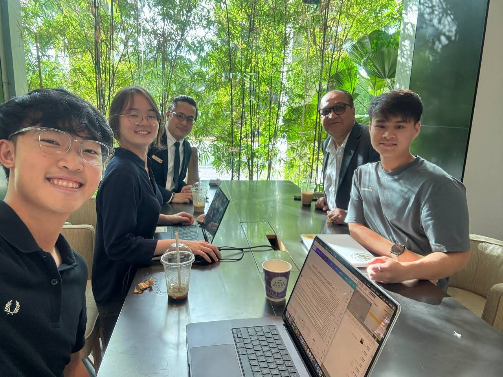
</div>

<p style="text-align:center; font-style:italic; font-size:0.9em;"><strong>Figure A.2: Shangri-La Singapore (site visit photograph)</strong></p>

**A.3 Raffles Hotel Singapore**  
At Raffles Hotel Singapore, we engaged with stakeholders to understand the perspectives from an iconic luxury heritage brand.

**Stakeholders Engaged**  
Alfani Leonaris – Lobby Operation Manager  
Christian Westbeld – Managing Director


<div style="text-align: center; margin: 16px 0;">
  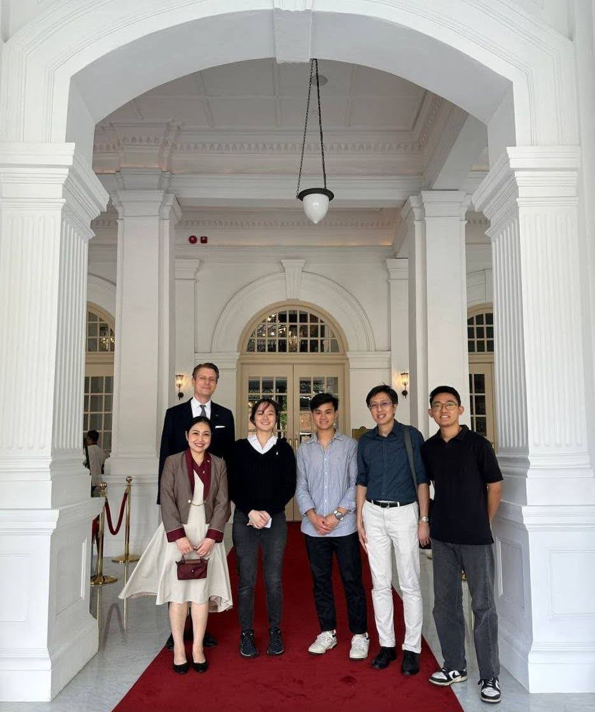
</div>

<p style="text-align:center; font-style:italic; font-size:0.9em;"><strong>Figure A.3: Raffles Hotel Singapore – lobby and entrance area (site visit photograph)</strong></p>

**A.4 Banyan Tree Headquarters**  
We visited the Banyan Tree Headquarters to gain a brand-level perspective on guest experience and the strategic role of technology and AI across the group’s portfolio.

**Stakeholder Engaged**  
Sheriann – Business Development Team


<div style="text-align: center; margin: 16px 0;">
  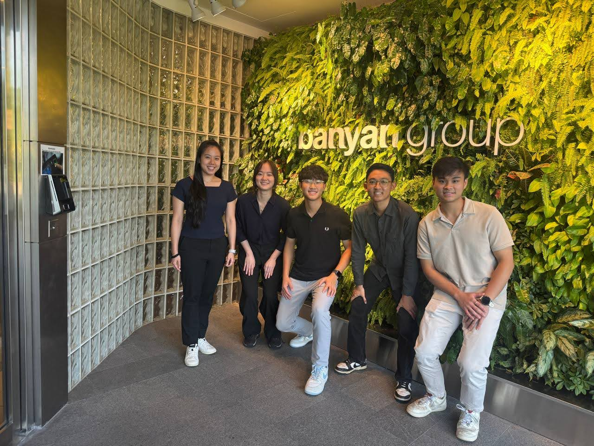
</div>

<p style="text-align:center; font-style:italic; font-size:0.9em;"><strong>Figure A.4: Banyan Tree Headquarters (site visit photograph)</strong></p>

**A.5 Mandai Rainforest Resort**  
We also visited Mandai Rainforest Resort, a flagship resort under Banyan Tree.

**Stakeholder Engaged**  
Joan Yao – Director, Rooms


<div style="text-align: center; margin: 16px 0;">
  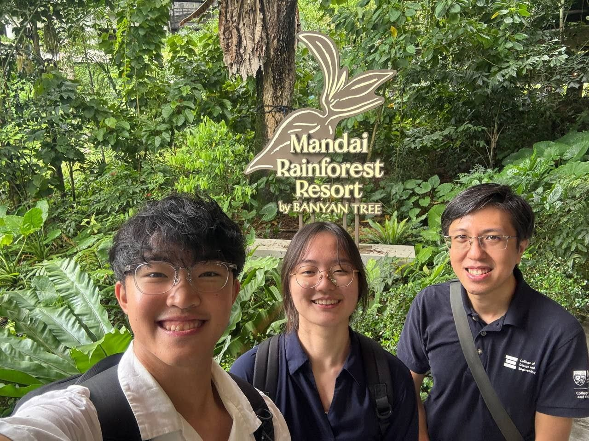
</div>

<p style="text-align:center; font-style:italic; font-size:0.9em;"><strong>Figure A.5: Mandai Rainforest Resort – arrival area (site visit photograph)</strong></p>

<a id="appendix-b"></a>

## Appendix B: Interview Protocol and Preparation

To gain a holistic understanding of the current luxury hotel check-in experience, we conducted semi-structured interviews with hospitality professionals across four prominent hotels in Singapore: Shangri-La, Banyan Tree, Raffles Hotel, and Amara Hotel (Appendix B). Participants represented a diverse range of roles within the hotel ecosystem, including the Rooms Director, Front Desk Manager, Front Desk Staff, General Manager, and Head of Technology. These individuals were selected for their ability to offer operational, managerial, and technological perspectives. Initial contact was made through formal email outreach and online contact forms.

<a id="data-collection-protocol"></a>

#### Data Collection Protocol

Interviews were conducted between September and October 2025, following the protocol developed for this study. Each session began with an introduction to the research context and verbal consent for recording. The interviews were audio-recorded with consent and supplemented by extensive note-taking  two team members recorded observations and verbatim quotes while the other two led the conversation. In three of the four hotels, participants additionally provided guided walkthroughs of their front-desk operations, allowing the research team to observe real-time workflows and backstage processes. Notably, one hotel granted permission for us to interact directly with their front-desk system, providing valuable insights into system interfaces and limitations.

[View Interview Questions Preparation Document →](https://soongensayo.github.io/GEDI-ME310-hotel/assets/documents/InterviewQuestions.html)

<a id="interview-design-and-flow"></a>

#### Interview Design and Flow

The semi-structured interview guide was designed around five thematic stages.  
  
This design enabled both structured coverage of key topics and flexibility for interviewees to share detailed narratives about daily operations, guest interactions, and technology adoption in premium hospitality environments. 

<a id="appendix-c"></a>

## Appendix C: Key Themes & Insights from Hotel Interviews

Following the interviews, we adopted an affinity clustering methodology supported by an empathy mapping framework, where we classified each data point across six categories – Think/Feel, See, Say/Do, Hear, Pains, and Gains.

These clusters were then distilled into key insights and design implications forming the foundation for subsequent concept development.

  

<div style="text-align: center; margin: 16px 0;">
  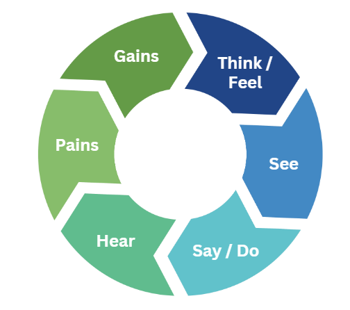
</div>

<div style="text-align: center; margin: 16px 0;">
  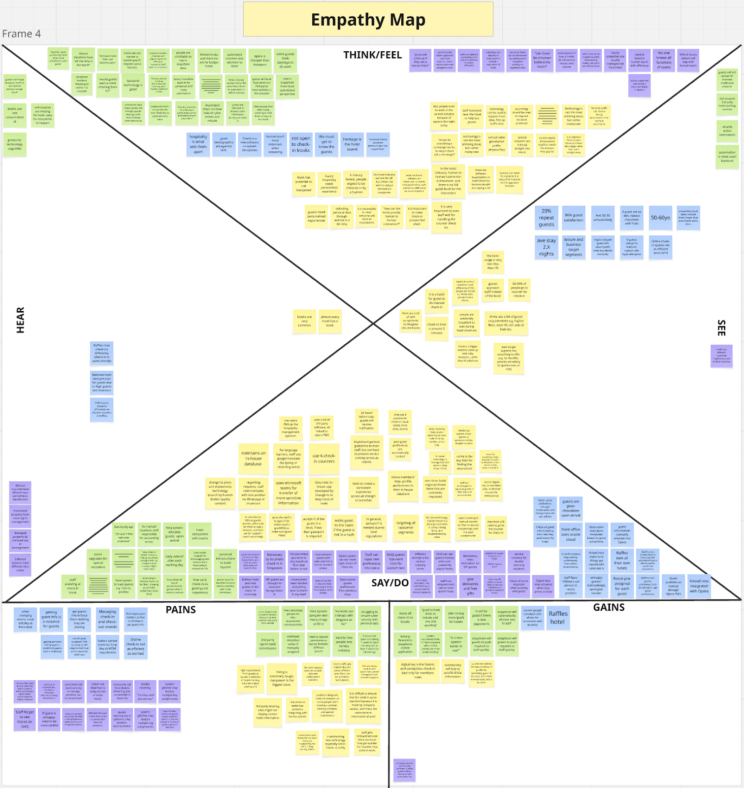
</div>

<p style="text-align:center; font-style:italic; font-size:0.9em;"><strong>Figure C.1: Empathy Map</strong></p>

  

<div style="text-align: center; margin: 16px 0;">
  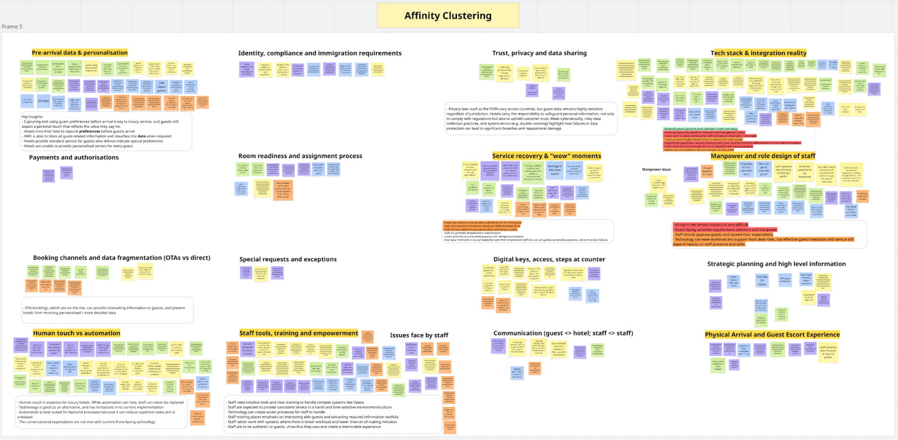
</div>

<p style="text-align:center; font-style:italic; font-size:0.9em;"><strong>Figure C.2: Affinity Clustering</strong></p>

The following presents the consolidated findings for each key insight. Each data point is colour-coded by source property: green denotes Amara Hotel, yellow denotes Shangri-La, blue denotes Raffles Hotel, orange denotes Banyan Tree, and purple denotes miscellaneous luxury hotel sources.


<table class="rt">
  <thead><tr><th>#</th><th>Theme &amp; Key Findings</th></tr></thead>
  <tbody>
    <tr>
      <td class="rt-num">1</td>
      <td>
        <div class="rt-head">Tech Stack and Integration Reality</div>
        Backend systems such as Opera PMS and Oracle Cloud are generally reliable within existing workflows, but high reliance on third-party software and fragmentation between systems creates inefficiencies and compatibility issues. Implementing new technologies is costly and often constrained by vendor lock-in, data permissions, and cybersecurity concerns. As a result, technology upgrades remain incremental, focused on reducing staff workload rather than transforming the guest experience.
      </td>
    </tr>
    <tr>
      <td class="rt-num">2</td>
      <td>
        <div class="rt-head">Human Touch vs Automation</div>
        Our interviewee from Shangri-La noted that 98–99% of guests were observed approaching human staff over kiosks even when self-service options were available. Luxury guests consistently associate check-in with being genuinely welcomed, and existing kiosk solutions were described as emotionless, transactional, and misaligned with luxury price points. The consensus across all interviewees was that automation should enhance rather than replace the human warmth central to luxury hospitality.
      </td>
    </tr>
    <tr>
      <td class="rt-num">3</td>
      <td>
        <div class="rt-head">Staff Tools and Empowerment</div>
        Frontline staff expressed that while tools like Opera and HotSOS are indispensable, they are also complex and unintuitive, requiring steep learning curves. Training periods are long, and mistakes — especially in data entry or double rooming — can directly affect guest satisfaction. Staff repeatedly emphasised the need for simpler, integrated tools and better pre-shift briefings to manage information overload. Empowerment emerged as a central motivator: when staff have autonomy to resolve issues or make small gestures (e.g., using a discretionary budget to delight guests), morale and service quality improve significantly.
      </td>
    </tr>
    <tr>
      <td class="rt-num">4</td>
      <td>
        <div class="rt-head">Pre-arrival Data and Personalisation</div>
        Hotels strive to capture guest preferences before arrival through membership profiles, pre-arrival forms, and communication platforms like Canary and Opera PMS. However, data utilisation remains inconsistent. While some hotels use this information to prepare amenities or room settings, others rely heavily on staff memory or manual notes. Luxury guests expect a personal touch proportionate to what they pay, yet personalisation across all guests is impractical due to scale and manpower constraints.
      </td>
    </tr>
    <tr>
      <td class="rt-num">5</td>
      <td>
        <div class="rt-head">Manpower and Role Design of Staff</div>
        The manpower shortage remains one of the most pressing issues in the industry. Recruiting and retaining hospitality workers — especially for front-desk roles — is increasingly difficult due to long hours, stress, and perceived lack of career progression. Technology can reduce repetitive tasks and support staff efficiency but cannot replace the emotional labour essential to guest satisfaction. Hotels have thus begun redesigning roles to combine operational efficiency with relational expertise, positioning staff near kiosks to assist guests and manage exceptions.
      </td>
    </tr>
    <tr>
      <td class="rt-num">6</td>
      <td>
        <div class="rt-head">Service Recovery and "Wow" Moments</div>
        Service recovery emerged as a defining factor separating good from exceptional hospitality. Staff described instances of empowered decision-making — where they could upgrade rooms, offer discounts, or personalise gestures without waiting for management approval — allowing quick, authentic responses to guest issues. This culture varies across hotels; some operate under strict approval hierarchies, limiting graceful recovery from service lapses. Interviewees emphasised that true "wow" moments often stem from staff intuition and empathy, not protocol.
      </td>
    </tr>
    <tr>
      <td class="rt-num">7</td>
      <td>
        <div class="rt-head">Physical Arrival and Guest Escort Experience</div>
        The physical dimensions of arrival — from the moment guests step out of their vehicle to the point they reach their room — emerged as a consistently staff-dependent and labour-intensive process across all properties visited. Bellmen were described as playing a critical bridging role, leading guests from the entrance through to the check-in counter and, in the case of VIP or ultra-luxury guests, escorting them directly to their rooms with a brief orientation. Interviewees noted that this escort experience is among the most impression-forming moments of the stay, yet it is highly variable and driven almost entirely by staff availability and initiative rather than a consistent service standard.
      </td>
    </tr>
  </tbody>
</table>


<a id="appendix-d"></a>

## Appendix D: Hotel Observation Field Notes and Methodology

**Overview**  
This appendix documents the methodology, framework, and summarised notes from the on-site observational research conducted at three luxury hotel properties in Singapore: Marina Bay Sands, Fullerton Bay Hotel, and The Fullerton Hotel. Observations were conducted during peak check-in periods to maximise the density of guest-staff interactions visible within a single session.

**Observation Details**


| Property            | Time        | Duration | Observers |
| ------------------- | ----------- | -------- | --------- |
| Marina Bay Sands    | 2:00–4:30pm | 2.5 hrs  | 2         |
| Fullerton Bay Hotel | 2.00-2.30pm | 30 mins  | 2         |
| The Fullerton Hotel | 2.30pm-4pm  | 1.5 hrs  | 2         |


**Observational Methodology**  
Observational research was selected as a complementary method to the interviews documented in Section 3.3.3. While interviews surface staff accounts of the check-in experience, observation captures what actually happens,  including behaviours, adaptations, and frictions that practitioners may not consciously register or volunteer. The distinction is deliberate: staff accounts are shaped by professional norms, institutional memory, and the desire to present their operations favourably, whereas direct observation is not subject to these filters.

The team employed a structured observational approach drawing on the AEIOU framework (Figure X).

  

<div style="text-align: center; margin: 16px 0;">
  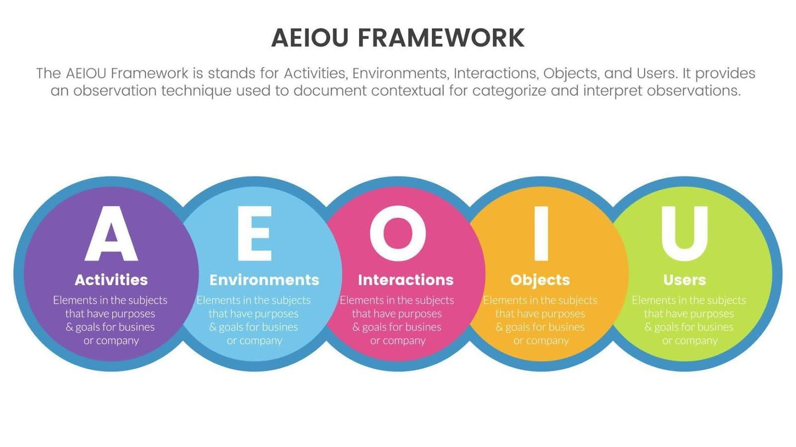
</div>

<p style="text-align:center; font-style:italic; font-size:0.9em;"><strong>Figure D.1: AEIOU Framework  </strong></p>
**Observational Posture**  
**Fly-on-the-Wall:** We positioned ourselves in lobby areas without engaging staff or guests, allowing natural behaviour to emerge uninterrupted. This approach was selected to minimise the Hawthorne Effect: the documented tendency for individuals to modify their behaviour when they know they are being observed. By blending into the lobby environment, we were able to capture operational patterns that would not be visible during a formal site visit or guided tour.

**Validation Against Interview Themes**  
Raw field notes were collected across all properties and organised into three thematic clusters as seen in Figure D.2: These were then mapped against the seven key themes identified in the staff interviews (Section 3.3.3) to assess where direct observation confirmed, qualified, or contradicted what practitioners had reported.

  

<div style="text-align: center; margin: 16px 0;">
  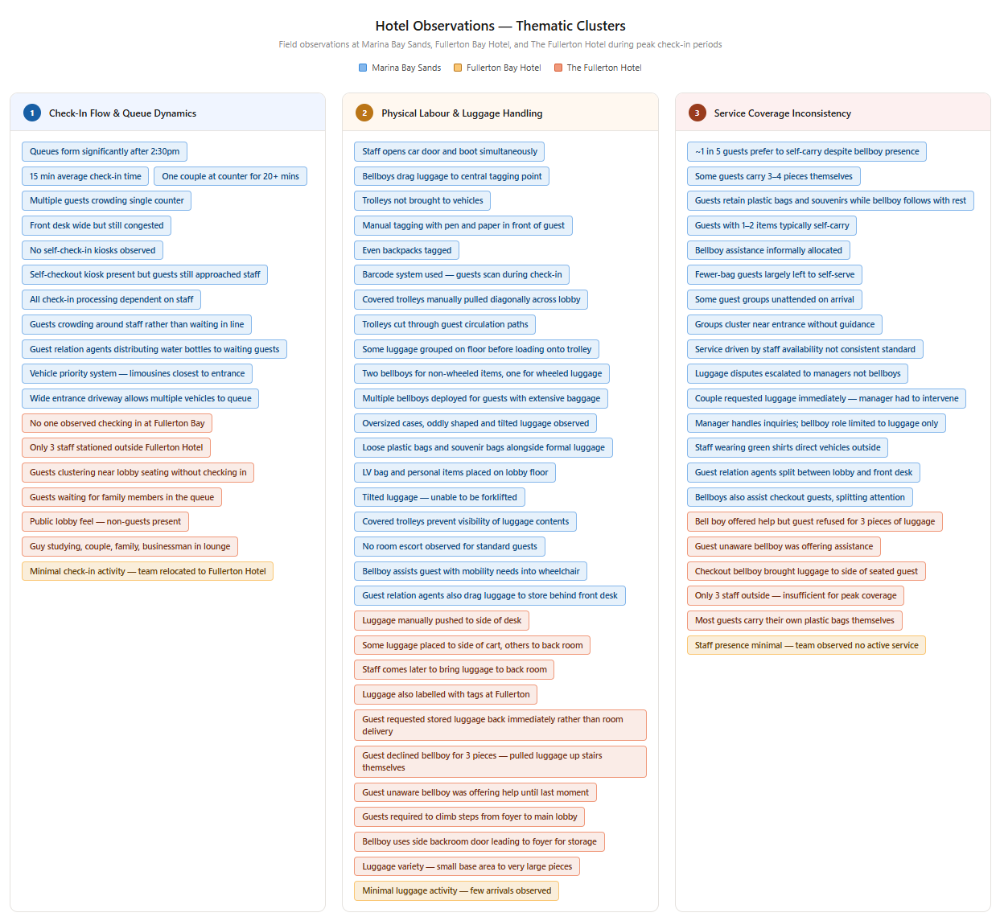
</div>

<p style="text-align:center; font-style:italic; font-size:0.9em;"><strong>Figure D.2: Three Thematic Clusters Surfaced</strong></p>

The thematic clustering is accessible at the link below: [https://taroboro.github.io/thematicinsighthotels/](https://taroboro.github.io/thematic_insight_hotels/) 

Some images from our field observation can be found below

*Arrival & Drop-Off*

  

<div style="text-align: center; margin: 16px 0;">
  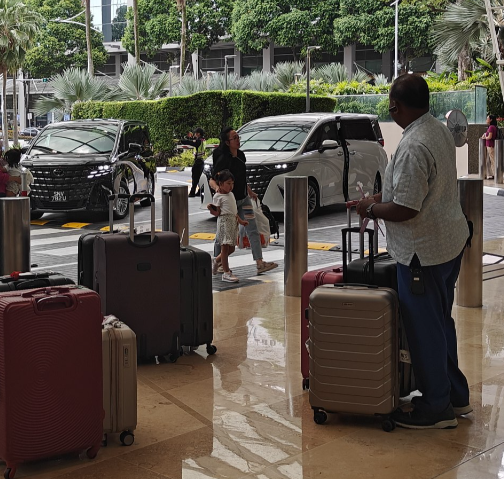
</div>

<p style="text-align:center; font-style:italic; font-size:0.9em;"><strong>Figure D.3: Staff member unloading and bundling luggage from vehicle</strong></p>

  

<div style="text-align: center; margin: 16px 0;">
  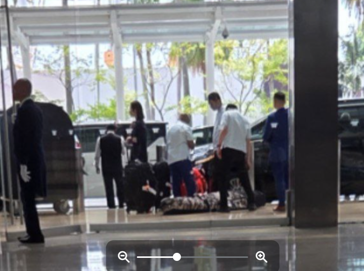
</div>

<p style="text-align:center; font-style:italic; font-size:0.9em;"><strong>Figure D.4: Multiple bellboys attending to a single vehicle </strong></p>

*Luggage Handling*

  

<div style="text-align: center; margin: 16px 0;">
  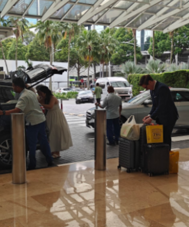
</div>

<p style="text-align:center; font-style:italic; font-size:0.9em;"><strong>Figure D.5: Luggage with plastic bags of souvenirs alongside formal luggage </strong></p>

  

<div style="text-align: center; margin: 16px 0;">
  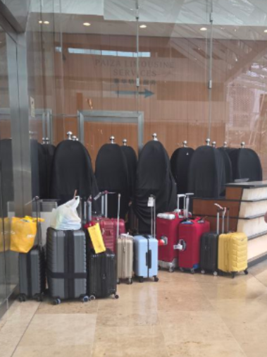
</div>

<p style="text-align:center; font-style:italic; font-size:0.9em;"><strong>Figure D.6: Central luggage handling point — groups of luggage placed on floor before trolley loading </strong></p>


<div style="text-align: center; margin: 16px 0;">
  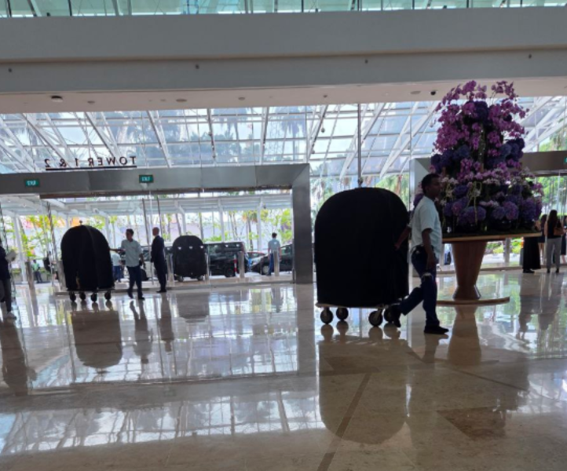
</div>

<p style="text-align:center; font-style:italic; font-size:0.9em;"><strong>Figure D.7: Luggage cart pulled diagonally across lobby, cutting through guest circulation paths</strong></p>

<a id="appendix-e"></a>

## Appendix E: One-Star Review Study — Methodology and Dashboard

The live dashboard is accessible at the link below: [https://soongensayo.github.io/GEDI-ME310-hotel/assets/dashboards/hotel-review-dashboard.html](https://soongensayo.github.io/GEDI-ME310-hotel/assets/dashboards/hotel-review-dashboard.html) 

**Overview**  
This appendix documents the methodology and findings from the first round of guest review analysis conducted during the interim phase of the project. The study focused exclusively on one-star reviews from five-star properties in Singapore to surface the most acute and unambiguous sources of guest dissatisfaction.

**Methodology**  
Reviews were collected from major online travel platforms including TripAdvisor, Google Reviews, and Booking.com, filtered to one-star ratings at five-star Singapore properties. A dataset of 60+ reviews was assembled, cleaned, and structured for analysis. Each review was read in full and coded into sub-themes based on the nature of dissatisfaction expressed. Sub-themes were then consolidated into higher-level themes through affinity clustering, producing 9 themes across 34 categories.

The analysis was conducted independently by two team members, with disagreements in coding resolved through discussion. The focus on one-star reviews was a deliberate methodological choice: extreme dissatisfaction provides a clear and unfiltered signal of where the luxury experience breaks down most severely, without the moderating effect of positive aspects that appear in mixed-rating reviews.


| Key Findings                 |                      |
| ---------------------------- | -------------------- |
| **Theme**                    | **Share of Total %** |
| Staff & Service Quality      | 95.80%               |
| Value-for-Money              | 65.55%               |
| Room Assignment & Conditions | 62.18%               |
| Check-In & Check-Out Process | 53.78%               |
| Food & Beverage Experience   | 37.82%               |
| Facilities & Infrastructure  | 36.97%               |
| Reservation & Pre-Arrival    | 20.17%               |
| Technology & Amenities       | 17.65%               |
| Security & Privacy           | 15.97%               |


Within the Check-In & Check-Out Process theme, the dominant sub-categories were poor service (32.77% of all reviews) and long wait times (24.37%), confirming that process inefficiency and service quality failures are the primary drivers of check-in dissatisfaction.

  

<div style="text-align: center; margin: 16px 0;">
  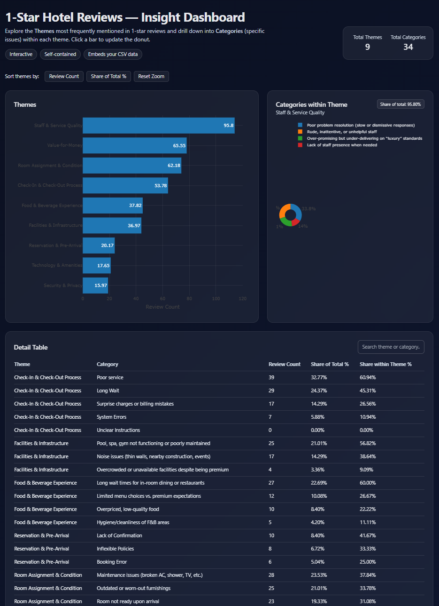
</div>

<p style="text-align:center; font-style:italic; font-size:0.9em;"><strong>Figure E.1: One-Star Review Insight Dashboard</strong></p>

<a id="appendix-f"></a>

## Appendix F: Broader Sentiment Study — Methodology and Dashboard

The live dashboard is accessible at the link below: [https://taroboro.github.io/hotelreviews/](https://taroboro.github.io/hotel_reviews/) 

**Overview**  
This appendix documents the methodology and findings from the second round of guest review analysis, conducted to complement the one-star study with a broader, rating-balanced view of the luxury arrival experience across four Singapore properties.

**Methodology**  
109 reviews were collected from four Singapore luxury properties: Capella, Marina Bay Sands, Raffles, and Fullerton. The reviews span a full rating range from one to five stars. Rather than coding reviews into themes, this round applied a structured sentiment scoring approach across five service dimensions: luggage handling, high-touch service, staff availability, staff competency, and staff attitude. Each dimension was scored on a 1–5 scale based on the sentiment expressed in the review text, with scores assigned only where the review contained sufficient evidence for that dimension. Reviews where a dimension was not mentioned were excluded from that dimension's average to avoid distortion.

The broader rating range was a deliberate methodological choice: by including positive and neutral reviews alongside negative ones, this round captures what the best and worst arrival experiences have in common, not only what drives extreme dissatisfaction.

**Key Findings**

<div style="text-align: center; margin: 24px 0;">
  <table style="margin-left: auto; margin-right: auto;">
    <thead>
      <tr>
        <th>Dimension</th>
        <th>Avg Score</th>
        <th>No. of Reviews Scored</th>
      </tr>
    </thead>
    <tbody>
      <tr>
        <td>Luggage Handling</td>
        <td>3.37</td>
        <td>68</td>
      </tr>
      <tr>
        <td>High Touch Service</td>
        <td>3.59</td>
        <td>34</td>
      </tr>
      <tr>
        <td>Staff Availability</td>
        <td>3.46</td>
        <td>37</td>
      </tr>
      <tr>
        <td>Staff Competency</td>
        <td>3.28</td>
        <td>32</td>
      </tr>
      <tr>
        <td>Staff Attitude</td>
        <td>3.67</td>
        <td>45</td>
      </tr>
    </tbody>
  </table>
</div>

**Overall average rating:** 3.5 / 5.0 across 109 reviews

**Hotel breakdown:** Capella (42 reviews), Marina Bay Sands (26), Raffles (10), Fullerton (31)

The 0.30-point gap between the highest dimension (attitude, 3.67) and the lowest (luggage handling, 3.37) was the most significant finding, confirmed across all four properties. 39% of reviews referenced check-in or waiting experiences as a source of friction or delight.

**Linking to Interview Themes**

The review data corroborates several key themes from staff interviews. Low scores in staff availability and competency validate the interview finding that manpower constraints create service inconsistency (Theme 5). The attitude-luggage gap validates Theme 7: that physical arrival dimensions remain underserved despite warm and willing staff. The check-in friction cited in 39% of reviews validates Theme 2: that human-led check-in remains the preferred and expected mode, and that existing processes are not consistently meeting that expectation.


<div style="text-align: center; margin: 16px 0;">
  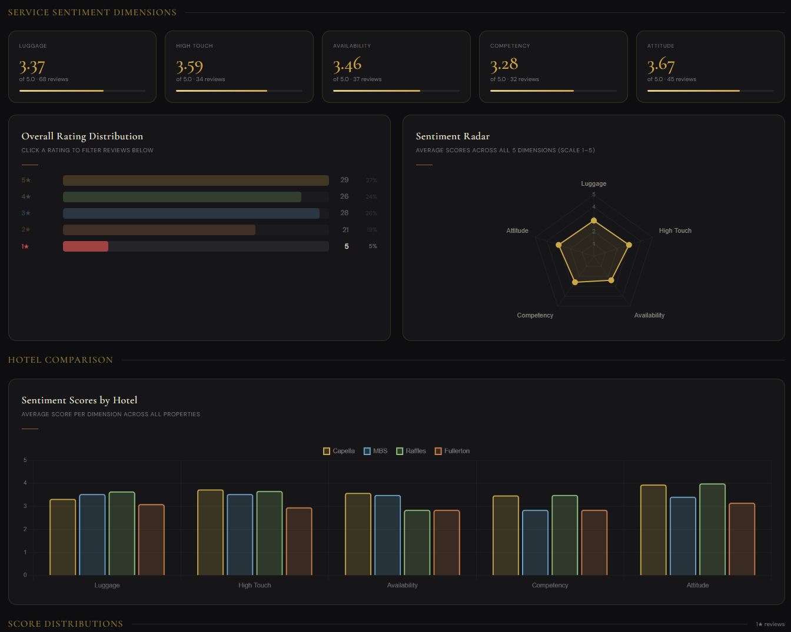
</div>

<a id="appendix-g"></a>

## Appendix G: User Journey Maps

This appendix presents detailed stage-by-stage breakdowns of the three current-state journey maps developed in Section 3.3.1. Each map was constructed based on hotel interviews, walkthroughs, and field observations conducted across multiple Singapore luxury properties.

**Pre-Arrival**  


<div style="text-align: center; margin: 16px 0;">
  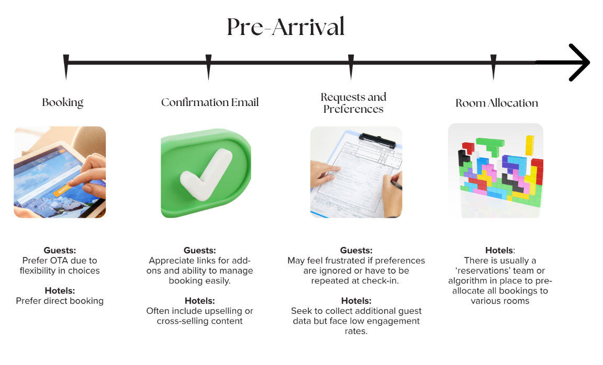
</div>

<p style="text-align:center; font-style:italic; font-size:0.9em;"><strong>Figure G.1: Pre-Arrival Flow</strong></p>

The pre-arrival phase establishes the foundation for the guest’s overall hotel experience. In luxury hospitality, this stage is not merely transactional but an opportunity to communicate attentiveness, personalization, and efficiency — qualities that define a premium brand. A seamless pre-arrival journey ensures that guests begin their stay feeling understood and valued, while the hotel benefits from streamlined operations and accurate data for service preparation ([EHL, 2023](https://hospitalityinsights.ehl.edu/luxury-hospitality-trends-challenges-best-practices)).


<table class="rt">
  <thead><tr><th>#</th><th>Stage</th></tr></thead>
  <tbody>
    <tr>
      <td class="rt-num">1</td>
      <td>
        <div class="rt-head">Booking</div>
        Guests today increasingly prefer online travel agencies (OTAs) such as Booking.com or Expedia for their flexibility and ease of comparison. However, hotels prefer direct booking channels as these allow access to guest data directly, enabling more targeted communication, personalisation, and upselling opportunities (Ernst &amp; Young, 2023). Integrating personalised booking systems that synchronise with guest profiles allows hotels to anticipate needs such as preferred room type, amenities, and check-in times well before arrival — reinforcing the sense of exclusivity expected in the luxury segment.
      </td>
    </tr>
    <tr>
      <td class="rt-num">2</td>
      <td>
        <div class="rt-head">Confirmation Email</div>
        The confirmation email is more than a transactional receipt; it acts as an early stage of relationship-building. Guests appreciate clear, accessible booking details and links that allow them to modify reservations, add services, or manage transportation requests with minimal friction. Many hotels leverage this touchpoint to include upselling content — dining experiences, spa packages, or transportation upgrades. The tone and aesthetic of these communications should reflect brand values: calm, refined, and anticipatory rather than commercial.
      </td>
    </tr>
    <tr>
      <td class="rt-num">3</td>
      <td>
        <div class="rt-head">Requests and Preferences</div>
        This touchpoint captures the guest's ability to communicate specific needs and personal preferences — such as bedding type, dietary restrictions, or room location. However, as identified during user interviews, guests often experience frustration when their pre-submitted requests appear ignored or require repetition during check-in. For hotels, collecting and managing such data remains challenging due to low engagement rates and fragmented information systems.
      </td>
    </tr>
    <tr>
      <td class="rt-num">4</td>
      <td>
        <div class="rt-head">Room Allocation</div>
        Behind the scenes, the pre-arrival process culminates in room allocation, where hotels match reservations to specific rooms based on availability, maintenance status, and guest requirements. In most luxury properties, this is managed by a reservations team or automated algorithm that pre-allocates rooms to optimise occupancy while accommodating personalised preferences. When integrated with CRM and housekeeping systems, this process enhances both efficiency and guest satisfaction by ensuring that the assigned room is prepared and tailored to expectations prior to arrival.
      </td>
    </tr>
  </tbody>
</table>


Collectively, these pre-arrival touchpoints demonstrate the interdependence of technology, personalization, and operational design in shaping the luxury guest journey. A reimagined premium check-in experience must therefore begin before the guest arrives—bridging digital anticipation with physical hospitality through integrated, data-driven, and emotionally engaging systems.

---

**Traditional Counter Check-In**

  

<div style="text-align: center; margin: 16px 0;">
  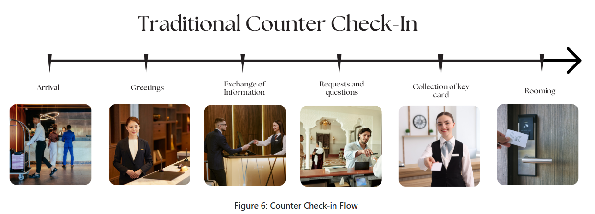
</div>

<p style="text-align:center; font-style:italic; font-size:0.9em;"><strong>Figure G.2: Counter Check-In Flow</strong></p>

The check-in process is one of the most defining moments in the guest journey, shaping first impressions and setting the tone for the stay (Mann et al., 2024). For luxury hotels, this stage embodies the brand’s promise of seamlessness, warmth, and personalization. Yet, as our field research and observations reveal, traditional counter-based check-in workflows can create friction for both guests and staff due to outdated system design, fragmented communication, and process inefficiencies.


<table class="rt">
  <thead><tr><th>#</th><th>Stage</th></tr></thead>
  <tbody>
    <tr>
      <td class="rt-num">1</td>
      <td>
        <div class="rt-head">Arrival</div>
        <div class="rt-guest"><span class="rt-label">Guest perspective:</span> Upon arrival, guests often face queues before even reaching the front desk. Especially during peak hours, waiting time becomes a key source of frustration, undermining the perception of efficiency and exclusivity expected in premium hospitality. Luxury guests expect immediacy and recognition, and long waits detract from that promise.</div>
        <div><span class="rt-label">Staff perspective:</span> Front desk staff must juggle multiple simultaneous tasks — handling ongoing check-ins, attending to phone calls, and coordinating with bell staff. High guest volumes exacerbate this workload, leaving little time to deliver personalised attention. Staff shortages further intensify this pressure.</div>
      </td>
    </tr>
    <tr>
      <td class="rt-num">2</td>
      <td>
        <div class="rt-head">Greetings</div>
        <div class="rt-guest"><span class="rt-label">Guest perspective:</span> The greeting moment, while brief, carries emotional weight. Guests notice whether the staff member smiles, greets them by name, or acknowledges special occasions. Inconsistent greetings often lead guests to perceive the interaction as transactional rather than genuine.</div>
        <div><span class="rt-label">Staff perspective:</span> Staff acknowledge that they want to personalise greetings but often cannot recall guest details or lack access to the right information before the guest reaches the counter — a disconnect stemming from PMS interface limitations.</div>
      </td>
    </tr>
    <tr>
      <td class="rt-num">3</td>
      <td>
        <div class="rt-head">Exchange of Information</div>
        <div class="rt-guest"><span class="rt-label">Guest perspective:</span> Guests frequently express frustration when asked to repeat information they have already provided during online booking or pre-arrival forms. This duplication creates an impression of inefficiency and poor data integration. Guests also find it unclear what staff are doing behind the screen, leading to perceptions of slowness or disorganisation.</div>
        <div><span class="rt-label">Staff perspective:</span> Staff must navigate between multiple software systems (e.g., PMS, payment gateways, and ID verification tools) to complete a single check-in. This multitasking increases cognitive load and risk of error — many noted difficulty in maintaining conversation with guests while simultaneously keying data.</div>
      </td>
    </tr>
    <tr>
      <td class="rt-num">4</td>
      <td>
        <div class="rt-head">Requests and Questions</div>
        <div class="rt-guest"><span class="rt-label">Guest perspective:</span> Guests often hesitate to raise additional questions or requests during check-in, perceiving staff as too busy or unapproachable. When they do ask, responses may feel scripted or delayed due to staff needing to check information in other systems.</div>
        <div><span class="rt-label">Staff perspective:</span> Employees sometimes struggle to answer guest questions on the spot, particularly regarding local recommendations or real-time room updates. When guests express dissatisfaction, front desk agents must escalate issues while staying composed — a difficult balance amid ongoing check-ins.</div>
      </td>
    </tr>
    <tr>
      <td class="rt-num">5</td>
      <td>
        <div class="rt-head">Collection of Key Card</div>
        <div class="rt-guest"><span class="rt-label">Guest perspective:</span> At this point, guests expect efficiency and clarity — they want to feel assured that their requests (such as late checkout or special amenities) have been noted. However, rushed handovers can create confusion and anxiety if guests are unsure about room details or inclusions.</div>
        <div><span class="rt-label">Staff perspective:</span> Staff often continue inputting data or printing forms while handing over key cards. If last-minute changes occur (e.g., incorrect room setup), the responsibility still falls on the front desk, despite upstream system or communication failures.</div>
      </td>
    </tr>
    <tr>
      <td class="rt-num">6</td>
      <td>
        <div class="rt-head">Rooming</div>
        <div class="rt-guest"><span class="rt-label">Guest perspective:</span> After check-in, guests evaluate whether the in-room experience matches what was promised. A missing request or incorrect setup amplifies dissatisfaction, signalling poor internal communication.</div>
        <div><span class="rt-label">Staff perspective:</span> Staff acknowledge that follow-up lapses can occur, especially when information from the PMS is not synced with housekeeping or concierge systems. Front desk agents often receive the complaint despite not being responsible for the error.</div>
      </td>
    </tr>
  </tbody>
</table>


---

**Kiosk Check-In**

  

<div style="text-align: center; margin: 16px 0;">
  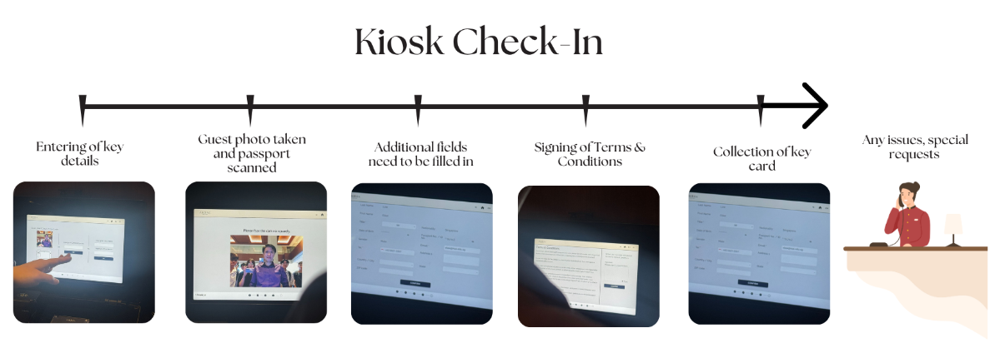
</div>

<p style="text-align:center; font-style:italic; font-size:0.9em;"><strong>Figure G.3: Self-Service Kiosk Check-In</strong></p>

As hotels experiment with automation to enhance efficiency and reduce manpower dependency, self-service kiosks have become increasingly common, especially in business and mid-to-upscale hotels. These kiosks aim to streamline routine procedures such as guest identification, payment, and room key issuance — mirroring the self-check-in models seen in airports. In Singapore, automation has been widely encouraged to address labour shortages and operational inefficiencies in the hospitality sector (Ernst & Young, 2023). However, while kiosk systems deliver measurable gains in speed and consistency, they also expose gaps in emotional engagement and personalization — both critical attributes of the luxury segment.


<table class="rt">
  <thead><tr><th>#</th><th>Stage</th></tr></thead>
  <tbody>
    <tr>
      <td class="rt-num">1</td>
      <td>
        <div class="rt-head">Entering of Key Details</div>
        <div class="rt-guest"><span class="rt-label">Guest perspective:</span> Guests generally perceive the kiosk as efficient and straightforward, appreciating the ability to bypass long queues. However, many express frustration that they still have to manually enter personal information even if these details were already provided during online booking — contradicting the promise of a seamless digital experience.</div>
        <div><span class="rt-label">Staff perspective:</span> The automation of initial data entry reduces front desk workload, allowing staff to supervise multiple kiosks simultaneously and assist guests only when necessary — enabling a more relaxed, concierge-like presence on the floor rather than behind the counter.</div>
      </td>
    </tr>
    <tr>
      <td class="rt-num">2</td>
      <td>
        <div class="rt-head">Guest Photo and Passport Scanning</div>
        <div class="rt-guest"><span class="rt-label">Guest perspective:</span> The passport scanning and verification process reinforces efficiency but introduces a transactional, impersonal tone. Guests accustomed to high-touch luxury interactions often perceive the lack of human acknowledgment as diminishing the sense of welcome.</div>
        <div><span class="rt-label">Staff perspective:</span> Kiosks significantly reduce training time — from an estimated one month to about a week — as staff no longer need to memorise complex PMS workflows. However, staff must still intervene frequently when the kiosk's document recognition fails, especially with non-standard passports or international ID formats.</div>
      </td>
    </tr>
    <tr>
      <td class="rt-num">3</td>
      <td>
        <div class="rt-head">Filling Additional Fields and Signing T&amp;Cs</div>
        <div class="rt-guest"><span class="rt-label">Guest perspective:</span> This stage is where friction typically resurfaces. Guests may be required to fill in multiple mandatory fields, sign digital forms, and review terms on-screen. For less tech-savvy users or older guests, the interface can appear daunting, particularly if touch targets are small or instructions unclear.</div>
        <div><span class="rt-label">Staff perspective:</span> While kiosks handle the procedural aspects of check-in, they remain limited in scope — unable to accommodate complex or exception-based requests such as split billing, room upgrades, or special amenities. Staff must therefore monitor the kiosks closely to address these exceptions in real time.</div>
      </td>
    </tr>
    <tr>
      <td class="rt-num">4</td>
      <td>
        <div class="rt-head">Collection of Key Card and Handling of Issues</div>
        <div class="rt-guest"><span class="rt-label">Guest perspective:</span> Guests expect the process to conclude smoothly once the key card is dispensed. However, issues such as incorrect room assignment, non-functional cards, or unmet special requests often require them to return to the counter — undermining the convenience of the kiosk experience.</div>
        <div><span class="rt-label">Staff perspective:</span> Front desk teams report that kiosks reduce repetitive administrative tasks, freeing time for proactive engagement. However, system limitations lead to fragmented workflows — tasks often have to be finalised manually in the PMS, creating inconsistency in record-keeping and increasing post-check-in corrections.</div>
      </td>
    </tr>
  </tbody>
</table>


---

  

<div style="text-align: center; margin: 16px 0;">
  
</div>

<p style="text-align:center; font-style:italic; font-size:0.9em;"><strong>Figure G.4: Luggage Handling Journey Map (modelled from Marina Bay Sands)</strong></p>

The luggage handling journey documents the physical arrival experience as a distinct dimension of the guest stay. Unlike the check-in flows above, this journey is physically demanding, spatially disruptive, and almost entirely staff-dependent, with no existing automated or digital system in place across any property observed.


<table class="rt">
  <thead><tr><th>#</th><th>Stage</th></tr></thead>
  <tbody>
    <tr>
      <td class="rt-num">1</td>
      <td>
        <div class="rt-head">Guest Arrival and Luggage Handoff</div>
        <div class="rt-guest"><span class="rt-label">Guest perspective:</span> Guests arriving with extensive luggage — oversized cases, plastic bags, or irregularly shaped items — often find the handoff process rushed and inconsistent, with no clear protocol for what gets taken and what remains with the guest.</div>
        <div><span class="rt-label">Staff perspective:</span> Bellboys must quickly assess each arrival, deploying additional staff for large luggage volumes and making individual judgement calls for irregular items. During peak periods, multiple bellboys assigned to a single vehicle can draw resources away from other arriving guests.</div>
      </td>
    </tr>
    <tr>
      <td class="rt-num">2</td>
      <td>
        <div class="rt-head">Luggage Tagging</div>
        <div class="rt-guest"><span class="rt-label">Guest perspective:</span> Luggage is tagged in front of the guest before being taken out of sight, providing some reassurance. However, the entirely manual process feels dated and slow, particularly when multiple pieces must each be individually tagged. Guests have no visibility of their luggage after this point, which can create anxiety.</div>
        <div><span class="rt-label">Staff perspective:</span> Bellboys remain fully accountable for luggage security until delivery. The process relies entirely on individual staff attentiveness and is vulnerable to human error, with no digital fallback.</div>
      </td>
    </tr>
    <tr>
      <td class="rt-num">3</td>
      <td>
        <div class="rt-head">Transport and Delivery</div>
        <div class="rt-guest"><span class="rt-label">Guest perspective:</span> Luggage carts travelling across the lobby floor create visual disorder inconsistent with the hotel's luxury positioning. Guests are also left uncertain about where their luggage is and when it will arrive. Guests expect their bags to be in the room the moment they enter.</div>
        <div><span class="rt-label">Staff perspective:</span> Staff must navigate active lobby spaces with covered trolleys during peak periods, completing a physically demanding circuit repeated for every arriving guest. Room delivery marks the final step, but any delay or mismatch at this stage compounds earlier friction and reflects poorly on the entire arrival experience.</div>
      </td>
    </tr>
  </tbody>
</table>


<a id="appendix-h"></a>

## Appendix H: Stakeholder Profiles

  

<div style="text-align: center; margin: 16px 0;">
  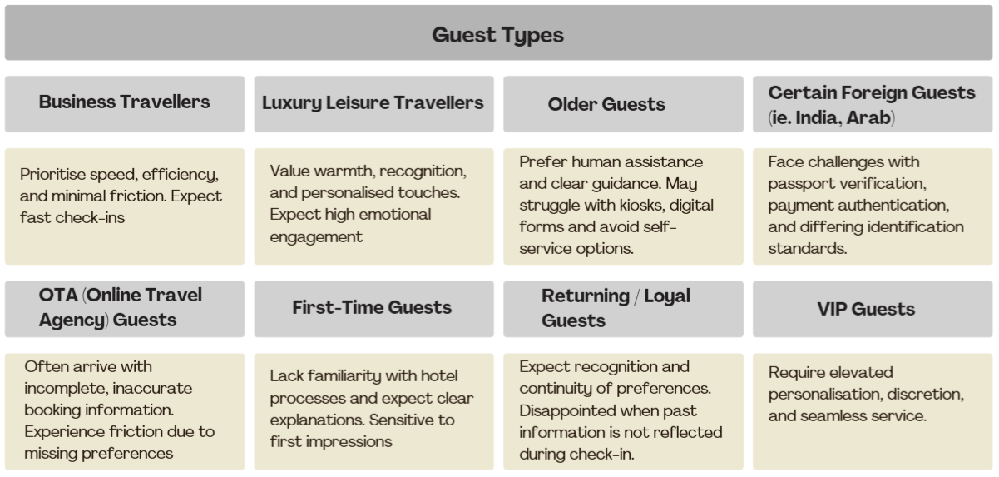
</div>

<p style="text-align:center; font-style:italic; font-size:0.9em;"><strong>Figure H.1: Diverse Guest Profiles and Their Unique Check-In Challenges</strong></p>

While each guest segment varies in priorities, their foundational expectations remain consistent.


<table class="rt">
  <tbody>
    <tr>
      <td>
        <div class="rt-card">
          <div class="rt-card-head">Core Expectations</div>
          Fast, seamless, low-friction check-in &bull; Recognition, warmth, and personalisation &bull; Clear communication and prompt issue resolution &bull; Strong reassurance of data privacy and consent
        </div>
        <div class="rt-card">
          <div class="rt-card-head">Pain Points</div>
          <ul>
            <li>Long queues and waiting times, especially during peak hours</li>
            <li>Inconsistency in greetings and human warmth across staff and properties</li>
            <li>Impersonal kiosk interactions that feel transactional and misaligned with luxury price points</li>
            <li>Frustration when special requests or preferences are not reflected at check-in</li>
            <li>Limited capability of current kiosks to handle complex or exception-based needs</li>
            <li>Lacking guidance in navigating the lobby and reaching the room</li>
            <li>Uncertainty about luggage status and delivery timing</li>
          </ul>
        </div>
        <div class="rt-card">
          <div class="rt-card-head">Needs</div>
          Faster, smoother, low-friction check-in &bull; Warm, personalised interactions that match luxury standards &bull; Seamless physical guidance from vehicle drop-off through to the room
        </div>
      </td>
    </tr>
  </tbody>
</table>


**2 Front-Office Staff**

Front-office staff are responsible for executing the end-to-end check-in process, navigating complex systems such as Opera PMS, verifying guest identities, processing payments, managing room allocations, and handling real-time guest inquiries, all while maintaining warmth, composure, and attentiveness. This combination of administrative demand and emotional labour defines the central challenge of the front desk role.


<table class="rt">
  <tbody>
    <tr>
      <td>
        <div class="rt-card">
          <div class="rt-card-head">Core Expectations</div>
          Deliver high-touch hospitality and maintain warm guest interactions &bull; Accurately verify identities, process payments, check/modify reservations &bull; Ability to multitask without compromising warmth or composure &bull; Manage real-time issues, exceptions, and service recovery &bull; Uphold brand standards under pressure
        </div>
        <div class="rt-card">
          <div class="rt-card-head">Pain Points</div>
          <ul>
            <li>Heavy multi-tasking (PMS navigation, answering calls, chat, guest queries)</li>
            <li>Complex systems (e.g., Opera PMS) that require deep knowledge and many clicks</li>
            <li>High risk of errors (misspelling names, incorrect allocations or missing requests)</li>
            <li>Stress from impatient guests, queue pressure, and service recovery situations</li>
            <li>Limited time and mental bandwidth to deliver personalised greetings</li>
            <li>Inconsistent handovers between shifts due to poor note capture</li>
          </ul>
        </div>
        <div class="rt-card">
          <div class="rt-card-head">Needs</div>
          Tools that reduce repetitive administrative workload &bull; Systems with low cognitive load and minimal training curve &bull; Real-time visibility of guest data, preferences, and history &bull; Error-reduction support (auto-fill, guidance, note capture)
        </div>
      </td>
    </tr>
  </tbody>
</table>


Within the broader front-office team, bellmen and porters occupy a distinct and physically demanding sub-role. Their primary responsibility is the handling and transport of guest luggage from arrival to room, a task that is labour-intensive, physically taxing, and operationally inconsistent across properties.


<table class="rt">
  <tbody>
    <tr>
      <td>
        <div class="rt-card">
          <div class="rt-card-head">Core Expectations</div>
          Deliver high-touch hospitality and maintain warm guest interactions &bull; Manage guest luggage accurately and without delay &bull; Physical labour without compromising warmth or composure
        </div>
        <div class="rt-card">
          <div class="rt-card-head">Pain Points</div>
          <ul>
            <li>Repeated heavy lifting causes occupational health risk</li>
            <li>Manual luggage tagging prone to errors, mismatches, and slow retrieval</li>
            <li>Inconsistent service bandwidth due to manpower constraints</li>
          </ul>
        </div>
        <div class="rt-card">
          <div class="rt-card-head">Needs</div>
          Physical support or tools to reduce lifting load and frequency across shifts &bull; Digital luggage tracking to eliminate tagging errors and improve retrieval accuracy &bull; Pre-arrival guest information to enable proactive and personalised service at the entrance
        </div>
      </td>
    </tr>
  </tbody>
</table>


**3 Hotel Management**

Hotel managers oversee the performance and consistency of front office operations, ensuring that staff deliver service that meets luxury hospitality standards. They coordinate manpower, manage scheduling, monitor service quality metrics, resolve guest escalations, and make decisions on technology adoption. Their responsibilities bridge guest satisfaction, staff capability, and operational efficiency.


<table class="rt">
  <tbody>
    <tr>
      <td>
        <div class="rt-card">
          <div class="rt-card-head">Core Expectations</div>
          Ensure consistent service quality across varying staff skill levels &bull; Manage manpower allocation, scheduling, and team performance &bull; Oversee guest satisfaction scores and service recovery protocols &bull; Make decisions on technology investment and operations
        </div>
        <div class="rt-card">
          <div class="rt-card-head">Pain Points</div>
          <ul>
            <li>Persistent manpower shortages and high turnover</li>
            <li>Maintaining consistent service quality with inexperienced staff</li>
            <li>Fragmented tech stack leading to inefficiencies</li>
            <li>High cost and complexity of implementing new technology</li>
            <li>Pressure to balance luxury expectations with operational constraints</li>
          </ul>
        </div>
        <div class="rt-card">
          <div class="rt-card-head">Needs</div>
          Tools that increase staff productivity and reduce training time &bull; Cost-effective, scalable solutions that integrate with existing systems &bull; Visibility into operational bottlenecks and performance trends &bull; Systems that reduce service inconsistencies and empower staff
        </div>
      </td>
    </tr>
  </tbody>
</table>


**4 Technology Department**

Technology departments maintain the hotel’s digital ecosystem, including PMS, kiosk systems, CRM platforms, keycard systems, automated check-in solutions, and cybersecurity protocols. They ensure that systems remain compliant with data protection policies. Additionally, they support integrations, automation implementation and maintenance, troubleshooting system failures, and evaluating new technologies for feasibility and ROI. Their work underpins the operational reliability needed for smooth check-ins and personalised guest experiences.


<table class="rt">
  <tbody>
    <tr>
      <td>
        <div class="rt-card">
          <div class="rt-card-head">Core Expectations</div>
          Maintain system reliability, uptime, and integration health &bull; Oversee data governance, cybersecurity, and PDPA compliance &bull; Support deployment, troubleshooting, and tech adoption &bull; Ensure smooth operation of PMS, kiosks, key systems, and APIs
        </div>
        <div class="rt-card">
          <div class="rt-card-head">Pain Points</div>
          <ul>
            <li>Legacy systems with limited flexibility and heavy vendor lock-in</li>
            <li>Integration issues between kiosks, PMS, and CRM systems</li>
            <li>High risk associated with AI overhearing or data misuse</li>
          </ul>
        </div>
        <div class="rt-card">
          <div class="rt-card-head">Needs</div>
          Modular and easily maintainable solutions &bull; Secure systems with strong privacy protections and local processing &bull; Minimal disruption to operations during integration &bull; Reduced dependency on third-party vendors
        </div>
      </td>
    </tr>
  </tbody>
</table>


<a id="appendix-i"></a>

## Appendix I: Alluvio — Prototype Documentation

Alluvio covers the pre-booking and booking phases of the luxury hotel check-in journey. Our goal is to design an intelligent, secure luxury system that intuitively captures and organises guest preferences. Through a fun, swipe-based interface, guests can build dynamic, evolving profiles while AI delivers personalised recommendations based on their preferences. Profiles can also securely store essential travel documents such as Visas, for easy and anytime access. With explicit consent, this information can be shared accurately across onboarded luxury hotels via secure integrations with their hotel management systems.

**Design Rationale**  
Most guests start looking for accommodation on Online Travel Agencies such as Booking.com, Expedia, Trip.com and Agoda. These platforms act as a centralised hub that allows users to compare prices, amenities and reviews across a wide range of properties, helping them find the best fit with minimal effort and high convenience. In recent years, many OTAs have expanded beyond hotel stays to include rental cars, attractions, flights and even airport transfers to the booked hotel, reinforcing their position as a one stop shop for travellers. According to a 2024 hotel distribution report, the vast majority of guests in Asia and Europe continue to book through these indirect channels, based on data from 2018 to 2023 as shown in Figure 10 ([Hotel Distribution Report, 2024](https://www.d-edge.com/wp-content/uploads/2024/04/Hotel-Distribution-Report-2024-EN.pdf)). A similar pattern is observed in the United States, where data collected in 2019, 2021 and 2023 indicates that OTAs remain a dominant booking channel, as shown in Figure 11 ([Phocuswright Research](https://www.phocuswright.com/Travel-Research/Research-Updates/2022/by-2023-hotel-supplier-direct-will-again-surpass-ota), 2022). Together, these findings demonstrate how OTAs have become modern day leviathans in travel, shaping how guests search for and book their stays.

  

<div style="text-align: center; margin: 16px 0;">
  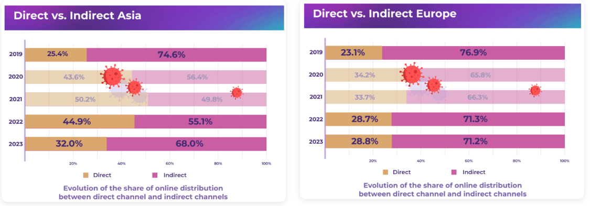
</div>

<p style="text-align:center; font-style:italic; font-size:0.9em;"><strong>Figure I.1: Share of direct and indirect online hotel bookings in Asia and Europe from 2019 to 2023</strong></p>

  

<div style="text-align: center; margin: 16px 0;">
  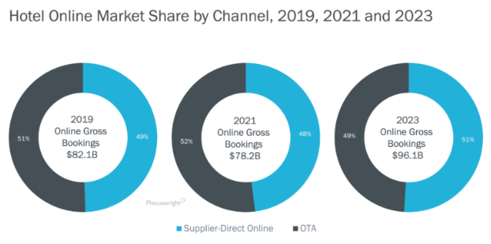
</div>

<p style="text-align:center; font-style:italic; font-size:0.9em;"><strong>Figure I.2: Share of direct and indirect online hotel bookings in the United States in 2019, 2021 and 2023</strong></p>

However, while OTAs bring clear benefits to guests, they are not as well received by hotels. OTAs function as intermediaries, which can introduce misrepresentation of hotel offerings, including outdated photos, inaccurate descriptions or missing amenities ([Goswami, 2024](https://www.ezeeabsolute.com/blog/ota-vs-direct-booking/)). From our interviews with hotel staff, we also learned that OTAs do not always pass on guest information accurately and in some cases do not share it at all. This breakdown in communication can lead to guest dissatisfaction when preferences or special requests are not properly recorded or honoured at the property.

These shortcomings help explain why many hotels prefer direct bookings. When guests book directly, hotels gain full access to guest data, which enables deeper personalisation and a stronger sense of hospitality. Direct access to accurate guest profiles allows hotels to tailor services, anticipate needs and build long term relationships rather than simply fulfilling a transaction. More importantly, hotels can avoid the commission fees that OTAs typically charge, which are often in the range of 15-30% of the booking value (Huang, 2025). For hotels, direct bookings therefore combine better control over the guest experience with improved financial outcomes.

**Value Proposition**  
From here, we recognise that OTAs play an important role. They give hotels visibility, help them reach a wider audience and make it easy for guests to discover and compare options. At the same time, hotels still value direct bookings because they allow them to build stronger relationships with guests, personalise the stay and retain more revenue. Instead of replacing OTAs, our aim is to bring the best of both worlds together.

As such, Alluvio keeps the convenience and reach of OTAs while creating a direct and effortless connection between guests and the hotel. Through the integrated app and web platform, guests enjoy a smoother and more personalised pre-arrival experience and hotels can better anticipate their needs through direct communication. By allowing guests to apply their hotel loyalty programmes when booking through Alluvio, which is something that is not typically possible on OTAs, Alluvio makes the experience feel as seamless and rewarding as booking directly with the hotel while still delivering a level of service that reflects modern luxury.

**User Testing and Analysis**

We had the opportunity to conduct user testing and analysis with hotel guests and staff, who are the two key stakeholder groups for Alluvio. Guests shared valuable feedback on both usability and the overall experience. They highlighted the need to reduce interaction friction, such as keeping all swipe options on the same page to avoid unnecessary scrolling. Guests also expressed that first time discounts or immediate rewards would motivate them to download and try a new platform. In addition, they were enthusiastic about features that help them discover hotels more easily, such as personalised recommendations based on their preference profiles.

As for hotel staff, their insights centred strongly on revenue considerations. They emphasised that profit margins are always at the core of decision making and that guest preference data or personalised services are valuable mainly because they help guests feel that their stay is worth returning for. Staff noted that OTAs typically take between 16-20% of a room’s price, so from a business perspective they are open to adopting new platforms that offer more competitive pricing models. They also raised concerns about direct channel poaching, where guests who book through Alluvio could potentially be redirected by the hotel to amend or rebook their stay directly with the property due to the direct communication. This highlights the need for clear non-solicitation and shared data agreements if Alluvio were to work smoothly with hotels. Finally, staff suggested that Alluvio could offer guests meaningful benefits, such as a loyalty tier programme or the ability to stack rewards on top of existing hotel loyalty schemes, in order to motivate guests to use the platform.

These insights from guests and staff helped clarify Alluvio’s positioning and guided improvements to our interface and features. They are valuable considerations that we will carry forward as we decide on our final direction and solution.

<a id="appendix-j"></a>

## Appendix J: AI Kiosk Assistant — Prototype Documentation

The AI Kiosk Assistant is a complementary device that works alongside existing self-service kiosks, keeping their speed while adding warmth and guidance. It uses a natural, conversational voice to talk with guests, help them through check-in, and gently capture their preferences.

**Design Rationale (Primary)**  
Through site visits to multiple hotels in Singapore and interviews with front-office staff and managers, we examined how existing self-service kiosks are deployed and experienced in practice. In one hotel, for example, we observed tourists approaching the kiosk, appearing confused, and quickly searching for staff rather than completing check-in independently, highlighting a lack of clear guidance and reassurance. Across these observations and interviews, we distilled recurring pain points:

- Kiosks were too transactional and non-conversational  
- Lacked guidance and emotionless  
- Misaligned with luxury price points  
- Inadequate when guests had questions or exceptions to handle

These insights suggest that the core issue is not automation itself, but that current kiosk experiences lack emotional engagement, clear guidance, and a sense of being genuinely cared for.

**Design Rationale (Secondary)**  
Secondary research points to a persistent tension between automation and emotional connection in hospitality. Automation can improve efficiency and consistency, but it often reduces warmth and empathy; qualities that are central to genuine hospitality. Studies also show that when self-service systems replace face-to-face interaction, guest satisfaction tends to drop, especially in areas like personalisation and perceived service quality (Christou et al., 2023).

Moreover, studies indicate that reduced interpersonal interaction in self-service systems negatively impacts guest satisfaction, particularly in areas related to personalization and perceived service quality (Peng & Zhang, 2020).

Despite technological advancements, guests continue to value human guidance in handling exceptions, building trust, and creating meaningful service experiences, showing that technology alone cannot meet the emotional expectations of luxury travelers (Christou et al., 2023). Consequently, emerging research supports a “High Touch  High Tech” approach that combines human empathy with intelligent automation to achieve both operational excellence and lasting guest satisfaction (Nichols, 2025).

Collectively, these insights underscore the importance of designing solutions such as the AI Kiosk Assistant that balance efficiency with emotional resonance to redefine the modern luxury experience.

**Value Proposition**  
For guests, the AI Kiosk Assistant offers the speed of a self-service kiosk with the reassurance of a human host. It turns the interaction from transactional to conversational, provides clear step-by-step guidance, responds to simple questions and exceptions, and adds emotional warmth and light personalisation so that using a kiosk feels aligned with luxury expectations rather than “cheap” or mechanical.

For hotels, it encourages higher kiosk adoption without the cost and disruption of a full hardware overhaul, as it can be added onto existing devices as a complementary layer.

Key Features

- Conversational Guidance: Natural voice interaction that welcomes guests, explains steps, and reduces confusion at the kiosk.  
- Policy & Knowledge Awareness: Powered by OpenAI’s large language model that can be tailored with hotel policies, FAQs, and local information, so responses stay accurate and context-specific.  
- Exception Handling & Escalation: Lets guests ask simple questions (e.g. late check-out, bedding type, package entitlements) and either provides guided answers or seamlessly routes the issue to front-office staff when human intervention is needed.  
- Light Personalisation: Picks up basic preferences (e.g. pillow type, dietary requirements) during conversation  
- Emotionally Aware Tone: Uses friendly, reassuring language and pacing to make the interaction feel less mechanical and more in line with a luxury experience.  
- Retrofit-Friendly Setup: Designed to work alongside existing kiosk hardware and check-in flows with minimal operational change, avoiding a full system overhaul.

**User Testing and Analysis**

Feedback from Hotel Stakeholders and Industry Partners  
To validate the AI Kiosk Assistant concept, we conducted early-stage user testing with front desk staff, hospitality trainees, and industry partners. The feedback provided valuable direction for refinement, summarised below:

1 Operational Realism and Alignment with SOPs

Stakeholders stressed that any AI layer must align with real hotel procedures rather than just “talk nicely” on top of the kiosk. They emphasised that the system must support upselling within existing hotel policies, check booking time, room status, and room type before issuing a key, and escalate to staff when rooms are unavailable or exceptions arise. Overall, this feedback underscored the importance of operational accuracy and strict adherence to SOPs, guiding our next steps to refine system flows so they mirror existing procedures and escalation rules to ensure seamless hotel adoption.

2 Voice Interaction, Noise, and Error Handling

Stakeholders raised concerns about whether voice interaction would function reliably in real hotel environments. They noted that lobbies can be noisy, especially during events, making it difficult for the AI to hear guests accurately, and there was worry that the system might overhear nearby conversations and respond inappropriately. Together, these points highlighted the need for robust handling of noise, misrecognition, and unintended activations. In response, our next steps focus on implementing dynamic audio systems and utilising touch-to-speak mechanisms to ensure more reliable interactions.

3 Privacy, Data Protection, and Guest Expectations

Both hotel stakeholders and Venture Corporation emphasised strong concerns around privacy and data protection. They worried that the AI might overhear nearby conversations, questioned where voice data would be sent or stored in relation to PDPA requirements, and stressed the need to reassure guests that the system only listens when intentionally activated. This feedback highlighted the importance of moving toward privacy-by-design solutions, shaping our next steps to establish clearer boundaries around when the AI is active and explore on-device processing such as EdgeAI to minimise data exposure.

4 Cost, ROI, and Adoption Risk

Cost and return on investment emerged as major concerns. With a single kiosk already costing around SGD 28,000, hotels questioned whether adding an AI layer would deliver clear, measurable benefits. Their feedback emphasised the need for a strong business case, guiding our next steps to assess whether the added investment can be justified.

Feedback from Potential Guests

Additionally, early-stage user testing with potential guests in a simulated setting revealed that users were open to guided automation and felt comfortable using a kiosk when it offered clear step-by-step instructions and reassurance at key moments. However, some were uneasy about speaking personal details aloud in a public lobby and preferred having the option to switch to touch input for sensitive information. 

<a id="appendix-k"></a>

## Appendix K: Hotelly — Prototype Documentation

Building on the identified challenges of manpower shortages, inconsistent service quality, and rising guest expectations, our team developed Hotelly, an AI overlay system designed to discreetly support front desk staff during the hotel check-in process. Rather than replacing human hospitality, Hotelly enhances it. It serves as a real-time “co-pilot” that empowers staff to deliver warm, precise, and personalized service even under pressure.

Hotelly operates as a context-aware assistive layer, providing live prompts, key guest information, and automated note capture during guest interactions. This helps staff maintain composure and consistency, ensuring that high-touch service standards are met regardless of varying experience levels among employees. The prototype was inspired by successful analogues such as Google Contact Center AI, Otter.ai, and Cluely, which have demonstrated the technical viability of real-time overlays in other high-stakes conversational environments ([AmplifAI, 2024](https://www.amplifai.com)).

**Design Rationale**  
The design rationale behind Hotelly was shaped by a recurring insight from our fieldwork across luxury hotels: although technology can streamline back-end processes, the essence of frontline hospitality remains profoundly human. Guest-facing excellence depends on staff judgement, composure, and consistent delivery, all traits that are increasingly difficult to maintain amid labour shortages, variable training quality, and rising expectations for personalization (Ernst & Young, 2023). Rather than pursuing automation for its own sake, the team anchored the concept in an assistive paradigm: augmenting human capability rather than replacing it. Hotelly was therefore conceived as an AI co-pilot that strengthens service delivery while preserving the warmth and intentionality associated with luxury hospitality.

A key challenge uncovered during ethnographic observations was the cognitive load placed on front desk staff. Check-in requires parallel management of guest verification, data entry, problem-solving, and rapport-building  all while staying attentive and composed. Less experienced staff often struggled to recall phrasing, hotel policies, or local recommendations without breaking conversational flow. To address this, Hotelly introduces context-sensitive, real-time guidance delivered through a minimal peripheral overlay. This design takes inspiration from tools such as Google Contact Center AI and Cluely, which demonstrate how subtle prompts can bolster performance without becoming intrusive. By surfacing relevant information at the right moment, Hotelly supports knowledge recall and reduces hesitation, enabling staff to maintain natural interaction and human presence. Preserving emotional connection was another foundational principle. Luxury guests consistently emphasized the value of eye contact, warmth, and authentic conversation; intrusive technology was seen as detracting from these qualities. User testing revealed strong resistance toward head-mounted interfaces, which were described as “awkward” and “dehumanizing.” As a result, Hotelly intentionally adopts a desktop-based design with compact, digestible prompts that live at the edges of the interface. This ensures that guidance remains available without pulling attention away from the guest or encouraging staff to read verbatim from a script. The system complements the choreography of human interaction.

Beyond moment-to-moment guidance, Hotelly also addresses a broader operational gap: the loss of service continuity between shifts. Many hotels suffer from inconsistent documentation of guest preferences and interactions, leading to lapses in personalization. Hotelly’s automated note capture and summarization create structured, timestamped records of guest conversations, improving handovers and supporting more accurate post-stay personalization and dispute resolution. This mirrors contemporary coaching systems (AmplifAI, 2024), where reflective review strengthens team capability over time. Together, these design choices reflect EHL Insights’s (2025) principle that AI in hospitality should enhance, not replace, empathy and human judgement. Ultimately, Hotelly aims to bridge automation with emotional intelligence, elevating the guest experience by empowering the people at its center.

**Value Proposition**  
Hotelly delivers value by strengthening the quality and consistency of front desk service while preserving the human warmth central to luxury hospitality. The system equips staff with subtle, real-time prompts that enhance confidence, speed, and accuracy during guest interactions, helping them respond more naturally and maintain composure even under pressure. This ensures that high-touch service can be delivered reliably across varying experience levels.

In addition, Hotelly automates the capture of guest notes, preferences, and key conversational details, reducing manual administrative work and improving continuity across shifts. By integrating lightweight automation with human-centric guidance, the system enhances personalization, reduces cognitive load, and reinforces a seamless, brand-aligned check-in experience that benefits both staff and guests.

**User Testing and Analysis**

To validate the Hotelly concept, we conducted early-stage user testing with front desk staff and hospitality trainees. The feedback provided valuable direction for refinement, summarized below:

1 Real-Time Retrieval Builds Confidence  
Many users described Hotelly as enabling them to appear “more knowledgeable” and “calmer under pressure.” Staff found it particularly helpful in recalling park timings, local attractions, or property-specific policies that they could not always memorize. The ability to surface key facts instantly helped maintain smooth conversational flow and reduced anxiety, especially among newer employees. This validated our hypothesis that cognitive offloading through AI can elevate, not hinder guest interaction quality.

2 Training Potential Strongly Validated  
Participants widely recognized Hotelly’s potential as a training companion. New or junior staff saw it as a safety net that enabled them to handle complex guest requests more confidently. One participant noted: “It’s more useful as a training tool than in real life. But for new hires, it’s perfect.” This led to the concept of a dual-mode interface, a “Training Mode” with more guidance and feedback prompts, and a “Live Mode” optimized for minimal intrusion during actual guest interactions.

3 Automated Note-Taking as a Key Value Driver  
Automation of guest note capture was consistently highlighted as one of Hotelly’s most valuable features. Staff emphasized its potential for dispute resolution, shift continuity, and personalized service. However, they also noted that accuracy and brevity would be critical: “It even summarises preferences, that’s very helpful, but accuracy is important.”This feedback informed our next development milestone  integrating real-time summarization with adjustable confidence thresholds to balance automation and reliability.

4 Managing Cognitive Offloading and Skill Atrophy  
While automation was largely welcomed, several respondents expressed concern about potential skill atrophy. Over-reliance on AI prompts might make staff dependent on the system rather than internalizing knowledge. As one user put it: “This could make staff lazy… they might just read off it instead of remembering.” These insights guided our philosophy that Hotelly should serve as a co-pilot, not a crutch, providing support while encouraging independent learning through gradual reduction of assistance.

5 Interface and Usability Feedback  
Aesthetics and legibility were key concerns. Staff preferred short bullet points, large fonts, and strong visual hierarchy for quick scanning. They emphasized that the overlay should never compete with the PMS (Property Management System) interface, but rather complement it. This will guide subsequent iterations focusing on adaptive UI scaling, contrast sensitivity, and contextual card grouping.

6 Discretion in Guest-Facing Interactions  
A final insight related to physical discretion was that participants felt that using smart glasses or overly visible devices risked making interactions feel robotic. Instead, staff favored screen-based overlays placed subtly on monitors or tablets. This feedback affirmed the decision to keep Hotelly’s presence peripheral and contextually embedded within existing workflows.

Together, these insights underscored the importance of balance—between speed and subtlety, automation and authenticity, information and intuition.

<a id="appendix-l"></a>

## Appendix L: Aria — Prototype Documentation

Aria is an AI assistant designed to help staff focus on conversation rather than typing. It empowers hospitality staff through voice-driven data capture and real-time transcription without recording. Conversation details could be automatically autofilled into guest profile and request fields, while guided prompts provide answers to guest inquiries, suggest follow-up questions, generate real-time summaries, and support personalised recommendations. Aria could also reference hotel policies, FAQs, internal databases such as room availability, and safe external web information. To maintain accuracy and accountability, staff would be able to manually verify, edit, and approve all extracted information. Consent, privacy, and data governance remain central: Aria would require explicit guest consent before activation, retain transcripts only briefly for verification, encrypt any stored text, and maintain audit trails for compliance. Operationally, Aria could integrate with existing systems such as Opera PMS to support seamless workflow integration.

**Design Rationale (Primary)**  
From our interviews, we found that front desk staff often struggle to balance conversation and data entry. Staff members described needing to pause interactions to avoid mistakes, which prolongs the process. Staff also get bombarded with guest questions and also frequently need to multitask. Such as across calls, chatboxes, in-person queries, and typing into systems, some of which occur simultaneously. Since details are manually keyed into Opera, mistakes such as missing or wrong/misspelled information may occur. These insights highlight the need for a tool that reduces typing burden and supports accurate, real-time data capture.

**Design Rationale (Secondary)**  
As personal service by staff remains an important skill, research across luxury hospitality consistently shows that high-touch remains central to luxury, and technology should enhance rather than replace human warmth and empathy,(World, 2025; AL-HYARI et al., 2023; [Bharwani & Mathews, 2021](https://www.researchgate.net/publication/352012550_Techno-business_strategies_for_enhancing_guest_experience_in_luxury_hotels_a_managerial_perspective); EHL Insights, 2025). This informs our decision to position Aria for staff support instead of replacement.

AI can streamline routine administrative tasks and boost efficiency, improving service quality and allowing employees to focus on higher-value meaning guest interactions, creating a lasting impression (Bharwani & Mathews, 2021; EHL Insights, 2025). In this context, Aria automates typing so staff can focus more on the guest.

Moreover, technology enables superior guest service and improves guest satisfaction by helping hotels identify and anticipate guest needs. It acts as an efficiency enhancer that equips staff with real-time, guest-specific and directly relevant information, combining data-driven precision with human empathy to elevate personalisation experience and service (AL-HYARI et al., 2023; Bharwani & Mathews, 2021). This aligns with our design choice for Aria to analyses guest profiles to tailored prompts and service recommendations, and support staff with answers to guest questions.

**Value Proposition**  
For hotel staff who need to reduce manual workload while multitasking, ARIA is an AI-powered assistant that listens to guest conversations, automatically captures key information, and provides real-time intelligent prompts and answers. Delivering seamless and faster integration into hotel processes, allowing staff to focus on delivering personalized, high-touch guest experiences.

Unlike manual workflows where staff must track guest requests while juggling real-time interactions, ARIA supports rather than replaces staff tasks by reducing administrative burden, keeping them in the loop for verification, and providing quick access to information. This ensures accuracy, reduces stress and enhances workflow.

**User Testing and Analysis**

1 Accuracy Concern

During feedback sessions, the manager raised concerns about accuracy and the risk of staff over-relying on AI. They worried that staff may lose focus or assume the system captured information when it did not, which could lead to problems. Staff emphasised that the effectiveness of an AI assistant depends heavily on its reliability and the need for staff to remain very attentive and actively verify information. In response, Aria can incorporate real-time confirmation prompts and to maintain accuracy and accountability and ensure that control over guest data always rests with staff. Concerns also emerged regarding microphone sensitivity and placement. The manager noted that counters in close proximity could cause the mic to pick up conversations from neighbouring guests. Solutions can include using directional microphones and training the AI to distinguish speakers to mitigate background voice capture.

2 Data Protection


Data protection was another major concern. The manager highlighted PDPA risks, noting that guests can be very sensitive about data protection such as voice and cited “voice leak scandals” as to why guests may fear being recorded and also mention the importance of assuring guests that all data is deleted. He also mentioned that some staff might activate the tool even without obtaining consent. To address this, Aria requires explicit consent before activation, uses real-time transcription without storing raw audio and should include a visible active indicator, enforce audit trails with logged user actions and timestamps, and automatically delete transcripts after a defined period with a logged deletion timestamp. The IT director further stressed that any stored transcript must be encrypted.

3 Value of autofill

Feedback also revealed mixed views about the usefulness of the auto-fill feature. The IT director acknowledged its value for capturing guest preferences and requests, noting that such requests could ideally be routed directly to service centres. However, the front office manager questioned its benefit for very short or simple interactions, where manual typing could be done quickly and easily. This informed our positioning that Aria is most beneficial in long, information-heavy, or multitasking situations rather than every check-in.

<style>
  body {
    margin: 0;
    padding: 0;
    padding-left: 300px;
    font-family: -apple-system, BlinkMacSystemFont, 'Segoe UI', Helvetica, Arial, sans-serif;
  }
  
  body > *:not(.toc-sidebar):not(style):not(script) {
    max-width: 1100px;
    margin-right: auto;
  }
  
  .report-container {
    display: flex;
    min-height: 100vh;
    margin-left: 0;
  }
  
  .toc-sidebar {
    position: fixed;
    left: 0;
    top: 0;
    width: 280px;
    height: 100vh;
    overflow-y: auto;
    background-color: #f8f9fa;
    border-right: 1px solid #e1e4e8;
    padding: 20px;
    box-sizing: border-box;
    z-index: 1000;
  }
  
  .toc-sidebar h2 {
    margin-top: 0;
    margin-bottom: 16px;
    font-size: 18px;
    font-weight: 600;
    color: #24292e;
    border-bottom: 2px solid #e1e4e8;
    padding-bottom: 8px;
  }
  
  .toc-sidebar ul {
    list-style: none;
    padding: 0;
    margin: 0;
  }
  
  .toc-sidebar li {
    margin: 4px 0;
  }
  
  .toc-sidebar a {
    display: block;
    padding: 6px 8px;
    color: #0366d6;
    text-decoration: none;
    font-size: 14px;
    line-height: 1.5;
    border-radius: 3px;
    transition: background-color 0.2s;
  }
  
  .toc-sidebar a:hover {
    background-color: #e1e4e8;
    text-decoration: none;
  }
  
  .toc-sidebar a:active,
  .toc-sidebar a:focus {
    background-color: #d1d5da;
  }
  
  .toc-sidebar > ul > li > a {
    font-weight: 600;
    margin-top: 8px;
  }
  
  .toc-sidebar > ul > li {
    position: relative;
  }
  
  .toc-sidebar > ul > li.has-children > a {
    position: relative;
    padding-left: 24px;
    cursor: pointer;
  }
  
  .toc-sidebar > ul > li.has-children > a::before {
    content: '\25B8';
    position: absolute;
    left: 8px;
    top: 50%;
    transform: translateY(-50%);
    font-size: 12px;
    color: #586069;
    transition: transform 0.2s ease;
    display: inline-block;
  }
  
  .toc-sidebar > ul > li.has-children.expanded > a::before {
    transform: translateY(-50%) rotate(90deg);
  }
  
  .toc-sidebar > ul > li.has-children > a:hover::before {
    color: #0366d6;
  }
  
  .toc-sidebar ul ul {
    margin-left: 12px;
    margin-top: 4px;
    overflow: hidden;
    transition: max-height 0.3s ease, opacity 0.2s ease, margin 0.3s ease;
    max-height: 5000px;
    opacity: 1;
  }
  
  .toc-sidebar > ul > li.has-children.collapsed > ul {
    max-height: 0;
    margin-top: 0;
    margin-bottom: 0;
    opacity: 0;
  }
  
  .toc-sidebar ul ul a {
    font-weight: normal;
    font-size: 13px;
    padding-left: 12px;
  }
  
  .toc-sidebar ul ul ul {
    margin-left: 16px;
  }
  
  .toc-sidebar ul ul ul a {
    font-size: 12px;
    padding-left: 16px;
  }
  
  .main-content {
    margin-left: 20px;
    margin-right: 60px;
    padding: 40px 80px;
    max-width: 1100px;
    line-height: 1.6;
  }
  
  @media (max-width: 768px) {
    .toc-sidebar {
      position: relative;
      width: 100%;
      height: auto;
      max-height: 300px;
      border-right: none;
      border-bottom: 1px solid #e1e4e8;
    }
    
    .main-content {
      margin-left: 0;
      padding: 20px;
    }
  }
  
  .main-content h1,
  .main-content h2,
  .main-content h3,
  .main-content h4,
  .main-content h5,
  .main-content h6 {
    margin-top: 24px;
    margin-bottom: 16px;
    font-weight: 600;
    line-height: 1.25;
  }
  
  .main-content h1 {
    font-size: 2em;
    border-bottom: 1px solid #eaecef;
    padding-bottom: 0.3em;
  }
  
  .main-content h2 {
    font-size: 1.5em;
    border-bottom: 1px solid #eaecef;
    padding-bottom: 0.3em;
  }
  
  .main-content p {
    margin-bottom: 16px;
  }
  
  .main-content ul,
  .main-content ol {
    margin-bottom: 16px;
    padding-left: 2em;
  }
  
  .main-content img {
    max-width: 100%;
    height: auto;
  }
</style>

<div class="report-container">
  <nav class="toc-sidebar">
    <h2>Table of Contents</h2>
    <ul>
      <li><a href="#1-acknowledgements">1 Acknowledgements</a></li>
      <li>
        <a href="#2-context">2 Context</a>
        <ul>
          <li><a href="#2-1-stanford-gedi-programme-overview">2.1 Stanford GEDI Programme Overview</a></li>
          <li><a href="#2-2-programme-timeline">2.2 Programme Timeline</a></li>
          <li><a href="#2-3-nature-of-collaboration">2.3 Nature of Collaboration</a></li>
        </ul>
      </li>
      <li>
        <a href="#3-problem-statement">3 Problem Statement</a>
        <ul>
          <li><a href="#3-1-industry-partner-and-design-challenge">3.1 Industry Partner and Design Challenge</a></li>
          <li><a href="#3-2-objective-scope">3.2 Objective &amp; Scope</a></li>
        </ul>
      </li>
      <li>
        <a href="#4-background-problem-investigation">4 Background &amp; Problem Investigation</a>
        <ul>
          <li><a href="#4-1-definition-of-luxury">4.1 Definition of Luxury</a></li>
          <li><a href="#4-2-market-trends-overview">4.2 Market Trends Overview</a></li>
          <li><a href="#4-3-primary-research">4.3 Primary Research</a></li>
          <li><a href="#4-4-secondary-research">4.4 Secondary Research</a></li>
          <li><a href="#4-5-key-insights-from-primary-and-secondary-research">4.5 Key Insights</a></li>
          <li><a href="#4-6-review-of-existing-solutions">4.6 Review of Existing Solutions</a></li>
          <li><a href="#4-7-upcoming-trends">4.7 Upcoming Trends</a></li>
          <li><a href="#4-8-opportunities-and-design-direction">4.8 Opportunities and Design Direction</a></li>
        </ul>
      </li>
      <li>
        <a href="#5-design-exploration-solution-development">5 Design Exploration &amp; Solution Development</a>
        <ul>
          <li><a href="#5-1-user-journey-map">5.1 User Journey Map</a></li>
          <li><a href="#5-2-stakeholder-needs">5.2 Stakeholder Needs</a></li>
          <li><a href="#5-3-initial-ideas">5.3 Initial Ideas</a></li>
          <li><a href="#5-4-stanford-dark-horse-prototyping-experience-the-turning-point">5.4 Stanford &amp; Dark Horse</a></li>
          <li><a href="#5-5-new-refined-ideas">5.5 New &amp; Refined Ideas</a></li>
        </ul>
      </li>
      <li>
        <a href="#6-concept-of-our-idea">6 Concept of our Idea</a>
        <ul>
          <li><a href="#6-1-components-of-elevia">6.1 Components of ELEVIA</a></li>
          <li><a href="#6-2-autonomous-mobile-robot-amr">6.2 Autonomous Mobile Robot</a></li>
          <li><a href="#6-3-luggage-porter">6.3 Luggage Porter</a></li>
          <li><a href="#6-4-ai-check-in-capabilities">6.4 AI Check-in Capabilities</a></li>
          <li><a href="#6-5-ai-agent">6.5 AI Agent</a></li>
          <li><a href="#6-6-passport-reader">6.6 Passport Reader</a></li>
          <li><a href="#6-7-nfc-module">6.7 NFC Module</a></li>
          <li><a href="#6-8-design-considerations-for-ai-check-in-capabilities">6.8 Design Considerations</a></li>
        </ul>
      </li>
      <li>
        <a href="#7-prototyping-and-testing">7 Prototyping and Testing</a>
        <ul>
          <li><a href="#7-1-the-final-prototype">7.1 The Final Prototype</a></li>
          <li><a href="#7-2-selection-of-the-sesto-magnus-amr">7.2 SESTO Magnus AMR</a></li>
          <li><a href="#7-3-peripheral-housing">7.3 Peripheral Housing</a></li>
          <li><a href="#7-4-ai-agent">7.4 AI Agent</a></li>
          <li><a href="#7-5-passport-reader-nfc">7.5 Passport Reader &amp; NFC</a></li>
          <li><a href="#7-6-electrical-configuration-and-integration">7.6 Electrical Configuration</a></li>
          <li><a href="#7-7-integration-with-hotel-system-architecture">7.7 System Architecture</a></li>
        </ul>
      </li>
      <li>
        <a href="#8-feedback-and-validation">8 Feedback and Validation</a>
        <ul>
          <li><a href="#8-1-user-testing-at-nus-open-house">8.1 NUS Open House Testing</a></li>
          <li><a href="#8-2-hotel-feedback">8.2 Hotel Feedback</a></li>
          <li><a href="#8-3-expert-review">8.3 Expert Review</a></li>
          <li><a href="#8-4-real-world-navigation-testing">8.4 Navigation Testing</a></li>
          <li><a href="#8-5-survey-testing">8.5 Survey Testing</a></li>
          <li><a href="#8-6-overall-findings">8.6 Overall Findings</a></li>
          <li><a href="#8-7-closing-the-loop">8.7 Closing the Loop</a></li>
          <li><a href="#8-8-limitations">8.8 Limitations</a></li>
        </ul>
      </li>
      <li>
        <a href="#9-future-work">9 Future Work</a>
        <ul>
          <li><a href="#9-1-further-development-roadmap">9.1 Development Roadmap</a></li>
          <li><a href="#9-2-integration-with-ventures-existing-computing-board">9.2 Venture Integration</a></li>
        </ul>
      </li>
      <li>
        <a href="#10-reflection">10 Reflection</a>
        <ul>
          <li><a href="#10-1-revised-target-market">10.1 Revised Target Market</a></li>
          <li><a href="#10-2-lessons-learned">10.2 Lessons Learned</a></li>
        </ul>
      </li>
      <li><a href="#11-conclusion">11 Conclusion</a></li>
      <li><a href="#12-references">12 References</a></li>
      <li>
        <a href="#13-appendices">13 Appendices</a>
        <ul>
          <li><a href="#appendix-a">Appendix A: Interview Protocol</a></li>
          <li><a href="#appendix-b">Appendix B: Interview Preparation</a></li>
          <li><a href="#appendix-c">Appendix C: Key Themes &amp; Insights</a></li>
          <li><a href="#appendix-d">Appendix D: Observation Notes</a></li>
          <li><a href="#appendix-e">Appendix E: One-Star Review Study</a></li>
          <li><a href="#appendix-f">Appendix F: Broader Sentiment Study</a></li>
          <li><a href="#appendix-g">Appendix G: User Journey Maps</a></li>
          <li><a href="#appendix-h">Appendix H: Stakeholder Profiles</a></li>
          <li><a href="#appendix-i">Appendix I: Alluvio</a></li>
          <li><a href="#appendix-j">Appendix J: AI Kiosk Assistant</a></li>
          <li><a href="#appendix-k">Appendix K: Hotelly</a></li>
          <li><a href="#appendix-l">Appendix L: Aria</a></li>
        </ul>
      </li>
    </ul>
  </nav>
  
  <div class="main-content">

  </div>
</div>

<script>
  document.addEventListener('DOMContentLoaded', function() {
    const tocSidebar = document.querySelector('.toc-sidebar');
    if (!tocSidebar) return;
    
    const topLevelItems = tocSidebar.querySelectorAll('> ul > li');
    
    topLevelItems.forEach(function(item) {
      const nestedUl = item.querySelector('> ul');
      if (nestedUl) {
        item.classList.add('has-children', 'expanded');
        
        const link = item.querySelector('> a');
        if (link) {
          link.addEventListener('click', function(e) {
            const clickedLink = e.target.closest('a');
            if (clickedLink && clickedLink !== link) {
              return;
            }
            
            e.preventDefault();
            e.stopPropagation();
            
            if (item.classList.contains('expanded')) {
              item.classList.remove('expanded');
              item.classList.add('collapsed');
            } else {
              item.classList.remove('collapsed');
              item.classList.add('expanded');
            }
            
            const href = link.getAttribute('href');
            if (href && href.startsWith('#')) {
              const targetId = href.substring(1);
              const targetElement = document.getElementById(targetId);
              if (targetElement) {
                targetElement.scrollIntoView({ behavior: 'smooth', block: 'start' });
              }
            }
          });
        }
      }
    });
  });
</script>
