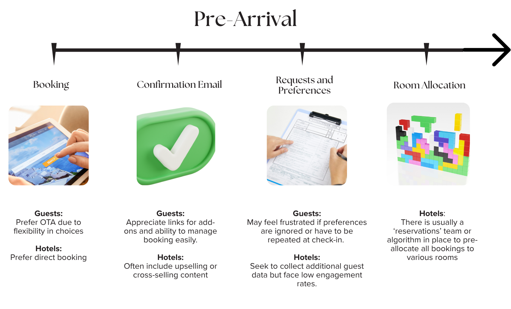
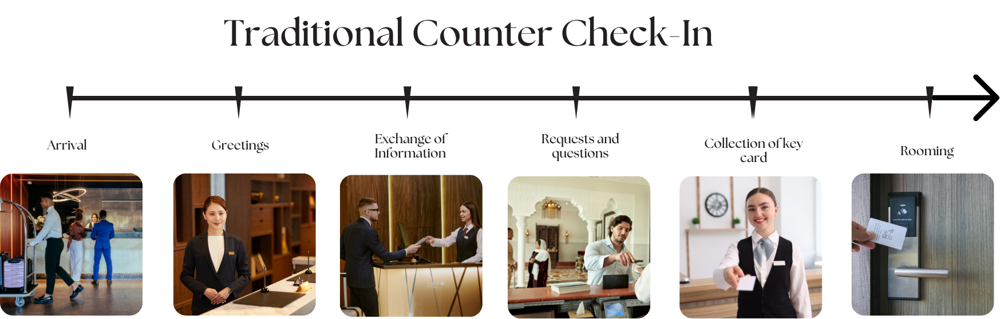
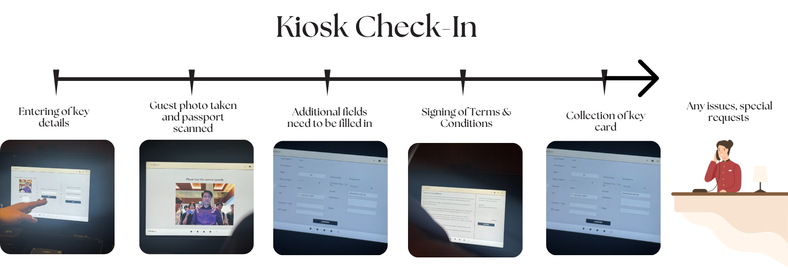

## Experience Journey Map: Pre-Arrival

The pre-arrival phase establishes the foundation for the guest’s overall hotel experience. In luxury hospitality, this stage is not merely transactional but an opportunity to communicate attentiveness, personalization, and efficiency — qualities that define a premium brand. A seamless pre-arrival journey ensures that guests begin their stay feeling understood and valued, while the hotel benefits from streamlined operations and accurate data for service preparation (Ecole Hôtelière de Lausanne, 2023).

---

### 1. Booking
The booking process represents the first point of interaction between the guest and the property. Guests today increasingly prefer online travel agencies (OTAs) such as Booking.com or Expedia for their flexibility and ease of comparison (Frost & Sullivan, 2024). However, hotels prefer direct booking channels as these allow them to access guest data directly, enabling more targeted communication, personalization, and upselling opportunities (Workforce Singapore, 2023). According to the Venture Corporation project brief (2025), integrating personalized booking systems that synchronize with guest profiles allows hotels to anticipate needs—such as preferred room type, amenities, and check-in times—well before arrival. This not only optimizes operational planning but also reinforces the sense of exclusivity expected in the luxury segment (Mann, Scully, Straus & Tellez Holub, 2024).

### 2. Confirmation Email
The confirmation email is more than a transactional receipt; it acts as an early stage of relationship-building. Guests appreciate clear, accessible booking details and links that allow them to modify reservations, add services, or manage transportation requests with minimal friction. Many hotels leverage this touchpoint to include upselling and cross-selling content, such as dining experiences, spa packages, or transportation upgrades (Venture Corporation, 2025). From a service-design standpoint, the tone and aesthetic of these communications should reflect brand values — calm, refined, and anticipatory rather than commercial. According to McKinsey & Company (Mann et al., 2024), early digital interactions significantly influence brand perception and guest trust, with consistency across pre-arrival communication reinforcing an impression of quality and attentiveness.

### 3. Requests & Preferences
This touchpoint captures the guest’s ability to communicate specific needs and personal preferences, such as bedding type, dietary restrictions, or room location. However, as identified during user interviews, guests often experience frustration when their pre-submitted requests appear ignored or require repetition during check-in. For hotels, collecting and managing such data remains challenging due to low engagement rates and fragmented information systems. Industry trends point toward integrating AI-powered preference engines that automatically compile and interpret guest data from previous stays to generate actionable insights for staff (Ecole Hôtelière de Lausanne, 2025). This enables hotels to deliver continuity of care and strengthen guest loyalty through subtle recognition of preferences — a hallmark of true luxury service (Pine & Gilmore, 1998).

### 4. Room Allocation
Behind the scenes, the pre-arrival process culminates in room allocation, where hotels match reservations to specific rooms based on availability, maintenance status, and guest requirements. In most luxury properties, this is managed by a reservations team or automated algorithm that pre-allocates rooms to optimize occupancy while accommodating personalized preferences (Workforce Singapore, 2023). When integrated with CRM and housekeeping systems, this process enhances both efficiency and guest satisfaction by ensuring that the assigned room is prepared and tailored to expectations prior to arrival. Automation at this stage also alleviates administrative load — an increasingly critical factor amid global hospitality manpower shortages (Singapore Institute of Hospitality, 2024).

> 🪄 Collectively, these pre-arrival touchpoints demonstrate the interdependence of **technology, personalization, and operational design** in shaping the luxury guest journey. A reimagined premium check-in experience must begin before arrival — bridging digital anticipation with physical hospitality through integrated, data-driven, and emotionally engaging systems *(Venture Corporation, 2025).*

---

## Experience Journey Map: Traditional Counter Check-In

The check-in process is one of the most defining moments in the guest journey, shaping first impressions and setting the tone for the stay (Mann, Scully, Straus & Tellez Holub, 2024). For luxury hotels, this stage embodies the brand’s promise of seamlessness, warmth, and personalization. Yet, as our field research and observations reveal, traditional counter-based check-in workflows can create friction for both guests and staff due to outdated system design, fragmented communication, and process inefficiencies.

---

### 1. Arrival
**Guest:** Upon arrival, guests often face queues before even reaching the front desk. Especially during peak hours, waiting time becomes a key source of frustration, undermining the perception of efficiency and exclusivity expected in premium hospitality. Luxury guests expect immediacy and recognition — long waits detract from that promise (Ecole Hôtelière de Lausanne, 2023).
**Staff:** Front desk staff must juggle multiple simultaneous tasks such as handling ongoing check-ins, attending to phone calls, and coordinating with bell staff. High guest volumes exacerbate this workload, leaving little time to deliver personalized attention (Workforce Singapore, 2023). Staff shortages, identified as one of the industry’s most pressing challenges, further intensify this pressure (Singapore Institute of Hospitality, 2024).

### 2. Greetings
**Guest:** The greeting moment, while brief, carries emotional weight. Guests notice whether the staff member smiles, greets them by name, or acknowledges special occasions. Inconsistent greetings often lead guests to perceive the interaction as transactional rather than genuine.
**Staff:** Staff acknowledge that they want to personalize greetings but often cannot recall guest details or lack access to the right information before the guest reaches the counter. This disconnect stems from the PMS interface limitations — information such as preferences or past stay notes is often buried within multiple tabs or outdated records.

### 3. Exchange of Information
**Guest:** Guests frequently express frustration when asked to repeat information they have already provided during online booking or pre-arrival forms. This duplication creates an impression of inefficiency and poor data integration. Guests also find it unclear what staff are doing behind the screen, leading to perceptions of slowness or disorganization. 
**Staff:** Staff report that they must navigate between multiple software systems (e.g., PMS, payment gateways, and ID verification tools) to complete a single check-in. This multitasking increases cognitive load and risk of error. Many noted difficulty in maintaining conversation with guests while simultaneously keying data, undermining the warmth of the interaction.

### 4. Requests & Questions
**Guest:** Guests often hesitate to raise additional questions or requests during check-in, perceiving staff as too busy or unapproachable. When they do ask, responses may feel scripted or delayed due to staff needing to check information in other systems.
**Staff:** Employees shared that they sometimes struggle to answer guest questions on the spot, particularly regarding local recommendations or real-time room updates. When guests express dissatisfaction, front desk agents must escalate issues while staying composed - a difficult balance amid ongoing check-ins.

### 5. Collection of Key Card
**Guest:** At this point, guests expect efficiency and clarity — they want to feel assured that their requests (such as late checkout or special amenities) have been noted. However, rushed handovers can create confusion and anxiety if guests are unsure about room details or inclusions. 
**Staff:** Staff often continue inputting data or printing forms while handing over key cards. If last-minute changes occur (e.g., incorrect room setup), the responsibility still falls on the front desk, despite upstream system or communication failures. This creates stress and impacts morale.

### 6. Rooming
**Guest:** After check-in, guests evaluate whether the in-room experience matches what was promised. A missing request or incorrect setup (e.g., twin instead of king bed) amplifies dissatisfaction, as it signals poor internal communication.
**Staff:** Staff acknowledge that follow-up lapses can occur, especially when information from the PMS is not synced with housekeeping or concierge systems. When issues arise, front desk agents often receive the complaint despite not being responsible for the error, highlighting the fragmented nature of existing workflows.

---

## Experience Journey Map: Kiosk Check-In (Alternative)

As hotels experiment with automation to enhance efficiency and reduce manpower dependency, **self-service kiosks** have become increasingly common, especially in business and mid-to-upscale hotels. These kiosks aim to streamline routine procedures such as guest identification, payment, and room key issuance — mirroring the self-check-in models seen in airports. In Singapore, automation has been widely encouraged to address labour shortages and operational inefficiencies in the hospitality sector (Workforce Singapore, 2023). However, while kiosk systems deliver measurable gains in speed and consistency, they also expose gaps in emotional engagement and personalization — both critical attributes of the luxury segment (Ecole Hôtelière de Lausanne, 2023).

---

### 1. Entering of Key Details
**Guest:** Guests generally perceive the kiosk as efficient and straightforward, appreciating the ability to bypass long queues. However, many express frustration that they still have to manually enter personal information, even if these details were already provided during online booking. This duplication creates a sense of redundancy and contradicts the promise of a seamless digital experience.
**Staff:** The automation of initial data entry reduces front desk workload, allowing staff to supervise multiple kiosks simultaneously and assist guests only when necessary. This redeployment of manpower enables a more relaxed, concierge-like presence on the floor rather than behind the counter (Venture Corporation, 2025).

### 2. Guest Photo & Passport Scanning
**Guest:** The passport scanning and verification process reinforces efficiency but introduces a transactional, impersonal tone. Guests accustomed to high-touch luxury interactions often perceive the lack of human acknowledgment as diminishing the sense of welcome. This aligns with findings from McKinsey (Mann, Scully, Straus & Tellez Holub, 2024), which highlight that luxury guests prioritize personalized recognition and emotional connection above speed.
**Staff:** Kiosks significantly reduce training time, from an estimated one month to about a week, as staff no longer need to memorize complex PMS workflows. However, staff must still intervene frequently when the kiosk’s document recognition or verification system fails — especially with non-standard passports or international ID formats — revealing technical fragility beneath the automation veneer.

### 3. Filling Additional Fields & Signing T&Cs
**Guest:** This stage is where friction typically resurfaces. Guests may be required to fill in multiple mandatory fields, sign digital forms, and review terms on-screen. For less tech-savvy users or older guests, the interface can appear daunting, particularly if touch targets are small or instructions unclear. Such usability issues echo broader research noting that while self-service technologies improve efficiency, they can also alienate users when poorly designed (Ecole Hôtelière de Lausanne, 2025).
**Staff:** While kiosks handle the procedural aspects of check-in, they remain limited in scope — unable to accommodate complex or exception-based requests such as split billing, room upgrades, or special amenities. Staff must therefore monitor the kiosks closely to address these exceptions in real time, sometimes negating the efficiency gains.

### 4. Key Collection & Issue Handling
**Guest:** Guests expect the process to conclude smoothly once the key card is dispensed. However, issues such as incorrect room assignment, non-functional cards, or unmet special requests often require them to return to the counter — undermining the convenience of the kiosk experience. As one observed guest described, “I still have to go to the front desk anyway because of how limited the kiosk is.”
**Staff:** Front desk teams report that kiosks reduce repetitive administrative tasks, freeing time for proactive engagement. However, they also note that system limitations lead to fragmented workflows — tasks often have to be finalized manually in the PMS, creating inconsistency in record-keeping and increasing post-check-in corrections.

> ✨ **Summary:** While kiosks improve efficiency, they risk diluting the sense of luxury and human warmth that defines premium hospitality. True innovation must integrate automation *with* empathy — transforming check-in from a transaction into an orchestrated first impression.

---

## 3. Hotelly - AI Overlay System for Front Desk Staff
Building on the identified challenges of manpower shortages, inconsistent service quality, and rising guest expectations, our team developed Hotelly, an AI overlay system designed to discreetly support front desk staff during the hotel check-in process. Rather than replacing human hospitality, Hotelly enhances it. It serves as a real-time “co-pilot” that empowers staff to deliver warm, precise, and personalized service even under pressure.

Hotelly operates as a context-aware assistive layer, providing live prompts, key guest information, and automated note capture during guest interactions. This helps staff maintain composure and consistency, ensuring that high-touch service standards are met regardless of varying experience levels among employees. The prototype was inspired by successful analogues such as Google Contact Center AI, Otter.ai, and Cluely, which have demonstrated the technical viability of real-time overlays in other high-stakes conversational environments (AmplifAI, 2024).

### Design Rationale
The design rationale behind Hotelly was grounded in a recurring insight from our user interviews and field research across luxury hotels: while technology can automate many back-end operations, frontline excellence remains a distinctly human craft that depends on knowledge, composure, and consistency. However, labour shortages, uneven training quality, and rising service expectations have stretched staff capacity thin (Workforce Singapore, 2023). Our aim was thus to design an assistive, not replacement-based, AI system - one that could elevate human performance rather than diminish it.

#### Cognitive Load Reduction through Real-Time Guidance
A major pain point uncovered during ethnographic observations was the mental juggling required of front desk staff during check-in. Staff must simultaneously manage guest verification, system input, small talk, and upselling, all while maintaining warmth and poise. Less experienced staff often hesitated or broke conversational flow when recalling hotel policies or local recommendations. Hotelly addresses this by providing context-sensitive, real-time prompts that surface relevant talking points, FAQs, or brand-aligned phrasing at the right moment.

These suggestions appear through a minimal overlay interface, drawing inspiration from existing assistive tools such as Google Contact Center AI and Cluely, which have proven effective in delivering real-time intelligence without overwhelming the user (AmplifAI, 2024). This approach allows Hotelly to act as an on-the-job coach, supporting knowledge recall while allowing staff to focus on relationship-building.

#### Preservation of Human Warmth through Peripheral Design
Luxury hospitality is built upon emotional connection—the subtle warmth of conversation, eye contact, and anticipation of unspoken needs. Overly intrusive technology risks eroding this human essence. To preserve natural interaction, Hotelly adopts a peripheral design approach, meaning its overlay occupies the edges of the screen and delivers short, digestible bullet points rather than full sentences. This prevents staff from reading verbatim or appearing distracted.
User research further indicated strong resistance toward smart-glasses interfaces, which were perceived as “awkward” and “dehumanizing” during guest-facing interactions. Therefore, our prototype was intentionally limited to desktop-based overlays that complement, rather than intrude upon, the service experience.

#### Automation for Knowledge Continuity
Another gap identified through user journey mapping was the loss of service continuity between shifts or staff members. When key guest preferences (such as preferred room temperature, pillow type, or breakfast timing) were captured verbally but never recorded, personalization suffered. To address this, Hotelly integrates automated note capture and summarization, transcribing live interactions into structured summaries. These notes are timestamped, categorized, and stored for future retrieval, facilitating smoother handovers between shifts and improving accuracy in post-stay personalization or dispute resolution.

This design choice also supports training reinforcement, as staff can review past interactions to reflect on tone, phrasing, and guest response patterns - echoing AmplifAI’s (2024) model of “coaching through context.”

#### Human-Centric AI Integration
Our design follows Ecole Hôtelière de Lausanne’s (2025) principle that AI in hospitality should enhance, not replace, the warmth and empathy that define service. Hotelly is conceptualized as a co-pilot: a system that lightens cognitive load and improves precision without replacing judgement or authenticity. The system’s tone and visuals are deliberately subtle, prioritizing emotional intelligence and discretion over technological dominance.
Collectively, these principles align with the project’s guiding objective - to reimagine luxury hospitality by bridging automation and human connection, ensuring that technology amplifies the guest experience rather than diluting it.

### Solution demo

### User Testing and Analysis
To validate the Hotelly concept, we conducted early-stage user testing with front desk staff and hospitality trainees. The feedback provided valuable direction for refinement, summarized below:
Real-Time Retrieval Builds Confidence
Many users described Hotelly as enabling them to appear “more knowledgeable” and “calmer under pressure.” Staff found it particularly helpful in recalling park timings, local attractions, or property-specific policies that they could not always memorize. The ability to surface key facts instantly helped maintain smooth conversational flow and reduced anxiety, especially among newer employees. This validated our hypothesis that cognitive offloading through AI can elevate, not hinder guest interaction quality.

### Training Potential Strongly Validated
Participants widely recognized Hotelly’s potential as a training companion. New or junior staff saw it as a safety net that enabled them to handle complex guest requests more confidently. One participant noted: “It’s more useful as a training tool than in real life. But for new hires, it’s perfect.” This led to the concept of a dual-mode interface, a “Training Mode” with more guidance and feedback prompts, and a “Live Mode” optimized for minimal intrusion during actual guest interactions.

### Automated Note-Taking as a Key Value Driver
Automation of guest note capture was consistently highlighted as one of Hotelly’s most valuable features. Staff emphasized its potential for dispute resolution, shift continuity, and personalized service. However, they also noted that accuracy and brevity would be critical: “It even summarises preferences, that’s very helpful, but accuracy is important.”This feedback informed our next development milestone - integrating real-time summarization with adjustable confidence thresholds to balance automation and reliability.
Managing Cognitive Offloading and Skill Atrophy
While automation was largely welcomed, several respondents expressed concern about potential skill atrophy. Over-reliance on AI prompts might make staff dependent on the system rather than internalizing knowledge. As one user put it: “This could make staff lazy… they might just read off it instead of remembering.” These insights guided our philosophy that Hotelly should serve as a co-pilot, not a crutch, providing support while encouraging independent learning through gradual reduction of assistance.

### Interface and Usability Feedback
Aesthetics and legibility were key concerns. Staff preferred short bullet points, large fonts, and strong visual hierarchy for quick scanning. They emphasized that the overlay should never compete with the PMS (Property Management System) interface, but rather complement it. This will guide subsequent iterations focusing on adaptive UI scaling, contrast sensitivity, and contextual card grouping.

### Discretion in Guest-Facing Interactions
A final insight related to physical discretion was that participants felt that using smart glasses or overly visible devices risked making interactions feel robotic. Instead, staff favored screen-based overlays placed subtly on monitors or tablets. This feedback affirmed the decision to keep Hotelly’s presence peripheral and contextually embedded within existing workflows.
Together, these insights underscored the importance of balance—between speed and subtlety, automation and authenticity, information and intuition.
